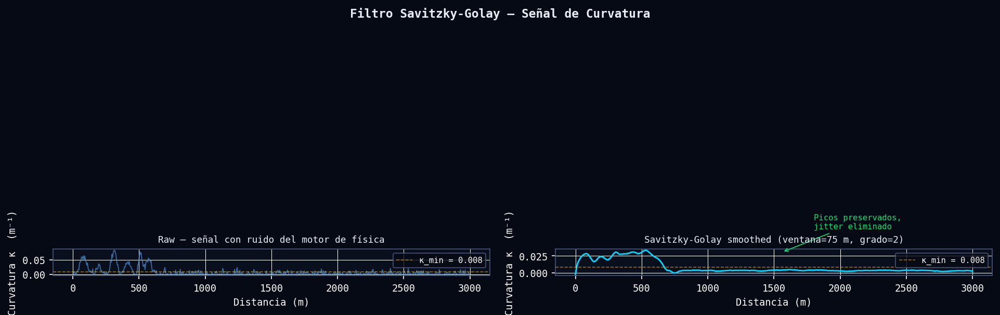
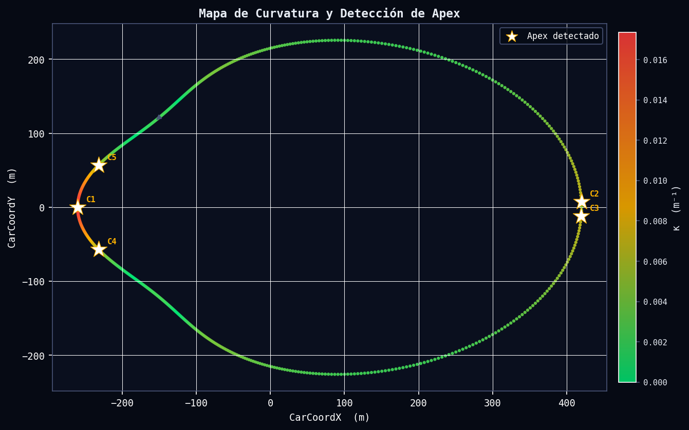
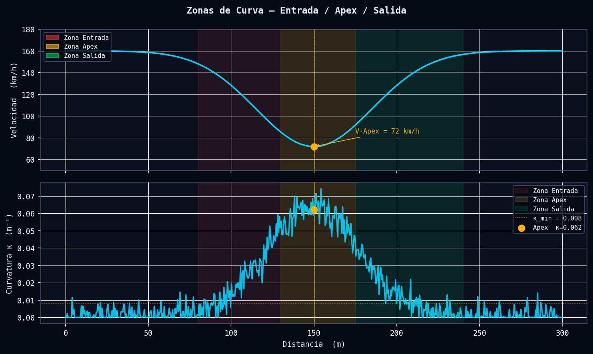
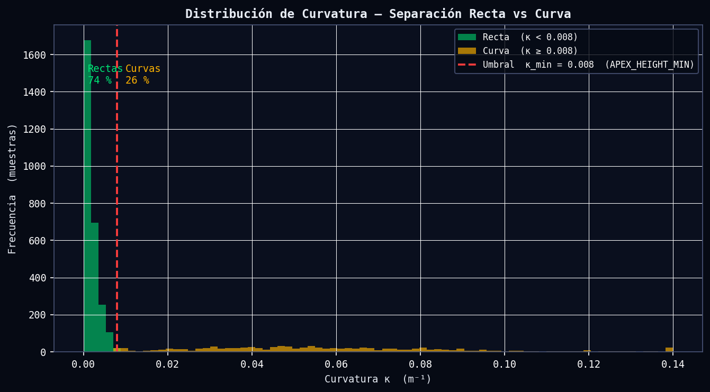

# Geometría de Pista y Detección de Vértices de Curva

**Módulo:** `src/analytics/geometry.py`  
**Funciones principales:** `procesar_geometria_pista_perfecta`, `detectar_apexes_perfectos`, `reporte_apexes`  
**Última revisión:** 2026-06-11

---

## Tabla de Contenidos

1. [Descripción General](#descripción-general)
2. [Fundamentos Científicos](#fundamentos-científicos)
   - [2.1 Filtro Savitzky-Golay](#21-filtro-savitzky-golay)
   - [2.2 Curvatura Geométrica Paramétrica](#22-curvatura-geométrica-paramétrica)
   - [2.3 Splines Cúbicos para Derivadas Espaciales](#23-splines-cúbicos-para-derivadas-espaciales)
   - [2.4 Detección de Picos y Prominencia Dinámica](#24-detección-de-picos-y-prominencia-dinámica)
   - [2.5 División de Zonas por Curva](#25-división-de-zonas-por-curva)
3. [Algoritmo e Implementación](#algoritmo-e-implementación)
4. [Parámetros Clave](#parámetros-clave)
5. [Interpretación de Resultados](#interpretación-de-resultados)
6. [Recomendaciones para el Piloto](#recomendaciones-para-el-piloto)
7. [Visualizaciones](#visualizaciones)
8. [Referencias](#referencias)

---

## Descripción General

El módulo de geometría de pista extrae la estructura geométrica objetiva del circuito a partir de los datos de posición tridimensional registrados por la telemetría ACTI (Assetto Corsa Telemetry Interface). El proceso convierte una nube de puntos irregular —afectada por jitter del motor de física y frecuencias de muestreo variables— en una representación matemática precisa de la curvatura de la trayectoria, medida con resolución de 1 metro por muestra.

El núcleo analítico es el cálculo de la curvatura geométrica paramétrica κ a partir de las derivadas espaciales de las coordenadas horizontales `CarCoordX` y `CarCoordY`. Una vez obtenida la señal de curvatura, el algoritmo identifica automáticamente los vértices (apex) de cada curva mediante detección de picos con umbralización dinámica y un filtro físico que valida cada candidato contra los datos de acelerador: en una curva de competición real, el piloto no aplica más del 85 % de acelerador en el vértice. El resultado es un mapa geométrico calibrado del circuito que sirve de base para todos los análisis de rendimiento posteriores (comparativa de vueltas, detección de anomalías, modelo de tiempo óptimo).

---

## Fundamentos Científicos

### 2.1 Filtro Savitzky-Golay

La señal de coordenadas GPS o de simulación contiene ruido de alta frecuencia (jitter del motor de físicas, cuantización de posición, oscilaciones de suspensión) que contamina el cálculo de derivadas. Un filtro de media móvil simple atenúa indiscriminadamente todas las frecuencias, incluyendo los flancos agudos de los picos de curvatura, lo que desplaza y subestima los vértices reales.

El filtro Savitzky-Golay ajusta un polinomio local de grado $p$ sobre una ventana deslizante de $2m+1$ puntos mediante mínimos cuadrados, y evalúa el polinomio en el punto central:

$$\hat{y}_i = \sum_{j=-m}^{m} c_j \, y_{i+j}$$

donde los coeficientes $c_j$ son invariantes y se calculan una sola vez para los parámetros $(m, p)$ elegidos. Para una ventana de $2m+1 = 75$ puntos y grado $p = 2$, el filtro actúa como un paso-bajo con frecuencia de corte $\approx 1/37.5$ ciclos/m, suprimiendo el jitter de alta frecuencia mientras preserva la forma parabólica de las curvas. Matemáticamente, el filtro es equivalente a una convolución con el kernel de Gram:

$$c_j = \frac{(2m+1) \sum_{k} \lambda_k P_k(0) P_k(j)}{\sum_{k} \lambda_k [P_k]^2}$$

donde $P_k$ son los polinomios de Legendre discretos. La clave es que el filtro preserva exactamente los momentos hasta el orden $p$, lo que significa que los picos de curvatura (estructuras de segundo orden) no se desplazan en posición ni se subestiman en amplitud, a diferencia del promedio móvil que introduce un sesgo sistemático hacia abajo.

**Implementación en el módulo:**

```python
SAVGOL_WINDOW = 75   # metros = muestras (a 1 m/muestra)
SAVGOL_ORDER  = 2    # grado del polinomio local

x_smooth = savgol_filter(x_interp, window_length=SAVGOL_WINDOW, polyorder=SAVGOL_ORDER)
y_smooth = savgol_filter(y_interp, window_length=SAVGOL_WINDOW, polyorder=SAVGOL_ORDER)
```

---

### 2.2 Curvatura Geométrica Paramétrica

Sea la trayectoria del vehículo descrita por el par de funciones paramétricas:

$$\mathbf{r}(s) = \bigl(x(s),\, y(s)\bigr)$$

donde $s$ es la distancia recorrida a lo largo de la trayectoria (longitud de arco). La **curvatura geométrica** $\kappa$ mide la tasa de cambio de la dirección tangente respecto al arco:

$$\kappa = \left| \frac{d\theta}{ds} \right| = \frac{|\mathbf{r}' \times \mathbf{r}''|}{|\mathbf{r}'|^3}$$

Expandiendo el producto vectorial en 2D (la componente $z$ del producto cruzado):

$$\boxed{\kappa = \frac{|x' y'' - y' x''|}{\left(x'^2 + y'^2\right)^{3/2}}}$$

**Derivación desde longitud de arco:**

El ángulo tangente es $\theta = \arctan\!\left(\frac{y'}{x'}\right)$. Su derivada respecto a $s$ es:

$$\frac{d\theta}{ds} = \frac{x' y'' - y' x''}{x'^2 + y'^2}$$

La velocidad de recorrido del parámetro es $|\mathbf{r}'| = \sqrt{x'^2 + y'^2}$, por lo que:

$$\kappa = \left|\frac{d\theta}{ds}\right| = \frac{|x' y'' - y' x''|}{(x'^2 + y'^2)} \cdot \frac{1}{|\mathbf{r}'|} = \frac{|x' y'' - y' x''|}{(x'^2 + y'^2)^{3/2}}$$

El radio de curvatura instantáneo del vehículo en cada punto es simplemente:

$$R = \frac{1}{\kappa} \quad [m]$$

Una curva con $\kappa = 0.065\,\text{m}^{-1}$ tiene un radio $R \approx 15.4\,\text{m}$; una curva rápida con $\kappa = 0.010\,\text{m}^{-1}$ tiene $R \approx 100\,\text{m}$.

**Implementación en el módulo:**

```python
numerador   = np.abs(dx * ddy - dy * ddx)
denominador = (dx**2 + dy**2) ** 1.5
curvatura   = np.where(denominador > 1e-6, numerador / denominador, 0.0)
```

La guarda `denominador > 1e-6` previene divisiones por cero en las rectas donde la velocidad de avance puede ser numéricamente nula.

---

### 2.3 Splines Cúbicos para Derivadas Espaciales

El remuestreo lineal produce coordenadas a 1 m/muestra pero no garantiza la continuidad de las derivadas. Para obtener $x'$, $x''$, $y'$, $y''$ con precisión sub-métrica, el módulo ajusta splines cúbicos (`scipy.interpolate.CubicSpline`) sobre la señal ya suavizada por Savitzky-Golay:

$$x(s) = a_k (s - s_k)^3 + b_k (s - s_k)^2 + c_k (s - s_k) + d_k \quad \forall\, s \in [s_k, s_{k+1}]$$

Las condiciones de empalme $C^2$ (continuidad hasta la segunda derivada) aseguran que $x''$ y $y''$ sean continuas en todos los nodos, lo cual es esencial para la fórmula de curvatura. La derivada de orden $n$ se evalúa con:

```python
spline_x = CubicSpline(dist_uniforme, x_smooth)
dx  = spline_x(dist_uniforme, 1)   # primera derivada x'
ddx = spline_x(dist_uniforme, 2)   # segunda derivada x''
```

---

### 2.4 Detección de Picos y Prominencia Dinámica

La detección de vértices combina dos criterios geométricos y uno físico:

**Criterio de altura mínima:**

$$\kappa_i > \kappa_{\min} = 0.008\,\text{m}^{-1} \quad (R < 125\,\text{m})$$

Este umbral fijo excluye las rectas y las curvas de radio amplio que no requieren frenada real.

**Criterio de prominencia dinámica:**

$$\text{prom}_{\min} = \pi_f \cdot \kappa_{\max}^{\text{circuito}}$$

donde $\pi_f = 0.15$ (15 %). La prominencia de un pico se define como la diferencia entre la altura del pico y la mayor de las dos "valles de contención" a su alrededor. Usar un umbral relativo al $\kappa_{\max}$ del circuito hace el detector agnóstico al tipo de circuito: funciona igual en un circuito urbano muy sinuoso ($\kappa_{\max} \approx 0.12$) que en un ovalado con chicanes ($\kappa_{\max} \approx 0.04$).

**Separación mínima entre apex:**

$$\Delta s_{\min} = 100\,\text{m}$$

Impide que dos apex del mismo complejo de curvas se detecten como curvas independientes. La elección de 100 m corresponde al mínimo físico razonable para un complejo de curvas en competición.

**Filtro físico de acelerador:**

$$\text{Throttle}_i < 85\,\%$$

En el vértice real de una curva de competición, el piloto está en transición entre frenada y aceleración. Un candidato con más del 85 % de acelerador corresponde a una curva larga de alta velocidad donde el piloto no levanta el pie, y no constituye un vértice de frenada relevante para el análisis de rendimiento.

---

### 2.5 División de Zonas por Curva

Cada curva detectada se divide en tres zonas funcionales basadas en la posición del apex $s_{\text{apex}}$:

| Zona | Definición | Característica física |
|------|-----------|----------------------|
| **Entrada** | $s < s_{\text{apex}}$, curvatura creciente | Frenada + giro |
| **Apex** | $\kappa = \kappa_{\max}$ local | Velocidad mínima, radio mínimo |
| **Salida** | $s > s_{\text{apex}}$, curvatura decreciente | Aceleración + apertura de volante |

Las métricas de rendimiento (velocidad de vértice, punto de frenada, punto de apertura del gas) se calculan referenciadas a estas zonas.

---

## Algoritmo e Implementación

El pipeline de procesamiento sigue seis pasos secuenciales:

**Paso 1 — Limpieza y ordenación** (`procesar_geometria_pista_perfecta`, líneas 63-67)

Se eliminan duplicados sobre la columna `Distance` y se ordena el DataFrame en sentido creciente. Los duplicados ocurren cuando el simulador genera dos frames con la misma marca de distancia (colisión de timestamps).

**Paso 2 — Remuestreo a eje uniforme** (líneas 70-74)

Se construye un eje de distancia uniforme $[0, d_{\max}]$ con paso de 1 m/muestra mediante `np.arange`. Las coordenadas `CarCoordX` y `CarCoordY` se interpolan linealmente a este eje. La interpolación lineal es suficiente aquí porque el suavizado posterior (Paso 3) elimina los artefactos de la interpolación.

$$d_k = k \cdot \Delta s, \quad \Delta s = 1.0\,\text{m}, \quad k = 0, 1, \ldots, \lfloor d_{\max} \rfloor$$

**Paso 3 — Filtro Savitzky-Golay** (líneas 77-80)

Ventana de 75 muestras (= 75 m a 1 m/muestra), polinomio de grado 2. Este es el paso más crítico: una ventana demasiado pequeña deja ruido residual que genera falsos picos de curvatura; una ventana demasiado grande distorsiona la geometría de las curvas cortas.

**Paso 4 — Splines cúbicos** (líneas 83-89)

Se ajustan splines independientes para $x(s)$ e $y(s)$. Las primeras y segundas derivadas se evalúan en cada punto del eje uniforme.

**Paso 5 — Curvatura geométrica** (líneas 92-94)

Cálculo vectorizado de $\kappa = |x' y'' - y' x''| / (x'^2 + y'^2)^{3/2}$ con protección numérica.

**Paso 6 — Interpolación de canales opcionales** (líneas 101-109)

Si el DataFrame de entrada contiene `Speed`, `Throttle` o `Brake`, estos se interpolan al mismo eje uniforme. La elevación real se toma de `CarCoordZ`.

**Detección de apex** (`detectar_apexes_perfectos`, líneas 147-170)

1. Calcular $\kappa_{\max}$ y $\text{prom}_{\min} = 0.15 \cdot \kappa_{\max}$
2. Llamar a `scipy.signal.find_peaks` con `height=0.008`, `prominence=prom_min`, `distance=100`
3. Filtrar candidatos por `Throttle < 85 %`
4. Retornar DataFrame con una fila por curva real

**Clasificación de curvas** (`reporte_apexes`, líneas 196-197)

El tipo de curva se asigna por radio:

$$\text{Tipo} = \begin{cases} \text{Rápida} & R > 90\,\text{m} \\ \text{Media} & 40 < R \leq 90\,\text{m} \\ \text{Frenada Fuerte / Lenta} & R \leq 40\,\text{m} \end{cases}$$

---

## Parámetros Clave

| Parámetro | Constante | Valor por defecto | Descripción | Efecto de aumentar |
|-----------|-----------|-------------------|-------------|-------------------|
| `SAVGOL_WINDOW` | `SAVGOL_WINDOW` | `75` m | Ventana del filtro Savitzky-Golay | Más suavizado; puede fusionar curvas cercanas |
| `SAVGOL_ORDER` | `SAVGOL_ORDER` | `2` | Grado del polinomio de suavizado | Más flexibilidad local; valores >3 amplifican ruido |
| `RESAMPLE_STEP` | `RESAMPLE_STEP` | `1.0` m | Resolución del eje uniforme | Más resolución; mayor coste computacional |
| `APEX_HEIGHT_MIN` | `APEX_HEIGHT_MIN` | `0.008` m⁻¹ | Curvatura mínima para considerar curva ($R < 125$ m) | Excluye más curvas lentas; puede perder chicanes |
| `APEX_PROM_FACTOR` | `APEX_PROM_FACTOR` | `0.15` | Factor de prominencia relativa a $\kappa_{\max}$ | Más selectivo; puede perder curvas secundarias |
| `APEX_DISTANCE_MIN` | `APEX_DISTANCE_MIN` | `100` m | Separación mínima entre apex consecutivos | Fusiona complejos de curvas en una sola curva |
| `APEX_THROTTLE_MAX` | `APEX_THROTTLE_MAX` | `85.0` % | Umbral máximo de acelerador en apex real | Excluye más curvas de alta velocidad sin frenada |

---

## Interpretación de Resultados

### Señal de Curvatura

- **κ < 0.008 m⁻¹ (R > 125 m):** Recta o curva de alta velocidad. No requiere frenada significativa.
- **0.008 ≤ κ < 0.022 m⁻¹ (40 < R < 125 m):** Curva media. Requiere modulación del acelerador.
- **0.022 ≤ κ < 0.025 m⁻¹ (40 < R ≤ 45 m):** Curva lenta. Frenada fuerte necesaria.
- **κ > 0.025 m⁻¹ (R < 40 m):** Horquilla o curva muy lenta. Máxima demanda de agarre lateral.

### Reporte de Apex

Cada fila del reporte incluye:

- **Distance (m):** Posición longitudinal del apex en el circuito. Permite comparar la posición de vértice entre pilotos o vueltas.
- **V-Apex (km/h):** Velocidad en el vértice. Una velocidad de vértice más alta que la referencia indica una mejora de ritmo de hasta 0.1–0.3 s por curva.
- **Alt (m):** Elevación real del vértice. Útil para identificar curvas en subida o bajada donde el agarre disponible difiere.
- **Throttle (%):** Apertura del acelerador en el vértice. Valores cercanos a 0 % indican frenada hasta el vértice (posible ganancia por trailbraking); valores entre 20–50 % son habituales en curvas medias.
- **Radio (m):** Radio de curvatura en el vértice. Determina la fuerza lateral máxima requerida.

### Banderas de Alerta

- **Radio detectado muy pequeño (R < 15 m):** Probable artefacto de ruido residual o error de coordenadas. Verificar la señal bruta.
- **Número de curvas muy alto (> 2× el número real):** `APEX_DISTANCE_MIN` demasiado bajo o `APEX_PROM_FACTOR` demasiado bajo. Aumentar ambos parámetros.
- **Throttle en apex > 80 % en todas las curvas:** El piloto no está frenando; los datos de throttle pueden estar desplazados temporalmente. Verificar la sincronización de canales.
- **κ_max < 0.015 m⁻¹:** El circuito es muy rápido (tipo ovalado) o hay un problema con las coordenadas. Verificar que `CarCoordX` y `CarCoordY` son las columnas horizontales y no incluyen elevación.

---

## Recomendaciones para el Piloto

Las métricas geométricas extraídas por este módulo se traducen directamente en consejos de conducción accionables:

**1. Velocidad de vértice**
La velocidad en el apex es el indicador de rendimiento por excelencia en curvas de frenada. Un incremento de 5 km/h en el vértice equivale aproximadamente a 0.15–0.25 s ganados en esa curva, dependiendo del tipo de circuito y del perfil de tracción del vehículo.

**2. Posición longitudinal del apex (Distance)**
Si la posición del apex del piloto está más adelante en la pista que la referencia (apex tardío geométrico), el piloto está usando una trayectoria conservadora que permite una aceleración más temprana. Si está antes (apex temprano), la trayectoria se estrecha hacia la salida y limita la aceleración.

**3. Clasificación de curvas por radio**
Curvas con $R \leq 40\,\text{m}$ son las que mayor tiempo potencial ofrecen: pequeñas mejoras de técnica producen grandes ganancias. Curvas con $R > 90\,\text{m}$ son relativamente más sensibles a la carga aerodinámica y al equilibrio del vehículo que a la técnica del piloto.

**4. Throttle en el apex**
Un valor de Throttle entre 0 % y 15 % en el apex de una curva media sugiere que el piloto puede adelantar el punto de apertura del gas. Un valor de 0 % acompañado de velocidad de vértice baja es señal de subviraje al entrar o de una trayectoria de entrada demasiado amplia.

**5. Análisis de complejos de curvas**
Cuando dos apex quedan separados por menos de 200 m, el primer vértice determina el tipo de línea que hace posible el segundo. En estos casos priorizar la velocidad de salida del segundo vértice (el que da acceso a la recta más larga) sobre la velocidad de entrada al primero.

---

## Visualizaciones



**Fig. 1 — Filtro Savitzky-Golay aplicado a la señal de curvatura.** El panel izquierdo muestra la curvatura calculada directamente sobre las coordenadas sin filtrar (ruido de alta frecuencia generado por el motor de físicas). El panel derecho muestra la misma señal tras aplicar el filtro Savitzky-Golay (ventana=75 m, grado=2). Los picos de curvatura correspondientes a las curvas del circuito se preservan en posición y amplitud, mientras el jitter de fondo queda suprimido. La línea punteada ámbar marca el umbral `APEX_HEIGHT_MIN = 0.008 m⁻¹`.

---



**Fig. 2 — Mapa de curvatura de la trayectoria con apex marcados.** Cada punto de la trayectoria está coloreado según la magnitud de curvatura κ: verde para curvaturas bajas (rectas), ámbar para curvas medias y rojo para los vértices de máxima curvatura. Las estrellas blancas marcan los apex detectados automáticamente. La superposición de datos de curvatura sobre la geometría real del trazado permite al ingeniero validar visualmente que el detector ha identificado correctamente las curvas relevantes.

---



**Fig. 3 — Diagrama de zonas de una curva individual.** El subgráfico superior muestra el perfil de velocidad a lo largo de la curva; el inferior muestra la curvatura correspondiente. Las tres zonas están sombreadas: entrada (rojo, curvatura creciente y frenada), apex (ámbar, curvatura máxima y velocidad mínima) y salida (verde, curvatura decreciente y aceleración). El marcador ámbar indica la posición exacta del vértice detectado, con su velocidad y curvatura anotadas.

---



**Fig. 4 — Distribución estadística de curvatura para una vuelta completa.** El histograma revela la bimodalidad característica de los circuitos: una población dominante de muestras en recta (κ bajo, barras verdes) y una población secundaria de muestras en curva (κ más alto, barras ámbar). La línea discontinua roja marca el umbral `APEX_HEIGHT_MIN = 0.008 m⁻¹` que separa ambas poblaciones. El porcentaje de tiempo en curva se deriva directamente de la proporción de muestras a la derecha de este umbral.

---

## Referencias

1. **Savitzky, A. & Golay, M. J. E.** (1964). "Smoothing and Differentiation of Data by Simplified Least Squares Procedures." *Analytical Chemistry*, 36(8), 1627–1639. — Artículo original del filtro SG; establece las propiedades de preservación de momentos que justifican su uso sobre promedio móvil para señales con picos.

2. **do Carmo, M. P.** (1976). *Differential Geometry of Curves and Surfaces*. Prentice-Hall. — Derivación formal de la curvatura de curvas planas y espaciales desde primeros principios de geometría diferencial.

3. **Beckman, B.** (1991). *The Physics of Racing* (series). — Formulación de la curvatura en el contexto de trayectorias de vehículos de competición; relación entre κ, velocidad y fuerzas laterales en la zona de límite de adherencia.

4. **de Boor, C.** (2001). *A Practical Guide to Splines* (revised ed.). Springer. — Referencia estándar para splines cúbicos con condiciones de continuidad $C^2$; relevante para la implementación de `scipy.interpolate.CubicSpline` utilizada en el módulo.

5. **Betz, J., Wischnewski, A., Heilmeier, A., Lienkamp, M.** (2019). "A Software Framework for Autonomous Racing." *IEEE ITSC 2019*. — Implementación industrial de detección de apex y segmentación de circuito para vehículos autónomos de competición; contexto moderno de los algoritmos aquí documentados.
