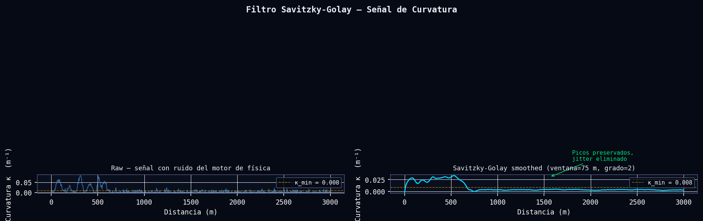
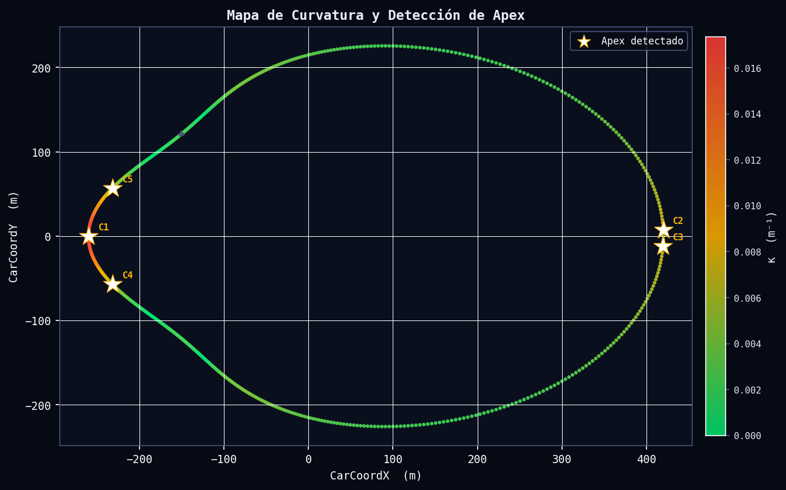
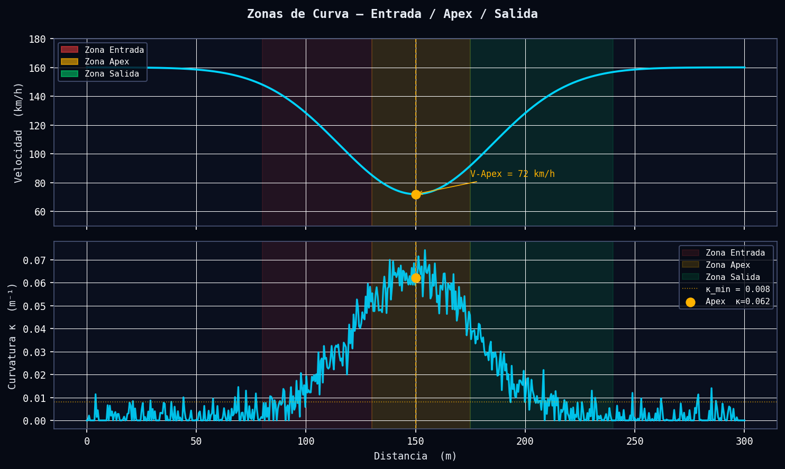
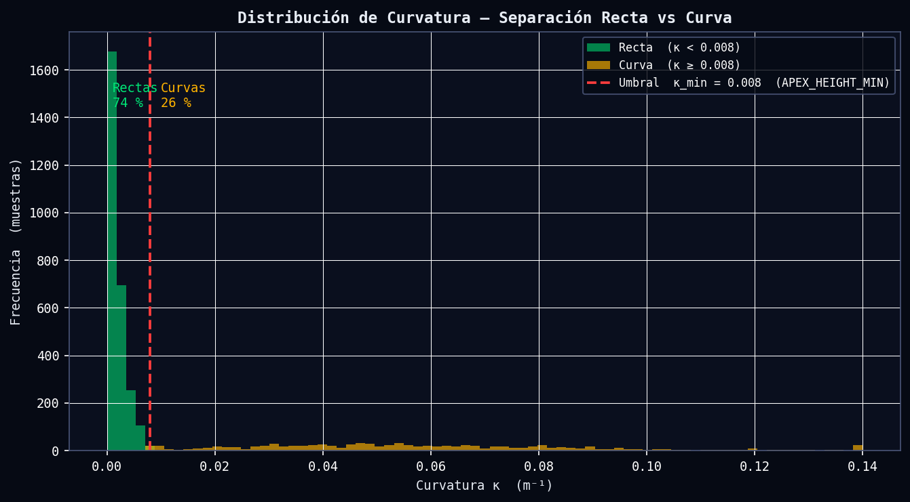

# Track Geometry and Corner Apex Detection

🌐 [Ver en Español](./01_geometry.es.md)

**Module:** `src/analytics/geometry.py`  
**Main functions:** `procesar_geometria_pista_perfecta`, `detectar_apexes_perfectos`, `reporte_apexes`  
**Last reviewed:** 2026-06-11

---

## Table of Contents

1. [Overview](#overview)
2. [Scientific Foundations](#scientific-foundations)
   - [2.1 Savitzky-Golay Filter](#21-savitzky-golay-filter)
   - [2.2 Parametric Geometric Curvature](#22-parametric-geometric-curvature)
   - [2.3 Cubic Splines for Spatial Derivatives](#23-cubic-splines-for-spatial-derivatives)
   - [2.4 Peak Detection and Dynamic Prominence](#24-peak-detection-and-dynamic-prominence)
   - [2.5 Corner Zone Division](#25-corner-zone-division)
3. [Algorithm and Implementation](#algorithm-and-implementation)
4. [Key Parameters](#key-parameters)
5. [Interpreting Results](#interpreting-results)
6. [Driver Recommendations](#driver-recommendations)
7. [Visualizations](#visualizations)
8. [References](#references)

---

## Overview

The track geometry module extracts the objective geometric structure of the circuit from the three-dimensional position data recorded by ACTI (Assetto Corsa Telemetry Interface) telemetry. The process converts an irregular point cloud — affected by physics-engine jitter and variable sampling rates — into a precise mathematical representation of trajectory curvature, measured at a resolution of 1 metre per sample.

The analytical core is the calculation of the parametric geometric curvature κ from the spatial derivatives of the horizontal coordinates `CarCoordX` and `CarCoordY`. Once the curvature signal is obtained, the algorithm automatically identifies the apex of each corner using peak detection with dynamic thresholding and a physical filter that validates each candidate against throttle data: in a real racing corner, the driver does not apply more than 85 % throttle at the apex. The result is a calibrated geometric map of the circuit that serves as the foundation for all subsequent performance analyses (lap comparison, anomaly detection, optimal lap time model).

---

## Scientific Foundations

### 2.1 Savitzky-Golay Filter

The GPS or simulation coordinate signal contains high-frequency noise (physics-engine jitter, position quantisation, suspension oscillations) that contaminates derivative calculations. A simple moving-average filter attenuates all frequencies indiscriminately, including the sharp flanks of curvature peaks, which shifts and underestimates the true apexes.

The Savitzky-Golay filter fits a local polynomial of degree $p$ over a sliding window of $2m+1$ points using least squares, and evaluates the polynomial at the central point:

$$\hat{y}_i = \sum_{j=-m}^{m} c_j \, y_{i+j}$$

where the coefficients $c_j$ are invariant and are computed once for the chosen parameters $(m, p)$. For a window of $2m+1 = 75$ points and degree $p = 2$, the filter acts as a low-pass with a cutoff frequency $\approx 1/37.5$ cycles/m, suppressing high-frequency jitter while preserving the parabolic shape of corners. Mathematically, the filter is equivalent to convolution with the Gram kernel:

$$c_j = \frac{(2m+1) \sum_{k} \lambda_k P_k(0) P_k(j)}{\sum_{k} \lambda_k [P_k]^2}$$

where $P_k$ are the discrete Legendre polynomials. The key property is that the filter preserves exactly the moments up to order $p$, which means that curvature peaks (second-order structures) are neither shifted in position nor underestimated in amplitude — unlike the moving average, which introduces a systematic downward bias.

**Implementation in the module:**

```python
SAVGOL_WINDOW = 75   # metres = samples (at 1 m/sample)
SAVGOL_ORDER  = 2    # degree of the local polynomial

x_smooth = savgol_filter(x_interp, window_length=SAVGOL_WINDOW, polyorder=SAVGOL_ORDER)
y_smooth = savgol_filter(y_interp, window_length=SAVGOL_WINDOW, polyorder=SAVGOL_ORDER)
```

---

### 2.2 Parametric Geometric Curvature

Let the vehicle trajectory be described by the pair of parametric functions:

$$\mathbf{r}(s) = \bigl(x(s),\, y(s)\bigr)$$

where $s$ is the distance travelled along the trajectory (arc length). The **geometric curvature** $\kappa$ measures the rate of change of the tangent direction with respect to arc length:

$$\kappa = \left| \frac{d\theta}{ds} \right| = \frac{|\mathbf{r}' \times \mathbf{r}''|}{|\mathbf{r}'|^3}$$

Expanding the cross product in 2D (the $z$ component of the cross product):

$$\boxed{\kappa = \frac{|x' y'' - y' x''|}{\left(x'^2 + y'^2\right)^{3/2}}}$$

**Derivation from arc length:**

The tangent angle is $\theta = \arctan\!\left(\frac{y'}{x'}\right)$. Its derivative with respect to $s$ is:

$$\frac{d\theta}{ds} = \frac{x' y'' - y' x''}{x'^2 + y'^2}$$

The traversal speed of the parameter is $|\mathbf{r}'| = \sqrt{x'^2 + y'^2}$, so:

$$\kappa = \left|\frac{d\theta}{ds}\right| = \frac{|x' y'' - y' x''|}{(x'^2 + y'^2)} \cdot \frac{1}{|\mathbf{r}'|} = \frac{|x' y'' - y' x''|}{(x'^2 + y'^2)^{3/2}}$$

The instantaneous radius of curvature of the vehicle at each point is simply:

$$R = \frac{1}{\kappa} \quad [m]$$

A corner with $\kappa = 0.065\,\text{m}^{-1}$ has a radius $R \approx 15.4\,\text{m}$; a fast corner with $\kappa = 0.010\,\text{m}^{-1}$ has $R \approx 100\,\text{m}$.

**Implementation in the module:**

```python
numerador   = np.abs(dx * ddy - dy * ddx)
denominador = (dx**2 + dy**2) ** 1.5
curvatura   = np.where(denominador > 1e-6, numerador / denominador, 0.0)
```

The guard `denominador > 1e-6` prevents division by zero on straights where the forward speed may be numerically zero.

---

### 2.3 Cubic Splines for Spatial Derivatives

Linear resampling produces coordinates at 1 m/sample but does not guarantee continuity of derivatives. To obtain $x'$, $x''$, $y'$, $y''$ with sub-metric accuracy, the module fits cubic splines (`scipy.interpolate.CubicSpline`) to the signal already smoothed by Savitzky-Golay:

$$x(s) = a_k (s - s_k)^3 + b_k (s - s_k)^2 + c_k (s - s_k) + d_k \quad \forall\, s \in [s_k, s_{k+1}]$$

The $C^2$ joining conditions (continuity up to the second derivative) ensure that $x''$ and $y''$ are continuous at all nodes, which is essential for the curvature formula. The derivative of order $n$ is evaluated with:

```python
spline_x = CubicSpline(dist_uniforme, x_smooth)
dx  = spline_x(dist_uniforme, 1)   # first derivative x'
ddx = spline_x(dist_uniforme, 2)   # second derivative x''
```

---

### 2.4 Peak Detection and Dynamic Prominence

Apex detection combines two geometric criteria and one physical criterion:

**Minimum height criterion:**

$$\kappa_i > \kappa_{\min} = 0.008\,\text{m}^{-1} \quad (R < 125\,\text{m})$$

This fixed threshold excludes straights and wide-radius corners that do not require genuine braking.

**Dynamic prominence criterion:**

$$\text{prom}_{\min} = \pi_f \cdot \kappa_{\max}^{\text{circuit}}$$

where $\pi_f = 0.15$ (15 %). The prominence of a peak is defined as the difference between the peak's height and the taller of the two "containment valleys" on either side. Using a threshold relative to the circuit's $\kappa_{\max}$ makes the detector circuit-agnostic: it works equally well on a very twisty street circuit ($\kappa_{\max} \approx 0.12$) as on an oval with chicanes ($\kappa_{\max} \approx 0.04$).

**Minimum separation between apexes:**

$$\Delta s_{\min} = 100\,\text{m}$$

This prevents two apexes from the same corner complex from being detected as independent corners. The choice of 100 m corresponds to the reasonable physical minimum for a racing corner complex.

**Physical throttle filter:**

$$\text{Throttle}_i < 85\,\%$$

At the true apex of a racing corner, the driver is transitioning between braking and acceleration. A candidate with more than 85 % throttle corresponds to a long high-speed corner where the driver does not lift off, and does not constitute a braking apex relevant to performance analysis.

---

### 2.5 Corner Zone Division

Each detected corner is divided into three functional zones based on the apex position $s_{\text{apex}}$:

| Zone | Definition | Physical characteristic |
|------|------------|------------------------|
| **Entry** | $s < s_{\text{apex}}$, increasing curvature | Braking + turning |
| **Apex** | $\kappa = \kappa_{\max}$ local | Minimum speed, minimum radius |
| **Exit** | $s > s_{\text{apex}}$, decreasing curvature | Acceleration + unwinding the wheel |

Performance metrics (apex speed, braking point, throttle application point) are calculated with reference to these zones.

---

## Algorithm and Implementation

The processing pipeline follows six sequential steps:

**Step 1 — Cleaning and sorting** (`procesar_geometria_pista_perfecta`, lines 63–67)

Duplicates are removed on the `Distance` column and the DataFrame is sorted in ascending order. Duplicates occur when the simulator generates two frames with the same distance stamp (timestamp collision).

**Step 2 — Resampling to a uniform axis** (lines 70–74)

A uniform distance axis $[0, d_{\max}]$ with a step of 1 m/sample is built using `np.arange`. The coordinates `CarCoordX` and `CarCoordY` are linearly interpolated onto this axis. Linear interpolation is sufficient here because the subsequent smoothing (Step 3) removes interpolation artefacts.

$$d_k = k \cdot \Delta s, \quad \Delta s = 1.0\,\text{m}, \quad k = 0, 1, \ldots, \lfloor d_{\max} \rfloor$$

**Step 3 — Savitzky-Golay filter** (lines 77–80)

Window of 75 samples (= 75 m at 1 m/sample), polynomial of degree 2. This is the most critical step: a window that is too small leaves residual noise that generates false curvature peaks; a window that is too large distorts the geometry of short corners.

**Step 4 — Cubic splines** (lines 83–89)

Independent splines are fitted for $x(s)$ and $y(s)$. The first and second derivatives are evaluated at each point on the uniform axis.

**Step 5 — Geometric curvature** (lines 92–94)

Vectorised calculation of $\kappa = |x' y'' - y' x''| / (x'^2 + y'^2)^{3/2}$ with numerical protection.

**Step 6 — Interpolation of optional channels** (lines 101–109)

If the input DataFrame contains `Speed`, `Throttle` or `Brake`, these are interpolated onto the same uniform axis. The actual elevation is taken from `CarCoordZ`.

**Apex detection** (`detectar_apexes_perfectos`, lines 147–170)

1. Compute $\kappa_{\max}$ and $\text{prom}_{\min} = 0.15 \cdot \kappa_{\max}$
2. Call `scipy.signal.find_peaks` with `height=0.008`, `prominence=prom_min`, `distance=100`
3. Filter candidates by `Throttle < 85 %`
4. Return a DataFrame with one row per real corner

**Corner classification** (`reporte_apexes`, lines 196–197)

The corner type is assigned by radius:

$$\text{Type} = \begin{cases} \text{Fast} & R > 90\,\text{m} \\ \text{Medium} & 40 < R \leq 90\,\text{m} \\ \text{Heavy Braking / Slow} & R \leq 40\,\text{m} \end{cases}$$

---

## Key Parameters

| Parameter | Constant | Default value | Description | Effect of increasing |
|-----------|----------|---------------|-------------|----------------------|
| `SAVGOL_WINDOW` | `SAVGOL_WINDOW` | `75` m | Savitzky-Golay filter window | More smoothing; may merge nearby corners |
| `SAVGOL_ORDER` | `SAVGOL_ORDER` | `2` | Degree of the smoothing polynomial | More local flexibility; values >3 amplify noise |
| `RESAMPLE_STEP` | `RESAMPLE_STEP` | `1.0` m | Uniform axis resolution | Higher resolution; greater computational cost |
| `APEX_HEIGHT_MIN` | `APEX_HEIGHT_MIN` | `0.008` m⁻¹ | Minimum curvature to consider a corner ($R < 125$ m) | Excludes more slow corners; may miss chicanes |
| `APEX_PROM_FACTOR` | `APEX_PROM_FACTOR` | `0.15` | Prominence factor relative to $\kappa_{\max}$ | More selective; may miss secondary corners |
| `APEX_DISTANCE_MIN` | `APEX_DISTANCE_MIN` | `100` m | Minimum separation between consecutive apexes | Merges corner complexes into a single corner |
| `APEX_THROTTLE_MAX` | `APEX_THROTTLE_MAX` | `85.0` % | Maximum throttle threshold at a real apex | Excludes more high-speed corners without braking |

---

## Interpreting Results

### Curvature Signal

- **κ < 0.008 m⁻¹ (R > 125 m):** Straight or high-speed corner. No significant braking required.
- **0.008 ≤ κ < 0.022 m⁻¹ (40 < R < 125 m):** Medium corner. Requires throttle modulation.
- **0.022 ≤ κ < 0.025 m⁻¹ (40 < R ≤ 45 m):** Slow corner. Heavy braking required.
- **κ > 0.025 m⁻¹ (R < 40 m):** Hairpin or very slow corner. Maximum lateral grip demand.

### Apex Report

Each row of the report includes:

- **Distance (m):** Longitudinal position of the apex on the circuit. Allows comparison of apex position between drivers or laps.
- **V-Apex (km/h):** Speed at the apex. An apex speed higher than the reference indicates a lap-time gain of approximately 0.1–0.3 s per corner.
- **Alt (m):** True elevation of the apex. Useful for identifying uphill or downhill corners where available grip differs.
- **Throttle (%):** Throttle opening at the apex. Values close to 0 % indicate braking to the apex (potential gain from trail-braking); values between 20–50 % are typical for medium corners.
- **Radius (m):** Radius of curvature at the apex. Determines the maximum lateral force required.

### Alert Flags

- **Detected radius very small (R < 15 m):** Probable residual noise artefact or coordinate error. Check the raw signal.
- **Number of corners very high (> 2× the real number):** `APEX_DISTANCE_MIN` too low or `APEX_PROM_FACTOR` too low. Increase both parameters.
- **Throttle at apex > 80 % on all corners:** The driver is not braking; the throttle data may be temporally offset. Check channel synchronisation.
- **κ_max < 0.015 m⁻¹:** The circuit is very fast (oval type) or there is a problem with the coordinates. Verify that `CarCoordX` and `CarCoordY` are the horizontal columns and do not include elevation.

---

## Driver Recommendations

The geometric metrics extracted by this module translate directly into actionable driving advice:

**1. Apex speed**
Speed at the apex is the definitive performance indicator for braking corners. An increase of 5 km/h at the apex is approximately equivalent to 0.15–0.25 s gained in that corner, depending on the circuit type and the vehicle's traction profile.

**2. Longitudinal apex position (Distance)**
If the driver's apex position is further along the track than the reference (geometric late apex), the driver is using a conservative line that allows earlier acceleration. If it is earlier (early apex), the line tightens toward the exit and limits acceleration.

**3. Corner classification by radius**
Corners with $R \leq 40\,\text{m}$ offer the greatest time potential: small technique improvements produce large gains. Corners with $R > 90\,\text{m}$ are relatively more sensitive to aerodynamic load and vehicle balance than to driver technique.

**4. Throttle at apex**
A Throttle value between 0 % and 15 % at the apex of a medium corner suggests the driver can advance their throttle application point. A value of 0 % accompanied by a low apex speed is a sign of understeer on entry or an entry line that is too wide.

**5. Corner complex analysis**
When two apexes are separated by less than 200 m, the first apex determines the type of line that makes the second possible. In these cases, prioritise the exit speed from the second apex (the one leading onto the longest straight) over the entry speed into the first.

---

## Visualizations



**Fig. 1 — Savitzky-Golay filter applied to the curvature signal.** The left panel shows the curvature calculated directly from unfiltered coordinates (high-frequency noise generated by the physics engine). The right panel shows the same signal after applying the Savitzky-Golay filter (window=75 m, degree=2). The curvature peaks corresponding to the circuit's corners are preserved in position and amplitude, while background jitter is suppressed. The amber dashed line marks the threshold `APEX_HEIGHT_MIN = 0.008 m⁻¹`.

---



**Fig. 2 — Trajectory curvature map with marked apexes.** Each point on the trajectory is coloured according to the curvature magnitude κ: green for low curvatures (straights), amber for medium corners, and red for maximum-curvature apexes. White stars mark the automatically detected apexes. Overlaying curvature data on the actual track layout allows the engineer to visually validate that the detector has correctly identified the relevant corners.

---



**Fig. 3 — Zone diagram for an individual corner.** The upper subplot shows the speed profile along the corner; the lower shows the corresponding curvature. The three zones are shaded: entry (red, increasing curvature and braking), apex (amber, maximum curvature and minimum speed), and exit (green, decreasing curvature and acceleration). The amber marker indicates the exact position of the detected apex, with its speed and curvature annotated.

---



**Fig. 4 — Statistical curvature distribution for a full lap.** The histogram reveals the characteristic bimodality of racing circuits: a dominant population of straight samples (low κ, green bars) and a secondary population of cornering samples (higher κ, amber bars). The red dashed line marks the threshold `APEX_HEIGHT_MIN = 0.008 m⁻¹` that separates both populations. The percentage of time in corners is derived directly from the proportion of samples to the right of this threshold.

---

## References

1. **Savitzky, A. & Golay, M. J. E.** (1964). "Smoothing and Differentiation of Data by Simplified Least Squares Procedures." *Analytical Chemistry*, 36(8), 1627–1639. — Original SG filter paper; establishes the moment-preservation properties that justify its use over moving average for signals with peaks.

2. **do Carmo, M. P.** (1976). *Differential Geometry of Curves and Surfaces*. Prentice-Hall. — Formal derivation of the curvature of plane and space curves from first principles of differential geometry.

3. **Beckman, B.** (1991). *The Physics of Racing* (series). — Formulation of curvature in the context of racing vehicle trajectories; relationship between κ, speed, and lateral forces in the limit-of-grip zone.

4. **de Boor, C.** (2001). *A Practical Guide to Splines* (revised ed.). Springer. — Standard reference for cubic splines with $C^2$ continuity conditions; relevant to the implementation of `scipy.interpolate.CubicSpline` used in the module.

5. **Betz, J., Wischnewski, A., Heilmeier, A., Lienkamp, M.** (2019). "A Software Framework for Autonomous Racing." *IEEE ITSC 2019*. — Industrial implementation of apex detection and circuit segmentation for autonomous racing vehicles; modern context for the algorithms documented here.

---

*This document is a translation of [01_geometry.es.md](./01_geometry.es.md). The source of truth for terminology and equations is the Spanish original; if any discrepancy is found, the Spanish version takes precedence.*
