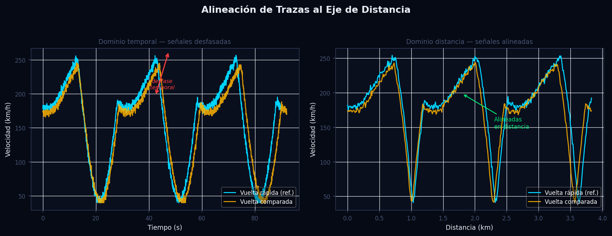
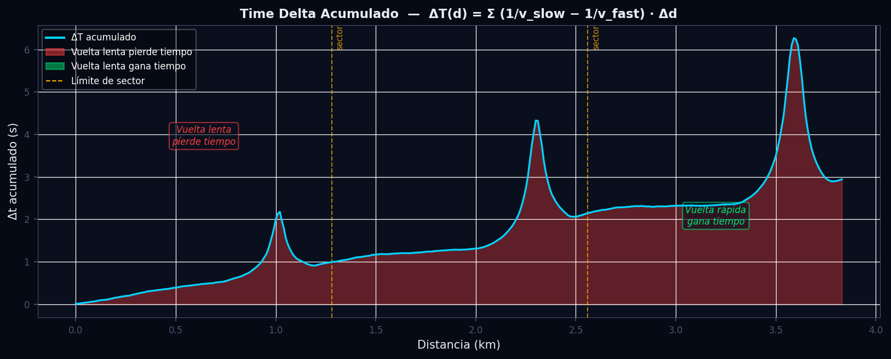
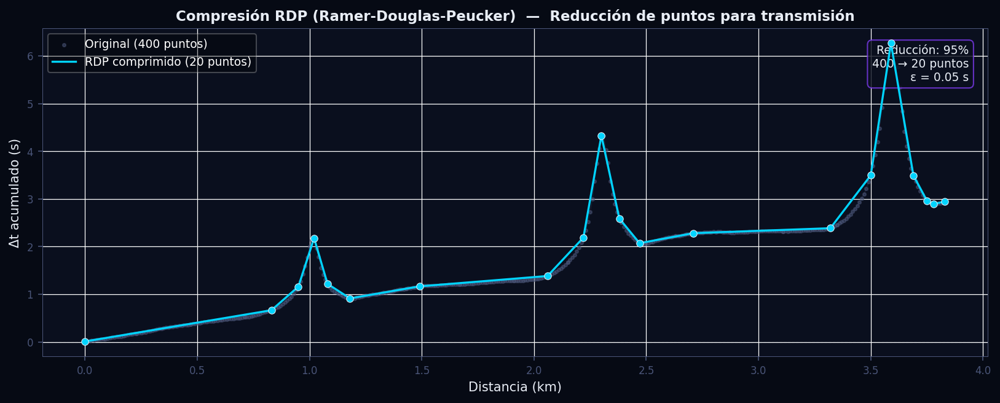

# Alineación Espacial y Delta de Tiempo Acumulado

---

## Tabla de Contenidos

1. [Descripción General](#descripción-general)
2. [Fundamentos Científicos](#fundamentos-científicos)
   - [El problema del dominio temporal](#el-problema-del-dominio-temporal)
   - [Re-indexación al eje de distancia](#re-indexación-al-eje-de-distancia)
   - [Fórmula del Time Delta acumulado](#fórmula-del-time-delta-acumulado)
   - [Sectorización por Apex](#sectorización-por-apex)
   - [Compresión RDP](#compresión-rdp-ramer-douglas-peucker)
3. [Algoritmo e Implementación](#algoritmo-e-implementación)
4. [Parámetros Clave](#parámetros-clave)
5. [Interpretación de Resultados](#interpretación-de-resultados)
6. [Recomendaciones para el Piloto](#recomendaciones-para-el-piloto)
7. [Visualizaciones](#visualizaciones)
8. [Referencias](#referencias)

---

## Descripción General

Comparar dos vueltas en el dominio del tiempo es engañoso en análisis de telemetría de motorsport. Si un piloto frena 20 metros antes que otro en una frenada, todas las señales posteriores quedan desfasadas temporalmente aunque el piloto esté ejecutando exactamente la misma línea. La solución estándar de la industria —utilizada en sistemas profesionales como el MoTeC i2 Pro, el PI Toolbox de McLaren y el AiM RS3Analysis— consiste en re-indexar ambas vueltas al mismo eje de distancia recorrida, haciendo que cada muestra corresponda exactamente al mismo punto físico del circuito.

Sobre esta base espacial común el módulo calcula el **Time Delta acumulado** (también denominado *Time Slip* en la literatura anglosajona): un canal continuo que, para cada metro del circuito, expresa cuántos segundos acumula de ventaja o desventaja la vuelta analizada respecto a la vuelta de referencia. Este canal es el más informativo disponible para el ingeniero de carrera: identifica no solo cuánto tiempo se pierde o gana globalmente, sino en qué zona exacta del trazado ocurre y con qué pendiente.

---

## Fundamentos Científicos

### El problema del dominio temporal

Sea $v_A(t)$ la velocidad de la vuelta A y $v_B(t)$ la de la vuelta B, ambas muestreadas en el dominio temporal con frecuencias de adquisición $f_s$ (típicamente 20–100 Hz). Aunque ambas den una vuelta al mismo circuito, sus vectores temporales tienen longitudes distintas:

$$
T_A = \int_0^{L} \frac{ds}{v_A(s)} \neq T_B = \int_0^{L} \frac{ds}{v_B(s)}
$$

donde $L$ es la longitud total del circuito. Una comparación directa muestra (n° de muestra $i$) a muestra introduce un error creciente: cada décima de segundo de diferencia de paso por una zona arrastra todo el perfil posterior.

### Re-indexación al eje de distancia

La solución es transformar ambas vueltas al dominio espacial. Dado que la distancia acumulada es monótonamente creciente, actúa como parámetro canónico. Se define una cuadrícula de distancia uniforme:

$$
\mathcal{D} = \{d_i = i \cdot \Delta d \mid i = 0, 1, \ldots, N\}, \quad \Delta d = \texttt{paso\_metros}, \quad d_N \leq \min(D_A^{\max}, D_B^{\max})
$$

Para cada canal de señal $x$ (velocidad, acelerador, freno, etc.) se aplica interpolación lineal por tramos:

$$
\hat{x}(d_i) = x(t_k) + \frac{d_i - D(t_k)}{D(t_{k+1}) - D(t_k)} \cdot \left[x(t_{k+1}) - x(t_k)\right]
$$

donde $t_k$ es el índice temporal tal que $D(t_k) \leq d_i < D(t_{k+1})$.

> **Nota de implementación:** el módulo usa `numpy.interp`, que realiza interpolación lineal piecewise con extrapolación constante en los extremos. Para circuitos con zonas de baja velocidad (pit lane) se aplica un clip de velocidad mínima $v_{\min} = 1.0\,\text{m/s}$ para evitar singularidades en la inversión.

### Fórmula del Time Delta acumulado

Una vez alineadas, el tiempo diferencial que tarda cada vuelta en recorrer un incremento de distancia $\Delta d$ es:

$$
dt_A(d_i) = \frac{\Delta d}{v_A(d_i)}, \qquad dt_B(d_i) = \frac{\Delta d}{v_B(d_i)}
$$

La diferencia de tiempos diferencial —positiva cuando la vuelta B es más lenta— es:

$$
\delta t(d_i) = \frac{\Delta d}{v_B(d_i)} - \frac{\Delta d}{v_A(d_i)} = \Delta d \left(\frac{1}{v_B(d_i)} - \frac{1}{v_A(d_i)}\right)
$$

El **Time Delta acumulado** es la suma parcial de todos los incrementos hasta el punto $d_n$:

$$
\boxed{\Delta T(d_n) = \sum_{i=0}^{n} \left(\frac{1}{v_{\text{slow}}(d_i)} - \frac{1}{v_{\text{fast}}(d_i)}\right) \cdot \Delta d}
$$

donde las velocidades se expresan en **m/s**. Esta es la discretización del integral continuo:

$$
\Delta T(d) = \int_0^{d} \left(\frac{1}{v_{\text{slow}}(s)} - \frac{1}{v_{\text{fast}}(s)}\right) ds
$$

Propiedades clave:

- $\Delta T(d) > 0$: la vuelta lenta **pierde tiempo** respecto a la referencia hasta ese punto.
- $\Delta T(d) < 0$: la vuelta analizada **lleva ventaja** hasta ese punto (raro salvo que la vuelta A no sea la más rápida).
- $\Delta T(L)$: es exactamente la diferencia de tiempos de vuelta $T_B - T_A$, verificable contra los datos cronométricos.
- La **pendiente** $\frac{d\,\Delta T}{d\,s}$ indica la tasa instantánea de pérdida o ganancia: pendiente positiva pronunciada señala una zona problemática.

### Sectorización por Apex

El circuito se divide en sectores cuyos límites son las distancias de los apexes detectados. El delta parcial de cada sector $k$ se obtiene por diferencia del delta acumulado en los extremos:

$$
\Delta T_{\text{sector}_k} = \Delta T(d_{\text{apex}_k}) - \Delta T(d_{\text{apex}_{k-1}})
$$

donde $d_{\text{apex}_0} = 0$ y $d_{\text{apex}_{N+1}} = L$. Esta descomposición permite aislar si la pérdida de tiempo ocurre en la frenada previa, en el vértice o en la salida de la curva, orientando directamente el trabajo de setup y la instrucción al piloto.

### Compresión RDP (Ramer-Douglas-Peucker)

El algoritmo RDP reduce el número de puntos de la curva $\Delta T(d)$ para transmisión eficiente a dashboards o almacenamiento en base de datos, preservando la forma visual. Dado un umbral $\varepsilon$ (en segundos), el algoritmo:

1. Toma el segmento de extremos $P_1$ y $P_N$.
2. Calcula la distancia perpendicular de cada punto intermedio $P_i$ a la línea recta $\overline{P_1 P_N}$:

$$
d_\perp(P_i) = \frac{\left|(P_N - P_1) \times (P_1 - P_i)\right|}{\|P_N - P_1\|}
$$

3. Si $\max(d_\perp) > \varepsilon$, conserva el punto de máxima desviación y recurre sobre ambas mitades.
4. Si $\max(d_\perp) \leq \varepsilon$, descarta todos los puntos intermedios.

La complejidad es $O(N \log N)$ para distribuciones típicas de telemetría. Con $\varepsilon = 0.05\,\text{s}$, una señal de 4 000 puntos se reduce habitualmente a 150–200 puntos, una reducción del 95% con error máximo de representación de 50 ms —imperceptible visualmente.

---

## Algoritmo e Implementación

La función principal del módulo es `alinear_vueltas_y_calcular_delta` en `src/analytics/alignment.py`. El flujo exacto es:

**Paso 1 — Limpieza de duplicados y ordenación**

```python
def _preparar(df):
    return (df.drop_duplicates(subset=["Distance"])
              .sort_values("Distance")
              .reset_index(drop=True))
```

Los archivos de telemetría crudos pueden contener muestras con la misma distancia (p.ej. en paradas de pit). Se eliminan duplicados conservando la primera ocurrencia y se garantiza orden monótono creciente, requisito para `numpy.interp`.

**Paso 2 — Determinación del rango compartido**

```python
max_dist = min(df_fast["Distance"].max(), df_slow["Distance"].max())
dist_uniforme = np.arange(0, max_dist, paso_metros)
```

Se usa el mínimo de los máximos para que ambas vueltas existan en todo el rango. `numpy.arange` con paso entero (1.0 m por defecto) produce exactamente $\lfloor L / \Delta d \rfloor$ puntos.

**Paso 3 — Interpolación y conversión de unidades**

```python
v_fast_ms = np.clip(v_fast_kmh / 3.6, V_CLIP_MIN_MS, None)
v_slow_ms = np.clip(v_slow_kmh / 3.6, V_CLIP_MIN_MS, None)
```

La velocidad se interpola en km/h (unidad de los canales de telemetría) y se convierte a m/s para la integración física. El clip a `V_CLIP_MIN_MS = 1.0 m/s` evita que zonas de velocidad casi nula (entrada al pit lane, banda de rodadura, maniobra de partida) generen valores infinitos en $1/v$.

**Paso 4 — Integración numérica del Time Delta**

```python
delta_tiempo = np.cumsum((1.0 / v_slow_ms - 1.0 / v_fast_ms) * paso_metros)
```

La suma acumulada de `numpy` (`cumsum`) implementa directamente la fórmula $\Delta T(d_n) = \sum_{i=0}^{n} (1/v_\text{slow} - 1/v_\text{fast}) \cdot \Delta d$. La operación es vectorizada y se ejecuta en microsegundos incluso para vueltas de 6 000 m a 1 m de resolución.

**Paso 5 — Sectorización** (`resumir_delta_por_sector`)

```python
delta_parcial = delta_final - delta_inicio
```

Para cada sector se extrae el valor de `Delta_Time` al inicio y al final usando `numpy.interp` sobre el vector de distancias, y la diferencia da el delta parcial del sector. El resultado es un DataFrame ordenado por sector con columnas `dist_inicio`, `dist_fin`, `delta_parcial` y `descripcion`.

---

## Parámetros Clave

| Parámetro | Valor por defecto | Tipo | Descripción | Efecto de cambio |
|---|---|---|---|---|
| `paso_metros` | `1.0` | `float` | Resolución del eje de distancia en metros | Menor valor: mayor precisión y mayor coste computacional. Valores < 0.5 m raramente justificados con telemetría a 20 Hz |
| `V_CLIP_MIN_MS` | `1.0` | `float` (constante) | Velocidad mínima en m/s para el cálculo de $1/v$ | Aumentarlo recorta más el pit lane pero puede sesgar el delta en frenadas muy fuertes (v → 0) |
| `canales_extra` | `None` | `list[str]` | Lista de canales adicionales a interpolar (`Gear`, `SteerAngle`, etc.) | Sin efecto en el delta; añade columnas al DataFrame de salida para análisis adicionales |
| `df_fast` | — | `DataFrame` | Vuelta de referencia (la más rápida o la "vuelta target") | Invierte el signo del delta si se intercambia con `df_slow` |
| `df_slow` | — | `DataFrame` | Vuelta a comparar contra la referencia | — |
| `epsilon` (RDP) | `0.05` s | `float` | Umbral de distancia perpendicular para RDP | Mayor $\varepsilon$: más compresión, mayor error de representación. Recomendado 0.02–0.10 s |

---

## Interpretación de Resultados

### Lectura del gráfico de Time Delta

El gráfico de `Delta_Time` vs `Distance` es la herramienta diagnóstica principal:

- **Pendiente positiva** en una zona: la vuelta analizada es más lenta que la referencia en ese tramo. La pendiente es la tasa de pérdida en s/m, equivalente a $1/v_\text{slow} - 1/v_\text{fast}$.
- **Pendiente negativa**: la vuelta analizada es más rápida en ese tramo.
- **Zona plana** (pendiente ≈ 0): ambas vueltas son iguales en ese segmento.
- **Valor final** $\Delta T(L)$: diferencia total de tiempo de vuelta. Debe coincidir con la diferencia cronométrica; una discrepancia > 0.05 s indica datos corruptos o longitudes de vuelta distintas.

### Señales de alerta

| Síntoma en el gráfico | Causa probable | Acción |
|---|---|---|
| Salto brusco de $\Delta T$ en un punto | Diferencia de línea o frenada violenta en esa distancia | Revisar la traza GPS superpuesta |
| $\Delta T$ diverge linealmente en toda la vuelta | La vuelta "rápida" no es en realidad la más rápida (error de selección) | Verificar tiempos de vuelta y volver a asignar `df_fast` / `df_slow` |
| $\Delta T$ oscila rápidamente con amplitud pequeña | Diferencias de frecuencia de muestreo o artefactos de interpolación | Aplicar filtro de media móvil al canal Speed antes de alinear |
| Delta sector pit lane muy alto | Clip de velocidad demasiado bajo; el pit lane está siendo incluido | Enmascarar el pit lane antes de llamar al módulo |

### Delta por sector

La tabla de sectores permite priorizar el trabajo:

- Sectores con `delta_parcial > 0.10 s` merecen análisis detallado de frenada, punto de giro y aceleración de salida.
- La suma de todos los `delta_parcial` debe igualar `Delta_Time[-1]` (verificación de consistencia).
- Un sector con delta positivo rodeado de sectores neutros indica un problema puntual de línea o de preparación de frenada, no de setup global.

---

## Recomendaciones para el Piloto

Las siguientes recomendaciones se derivan directamente de los patrones del Time Delta:

**1. Zona de pérdida en frenada previa al apex**
Si el delta sube bruscamente en los 50–150 m antes del apex detectado, el piloto frena demasiado pronto o con demasiada intensidad. Acción: retrasar el punto de frenada 10 m y verificar que el perfil de presión sobre el pedal sea lineal y progresivo.

**2. Zona de pérdida en la salida de la curva**
Si el delta sube en los 100–200 m posteriores al apex, la velocidad de salida es inferior a la referencia. Las causas habituales son un apex demasiado tardío que cierra la trayectoria, o una aplicación de acelerador prematura que provoca subviraje. Acción: abrir el apex 5–8 m y retrasar ligeramente el punto de aceleración hasta verificar que el coche está orientado hacia el exterior de la curva.

**3. Zona de ganancia en una curva pero pérdida en la siguiente**
Sugiere que el piloto arrastra demasiada velocidad media en la primera curva (línea agresiva), lo que compromete la preparación para la segunda. En circuitos con combinaciones de curvas esto es frecuente. Acción: sacrificar 0.1–0.2 s en la primera curva para ganar 0.3–0.5 s en la salida de la segunda.

**4. Delta estable y plano en el último 30% de la vuelta**
Una vez identificados los sectores de pérdida en los primeros dos tercios, si el delta final sigue siendo notable con la última parte plana, indica que la diferencia proviene del primer tramo. Revisar primordialmente la vuelta de calentamiento de neumáticos y la estrategia de ataque en el primer sector.

**5. Validación con la sectorización**
Antes de hacer cambios en la línea, confirmar que el sector problemático tiene `delta_parcial` estadísticamente consistente en 3 o más vueltas. Una sola vuelta con delta elevado puede deberse a tráfico, banderas amarillas o barro en la pista.

---

## Visualizaciones

### Figura 1 — Diagrama de alineación al eje de distancia



**Panel izquierdo:** Las dos trazas de velocidad representadas sobre el eje temporal. Las diferencias de tiempo de vuelta hacen que los picos de velocidad no se correspondan entre sí aunque representen la misma curva. La flecha roja indica el desfase que crece a lo largo de la vuelta.

**Panel derecho:** Las mismas trazas tras la interpolación al eje de distancia uniforme. Los picos de velocidad en cada curva quedan perfectamente alineados en la misma abscisa, permitiendo una comparación muestra a muestra con significado físico real.

---

### Figura 2 — Time Delta acumulado con sectorización



El eje horizontal es la distancia recorrida en el circuito (km); el eje vertical es el Time Delta acumulado $\Delta T(d)$ en segundos. La zona rellena en **rojo** indica que la vuelta lenta pierde tiempo respecto a la referencia; la zona en **verde** indica que la vuelta analizada lleva ventaja acumulada. Las líneas verticales **ámbar** delimitan los sectores definidos por los apexes. La línea punteada horizontal en $\Delta T = 0$ es la paridad exacta.

La lectura operativa es inmediata: el ingeniero señala al piloto las zonas donde la curva del delta sube con mayor pendiente y esas son las prioridades de trabajo para la siguiente salida.

---

### Figura 3 — Compresión RDP de la curva de Time Delta



Los puntos y línea **tenues** (gris azulado) representan la señal original muestreada a 400 puntos. Los puntos **cian brillantes** conectados por líneas muestran el subconjunto conservado tras aplicar el algoritmo RDP con $\varepsilon = 0.05\,\text{s}$. La reducción típica es del 90–95%, pasando de varios miles de puntos a menos de 200, con un error de representación máximo garantizado de $\varepsilon$ segundos. Este proceso es esencial para la transmisión en tiempo real a paneles de estrategia y para el almacenamiento eficiente en base de datos de series temporales.

---

## Referencias

1. **Milliken, W. F. & Milliken, D. L.** (1995). *Race Car Vehicle Dynamics*. SAE International, Warrendale, PA. — Capítulo 2: fundamentos del análisis de velocidad y aceleración longitudinal en circuito.

2. **Segers, J.** (2014). *Analysis Techniques for Racecar Data Acquisition* (2nd ed.). SAE International. — Capítulo 5: Time-distance analysis and delta-time computation; metodología de referencia para la re-indexación al eje de distancia.

3. **Ramer, U.** (1972). An iterative procedure for the polygonal approximation of plane curves. *Computer Graphics and Image Processing*, 1(3), 244–256. — Artículo original del algoritmo RDP, base teórica de la compresión de la curva de Time Delta.

4. **Douglas, D. H. & Peucker, T. K.** (1973). Algorithms for the reduction of the number of points required to represent a digitized line or its caricature. *Cartographica: The International Journal for Geographic Information and Geovisualization*, 10(2), 112–122. — Formulación estándar del algoritmo de compresión poligonal utilizado en el módulo.

5. **Press, W. H., Teukolsky, S. A., Vetterling, W. T. & Flannery, B. P.** (2007). *Numerical Recipes: The Art of Scientific Computing* (3rd ed.). Cambridge University Press. — Sección 3.3: interpolación por splines cúbicos y lineal piecewise; fundamento matemático del método `numpy.interp` empleado en la re-indexación espacial.
