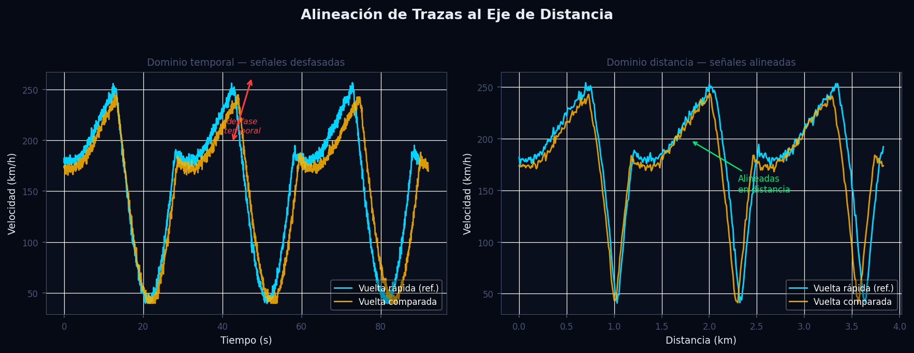
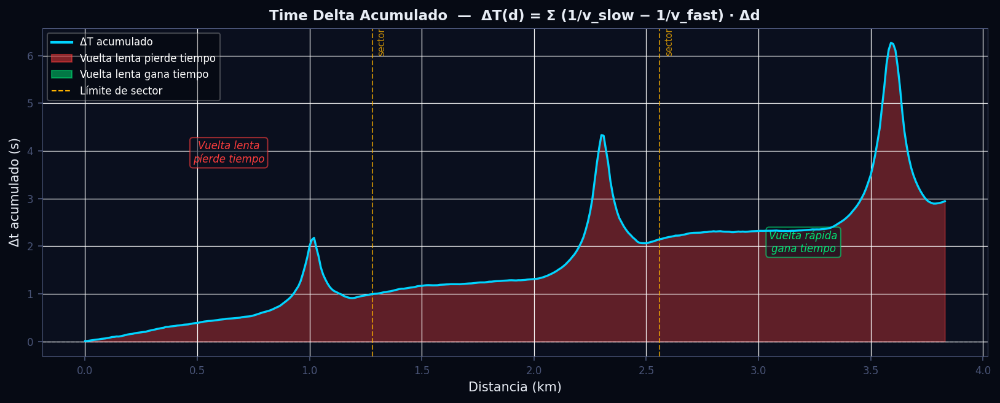
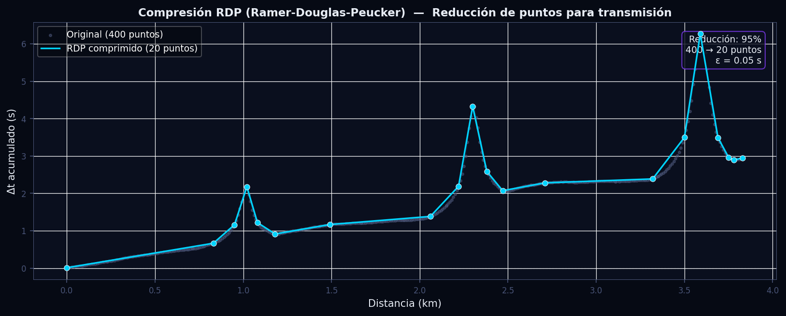

# Spatial Alignment and Cumulative Time Delta

🌐 [Ver en Español](./02_time_delta.es.md)

---

## Table of Contents

1. [Overview](#overview)
2. [Scientific Foundations](#scientific-foundations)
   - [The time-domain problem](#the-time-domain-problem)
   - [Re-indexing to the distance axis](#re-indexing-to-the-distance-axis)
   - [Cumulative Time Delta formula](#cumulative-time-delta-formula)
   - [Apex-based sectorization](#apex-based-sectorization)
   - [RDP compression](#rdp-compression-ramer-douglas-peucker)
3. [Algorithm and Implementation](#algorithm-and-implementation)
4. [Key Parameters](#key-parameters)
5. [Interpreting Results](#interpreting-results)
6. [Driver Recommendations](#driver-recommendations)
7. [Visualizations](#visualizations)
8. [References](#references)

---

## Overview

Comparing two laps in the time domain is misleading in motorsport telemetry analysis. If one driver brakes 20 metres earlier than another into a braking zone, all subsequent signals are temporally offset even if that driver is executing exactly the same line. The industry-standard solution — used in professional systems such as MoTeC i2 Pro, McLaren PI Toolbox, and AiM RS3Analysis — is to re-index both laps onto the same elapsed-distance axis, so that every sample corresponds to exactly the same physical point on the circuit.

On this common spatial basis the module computes the **Cumulative Time Delta** (also called *Time Slip* in the literature): a continuous channel that, for each metre of the circuit, expresses how many seconds of advantage or disadvantage the analysed lap has accumulated relative to the reference lap. This channel is the most informative one available to the race engineer: it identifies not only how much time is lost or gained overall, but precisely where on the track it happens and at what rate.

---

## Scientific Foundations

### The time-domain problem

Let $v_A(t)$ be the speed of lap A and $v_B(t)$ the speed of lap B, both sampled in the time domain at acquisition frequencies $f_s$ (typically 20–100 Hz). Although both laps complete the same circuit, their time vectors have different lengths:

$$
T_A = \int_0^{L} \frac{ds}{v_A(s)} \neq T_B = \int_0^{L} \frac{ds}{v_B(s)}
$$

where $L$ is the total circuit length. A direct sample-to-sample comparison (sample index $i$) introduces a growing error: every tenth of a second difference in passage time through one zone drags the entire subsequent profile out of phase.

### Re-indexing to the distance axis

The solution is to transform both laps into the spatial domain. Because elapsed distance is monotonically increasing it acts as a canonical parameter. A uniform distance grid is defined:

$$
\mathcal{D} = \{d_i = i \cdot \Delta d \mid i = 0, 1, \ldots, N\}, \quad \Delta d = \texttt{step\_metres}, \quad d_N \leq \min(D_A^{\max}, D_B^{\max})
$$

For each signal channel $x$ (speed, throttle, brake, etc.) piecewise linear interpolation is applied:

$$
\hat{x}(d_i) = x(t_k) + \frac{d_i - D(t_k)}{D(t_{k+1}) - D(t_k)} \cdot \left[x(t_{k+1}) - x(t_k)\right]
$$

where $t_k$ is the time index such that $D(t_k) \leq d_i < D(t_{k+1})$.

> **Implementation note:** the module uses `numpy.interp`, which performs piecewise linear interpolation with constant extrapolation at the boundaries. For circuits with low-speed sections (pit lane) a minimum speed clip of $v_{\min} = 1.0\,\text{m/s}$ is applied to avoid singularities in the inversion $1/v$.

### Cumulative Time Delta formula

Once aligned, the differential time each lap takes to cover a distance increment $\Delta d$ is:

$$
dt_A(d_i) = \frac{\Delta d}{v_A(d_i)}, \qquad dt_B(d_i) = \frac{\Delta d}{v_B(d_i)}
$$

The differential time difference — positive when lap B is slower — is:

$$
\delta t(d_i) = \frac{\Delta d}{v_B(d_i)} - \frac{\Delta d}{v_A(d_i)} = \Delta d \left(\frac{1}{v_B(d_i)} - \frac{1}{v_A(d_i)}\right)
$$

The **Cumulative Time Delta** is the partial sum of all increments up to point $d_n$:

$$
\boxed{\Delta T(d_n) = \sum_{i=0}^{n} \left(\frac{1}{v_{\text{slow}}(d_i)} - \frac{1}{v_{\text{fast}}(d_i)}\right) \cdot \Delta d}
$$

where speeds are expressed in **m/s**. This is the discretisation of the continuous integral:

$$
\Delta T(d) = \int_0^{d} \left(\frac{1}{v_{\text{slow}}(s)} - \frac{1}{v_{\text{fast}}(s)}\right) ds
$$

Key properties:

- $\Delta T(d) > 0$: the slow lap **loses time** relative to the reference up to that point.
- $\Delta T(d) < 0$: the analysed lap **holds an advantage** up to that point (rare unless lap A is not actually the faster one).
- $\Delta T(L)$: is exactly the lap time difference $T_B - T_A$, verifiable against timing data.
- The **slope** $\frac{d\,\Delta T}{d\,s}$ indicates the instantaneous rate of gain or loss: a steep positive slope signals a problem zone.

### Apex-based sectorization

The circuit is divided into sectors whose boundaries are the distances of the detected apexes. The partial delta for each sector $k$ is obtained by differencing the cumulative delta at the sector boundaries:

$$
\Delta T_{\text{sector}_k} = \Delta T(d_{\text{apex}_k}) - \Delta T(d_{\text{apex}_{k-1}})
$$

where $d_{\text{apex}_0} = 0$ and $d_{\text{apex}_{N+1}} = L$. This decomposition makes it possible to isolate whether time loss occurs in the preceding braking zone, at the apex, or on corner exit, directly guiding setup work and driver coaching.

### RDP Compression (Ramer-Douglas-Peucker)

The RDP algorithm reduces the number of points in the $\Delta T(d)$ curve for efficient transmission to dashboards or database storage, while preserving the visual shape. Given a threshold $\varepsilon$ (in seconds), the algorithm:

1. Takes the segment with endpoints $P_1$ and $P_N$.
2. Computes the perpendicular distance from each intermediate point $P_i$ to the straight line $\overline{P_1 P_N}$:

$$
d_\perp(P_i) = \frac{\left|(P_N - P_1) \times (P_1 - P_i)\right|}{\|P_N - P_1\|}
$$

3. If $\max(d_\perp) > \varepsilon$, keeps the point of maximum deviation and recurses on both halves.
4. If $\max(d_\perp) \leq \varepsilon$, discards all intermediate points.

Complexity is $O(N \log N)$ for typical telemetry distributions. With $\varepsilon = 0.05\,\text{s}$, a 4,000-point signal is typically reduced to 150–200 points — a 95% reduction with a maximum representation error of 50 ms, which is visually imperceptible.

---

## Algorithm and Implementation

The module's main function is `alinear_vueltas_y_calcular_delta` in `src/analytics/alignment.py`. The exact flow is:

**Step 1 — Duplicate removal and sorting**

```python
def _preparar(df):
    return (df.drop_duplicates(subset=["Distance"])
              .sort_values("Distance")
              .reset_index(drop=True))
```

Raw telemetry files may contain samples with the same distance value (e.g. during pit stops). Duplicates are removed keeping the first occurrence, and monotonically increasing order is enforced — a requirement for `numpy.interp`.

**Step 2 — Determining the shared range**

```python
max_dist = min(df_fast["Distance"].max(), df_slow["Distance"].max())
dist_uniforme = np.arange(0, max_dist, paso_metros)
```

The minimum of the two maxima is used so that both laps exist across the entire range. `numpy.arange` with an integer step (1.0 m by default) produces exactly $\lfloor L / \Delta d \rfloor$ points.

**Step 3 — Interpolation and unit conversion**

```python
v_fast_ms = np.clip(v_fast_kmh / 3.6, V_CLIP_MIN_MS, None)
v_slow_ms = np.clip(v_slow_kmh / 3.6, V_CLIP_MIN_MS, None)
```

Speed is interpolated in km/h (the unit used by telemetry channels) and converted to m/s for the physical integration. The clip to `V_CLIP_MIN_MS = 1.0 m/s` prevents near-zero speed zones (pit lane entry, tyre warmup manoeuvre, standing start) from producing infinite values in $1/v$.

**Step 4 — Numerical integration of the Time Delta**

```python
delta_tiempo = np.cumsum((1.0 / v_slow_ms - 1.0 / v_fast_ms) * paso_metros)
```

NumPy's cumulative sum (`cumsum`) directly implements the formula $\Delta T(d_n) = \sum_{i=0}^{n} (1/v_\text{slow} - 1/v_\text{fast}) \cdot \Delta d$. The operation is vectorised and executes in microseconds even for 6,000 m laps at 1 m resolution.

**Step 5 — Sectorization** (`resumir_delta_por_sector`)

```python
delta_parcial = delta_final - delta_inicio
```

For each sector the `Delta_Time` value at the start and end is extracted using `numpy.interp` over the distance vector, and the difference gives the sector's partial delta. The result is a DataFrame sorted by sector with columns `dist_inicio`, `dist_fin`, `delta_parcial`, and `descripcion`.

---

## Key Parameters

| Parameter | Default value | Type | Description | Effect of changing |
|---|---|---|---|---|
| `paso_metros` | `1.0` | `float` | Distance axis resolution in metres | Lower value: higher precision and higher computational cost. Values < 0.5 m are rarely justified with 20 Hz telemetry |
| `V_CLIP_MIN_MS` | `1.0` | `float` (constant) | Minimum speed in m/s for the $1/v$ computation | Increasing it clips more of the pit lane but can bias the delta in very heavy braking zones (v → 0) |
| `canales_extra` | `None` | `list[str]` | List of additional channels to interpolate (`Gear`, `SteerAngle`, etc.) | No effect on the delta; adds columns to the output DataFrame for further analysis |
| `df_fast` | — | `DataFrame` | Reference lap (the fastest lap or the "target lap") | Reverses the sign of the delta if swapped with `df_slow` |
| `df_slow` | — | `DataFrame` | Lap to compare against the reference | — |
| `epsilon` (RDP) | `0.05` s | `float` | Perpendicular distance threshold for RDP | Higher $\varepsilon$: more compression, higher representation error. Recommended range: 0.02–0.10 s |

---

## Interpreting Results

### Reading the Time Delta chart

The `Delta_Time` vs `Distance` chart is the primary diagnostic tool:

- **Positive slope** in a zone: the analysed lap is slower than the reference in that segment. The slope is the loss rate in s/m, equivalent to $1/v_\text{slow} - 1/v_\text{fast}$.
- **Negative slope**: the analysed lap is faster in that segment.
- **Flat zone** (slope ≈ 0): both laps are equal in that segment.
- **Final value** $\Delta T(L)$: total lap time difference. It must match the timing-system difference; a discrepancy > 0.05 s indicates corrupted data or differing lap lengths.

### Warning signs

| Symptom in the chart | Probable cause | Action |
|---|---|---|
| Abrupt jump in $\Delta T$ at a single point | Different line choice or aggressive braking at that distance | Review the overlaid GPS trace |
| $\Delta T$ diverges linearly throughout the lap | The "fast" lap is not actually the fastest (selection error) | Verify lap times and reassign `df_fast` / `df_slow` |
| $\Delta T$ oscillates rapidly with small amplitude | Sampling frequency mismatch or interpolation artefacts | Apply a moving-average filter to the Speed channel before aligning |
| Very high pit-lane sector delta | Speed clip too low; pit lane is being included | Mask the pit lane before calling the module |

### Delta by sector

The sector table allows work to be prioritised:

- Sectors with `delta_parcial > 0.10 s` deserve detailed analysis of braking, turn-in point, and corner-exit acceleration.
- The sum of all `delta_parcial` values must equal `Delta_Time[-1]` (consistency check).
- A sector with a positive delta surrounded by neutral sectors indicates a localised line or braking-preparation issue, not a global setup problem.

---

## Driver Recommendations

The following recommendations follow directly from Time Delta patterns:

**1. Loss zone in the braking phase before the apex**
If the delta rises sharply in the 50–150 m before the detected apex, the driver is braking too early or with too much force. Action: delay the brake point by 10 m and verify that the pedal pressure profile is linear and progressive.

**2. Loss zone on corner exit**
If the delta rises in the 100–200 m after the apex, exit speed is lower than the reference. Common causes are a late apex that closes the trajectory, or premature throttle application causing understeer. Action: open the apex by 5–8 m and slightly delay the throttle application point until the car is confirmed to be pointing toward the outside of the corner.

**3. Gain in one corner but loss in the next**
This suggests the driver is carrying too much average speed through the first corner (aggressive line), which compromises the set-up for the second. In circuits with corner combinations this is common. Action: sacrifice 0.1–0.2 s in the first corner to gain 0.3–0.5 s on the exit of the second.

**4. Stable, flat delta in the last 30% of the lap**
Once loss sectors have been identified in the first two thirds, if the final delta remains significant with the last section flat, the difference originates in the first part of the lap. Focus primarily on the tyre warm-up lap and the attack strategy in sector one.

**5. Validation with sectorization**
Before making any line changes, confirm that the problematic sector has a statistically consistent `delta_parcial` across 3 or more laps. A single lap with a high delta may be caused by traffic, yellow flags, or debris on track.

---

## Visualizations

### Figure 1 — Alignment-to-distance-axis diagram



**Left panel:** Both speed traces plotted on the time axis. Lap time differences cause speed peaks to be misaligned even though they represent the same corner. The red arrow indicates the offset that grows throughout the lap.

**Right panel:** The same traces after interpolation onto the uniform distance axis. Speed peaks at each corner are perfectly aligned at the same abscissa, enabling a sample-by-sample comparison with genuine physical meaning.

---

### Figure 2 — Cumulative Time Delta with sectorization



The horizontal axis is elapsed distance on the circuit (km); the vertical axis is the cumulative Time Delta $\Delta T(d)$ in seconds. The filled area in **red** indicates that the slow lap is losing time relative to the reference; the area in **green** indicates that the analysed lap holds a cumulative advantage. The **amber** vertical lines delimit sectors defined by the apexes. The horizontal dashed line at $\Delta T = 0$ represents exact parity.

The operational reading is immediate: the engineer points the driver to the zones where the delta curve rises most steeply — those are the priority areas to work on in the next run.

---

### Figure 3 — RDP compression of the Time Delta curve



The faint points and line (blue-grey) represent the original signal sampled at 400 points. The bright **cyan** points connected by lines show the subset retained after applying the RDP algorithm with $\varepsilon = 0.05\,\text{s}$. The typical reduction is 90–95%, going from several thousand points to fewer than 200, with a guaranteed maximum representation error of $\varepsilon$ seconds. This process is essential for real-time transmission to strategy dashboards and for efficient storage in time-series databases.

---

## References

1. **Milliken, W. F. & Milliken, D. L.** (1995). *Race Car Vehicle Dynamics*. SAE International, Warrendale, PA. — Chapter 2: fundamentals of speed and longitudinal acceleration analysis on circuit.

2. **Segers, J.** (2014). *Analysis Techniques for Racecar Data Acquisition* (2nd ed.). SAE International. — Chapter 5: Time-distance analysis and delta-time computation; reference methodology for re-indexing to the distance axis.

3. **Ramer, U.** (1972). An iterative procedure for the polygonal approximation of plane curves. *Computer Graphics and Image Processing*, 1(3), 244–256. — Original paper for the RDP algorithm, the theoretical basis for Time Delta curve compression.

4. **Douglas, D. H. & Peucker, T. K.** (1973). Algorithms for the reduction of the number of points required to represent a digitized line or its caricature. *Cartographica: The International Journal for Geographic Information and Geovisualization*, 10(2), 112–122. — Standard formulation of the polygonal compression algorithm used in the module.

5. **Press, W. H., Teukolsky, S. A., Vetterling, W. T. & Flannery, B. P.** (2007). *Numerical Recipes: The Art of Scientific Computing* (3rd ed.). Cambridge University Press. — Section 3.3: cubic spline and piecewise linear interpolation; mathematical foundation of the `numpy.interp` method used for spatial re-indexing.

---

*This document is a translation of [02_time_delta.es.md](./02_time_delta.es.md). The Spanish version is the authoritative source; in case of discrepancy, the Spanish original takes precedence.*
