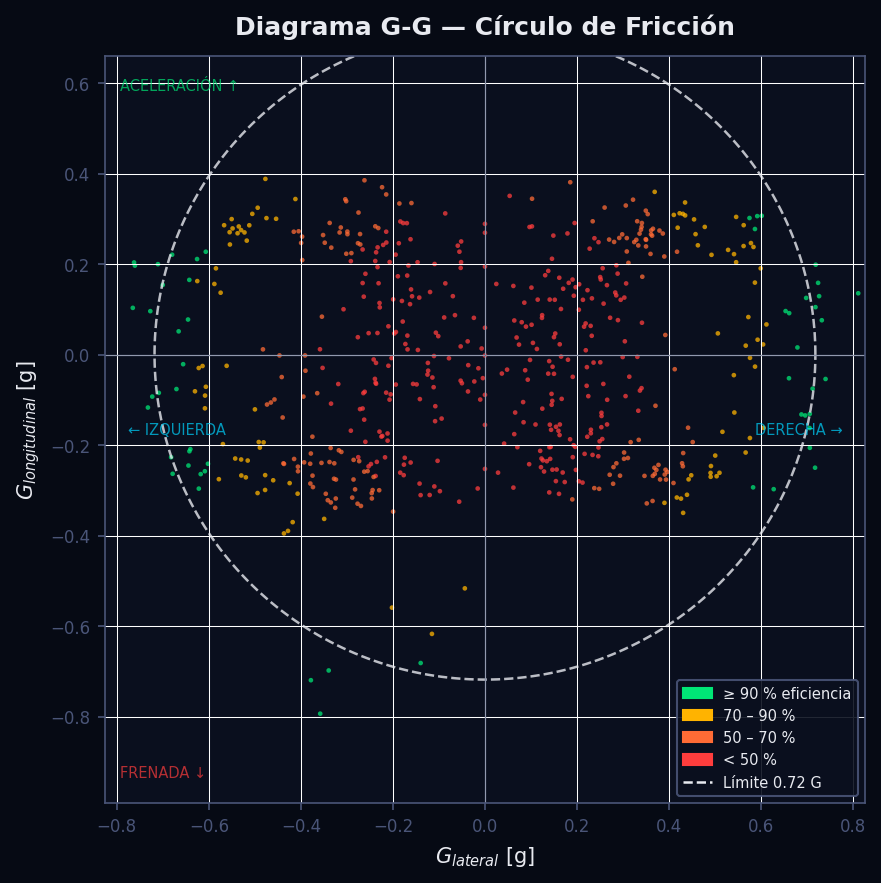
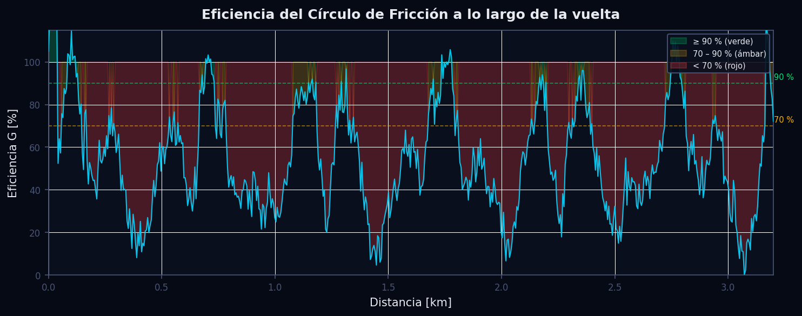
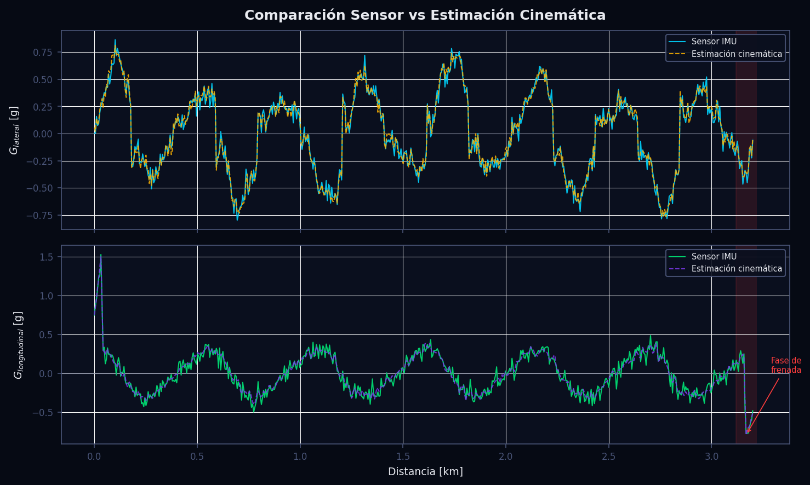
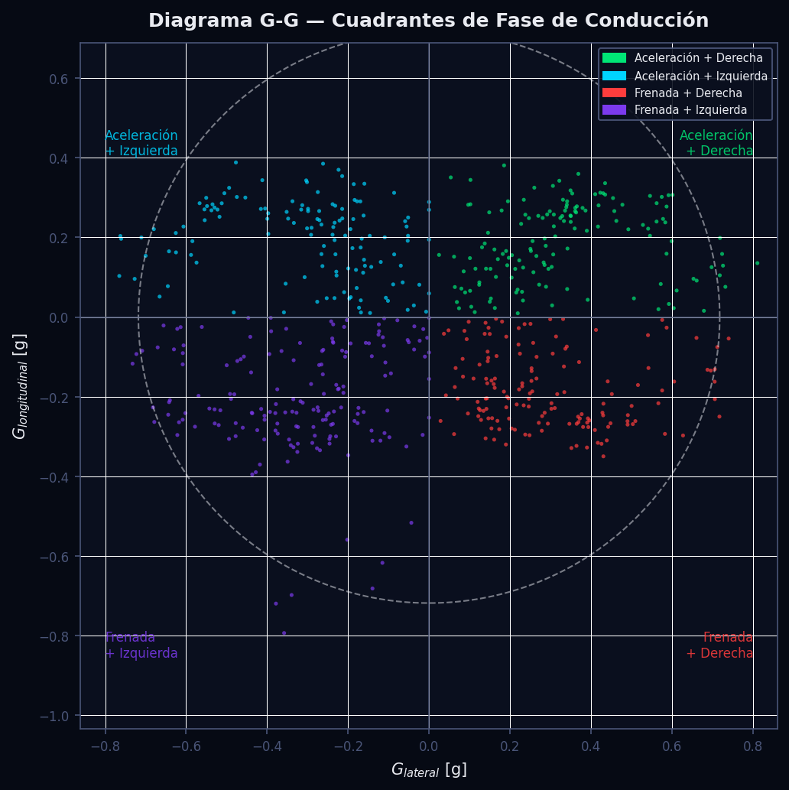

# Diagrama G-G, Círculo de Fricción y Estimación Cinemática

---

## Tabla de Contenidos

1. [Descripción General](#descripción-general)
2. [Fundamentos Científicos](#fundamentos-científicos)
   - 2.1 [El Círculo de Fricción](#21-el-círculo-de-fricción)
   - 2.2 [Eficiencia del Diagrama G-G](#22-eficiencia-del-diagrama-g-g)
   - 2.3 [Estimación Cinemática de Fuerzas G](#23-estimación-cinemática-de-fuerzas-g)
   - 2.4 [Forma Real vs Círculo Ideal: la "Diamante"](#24-forma-real-vs-círculo-ideal-la-diamante)
3. [Algoritmo e Implementación](#algoritmo-e-implementación)
   - 3.1 [Estimación Cinemática — `calcular_g_desde_cinematica`](#31-estimación-cinemática--calcular_g_desde_cinematica)
   - 3.2 [Límites Dinámicos y Eficiencia — `calcular_limites_dinamicos`](#32-límites-dinámicos-y-eficiencia--calcular_limites_dinamicos)
   - 3.3 [Construcción de Puntos G-G — `_build_gg_points`](#33-construcción-de-puntos-g-g--_build_gg_points)
   - 3.4 [Detección de Sub/Sobreviraje](#34-detección-de-subsobreviraje)
4. [Parámetros Clave](#parámetros-clave)
5. [Interpretación de Resultados](#interpretación-de-resultados)
6. [Recomendaciones para el Piloto](#recomendaciones-para-el-piloto)
7. [Visualizaciones](#visualizaciones)
8. [Referencias](#referencias)

---

## Descripción General

El **Diagrama G-G** (también llamado diagrama de tracción o círculo de fricción) es la herramienta central del análisis de dinámica vehicular en competición. Representa gráficamente el vector de aceleración total que experimenta el vehículo en cada instante de la vuelta, descompuesto en sus componentes lateral ($G_{lat}$) y longitudinal ($G_{lon}$). El espacio disponible dentro del círculo de fricción define la envolvente máxima de rendimiento del neumático, de modo que todo punto fuera de esa frontera implica deslizamiento incontrolado y, por ende, pérdida de tiempo por vuelta.

Este módulo implementa dos caminos complementarios: (1) el cálculo directo desde sensores IMU cuando el canal de aceleración está disponible en el CSV de telemetría, y (2) la **estimación cinemática** pura a partir de la velocidad y la geometría de la trazada, útil cuando el vehículo carece de acelerómetros de alta frecuencia. Además, el módulo calcula una métrica de eficiencia normalizada que permite cuantificar el porcentaje del potencial de adherencia que el piloto aprovecha instante a instante, y expone detectores automáticos de subviraje y sobreviraje que combinan el canal de ángulo de volante con el G lateral para generar diagnósticos orientados al setup del vehículo.

---

## Fundamentos Científicos

### 2.1 El Círculo de Fricción

Un neumático puede transmitir una fuerza horizontal máxima $F_{max} = \mu \cdot F_z$, donde $\mu$ es el coeficiente de fricción combinado y $F_z$ la carga vertical. Al dividir por la masa del vehículo se obtiene la aceleración límite en unidades g:

$$
G_{max} = \mu \cdot g
$$

La física de la goma establece que la capacidad de tracción se consume de forma **vectorial**: la misma fuerza máxima puede orientarse en cualquier dirección del plano horizontal, pero la suma cuadrática no puede superar el límite. Esto genera la restricción circular:

$$
G_{sum}(t) = \sqrt{G_{lat}^2(t) + G_{lon}^2(t)} \leq \mu \cdot g = G_{max}
$$

La razón geométrica por la que la frontera es una **circunferencia** y no un cuadrado se debe al modelo de Coulomb: el neumático satura cuando la resultante vectorial de las fuerzas de rozamiento alcanza $\mu F_z$, independientemente de la dirección. Un modelo de cuadrado supondría que la capacidad longitudinal no se ve afectada por la tracción lateral, lo cual es físicamente incorrecto. El círculo de fricción, en contraste, captura correctamente la transferencia de capacidad entre ejes de fuerza.

### 2.2 Eficiencia del Diagrama G-G

Para poder comparar pilotos o vueltas en condiciones de adherencia variables (temperatura de neumáticos, pista mojada, tipo de compuesto), se normaliza $G_{sum}$ contra un límite de referencia empírico derivado de la propia vuelta:

$$
G_{limit} = \text{percentil}_{95}\bigl(G_{sum}(t)\bigr)
$$

El percentil 95 se escoge deliberadamente en lugar del máximo para evitar que picos espúreos o maniobras de esquivar obstáculos distorsionen la referencia. Con este límite se define la **eficiencia de adherencia**:

$$
\eta(t) = \frac{G_{sum}(t)}{G_{limit}} \times 100\%
$$

Un piloto de referencia (o un conductor experto) mantiene $\eta(t)$ cerca del 100 % durante las fases de frenada, vértice y aceleración, con descensos solo en las transiciones entre fases. Valores medios de vuelta superiores al 80 % son indicativos de pilotaje de alto nivel en monoplazas de fórmula; en turismos de producción, valores por encima del 65 % ya representan un aprovechamiento muy bueno del neumático.

El código en `calcular_limites_dinamicos` implementa exactamente esta definición:

```python
g_max = df_aligned["G_Sum_Fast"].quantile(0.95)   # G_limit = p95
df_aligned["G_Efficiency_Fast"] = (df_aligned["G_Sum_Fast"] / g_max) * 100
```

Si `g_max` resultara menor que 0.1 G (datos degenerados o vehículo casi parado) se sustituye por 1.0 G como valor de guardia para evitar divisiones por cero.

### 2.3 Estimación Cinemática de Fuerzas G

Cuando el CSV de telemetría no incluye canales de acelerómetro, el módulo reconstruye los vectores G a partir de la velocidad longitudinal y la curvatura de la trazada. La derivación exacta es la siguiente:

**G Longitudinal**

Partiendo de la definición de aceleración longitudinal $a_{lon} = dv/dt$, se aplica la regla de la cadena para reescribir la derivada temporal en función de la distancia recorrida $s$:

$$
a_{lon} = \frac{dv}{dt} = \frac{dv}{ds} \cdot \frac{ds}{dt} = \frac{dv}{ds} \cdot v
$$

En unidades g:

$$
G_{lon}(t) = \frac{a_{lon}}{g} = \frac{v \cdot \frac{dv}{ds}}{g}
$$

La derivada espacial $dv/ds$ se evalúa numéricamente con diferencias centrales (`numpy.gradient`) sobre el vector de velocidad muestreado en pasos de 1 m de distancia.

**G Lateral**

En un movimiento curvilíneo, la aceleración centrípeta es $a_{lat} = v^2 / R$. Sustituyendo el radio de curvatura por su inverso, la curvatura geométrica $\kappa = 1/R$:

$$
a_{lat} = v^2 \cdot \kappa(s)
$$

En unidades g:

$$
G_{lat}(t) = \frac{v^2(t) \cdot \kappa\bigl(s(t)\bigr)}{g}
$$

donde $\kappa(s)$ es la curvatura de la trazada previamente calculada por el módulo de geometría (spline cúbico del GPS) e interpolada sobre la malla de distancia del canal de velocidad.

**Precisión del método**

La estimación cinemática es exacta en condiciones de agarre. Diverge de la lectura real del acelerómetro cuando existe deslizamiento lateral (porque entonces $v^2\kappa/g < G_{lat,real}$, el neumático no sigue la trazada geométrica) o cuando hay vibraciones de alta frecuencia en la velocidad muestreada. En la práctica, el error RMS en vueltas limpias es inferior al 5 % del rango dinámico, suficiente para análisis de setup y coaching.

### 2.4 Forma Real vs Círculo Ideal: la "Diamante"

En vehículos de competición reales, la nube de puntos del diagrama G-G no forma un círculo perfecto sino una figura **romboidal o en diamante** ligeramente aplanada en los vértices laterales. Las causas son:

- **Carga aerodinámica**: a alta velocidad, el downforce aumenta $F_z$ y por tanto $G_{max}$, extendiendo el círculo hacia los cuadrantes de frenada y aceleración a altas $v$, pero no necesariamente en el vértice (velocidad mínima).
- **Frenada con trail braking**: la técnica de frenada tardía y progresiva permite combinar $G_{lon}$ y $G_{lat}$ en la entrada de curva, llenando el cuadrante SE/SW y confiriendo la forma de diamante. Un piloto que suelta completamente el freno antes de girar dejará vacíos esos cuadrantes.
- **Asimetría neumático delantero/trasero**: los compuestos de diferente dureza, presiones o temperaturas producen elipses asimétricas respecto al eje de $G_{lat}$.
- **Limitaciones mecánicas**: la relación entre aceleración máxima en tracción y máxima en frenada no es 1:1; un monoplaza de F1 puede generar hasta 6 G en frenada pero solo 2–3 G en aceleración, desplazando el centroide del diagrama hacia $G_{lon} < 0$.

La forma del diagrama G-G es, por tanto, una huella digital del estilo de pilotaje, el setup del vehículo y las condiciones de la pista.

---

## Algoritmo e Implementación

### 3.1 Estimación Cinemática — `calcular_g_desde_cinematica`

**Archivo**: `src/analytics/dynamics.py`, línea 9.

**Entradas**:
- `df_aligned` — DataFrame con columnas `Distance`, `Speed_Fast`, `Speed_Slow` en pasos de 1 m.
- `df_geo` — DataFrame con columnas `Distance` y `Curvature` (curvatura geométrica en m⁻¹).
- `canal_speed` — nombre base del canal de velocidad (por defecto `"Speed"`).

**Pasos**:

1. **Validación de canales**: se comprueba que `df_geo` contenga `Distance` y `Curvature`. Si faltan, se emite un warning y se devuelve `df_aligned` sin modificar.

2. **Interpolación de curvatura**: la curvatura de la trazada se calcula sobre la malla del GPS (`df_geo`), que puede tener resolución diferente al canal de velocidad. Se construye una función de interpolación lineal con `scipy.interpolate.interp1d` con `fill_value=0.0` fuera de rango (rectas = curvatura cero):

   ```python
   f_kappa = interp1d(dist_geo, kappa_geo, kind="linear",
                      bounds_error=False, fill_value=0.0)
   kappa = f_kappa(dist_aligned)
   ```

3. **Conversión de unidades**: la velocidad se convierte de km/h a m/s y se recorta a un mínimo de 0.5 m/s para evitar divisiones por cero en las subsiguientes operaciones.

4. **G Longitudinal** (derivada numérica central):

   ```python
   dv_ds = np.gradient(speed_ms, 1.0)   # paso de 1 m
   lon_acc = dv_ds * speed_ms            # a_lon = (dv/ds) * v  [m/s²]
   df_aligned[f"LongitudinalG_{lap}"] = np.round(lon_acc / 9.81, 4)
   ```

5. **G Lateral** (producto curvatura-velocidad²):

   ```python
   lat_acc = speed_ms**2 * kappa         # a_lat = v² * κ  [m/s²]
   df_aligned[f"LateralG_{lap}"] = np.round(lat_acc / 9.81, 4)
   ```

   Nota: la función devuelve únicamente el módulo de $G_{lat}$ (valor siempre $\geq 0$) ya que la curvatura geométrica no codifica el sentido (derecha/izquierda). Para recuperar el signo se requiere el canal de ángulo de volante o la derivada del heading GPS.

6. **Iteración por vuelta**: el bloque se repite para `_Fast` (vuelta rápida) y `_Slow` (vuelta de referencia), produciendo cuatro columnas nuevas: `LongitudinalG_Fast`, `LateralG_Fast`, `LongitudinalG_Slow`, `LateralG_Slow`.

### 3.2 Límites Dinámicos y Eficiencia — `calcular_limites_dinamicos`

**Archivo**: `src/analytics/dynamics.py`, línea 59.

**Pasos**:

1. Verificar disponibilidad de canales `LateralG_Fast` y `LongitudinalG_Fast`. Si faltan, se registra un warning con la lista de columnas disponibles que contengan keywords relacionados con G/aceleración.

2. Calcular el vector suma para ambas vueltas:

   $$G_{sum} = \sqrt{G_{lat}^2 + G_{lon}^2}$$

   ```python
   df_aligned["G_Sum_Fast"] = np.sqrt(g_lat**2 + g_lon**2)
   ```

3. Determinar `g_max` como el percentil 95 de `G_Sum_Fast`. Se aplica el guardián de 0.1 G para datos corruptos.

4. Calcular `G_Efficiency_Fast` y `G_Efficiency_Slow` normalizando contra `g_max`.

5. Devolver el DataFrame enriquecido y el escalar `g_max` para que los módulos de visualización puedan dibujar el círculo de referencia.

### 3.3 Construcción de Puntos G-G — `_build_gg_points`

**Archivo**: `src/analytics/dynamics.py`, línea 103.

Esta función prepara la estructura de datos JSON para el frontend React. Opera un diezmado proporcional cuando el número de puntos supera `max_points` (por defecto 500) para evitar saturar la red:

```python
if len(subset) > max_points:
    subset = subset.iloc[:: len(subset) // max_points]
```

Cada punto exportado contiene tres valores: `lat` (G lateral), `lon` (G longitudinal) y `eff` (eficiencia en %). Esta terna es suficiente para que el componente `GGDiagramChart.jsx` aplique el mapeado de color por eficiencia en el cliente.

### 3.4 Detección de Sub/Sobreviraje

**Archivo**: `src/analytics/dynamics.py`, línea 176.

El algoritmo analiza ventanas de ±60 m alrededor de cada vértice de curva (apex) previamente detectado por el módulo de geometría:

**Subviraje** — Se detecta cuando el ángulo de volante crece (piloto pide más giro) pero la aceleración lateral no responde de forma proporcional:

$$
\frac{d\delta_{steer}}{ds} > 0.1 \quad \text{y} \quad \left|\frac{dG_{lat}}{ds}\right| < u_{sub} \cdot |\delta_{steer}|
$$

con $u_{sub} = 0.15$ (umbral por defecto). Se aplica suavizado rolling (ventana 3) antes de calcular gradientes para filtrar ruido de alta frecuencia del canal de volante.

**Sobreviraje** — Se detecta mediante la detección de jerk lateral (variación brusca de $G_{lat}$) combinada con una corrección de volante opuesta al giro:

$$
\text{jerk}_{lat} = |G_{lat}(i+1) - G_{lat}(i-1)| > u_{over}
$$

con $u_{over} = 0.5$ G por muestra. La corrección de volante se verifica comprobando que $|\delta_{after}|$ difiere de $|\delta_{before}|$ en más de un 30 %.

Los eventos se clasifican en tres niveles de severidad (leve, media, crítico) y se acompañan de un diagnóstico textual con recomendaciones de setup específicas.

---

## Parámetros Clave

| Parámetro | Valor por defecto | Descripción | Efecto sobre el análisis |
|---|---|---|---|
| `canal_speed` | `"Speed"` | Nombre base del canal de velocidad en el CSV | Selecciona las columnas `Speed_Fast` y `Speed_Slow` |
| `canal_lat` | `"LateralG"` | Nombre base del canal de G lateral | Permite usar canales personalizados de IMU |
| `canal_long` | `"LongitudinalG"` | Nombre base del canal de G longitudinal | Idem para aceleración longitudinal |
| `g` (constante) | `9.81 m/s²` | Aceleración de la gravedad estándar | Divide las aceleraciones físicas para obtener unidades g |
| `fill_value` curvatura | `0.0 m⁻¹` | Valor fuera del rango del GPS | Zonas sin datos de curvatura se tratan como recta |
| `clip_speed_min` | `0.5 m/s` | Velocidad mínima para evitar división por cero | Afecta al G longitudinal cuando el vehículo está casi parado |
| Percentil G_limit | `95` | Percentil de `G_Sum_Fast` usado como referencia | Determina el denominador de la eficiencia; aumentarlo eleva el estándar |
| `g_max` guardián | `1.0 G` | Valor mínimo de `g_max` si los datos son degenerados | Evita eficiencias artificialmente elevadas o NaN |
| `max_points` (GG export) | `500` | Máximo de puntos enviados al frontend | Controla el tamaño del JSON; reducir mejora latencia de red |
| `ventana_m` | `60 m` | Semiancho de ventana alrededor del apex | Ventanas más amplias detectan eventos más lejos del vértice |
| `umbral_sub` | `0.15` | Sensibilidad de detección de subviraje | Bajar el umbral produce más detecciones (posibles falsos positivos) |
| `umbral_over` | `0.5 G/muestra` | Umbral de jerk lateral para sobreviraje | Ajustar según la suspensión del vehículo (más rígida → mayor jerk normal) |
| Suavizado rolling | ventana 3 | Promedio móvil antes de gradientes | Reduce falsos positivos por ruido eléctrico en el canal de volante |

---

## Interpretación de Resultados

### Diagrama G-G (Círculo de Fricción)

**Figura circular densa hacia los bordes** — El piloto trabaja la adherencia al límite de forma consistente. La nube de puntos debe "rozar" el círculo de fricción en los cuadrantes de máxima frenada (S) y máxima aceleración (N).

**Figura concentrada en el centro** — El piloto no explota el neumático. Puede indicar exceso de precaución, circuit familiarity baja o setup extremadamente subvirante que impide confiar en el neumático.

**Forma de diamante extendida hacia SE y SW** — El piloto usa trail braking eficiente, aprovechando frenada lateral combinada en la entrada de curva. Es la firma de pilotos de nivel avanzado.

**Puntos más allá del círculo de referencia** — Implican que en esos instantes $G_{sum} > G_{limit}$. Pueden ser picos reales de adherencia en condiciones favorables (pista gummed up) o ruido del sensor/estimación. Si aparecen sistemáticamente, reconsiderar el percentil de referencia.

### Eficiencia a lo largo de la Vuelta

**Caídas de eficiencia largas (>100 m de distancia)** — Zonas donde el piloto levanta mucho el pie o gira de forma muy conservadora. Potencial de mejora inmediato mediante análisis del punto de frenada o de la velocidad mínima en el vértice.

**Eficiencia media de vuelta < 60 %** — Señal de subutilización global. En un piloto experimentado sugiere problemas de confianza en el setup (ej. sobreviraje crónico que obliga a pilotaje defensivo).

**Picos de eficiencia > 105 %** — El piloto supera el círculo de referencia. Si son frecuentes, el límite p95 puede estar subestimando la capacidad real (vuelta de referencia con neumáticos fríos).

### Comparación Sensor vs Estimación Cinemática

Cuando las dos curvas muestran buen acuerdo (error < 10 %) la estimación cinemática es fiable y puede usarse como substituto de la IMU. Divergencias significativas en zona de vértice suelen indicar deslizamiento lateral real (el vehículo no sigue exactamente la trazada GPS). En la fase de frenada, la estimación cinemática puede subestimar el pico de $G_{lon}$ si el muestreo de velocidad es bajo (< 10 Hz).

### Señales de Alerta Automáticas

| Severidad | Criterio de activación | Acción recomendada |
|---|---|---|
| **Subviraje crítico** | $d\delta/ds \geq 0.6$ o $\delta > 15°$ | Revisar presión delantera, suavizar barra estabilizadora delantera |
| **Subviraje moderado** | $d\delta/ds \geq 0.3$ o $\delta > 8°$ | Revisar trazada de entrada, evaluar balance de frenada |
| **Sobreviraje crítico** | jerk $\geq 2.5 \times u_{over}$ | Revisar presión trasera, dureza barra trasera, mapa de diferencial |
| **Sobreviraje moderado** | jerk $\geq 1.5 \times u_{over}$ | Evaluar ajuste de diferencial, entrada de curva |

---

## Recomendaciones para el Piloto

**1. Rellenar el diagrama G-G en los cuadrantes de transición (NE, SW)**

Los cuadrantes noreste (aceleración + giro derecha) y suroeste (frenada + giro izquierda) suelen estar vacíos en pilotos en desarrollo. La técnica para rellenarlos es el **trail braking progresivo**: mantener presión de freno decreciente mientras se inicia el giro, de forma que el vector de fuerza rote suavemente desde el sur (frenada pura) hasta el este/oeste (lateral puro), sin pasar por el centro del diagrama.

**2. Minimizar el tiempo con eficiencia < 70 %**

Cada muestra con $\eta < 70\%$ es tiempo sobre la mesa. Las zonas de baja eficiencia suelen coincidir con: (a) exceso de braking antes de la entrada de curva, (b) suelta prematura de freno, (c) aplicación tardía del acelerador en la salida. Identificar la distancia exacta de cada caída usando el gráfico de eficiencia sobre distancia.

**3. Consistencia entre vueltas**

Superponer el diagrama G-G de la vuelta rápida con la vuelta lenta. Las zonas donde la vuelta lenta tiene menos puntos en la periferia del círculo revelan dónde el piloto no replica el ritmo. La eficiencia en vértices de curvas lentas (velocidad < 80 km/h) es especialmente sensible a la técnica de frenada.

**4. Interpretar el sobreviraje detectado antes de tocar el setup**

Un evento de sobreviraje en la base del análisis puede tener origen técnico (subviraje crónico que el piloto corrige con agresividad) o de setup (diferencial demasiado cerrado en aceleración). Revisar en qué fase del arco de curva ocurre: si es en la entrada → técnica de frenada; si es en la salida → diferencial/presión trasera; si es en el vértice → equilibrio de balance mecánico.

**5. Usar $G_{limit}$ como KPI de evolución de neumático**

El valor de `g_max` (percentil 95 de $G_{sum}$) sube conforme el neumático alcanza su temperatura óptima. Comparar `g_max` entre el primer sector y el tercero de la misma vuelta para verificar que la goma está completamente trabajada. Una diferencia superior al 8 % sugiere que las primeras curvas se están pilotando con neumático frío.

---

## Visualizaciones

Para regenerar todas las imágenes de esta sección ejecutar:

```bash
python scripts/docs/gen_gg_diagram.py
```

---

### Figura 1 — Círculo de Fricción



Diagrama G-G polar con todos los puntos de la vuelta coloreados por eficiencia de adherencia. El eje X es $G_{lateral}$ (derecha positivo), el eje Y es $G_{longitudinal}$ (aceleración positivo, frenada negativo). La circunferencia blanca discontinua representa el límite de fricción $G_{limit} = \text{p95}(G_{sum})$. Los puntos verdes ($\eta \geq 90\%$) indican aprovechamiento óptimo del neumático; los rojos ($\eta < 50\%$) indican zonas con margen de mejora significativo. Una nube bien desarrollada toca el límite en los cuadrantes Norte (aceleración) y Sur (frenada), y muestra una forma de diamante extendida en los cuadrantes de transición cuando el piloto usa trail braking.

---

### Figura 2 — Eficiencia sobre Distancia



Serie temporal de la eficiencia $\eta(t)$ a lo largo de la vuelta expresada en distancia (km). Las líneas de referencia horizontales marcan los umbrales del 90 % (verde discontinuo) y 70 % (ámbar discontinuo). El relleno entre la curva y el 100 % se colorea en función de la banda de eficiencia: verde para zonas por encima del 90 %, ámbar entre 70 % y 90 %, y rojo para caídas por debajo del 70 %. Las caídas de eficiencia pronunciadas y prolongadas son el objetivo inmediato de coaching, pues representan distancia recorrida sin maximizar el uso del neumático.

---

### Figura 3 — Estimación Cinemática vs Sensor



Panel dual mostrando la comparación entre la lectura del sensor IMU (línea sólida) y la estimación cinemática (línea discontinua) para $G_{lateral}$ (panel superior, cyan/ámbar) y $G_{longitudinal}$ (panel inferior, verde/morado). La zona sombreada en rojo identifica la fase de frenada más intensa de la vuelta. Un buen acuerdo entre ambas curvas (desviaciones < 10 %) valida la estimación cinemática como substituto del acelerómetro. Divergencias sistemáticas en el pico de frenada o en el vértice de curva suelen indicar deslizamiento real o saturación del neumático.

---

### Figura 4 — Cuadrantes de Fase de Conducción



Versión del diagrama G-G con los puntos coloreados por fase de conducción: aceleración + giro derecha (verde, NE), aceleración + giro izquierda (cyan, NW), frenada + giro derecha (rojo, SE), frenada + giro izquierda (morado, SW). Esta representación permite identificar desequilibrios entre curvas derechas e izquierdas, y evaluar si el piloto usa con igual eficacia la combinación de frenada-giro en ambas direcciones. Un circuito con predominancia de curvas a derechas mostrará más densidad de puntos en los cuadrantes SE y NE.

---

## Referencias

1. **Milliken, W. F. & Milliken, D. L.** (1995). *Race Car Vehicle Dynamics*. SAE International. — Capítulo 5 (Steady-State Cornering), Capítulo 8 (Friction Circle). Referencia canónica para el círculo de fricción y el modelo de neumático de Coulomb.

2. **Segers, J.** (2014). *Analysis Techniques for Racecar Data Acquisition*, 2nd ed. SAE International. — Capítulos 4 y 6, metodología de análisis G-G, cálculo de eficiencia de adherencia y técnicas de normalización entre vueltas.

3. **Beckman, B.** (1991). *The Physics of Racing*. Series of technical articles. — Derivación intuitiva del círculo de fricción como consecuencia directa del modelo de Coulomb aplicado a neumáticos en competición.

4. **Kelly, D. P.** (2008). *Lap time simulation with transient vehicle and tyre dynamics*. PhD Thesis, Cranfield University. — Validación experimental de la estimación cinemática de G y sus límites de aplicabilidad en presencia de deslizamiento lateral.

5. **Siegler, B., Deakin, A. & Crolla, D.** (2000). *Lap time simulation: comparison of steady state, quasi-static and transient racing car cornering strategies*. SAE Technical Paper 2000-01-3563. — Comparación cuantitativa entre modelos de tracción estacionaria y transitoria, con implicaciones directas sobre la interpretación del diagrama G-G en frenada con trail braking.
