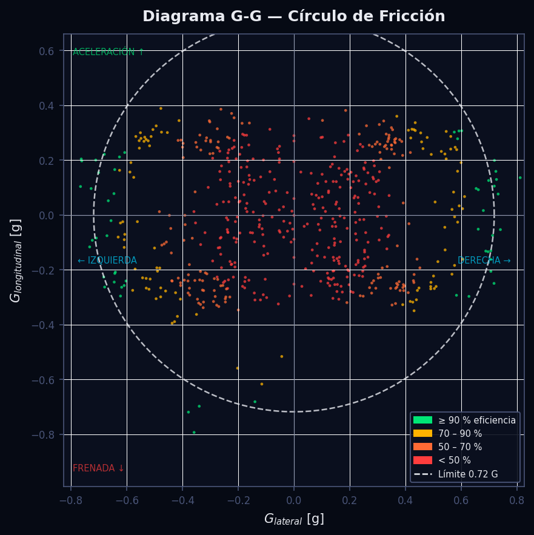
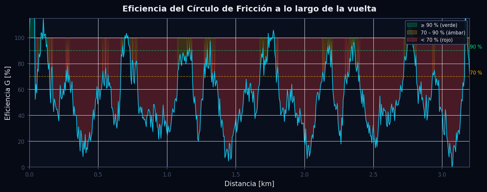
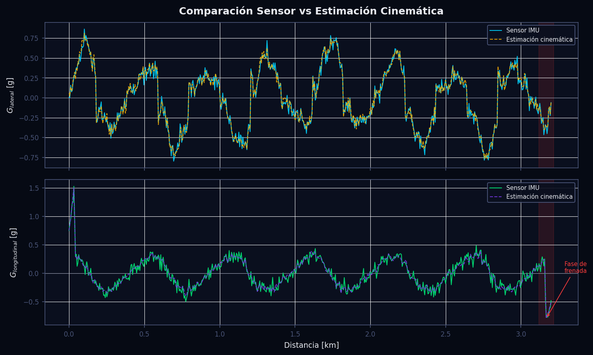
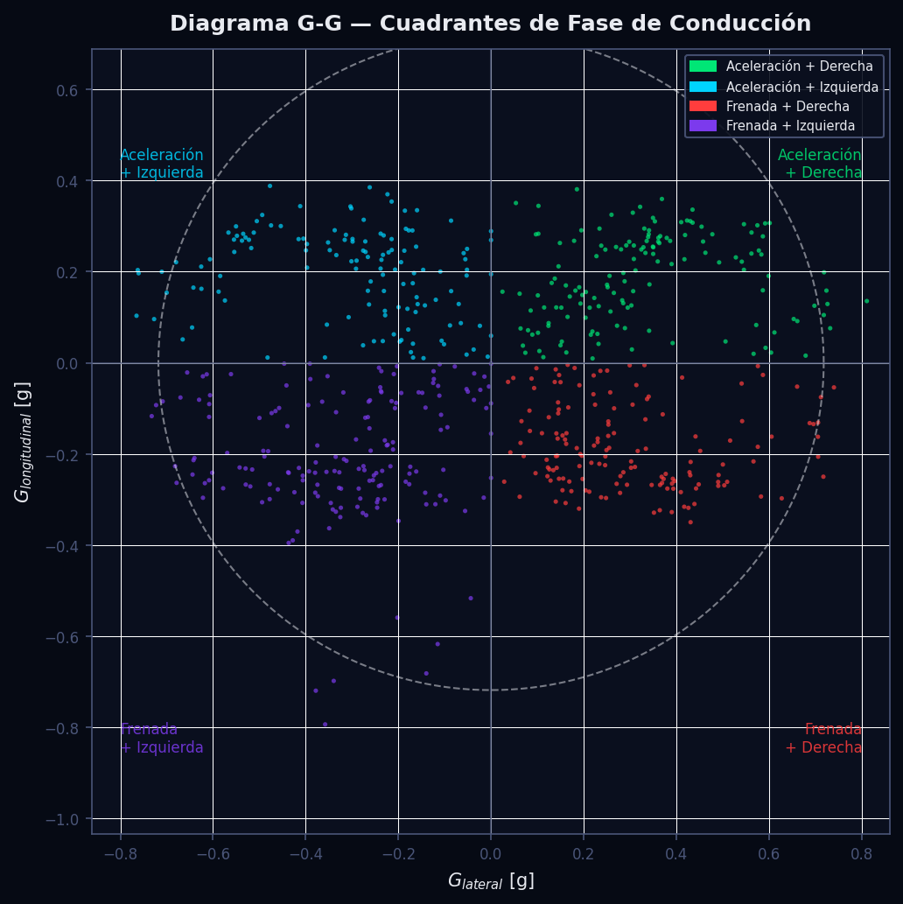

# G-G Diagram, Friction Circle, and Kinematic Estimation

🌐 [Ver en Español](./03_gg_diagram.es.md)

---

## Table of Contents

1. [Overview](#overview)
2. [Scientific Foundations](#scientific-foundations)
   - 2.1 [The Friction Circle](#21-the-friction-circle)
   - 2.2 [G-G Diagram Efficiency](#22-g-g-diagram-efficiency)
   - 2.3 [Kinematic Estimation of G-Forces](#23-kinematic-estimation-of-g-forces)
   - 2.4 [Real Shape vs Ideal Circle: the "Diamond"](#24-real-shape-vs-ideal-circle-the-diamond)
3. [Algorithm and Implementation](#algorithm-and-implementation)
   - 3.1 [Kinematic Estimation — `calcular_g_desde_cinematica`](#31-kinematic-estimation--calcular_g_desde_cinematica)
   - 3.2 [Dynamic Limits and Efficiency — `calcular_limites_dinamicos`](#32-dynamic-limits-and-efficiency--calcular_limites_dinamicos)
   - 3.3 [G-G Point Construction — `_build_gg_points`](#33-g-g-point-construction--_build_gg_points)
   - 3.4 [Under/Oversteer Detection](#34-underoversteer-detection)
4. [Key Parameters](#key-parameters)
5. [Interpreting Results](#interpreting-results)
6. [Recommendations for the Driver](#recommendations-for-the-driver)
7. [Visualizations](#visualizations)
8. [References](#references)

---

## Overview

The **G-G Diagram** (also called the traction diagram or friction circle) is the central tool in vehicle dynamics analysis for motorsport. It graphically represents the total acceleration vector experienced by the vehicle at each instant of the lap, decomposed into its lateral ($G_{lat}$) and longitudinal ($G_{lon}$) components. The space available within the friction circle defines the maximum performance envelope of the tyre, such that any point outside that boundary implies uncontrolled sliding and, consequently, lap time loss.

This module implements two complementary paths: (1) direct calculation from IMU sensors when the acceleration channel is available in the telemetry CSV, and (2) pure **kinematic estimation** from speed and track geometry, useful when the vehicle lacks high-frequency accelerometers. In addition, the module computes a normalised efficiency metric that quantifies the percentage of available grip potential the driver exploits at each instant, and exposes automatic understeer and oversteer detectors that combine the steering angle channel with lateral G to generate diagnostics aimed at vehicle setup.

---

## Scientific Foundations

### 2.1 The Friction Circle

A tyre can transmit a maximum horizontal force $F_{max} = \mu \cdot F_z$, where $\mu$ is the combined friction coefficient and $F_z$ is the vertical load. Dividing by vehicle mass gives the limit acceleration in g units:

$$
G_{max} = \mu \cdot g
$$

The physics of rubber establishes that traction capacity is consumed **vectorially**: the same maximum force can be directed in any horizontal-plane direction, but the quadratic sum cannot exceed the limit. This generates the circular constraint:

$$
G_{sum}(t) = \sqrt{G_{lat}^2(t) + G_{lon}^2(t)} \leq \mu \cdot g = G_{max}
$$

The geometric reason why the boundary is a **circle** and not a square stems from the Coulomb model: the tyre saturates when the vector resultant of friction forces reaches $\mu F_z$, regardless of direction. A square model would assume that longitudinal capacity is unaffected by lateral traction, which is physically incorrect. The friction circle, by contrast, correctly captures the capacity transfer between force axes.

### 2.2 G-G Diagram Efficiency

In order to compare drivers or laps under variable grip conditions (tyre temperature, wet track, compound type), $G_{sum}$ is normalised against an empirical reference limit derived from the lap itself:

$$
G_{limit} = \text{percentile}_{95}\bigl(G_{sum}(t)\bigr)
$$

The 95th percentile is deliberately chosen instead of the maximum to prevent spurious spikes or obstacle-avoidance manoeuvres from distorting the reference. Using this limit, **grip efficiency** is defined as:

$$
\eta(t) = \frac{G_{sum}(t)}{G_{limit}} \times 100\%
$$

A reference driver (or an expert driver) keeps $\eta(t)$ close to 100 % during braking, apex, and acceleration phases, with drops only during transitions between phases. Average lap values above 80 % are indicative of high-level driving in formula single-seaters; in production touring cars, values above 65 % already represent very good tyre exploitation.

The code in `calcular_limites_dinamicos` implements exactly this definition:

```python
g_max = df_aligned["G_Sum_Fast"].quantile(0.95)   # G_limit = p95
df_aligned["G_Efficiency_Fast"] = (df_aligned["G_Sum_Fast"] / g_max) * 100
```

If `g_max` turns out to be less than 0.1 G (degenerate data or vehicle nearly stationary), it is replaced by 1.0 G as a guard value to avoid division by zero.

### 2.3 Kinematic Estimation of G-Forces

When the telemetry CSV does not include accelerometer channels, the module reconstructs the G vectors from longitudinal speed and track curvature. The exact derivation is as follows:

**Longitudinal G**

Starting from the definition of longitudinal acceleration $a_{lon} = dv/dt$, the chain rule is applied to rewrite the time derivative as a function of distance travelled $s$:

$$
a_{lon} = \frac{dv}{dt} = \frac{dv}{ds} \cdot \frac{ds}{dt} = \frac{dv}{ds} \cdot v
$$

In g units:

$$
G_{lon}(t) = \frac{a_{lon}}{g} = \frac{v \cdot \frac{dv}{ds}}{g}
$$

The spatial derivative $dv/ds$ is evaluated numerically with central differences (`numpy.gradient`) over the speed vector sampled at 1 m distance steps.

**Lateral G**

In curvilinear motion, centripetal acceleration is $a_{lat} = v^2 / R$. Replacing the radius of curvature by its inverse, the geometric curvature $\kappa = 1/R$:

$$
a_{lat} = v^2 \cdot \kappa(s)
$$

In g units:

$$
G_{lat}(t) = \frac{v^2(t) \cdot \kappa\bigl(s(t)\bigr)}{g}
$$

where $\kappa(s)$ is the track curvature previously computed by the geometry module (cubic GPS spline) and interpolated onto the distance grid of the speed channel.

**Method Accuracy**

The kinematic estimation is exact under grip conditions. It diverges from the actual accelerometer reading when lateral slip occurs (because then $v^2\kappa/g < G_{lat,real}$, the tyre no longer follows the geometric line) or when high-frequency vibrations are present in the sampled speed signal. In practice, the RMS error on clean laps is below 5 % of the dynamic range, sufficient for setup analysis and coaching.

### 2.4 Real Shape vs Ideal Circle: the "Diamond"

In real competition vehicles, the point cloud of the G-G diagram does not form a perfect circle but rather a **rhomboidal or diamond** figure slightly flattened at the lateral vertices. The causes are:

- **Aerodynamic load**: at high speed, downforce increases $F_z$ and therefore $G_{max}$, extending the circle towards the braking and acceleration quadrants at high $v$, but not necessarily at the apex (minimum speed).
- **Braking with trail braking**: the technique of late, progressive braking allows combining $G_{lon}$ and $G_{lat}$ on corner entry, filling the SE/SW quadrants and conferring the diamond shape. A driver who fully releases the brake before turning will leave those quadrants empty.
- **Front/rear tyre asymmetry**: compounds of different hardness, pressures, or temperatures produce ellipses that are asymmetric with respect to the $G_{lat}$ axis.
- **Mechanical limitations**: the ratio between maximum acceleration under traction and maximum under braking is not 1:1; an F1 single-seater can generate up to 6 G under braking but only 2–3 G under acceleration, shifting the diagram centroid towards $G_{lon} < 0$.

The shape of the G-G diagram is therefore a fingerprint of driving style, vehicle setup, and track conditions.

---

## Algorithm and Implementation

### 3.1 Kinematic Estimation — `calcular_g_desde_cinematica`

**File**: `src/analytics/dynamics.py`, line 9.

**Inputs**:
- `df_aligned` — DataFrame with columns `Distance`, `Speed_Fast`, `Speed_Slow` at 1 m steps.
- `df_geo` — DataFrame with columns `Distance` and `Curvature` (geometric curvature in m⁻¹).
- `canal_speed` — base name of the speed channel (default `"Speed"`).

**Steps**:

1. **Channel validation**: checks that `df_geo` contains `Distance` and `Curvature`. If missing, a warning is issued and `df_aligned` is returned unmodified.

2. **Curvature interpolation**: track curvature is computed on the GPS grid (`df_geo`), which may have a different resolution than the speed channel. A linear interpolation function is built with `scipy.interpolate.interp1d` with `fill_value=0.0` out of range (straights = zero curvature):

   ```python
   f_kappa = interp1d(dist_geo, kappa_geo, kind="linear",
                      bounds_error=False, fill_value=0.0)
   kappa = f_kappa(dist_aligned)
   ```

3. **Unit conversion**: speed is converted from km/h to m/s and clipped to a minimum of 0.5 m/s to avoid division by zero in subsequent operations.

4. **Longitudinal G** (central numerical derivative):

   ```python
   dv_ds = np.gradient(speed_ms, 1.0)   # 1 m step
   lon_acc = dv_ds * speed_ms            # a_lon = (dv/ds) * v  [m/s²]
   df_aligned[f"LongitudinalG_{lap}"] = np.round(lon_acc / 9.81, 4)
   ```

5. **Lateral G** (curvature-speed² product):

   ```python
   lat_acc = speed_ms**2 * kappa         # a_lat = v² * κ  [m/s²]
   df_aligned[f"LateralG_{lap}"] = np.round(lat_acc / 9.81, 4)
   ```

   Note: the function returns only the magnitude of $G_{lat}$ (always $\geq 0$) because geometric curvature does not encode direction (right/left). Recovering the sign requires the steering angle channel or the derivative of the GPS heading.

6. **Per-lap iteration**: the block is repeated for `_Fast` (fast lap) and `_Slow` (reference lap), producing four new columns: `LongitudinalG_Fast`, `LateralG_Fast`, `LongitudinalG_Slow`, `LateralG_Slow`.

### 3.2 Dynamic Limits and Efficiency — `calcular_limites_dinamicos`

**File**: `src/analytics/dynamics.py`, line 59.

**Steps**:

1. Verify availability of channels `LateralG_Fast` and `LongitudinalG_Fast`. If missing, a warning is logged listing the available columns containing G/acceleration-related keywords.

2. Compute the sum vector for both laps:

   $$G_{sum} = \sqrt{G_{lat}^2 + G_{lon}^2}$$

   ```python
   df_aligned["G_Sum_Fast"] = np.sqrt(g_lat**2 + g_lon**2)
   ```

3. Determine `g_max` as the 95th percentile of `G_Sum_Fast`. The 0.1 G guard is applied for corrupt data.

4. Compute `G_Efficiency_Fast` and `G_Efficiency_Slow` by normalising against `g_max`.

5. Return the enriched DataFrame and the scalar `g_max` so that visualisation modules can draw the reference circle.

### 3.3 G-G Point Construction — `_build_gg_points`

**File**: `src/analytics/dynamics.py`, line 103.

This function prepares the JSON data structure for the React frontend. It performs proportional decimation when the number of points exceeds `max_points` (default 500) to avoid saturating the network:

```python
if len(subset) > max_points:
    subset = subset.iloc[:: len(subset) // max_points]
```

Each exported point contains three values: `lat` (lateral G), `lon` (longitudinal G), and `eff` (efficiency in %). This triple is sufficient for the `GGDiagramChart.jsx` component to apply colour mapping by efficiency on the client side.

### 3.4 Under/Oversteer Detection

**File**: `src/analytics/dynamics.py`, line 176.

The algorithm analyses windows of ±60 m around each corner apex previously detected by the geometry module:

**Understeer** — Detected when the steering angle increases (driver requests more lock) but lateral acceleration does not respond proportionally:

$$
\frac{d\delta_{steer}}{ds} > 0.1 \quad \text{and} \quad \left|\frac{dG_{lat}}{ds}\right| < u_{sub} \cdot |\delta_{steer}|
$$

with $u_{sub} = 0.15$ (default threshold). Rolling smoothing (window 3) is applied before computing gradients to filter high-frequency noise from the steering channel.

**Oversteer** — Detected via lateral jerk (sharp variation in $G_{lat}$) combined with a counter-steering correction:

$$
\text{jerk}_{lat} = |G_{lat}(i+1) - G_{lat}(i-1)| > u_{over}
$$

with $u_{over} = 0.5$ G per sample. The steering correction is verified by checking that $|\delta_{after}|$ differs from $|\delta_{before}|$ by more than 30 %.

Events are classified into three severity levels (mild, moderate, critical) and accompanied by a textual diagnosis with specific setup recommendations.

---

## Key Parameters

| Parameter | Default value | Description | Effect on analysis |
|---|---|---|---|
| `canal_speed` | `"Speed"` | Base name of the speed channel in the CSV | Selects columns `Speed_Fast` and `Speed_Slow` |
| `canal_lat` | `"LateralG"` | Base name of the lateral G channel | Allows using custom IMU channels |
| `canal_long` | `"LongitudinalG"` | Base name of the longitudinal G channel | Same for longitudinal acceleration |
| `g` (constant) | `9.81 m/s²` | Standard gravitational acceleration | Divides physical accelerations to obtain g units |
| `fill_value` curvature | `0.0 m⁻¹` | Value outside the GPS range | Zones without curvature data are treated as straights |
| `clip_speed_min` | `0.5 m/s` | Minimum speed to avoid division by zero | Affects longitudinal G when the vehicle is nearly stationary |
| G_limit percentile | `95` | Percentile of `G_Sum_Fast` used as reference | Determines the efficiency denominator; increasing it raises the standard |
| `g_max` guard | `1.0 G` | Minimum value of `g_max` if data is degenerate | Prevents artificially high efficiencies or NaN |
| `max_points` (GG export) | `500` | Maximum points sent to the frontend | Controls JSON size; reducing it improves network latency |
| `ventana_m` | `60 m` | Half-width of window around the apex | Wider windows detect events further from the vertex |
| `umbral_sub` | `0.15` | Understeer detection sensitivity | Lowering the threshold produces more detections (possible false positives) |
| `umbral_over` | `0.5 G/sample` | Lateral jerk threshold for oversteer | Adjust according to vehicle suspension (stiffer → higher normal jerk) |
| Rolling smoothing | window 3 | Moving average before gradients | Reduces false positives from electrical noise in the steering channel |

---

## Interpreting Results

### G-G Diagram (Friction Circle)

**Dense circular figure towards the edges** — The driver works the grip at the limit consistently. The point cloud should "brush" the friction circle in the maximum braking (S) and maximum acceleration (N) quadrants.

**Figure concentrated in the centre** — The driver is not exploiting the tyre. May indicate excessive caution, low circuit familiarity, or an extremely understeering setup that prevents trusting the tyre.

**Diamond shape extended towards SE and SW** — The driver uses efficient trail braking, combining lateral braking on corner entry. This is the signature of advanced-level drivers.

**Points beyond the reference circle** — Imply that at those instants $G_{sum} > G_{limit}$. These may be real grip peaks under favourable conditions (gummed-up track) or sensor/estimation noise. If they appear systematically, reconsider the reference percentile.

### Efficiency over the Lap

**Long efficiency drops (>100 m distance)** — Zones where the driver lifts significantly or turns very conservatively. Immediate improvement potential through analysis of the braking point or minimum apex speed.

**Average lap efficiency < 60 %** — Sign of global under-exploitation. In an experienced driver this suggests confidence issues with the setup (e.g. chronic oversteer forcing defensive driving).

**Efficiency peaks > 105 %** — The driver exceeds the reference circle. If frequent, the p95 limit may be underestimating real capacity (reference lap with cold tyres).

### Sensor vs Kinematic Estimation Comparison

When both curves show good agreement (error < 10 %) the kinematic estimation is reliable and can be used as a substitute for the IMU. Significant divergences in the apex zone usually indicate real lateral slip (the vehicle does not follow the GPS line exactly). During the braking phase, the kinematic estimation may underestimate the $G_{lon}$ peak if speed sampling is low (< 10 Hz).

### Automatic Alert Signals

| Severity | Activation criterion | Recommended action |
|---|---|---|
| **Critical understeer** | $d\delta/ds \geq 0.6$ or $\delta > 15°$ | Check front tyre pressure, soften front anti-roll bar |
| **Moderate understeer** | $d\delta/ds \geq 0.3$ or $\delta > 8°$ | Review corner entry line, evaluate brake balance |
| **Critical oversteer** | jerk $\geq 2.5 \times u_{over}$ | Check rear tyre pressure, rear bar stiffness, differential map |
| **Moderate oversteer** | jerk $\geq 1.5 \times u_{over}$ | Evaluate differential adjustment, corner entry |

---

## Recommendations for the Driver

**1. Fill the G-G diagram in the transition quadrants (NE, SW)**

The northeast quadrant (acceleration + right turn) and southwest quadrant (braking + left turn) are often empty in developing drivers. The technique to fill them is **progressive trail braking**: maintain decreasing brake pressure while initiating the turn, so that the force vector rotates smoothly from south (pure braking) to east/west (pure lateral), without passing through the centre of the diagram.

**2. Minimise time with efficiency < 70 %**

Every sample with $\eta < 70\%$ is time left on the table. Low-efficiency zones typically coincide with: (a) excessive braking before corner entry, (b) premature brake release, (c) delayed throttle application on exit. Identify the exact distance of each drop using the efficiency-over-distance chart.

**3. Consistency between laps**

Overlay the G-G diagram of the fast lap with the slow lap. Zones where the slow lap has fewer points at the circle periphery reveal where the driver fails to replicate the pace. Efficiency at the apex of slow corners (speed < 80 km/h) is especially sensitive to braking technique.

**4. Interpret detected oversteer before touching the setup**

An oversteer event in the base of the analysis may have a technical origin (chronic understeer that the driver corrects aggressively) or a setup origin (differential too locked under acceleration). Review which phase of the corner arc it occurs in: if on entry → braking technique; if on exit → differential/rear pressure; if at the apex → mechanical balance.

**5. Use $G_{limit}$ as a tyre evolution KPI**

The value of `g_max` (95th percentile of $G_{sum}$) rises as the tyre reaches its optimal temperature. Compare `g_max` between the first and third sector of the same lap to verify the tyre is fully worked. A difference above 8 % suggests the first corners are being driven on a cold tyre.

---

## Visualizations

To regenerate all images in this section run:

```bash
python scripts/docs/gen_gg_diagram.py
```

---

### Figure 1 — Friction Circle



Polar G-G diagram with all lap points coloured by grip efficiency. The X axis is $G_{lateral}$ (right positive), the Y axis is $G_{longitudinal}$ (acceleration positive, braking negative). The dashed white circle represents the friction limit $G_{limit} = \text{p95}(G_{sum})$. Green points ($\eta \geq 90\%$) indicate optimal tyre exploitation; red points ($\eta < 50\%$) indicate zones with significant improvement potential. A well-developed cloud touches the limit in the North (acceleration) and South (braking) quadrants, and shows a diamond shape extended in the transition quadrants when the driver uses trail braking.

---

### Figure 2 — Efficiency over Distance



Time series of efficiency $\eta(t)$ over the lap expressed in distance (km). Horizontal reference lines mark the 90 % (dashed green) and 70 % (dashed amber) thresholds. The fill between the curve and 100 % is coloured according to the efficiency band: green for zones above 90 %, amber between 70 % and 90 %, and red for drops below 70 %. Pronounced, prolonged efficiency drops are the immediate coaching target, as they represent distance covered without maximising tyre usage.

---

### Figure 3 — Kinematic Estimation vs Sensor



Dual panel showing the comparison between the IMU sensor reading (solid line) and the kinematic estimation (dashed line) for $G_{lateral}$ (upper panel, cyan/amber) and $G_{longitudinal}$ (lower panel, green/purple). The red-shaded area identifies the most intense braking phase of the lap. Good agreement between both curves (deviations < 10 %) validates the kinematic estimation as an accelerometer substitute. Systematic divergences at the braking peak or corner apex typically indicate real slip or tyre saturation.

---

### Figure 4 — Driving Phase Quadrants



Version of the G-G diagram with points coloured by driving phase: acceleration + right turn (green, NE), acceleration + left turn (cyan, NW), braking + right turn (red, SE), braking + left turn (purple, SW). This representation allows identifying imbalances between right and left corners, and evaluating whether the driver uses the braking-turning combination equally effectively in both directions. A circuit with a predominance of right-hand corners will show higher point density in the SE and NE quadrants.

---

## References

1. **Milliken, W. F. & Milliken, D. L.** (1995). *Race Car Vehicle Dynamics*. SAE International. — Chapter 5 (Steady-State Cornering), Chapter 8 (Friction Circle). Canonical reference for the friction circle and the Coulomb tyre model.

2. **Segers, J.** (2014). *Analysis Techniques for Racecar Data Acquisition*, 2nd ed. SAE International. — Chapters 4 and 6, G-G analysis methodology, grip efficiency calculation, and lap normalisation techniques.

3. **Beckman, B.** (1991). *The Physics of Racing*. Series of technical articles. — Intuitive derivation of the friction circle as a direct consequence of the Coulomb model applied to competition tyres.

4. **Kelly, D. P.** (2008). *Lap time simulation with transient vehicle and tyre dynamics*. PhD Thesis, Cranfield University. — Experimental validation of kinematic G estimation and its applicability limits in the presence of lateral slip.

5. **Siegler, B., Deakin, A. & Crolla, D.** (2000). *Lap time simulation: comparison of steady state, quasi-static and transient racing car cornering strategies*. SAE Technical Paper 2000-01-3563. — Quantitative comparison between steady-state and transient traction models, with direct implications for the interpretation of the G-G diagram under trail braking.

---

*This document is the English translation of [03_gg_diagram.es.md](./03_gg_diagram.es.md).*
