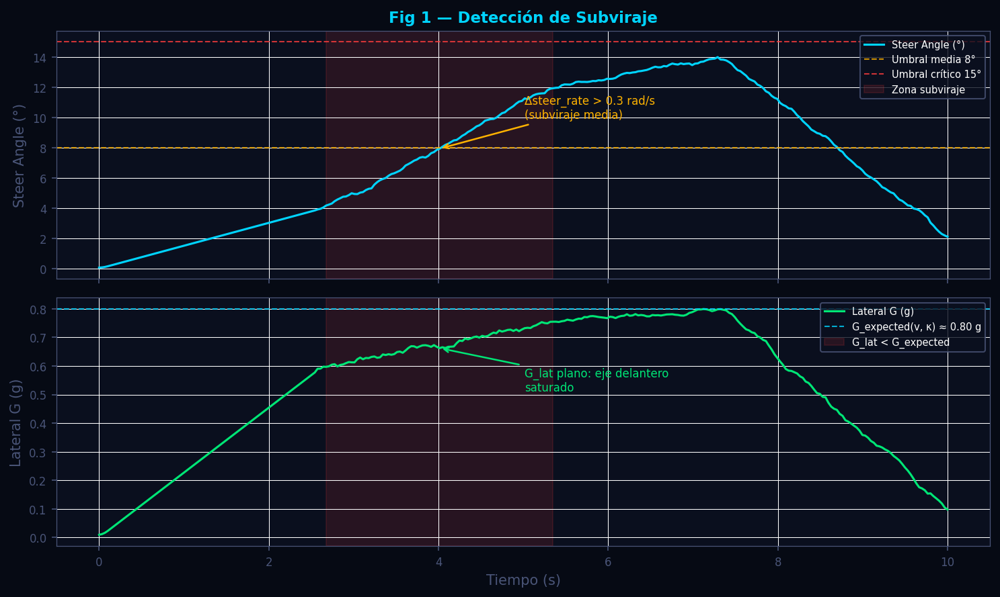
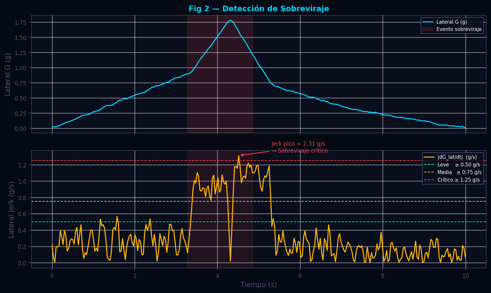
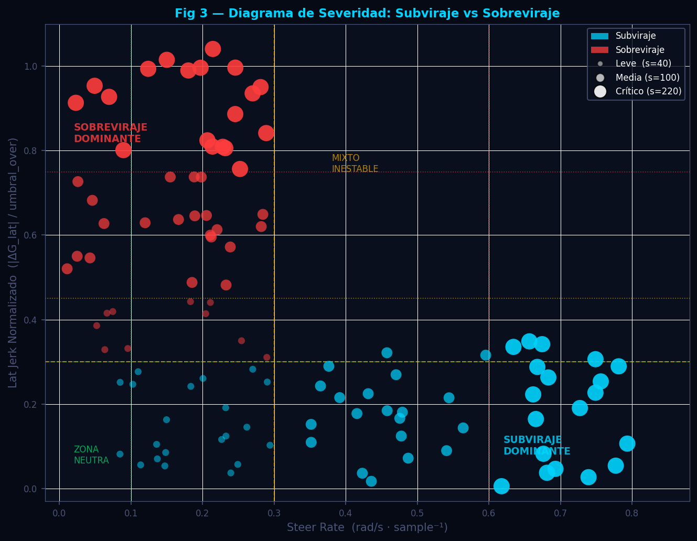

# Detección de Subviraje y Sobreviraje — Análisis Dinámico

**Módulo:** `src/analytics/dynamics.py`  
**Versión de referencia:** pipeline commit `22dd1ae`  
**Fecha de revisión:** 2026-06-11

---

## Tabla de Contenidos

1. [Descripción General](#descripción-general)
2. [Fundamentos Científicos](#fundamentos-científicos)
   - 2.1 [Estimación de G desde cinemática](#21-estimación-de-g-desde-cinemática)
   - 2.2 [Física del Subviraje](#22-física-del-subviraje)
   - 2.3 [Física del Sobreviraje](#23-física-del-sobreviraje)
   - 2.4 [Sistema de Severidad en Tres Niveles](#24-sistema-de-severidad-en-tres-niveles)
3. [Algoritmo e Implementación](#algoritmo-e-implementación)
   - 3.1 [G cinemático: `calcular_g_desde_cinematica`](#31-g-cinemático-calcular_g_desde_cinematica)
   - 3.2 [Límites de adherencia: `calcular_limites_dinamicos`](#32-límites-de-adherencia-calcular_limites_dinamicos)
   - 3.3 [Detección por apex: `detectar_subviraje_sobreviraje`](#33-detección-por-apex-detectar_subviraje_sobreviraje)
4. [Parámetros Clave](#parámetros-clave)
5. [Interpretación de Resultados](#interpretación-de-resultados)
6. [Recomendaciones para el Piloto](#recomendaciones-para-el-piloto)
7. [Visualizaciones](#visualizaciones)
8. [Referencias](#referencias)

---

## Descripción General

El módulo de dinámica lateral analiza el comportamiento del vehículo en cada curva para determinar si el tren delantero (subviraje) o el tren trasero (sobreviraje) están operando fuera del límite de adherencia. A diferencia de un enfoque puramente estadístico, el módulo trabaja evento a evento: para cada apex detectado en la pista, se extrae una ventana temporal alrededor del punto de máxima curvatura y se aplican dos detectores independientes basados en la física del neumático.

Cuando el coche de telemetría no dispone de sensores de fuerza G, el módulo los estima desde la cinemática del vehículo utilizando la curvatura del trazado y la velocidad instantánea. Esto permite operar con datos de bajo coste (GPS + encoder de velocidad) manteniendo la exactitud necesaria para el diagnóstico de setup. La salida del módulo es una lista de eventos con tipo, severidad, coordenada de distancia y texto de diagnóstico listo para presentar al ingeniero de carrera.

---

## Fundamentos Científicos

### 2.1 Estimación de G desde cinemática

Cuando el CSV de telemetría no contiene canales de aceleración directa, el módulo reconstruye las aceleraciones mediante la relación entre velocidad, distancia y curvatura de pista.

**Aceleración longitudinal** — se aplica la regla de la cadena sobre la derivada de velocidad respecto a la distancia recorrida:

$$
a_{lon} = \frac{dv}{dt} = \frac{dv}{ds} \cdot \frac{ds}{dt} = \frac{dv}{ds} \cdot v
$$

En unidades de g:

$$
G_{lon} = \frac{v \cdot \dfrac{dv}{ds}}{9.81}
$$

donde $v$ es la velocidad instantánea en m/s y $s$ es la distancia acumulada en metros. La derivada $dv/ds$ se estima con diferencias centradas usando `numpy.gradient`.

**Aceleración lateral** — un vehículo que sigue una trayectoria de curvatura $\kappa$ a velocidad $v$ experimenta aceleración centrípeta:

$$
a_{lat} = v^2 \cdot \kappa
$$

En unidades de g:

$$
G_{lat} = \frac{v^2 \cdot \kappa}{9.81}
$$

donde $\kappa$ (m⁻¹) es la curvatura de la línea de referencia de la pista, interpolada sobre el eje de distancia del lap alineado. El valor de $\kappa$ se obtiene del módulo de geometría de pista y se interpola linealmente sobre los puntos del lap con `scipy.interpolate.interp1d`.

> **Nota de precisión:** Esta estimación supone que el piloto sigue fielmente la línea de referencia. En condiciones de subviraje o sobreviraje activo, el coche se desvía de la línea y el $G_{lat}$ real puede diferir del estimado. Esta discrepancia es precisamente la señal que el detector de subviraje aprovecha.

---

### 2.2 Física del Subviraje

El subviraje ocurre cuando el eje delantero alcanza la saturación de adherencia antes que el trasero. El piloto percibe que, al añadir ángulo de volante, el coche no gira más sino que tiende a seguir recto (el vector de fuerza lateral delantera no aumenta con el ángulo de deslizamiento).

**Criterio cinemático de detección:**

$$
\text{Subviraje} \iff \underbrace{\frac{d\delta}{dt} > \theta_{sub}}_{\text{volante en aumento}} \quad \wedge \quad \underbrace{\left|\frac{dG_{lat}}{dt}\right| < \epsilon_{sub} \cdot |\delta|}_{\text{respuesta lateral plana}}
$$

donde:
- $\delta$ es el ángulo de volante en grados (canal `SteerAngle_Fast`)
- $\theta_{sub} = 0.10\ \text{rad/muestra}$ es la tasa mínima de aplicación de volante
- $\epsilon_{sub} = 0.15$ es el umbral de proporcionalidad (`umbral_sub` en código)
- La condición se evalúa únicamente en la fase de entrada a curva: $d_{apex} - d_i > 0$

**Aceleración lateral esperada** (referencia teórica para el diagrama de fases):

$$
G_{lat,\text{expected}}(v, \kappa) = \frac{v^2 \kappa}{9.81}
$$

Un $G_{lat}$ medido significativamente inferior a $G_{lat,\text{expected}}$ con $\delta$ elevado es la firma del subviraje.

**Umbrales de tasa de volante y ángulo:**

$$
\text{Severidad} =
\begin{cases}
\text{crítico} & \text{si } \dot\delta \geq 0.6 \text{ rad/s} \;\text{ó}\; \delta > 15° \\
\text{media}   & \text{si } \dot\delta \geq 0.3 \text{ rad/s} \;\text{ó}\; \delta > 8° \\
\text{leve}    & \text{en otro caso}
\end{cases}
$$

---

### 2.3 Física del Sobreviraje

El sobreviraje se produce cuando el eje trasero pierde adherencia antes que el delantero. El vehículo rota más allá de la demanda de yaw comandada por el ángulo de volante; el piloto debe corregir en sentido contrario a la curva. La firma en telemetría es un **pico brusco de G lateral** seguido de una corrección rápida de volante.

**Indicador de jerk lateral:**

$$
J_{lat}[i] = \left| G_{lat}[i+1] - G_{lat}[i-1] \right|
$$

Esta diferencia centrada de dos muestras actúa como una aproximación de la derivada temporal discreta de la aceleración lateral (jerk). El jerk es la magnitud física que distingue un cambio gradual de carga lateral (curva larga, sin problema) de un salto repentino (pérdida de adherencia trasera).

**Criterio de detección de sobreviraje:**

$$
\text{Sobreviraje} \iff J_{lat}[i] > \theta_{over} \;\wedge\; \text{corrección de volante}
$$

donde $\theta_{over} = 0.5\ \text{g}$ (`umbral_over` en código) y la corrección de volante se detecta como:

$$
\text{corrección} \iff \frac{|\delta_{i+1}|}{|\delta_{i-1}|} < 0.7 \;\;\text{ó}\;\; \frac{|\delta_{i+1}|}{|\delta_{i-1}|} > 1.3
$$

Es decir, el volante cambia de magnitud en más de un 30 % en dos muestras, indicando una acción correctiva del piloto.

**Umbrales de severidad basados en múltiplo del umbral base:**

$$
\text{Severidad} =
\begin{cases}
\text{crítico} & \text{si } J_{lat} \geq 2.5 \cdot \theta_{over} = 1.25 \text{ g} \\
\text{media}   & \text{si } J_{lat} \geq 1.5 \cdot \theta_{over} = 0.75 \text{ g} \\
\text{leve}    & \text{si } J_{lat} \geq 1.0 \cdot \theta_{over} = 0.50 \text{ g}
\end{cases}
$$

---

### 2.4 Sistema de Severidad en Tres Niveles

El sistema de severidad es independiente para subviraje y sobreviraje. La escala es la siguiente:

| Nivel | Código | Implicación física | Urgencia de acción |
|---|---|---|---|
| Leve | `leve` | El neumático opera cerca del límite pero el piloto mantiene control | Monitorear, revisar en siguiente sesión |
| Media | `media` | Saturación parcial repetida; tiempo de vuelta penalizado | Ajuste de setup recomendado antes de la siguiente salida |
| Crítico | `critico` | Saturación completa o pérdida de control potencial | Acción inmediata: balance de setup, trazada, o reducción de velocidad |

---

## Algoritmo e Implementación

### 3.1 G cinemático: `calcular_g_desde_cinematica`

```
Entradas:
  df_aligned  — DataFrame indexado por distancia (pasos de 1 m)
  df_geo      — DataFrame con columnas Distance y Curvature
  canal_speed — nombre del canal de velocidad (default: "Speed")

Proceso:
  1. Interpolar κ(s) desde df_geo sobre el eje de distancia de df_aligned
     usando interp1d(kind='linear', fill_value=0.0)
  2. Para cada lap (Fast, Slow):
     a. Convertir velocidad de km/h → m/s; aplicar clip(0.5) para evitar ÷0
     b. LongitudinalG = gradient(v, 1.0) * v / 9.81   [chain rule]
     c. LateralG      = v² * κ / 9.81
  3. Escribir columnas LateralG_Fast, LateralG_Slow, LongitudinalG_Fast, LongitudinalG_Slow
```

El `clip(0.5)` inferior en velocidad es una guardia numérica que evita errores de magnitud al calcular $v^2 \kappa$ cuando el coche está casi parado (pit lane, safety car).

---

### 3.2 Límites de adherencia: `calcular_limites_dinamicos`

Esta función calcula el vector resultante de G en cada punto del lap y la eficiencia respecto al límite de adherencia del vehículo:

$$
G_{sum} = \sqrt{G_{lat}^2 + G_{lon}^2}
$$

$$
\eta_G = \frac{G_{sum}}{G_{max,p95}} \times 100\%
$$

donde $G_{max,p95}$ es el percentil 95 de `G_Sum_Fast` sobre el lap completo. El uso del percentil 95 (en lugar del máximo absoluto) hace la métrica robusta frente a picos espúreos de ruido en la telemetría.

La eficiencia $\eta_G$ es la base del diagrama GG: puntos con $\eta_G < 60\%$ indican tramos donde el piloto tiene margen de carga sin explotar.

---

### 3.3 Detección por apex: `detectar_subviraje_sobreviraje`

**Firma de la función:**

```python
detectar_subviraje_sobreviraje(
    df_aligned: pd.DataFrame,
    apexes: pd.DataFrame,
    canal_lat:   str   = "LateralG",
    canal_steer: str   = "SteerAngle",
    ventana_m:   float = 60.0,
    umbral_sub:  float = 0.15,
    umbral_over: float = 0.5,
) -> list[dict]
```

**Flujo por cada apex:**

```
Para cada apex en apexes:
  1. Extraer ventana de distancia:
       [d_apex - ventana_m,  d_apex + ventana_m * 0.5]
       = [d_apex - 60 m,     d_apex + 30 m]
     (pre-apex más largo: el subviraje se manifiesta en la entrada)

  2. Suavizado: rolling mean (ventana 3, centrado) sobre SteerAngle y LateralG
     → steer_smooth, lat_smooth

  3. Derivadas:  d_steer = gradient(steer_smooth)
                 d_lat   = gradient(lat_smooth)

  4. Detección de subviraje (loop por muestra i):
       Si steer_smooth[i] < 3°  → skip (no hay entrada real a curva)
       steer_rising = d_steer[i] > 0.1
       lat_flat     = |d_lat[i]| < umbral_sub * |steer_smooth[i]|
       Si steer_rising AND lat_flat AND muestra antes del apex:
         → calcular severidad con _sev_subviraje(d_steer[i], steer_smooth[i])
         → registrar evento y break (un evento por curva)

  5. Detección de sobreviraje (loop por muestra i):
       Si |lat_smooth[i]| < 0.3 g → skip (G muy bajo, no hay carga lateral)
       lat_jerk = |lat_smooth[i+1] - lat_smooth[i-1]|
       steer_correction = ratio antes/después > 1.3 ó < 0.7
       Si lat_jerk > umbral_over AND steer_correction:
         → calcular severidad con _sev_sobreviraje(lat_jerk, umbral_over)
         → registrar evento y break

  6. Retornar lista de dicts con campos:
       tipo, curva, distancia, steer_angle/lat_g/jerkyness, severidad, diagnostico
```

**Ventana asimétrica:** la ventana pre-apex es de 60 m y la post-apex de 30 m (`ventana_m * 0.5`). Esta asimetría refleja la física: el subviraje ocurre en la fase de entrada (frenada y rotación), mientras que el sobreviraje puede aparecer tanto en la cima como en la salida (potencia + grip). Para pistas con apexes tardíos puede ser necesario ampliar la ventana post-apex ajustando `ventana_m`.

---

## Parámetros Clave

| Parámetro | Valor por defecto | Descripción | Efecto al aumentar |
|---|---|---|---|
| `ventana_m` | 60.0 m | Distancia pre-apex de análisis | Mayor cobertura de curvas lentas; puede incluir tramos de frenada alejados |
| `umbral_sub` | 0.15 | Coeficiente de proporcionalidad steer→G para subviraje | Más alto: menos eventos detectados (solo subviraje severo) |
| `umbral_over` | 0.5 g | Jerk lateral mínimo para declarar sobreviraje | Más alto: solo eventos de sobreviraje muy bruscos |
| `d_steer` leve | 0.10 rad/muestra | Tasa de volante mínima para iniciar detección | — |
| `d_steer` media | 0.30 rad/muestra | Umbral de clasificación media | — |
| `d_steer` crítico | 0.60 rad/muestra | Umbral de clasificación crítico | — |
| Multiplicador jerk media | 1.5 × `umbral_over` | = 0.75 g | — |
| Multiplicador jerk crítico | 2.5 × `umbral_over` | = 1.25 g | — |
| `steer_angle` media | 8° | Umbral de ángulo absoluto para severidad media (subviraje) | — |
| `steer_angle` crítico | 15° | Umbral de ángulo absoluto para severidad crítico | — |
| Smoothing window | 3 muestras | Rolling mean sobre steer y G antes de derivar | Mayor ventana: detecta solo eventos sostenidos |
| `max_points` GG | 500 | Máximo de puntos en diagrama GG para el frontend | Reducir si hay lentitud en renderizado web |
| `g_max` percentil | 95 | Percentil de G_Sum_Fast para calcular límite de adherencia | Más bajo: estima límite más conservador |

---

## Interpretación de Resultados

### Evento de subviraje

Un evento tiene los campos:
- `steer_angle`: ángulo de volante en el momento del evento (grados). Valores > 10° con G_lat < 0.5 g son señal de saturación pronunciada.
- `lat_g`: G lateral en el instante detectado. Si es < 0.4 g en una curva donde el coche podría mantener > 0.9 g, hay un problema de entrada.
- `severidad`: ver tabla anterior. Un evento `critico` en la misma curva en más del 50 % de las vueltas indica un problema estructural de setup o trazada.

**Banderas rojas:**
- Tres o más curvas consecutivas con subviraje `media` o `critico` sugieren un balance general del vehículo inclinado hacia el morro pesado.
- Subviraje `critico` en curvas rápidas (alta velocidad) implica riesgo de seguridad por posible falta de respuesta del eje delantero.
- Si `steer_angle` crece hacia la cima (apex) sin aumento de `lat_g`, el piloto está realizando correcciones ineficaces que generan resistencia aerodinámica.

### Evento de sobreviraje

- `jerkyness`: magnitud del jerk lateral en g. Valores > 1.0 g en curvas lentas son indicativos de sobreviraje repentino, posiblemente por aceleración anticipada o diferencial muy cerrado.
- `lat_g` en el momento del evento: valores muy altos (> 1.5 g) con jerk elevado indican que el piloto ha excedido el límite de adherencia trasero bajo alta carga lateral.

**Banderas rojas:**
- Sobreviraje `critico` recurrente en la salida de curvas de baja velocidad: diferencial demasiado cerrado o neumáticos traseros sobretemperados.
- Sobreviraje `media` en curvas de alta velocidad: potencialmente peligroso; revisar balance aerodinámico (downforce trasero insuficiente).
- Múltiples eventos `leve` en la misma curva en diferentes vueltas: barra estabilizadora trasera demasiado rígida o presión trasera elevada.

### G Efficiency y diagrama GG

- $\eta_G < 60\%$ en un tramo largo: el piloto está infrautilizando la capacidad del coche. Puede indicar exceso de precaución o trazada subóptima.
- La forma del diagrama GG (nube de puntos `G_lat` vs `G_lon`) debe aproximar una elipse simétrica para un setup equilibrado. Una nube asimétrica hacia los cuadrantes de frenada o aceleración indica desequilibrio.

---

## Recomendaciones para el Piloto

Las siguientes recomendaciones se derivan directamente del diagnóstico generado por `_diag_subviraje` y `_diag_sobreviraje`:

**Subviraje leve** (`leve`)
- La velocidad de entrada es marginalmente elevada. Retrasar el punto de frenado 5–10 m y verificar si desaparece el evento antes de tocar el setup.
- Si el evento persiste con la misma trazada, evaluar suavizar la barra estabilizadora delantera un clic.

**Subviraje moderado** (`media`)
- El piloto está añadiendo volante sin obtener rotación. Revisar el punto de apuntado: entrar más tarde y más lento permite al coche rotar antes del apex.
- Setup: incrementar el balance de frenada hacia atrás (más freno trasero) para ayudar a la rotación de entrada.
- Verificar presión delantera: presión elevada reduce el área de contacto y puede causar subviraje en frío.

**Subviraje crítico** (`critico`)
- El tren delantero está completamente saturado. No intentar compensar con más volante; esto aumenta el ángulo de deslizamiento y reduce aún más la fuerza lateral.
- Reducir la velocidad de entrada de forma significativa (> 10 km/h) y trabajar con el ingeniero en el balance de setup (muelle delantero, barra estabilizadora, geometría de suspensión).

**Sobreviraje leve** (`leve`)
- Movimiento de cola controlado. Monitorear temperatura de neumáticos traseros: si están en el límite superior de la ventana operativa, reducir presión 0.1 bar.
- No requiere acción inmediata; documentar condiciones de pista (temperatura, degradación).

**Sobreviraje moderado** (`media`)
- Evaluar la apertura del diferencial en la fase de aceleración de salida de curva.
- Reducir la rigidez de la barra estabilizadora trasera o incrementar el rebote trasero puede reducir la brusquedad de la transferencia de carga.

**Sobreviraje crítico** (`critico`)
- El tren trasero se desplaza violentamente. Verificar presión de neumáticos traseros, desgaste asimétrico y temperatura de diferencial.
- Revisar la configuración de diferencial (rampa de aceleración). Un diferencial demasiado cerrado en aceleración bloquea el eje trasero y provoca sobreviraje de potencia.
- Considerar reducir el ángulo de salida (más trazada exterior antes de aplicar gas) hasta resolver el problema de setup.

---

## Visualizaciones

Las siguientes figuras son generadas por `scripts/docs/gen_dynamics.py` con datos sintéticos que replican los patrones reales detectados por el módulo.

---

### Figura 1 — Detección de Subviraje



**Panel superior (Steer Angle):** Serie temporal del ángulo de volante. La zona sombreada en rojo corresponde al intervalo donde el detector identifica subviraje: el ángulo de volante sube de forma continua (tasa > 0.1 rad/muestra) mientras que la respuesta lateral no aumenta proporcionalmente. Las líneas horizontales discontinuas marcan los umbrales de severidad media (8°, naranja) y crítico (15°, rojo). La anotación señala el instante de mayor tasa de aplicación de volante.

**Panel inferior (Lateral G):** G lateral registrado en el mismo intervalo de tiempo. La línea discontinua cian marca el $G_{lat,\text{expected}}$ calculado a partir de velocidad y curvatura de pista. La divergencia creciente entre la línea esperada y la medida es la firma característica del subviraje: el coche debería generar 0.80 g pero el eje delantero saturado solo entrega ~0.70 g.

---

### Figura 2 — Detección de Sobreviraje



**Panel superior (Lateral G):** El pico abrupto de G lateral alrededor de t = 4–5 s indica el instante en que el tren trasero pierde adherencia. La velocidad de cambio (pendiente) es mucho mayor que en una curva normal. La zona sombreada en rojo delimita el evento de sobreviraje completo (inicio del pico hasta la corrección).

**Panel inferior (Lateral Jerk):** Magnitud del jerk lateral $J_{lat} = |G_{lat}[i+1] - G_{lat}[i-1]|$. Las tres líneas discontinuas horizontales marcan los umbrales de severidad: verde (leve, 0.50 g/s), naranja (media, 0.75 g/s) y rojo (crítico, 1.25 g/s). El pico del jerk en la figura supera el umbral crítico, lo que clasifica el evento como `critico`. Nótese que el jerk decae rápidamente después del pico, reflejando la corrección del piloto.

---

### Figura 3 — Diagrama de Severidad: Subviraje vs Sobreviraje



Diagrama de dispersión bidimensional de todos los eventos detectados en el análisis de un lap completo. El eje X representa la tasa de aplicación de volante (`steer_rate`, rad/muestra) y el eje Y el jerk lateral normalizado (`lat_jerk / umbral_over`).

**Cuadrantes:**
- **Superior izquierdo (Sobreviraje dominante):** eventos con jerk elevado y steer_rate bajo. Son los eventos de pérdida trasera, típicamente en la salida de curva.
- **Inferior derecho (Subviraje dominante):** steer_rate alto pero jerk bajo. El piloto añade volante sin que el coche responda.
- **Superior derecho (Mixto inestable):** alta actividad en ambos canales. Puede indicar un coche nervioso con balance incorrecto o condiciones de pista variables.
- **Inferior izquierdo (Zona neutra):** eventos de baja intensidad. No requieren acción inmediata.

El **tamaño de cada punto** representa la severidad (leve = 40, media = 100, crítico = 220). El **color** distingue el tipo de evento: cian para subviraje, rojo para sobreviraje. Los ingenieros de carrera deben prestar especial atención a los puntos grandes en los cuadrantes extremos.

---

## Referencias

1. Milliken, W. F., & Milliken, D. L. (1995). *Race Car Vehicle Dynamics*. SAE International. — Capítulo 5: Steady-state cornering; Capítulo 18: Transient response and lateral jerk in oversteer detection.

2. Beckman, B. (1991). *The Physics of Racing*. Series self-published. Parts 1–12. — Derivación de G lateral desde curvatura cinemática; análisis de saturación de neumático.

3. Dixon, J. C. (1996). *Tires, Suspension and Handling* (2nd ed.). SAE International. — Modelos de saturación del neumático; relación entre ángulo de deslizamiento y fuerza lateral; comportamiento en límite de adherencia.

4. Segers, J. (2014). *Analysis Techniques for Racecar Data Acquisition* (2nd ed.). SAE International. — Métodos de detección de subviraje/sobreviraje desde canales de steer angle y aceleración lateral; análisis de derivadas temporales de telemetría.

5. Pacejka, H. B. (2012). *Tire and Vehicle Dynamics* (3rd ed.). Butterworth-Heinemann / Elsevier. — Modelo de Magic Formula; explicación matemática de la transición a sobreviraje como pérdida de estabilidad del eje trasero (Capítulo 7).
