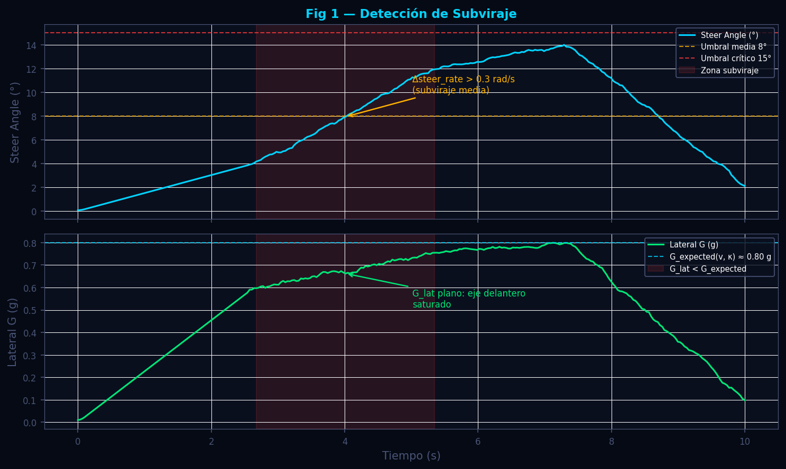
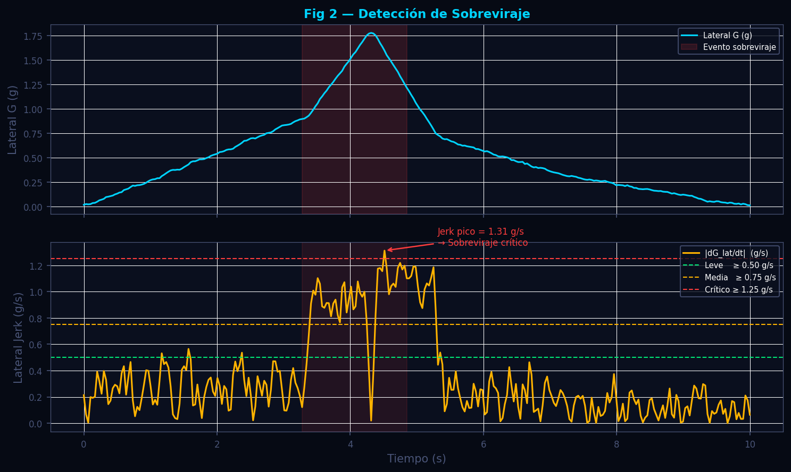
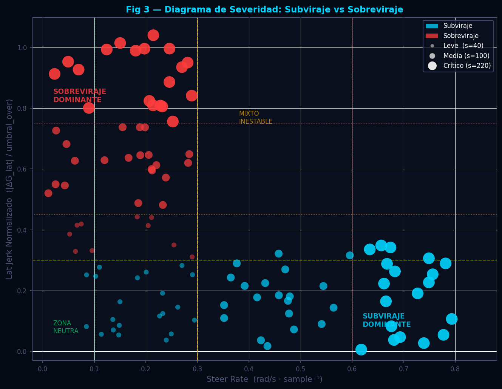

# Understeer and Oversteer Detection — Dynamic Analysis

🌐 [Ver en Español](./04_dynamics.es.md)

**Module:** `src/analytics/dynamics.py`  
**Reference version:** pipeline commit `22dd1ae`  
**Review date:** 2026-06-11

---

## Table of Contents

1. [Overview](#overview)
2. [Scientific Foundations](#scientific-foundations)
   - 2.1 [G Estimation from Kinematics](#21-g-estimation-from-kinematics)
   - 2.2 [Physics of Understeer](#22-physics-of-understeer)
   - 2.3 [Physics of Oversteer](#23-physics-of-oversteer)
   - 2.4 [Three-Level Severity System](#24-three-level-severity-system)
3. [Algorithm and Implementation](#algorithm-and-implementation)
   - 3.1 [Kinematic G: `calcular_g_desde_cinematica`](#31-kinematic-g-calcular_g_desde_cinematica)
   - 3.2 [Grip limits: `calcular_limites_dinamicos`](#32-grip-limits-calcular_limites_dinamicos)
   - 3.3 [Apex-based detection: `detectar_subviraje_sobreviraje`](#33-apex-based-detection-detectar_subviraje_sobreviraje)
4. [Key Parameters](#key-parameters)
5. [Interpreting Results](#interpreting-results)
6. [Recommendations for the Driver](#recommendations-for-the-driver)
7. [Visualizations](#visualizations)
8. [References](#references)

---

## Overview

The lateral dynamics module analyses the vehicle's behaviour at each corner to determine whether the front axle (understeer) or the rear axle (oversteer) is operating beyond the grip limit. Unlike a purely statistical approach, the module works event by event: for each apex detected on the track, a time window is extracted around the point of maximum curvature and two independent physics-based detectors are applied.

When the telemetry car does not have G-force sensors, the module estimates them from vehicle kinematics using track curvature and instantaneous speed. This allows operation with low-cost data (GPS + speed encoder) while maintaining the accuracy required for setup diagnosis. The module's output is a list of events with type, severity, distance coordinate, and diagnostic text ready to present to the race engineer.

---

## Scientific Foundations

### 2.1 G Estimation from Kinematics

When the telemetry CSV does not contain direct acceleration channels, the module reconstructs the accelerations using the relationship between speed, distance, and track curvature.

**Longitudinal acceleration** — the chain rule is applied to the derivative of speed with respect to distance travelled:

$$
a_{lon} = \frac{dv}{dt} = \frac{dv}{ds} \cdot \frac{ds}{dt} = \frac{dv}{ds} \cdot v
$$

In g units:

$$
G_{lon} = \frac{v \cdot \dfrac{dv}{ds}}{9.81}
$$

where $v$ is instantaneous speed in m/s and $s$ is accumulated distance in metres. The derivative $dv/ds$ is estimated with centred differences using `numpy.gradient`.

**Lateral acceleration** — a vehicle following a trajectory of curvature $\kappa$ at speed $v$ experiences centripetal acceleration:

$$
a_{lat} = v^2 \cdot \kappa
$$

In g units:

$$
G_{lat} = \frac{v^2 \cdot \kappa}{9.81}
$$

where $\kappa$ (m⁻¹) is the curvature of the track reference line, interpolated over the aligned lap's distance axis. The value of $\kappa$ is obtained from the track geometry module and linearly interpolated over the lap points using `scipy.interpolate.interp1d`.

> **Accuracy note:** This estimation assumes the driver faithfully follows the reference line. Under active understeer or oversteer conditions, the car deviates from the line and the actual $G_{lat}$ may differ from the estimate. This discrepancy is precisely the signal exploited by the understeer detector.

---

### 2.2 Physics of Understeer

Understeer occurs when the front axle reaches grip saturation before the rear. The driver perceives that, upon adding steering angle, the car does not turn further but instead tends to go straight (the front lateral force vector does not increase with the slip angle).

**Kinematic detection criterion:**

$$
\text{Understeer} \iff \underbrace{\frac{d\delta}{dt} > \theta_{sub}}_{\text{steering increasing}} \quad \wedge \quad \underbrace{\left|\frac{dG_{lat}}{dt}\right| < \epsilon_{sub} \cdot |\delta|}_{\text{flat lateral response}}
$$

where:
- $\delta$ is the steering angle in degrees (channel `SteerAngle_Fast`)
- $\theta_{sub} = 0.10\ \text{rad/sample}$ is the minimum steering application rate
- $\epsilon_{sub} = 0.15$ is the proportionality threshold (`umbral_sub` in code)
- The condition is evaluated only during the corner entry phase: $d_{apex} - d_i > 0$

**Expected lateral acceleration** (theoretical reference for the phase diagram):

$$
G_{lat,\text{expected}}(v, \kappa) = \frac{v^2 \kappa}{9.81}
$$

A measured $G_{lat}$ significantly lower than $G_{lat,\text{expected}}$ with a high $\delta$ is the signature of understeer.

**Steering rate and angle thresholds:**

$$
\text{Severity} =
\begin{cases}
\text{critical} & \text{if } \dot\delta \geq 0.6 \text{ rad/s} \;\text{or}\; \delta > 15° \\
\text{medium}   & \text{if } \dot\delta \geq 0.3 \text{ rad/s} \;\text{or}\; \delta > 8° \\
\text{mild}     & \text{otherwise}
\end{cases}
$$

---

### 2.3 Physics of Oversteer

Oversteer occurs when the rear axle loses grip before the front. The vehicle rotates beyond the yaw demand commanded by the steering angle; the driver must correct in the opposite direction to the corner. The telemetry signature is a **sharp lateral G spike** followed by a rapid steering correction.

**Lateral jerk indicator:**

$$
J_{lat}[i] = \left| G_{lat}[i+1] - G_{lat}[i-1] \right|
$$

This two-sample centred difference acts as an approximation of the discrete time derivative of lateral acceleration (jerk). Jerk is the physical quantity that distinguishes a gradual change in lateral load (long corner, no problem) from a sudden jump (rear grip loss).

**Oversteer detection criterion:**

$$
\text{Oversteer} \iff J_{lat}[i] > \theta_{over} \;\wedge\; \text{steering correction}
$$

where $\theta_{over} = 0.5\ \text{g}$ (`umbral_over` in code) and the steering correction is detected as:

$$
\text{correction} \iff \frac{|\delta_{i+1}|}{|\delta_{i-1}|} < 0.7 \;\;\text{or}\;\; \frac{|\delta_{i+1}|}{|\delta_{i-1}|} > 1.3
$$

That is, the steering changes magnitude by more than 30% in two samples, indicating a corrective action by the driver.

**Severity thresholds based on multiples of the base threshold:**

$$
\text{Severity} =
\begin{cases}
\text{critical} & \text{if } J_{lat} \geq 2.5 \cdot \theta_{over} = 1.25 \text{ g} \\
\text{medium}   & \text{if } J_{lat} \geq 1.5 \cdot \theta_{over} = 0.75 \text{ g} \\
\text{mild}     & \text{if } J_{lat} \geq 1.0 \cdot \theta_{over} = 0.50 \text{ g}
\end{cases}
$$

---

### 2.4 Three-Level Severity System

The severity system is independent for understeer and oversteer. The scale is as follows:

| Level | Code | Physical implication | Action urgency |
|---|---|---|---|
| Mild | `leve` | The tyre is operating near the limit but the driver maintains control | Monitor, review at next session |
| Medium | `media` | Repeated partial saturation; lap time penalised | Setup adjustment recommended before next run |
| Critical | `critico` | Full saturation or potential loss of control | Immediate action: setup balance, driving line, or speed reduction |

---

## Algorithm and Implementation

### 3.1 Kinematic G: `calcular_g_desde_cinematica`

```
Inputs:
  df_aligned  — DataFrame indexed by distance (1 m steps)
  df_geo      — DataFrame with Distance and Curvature columns
  canal_speed — name of the speed channel (default: "Speed")

Process:
  1. Interpolate κ(s) from df_geo over the distance axis of df_aligned
     using interp1d(kind='linear', fill_value=0.0)
  2. For each lap (Fast, Slow):
     a. Convert speed from km/h → m/s; apply clip(0.5) to avoid ÷0
     b. LongitudinalG = gradient(v, 1.0) * v / 9.81   [chain rule]
     c. LateralG      = v² * κ / 9.81
  3. Write columns LateralG_Fast, LateralG_Slow, LongitudinalG_Fast, LongitudinalG_Slow
```

The lower `clip(0.5)` on speed is a numerical guard that avoids magnitude errors when computing $v^2 \kappa$ while the car is nearly stationary (pit lane, safety car).

---

### 3.2 Grip limits: `calcular_limites_dinamicos`

This function computes the resultant G vector at each point of the lap and the efficiency relative to the vehicle's grip limit:

$$
G_{sum} = \sqrt{G_{lat}^2 + G_{lon}^2}
$$

$$
\eta_G = \frac{G_{sum}}{G_{max,p95}} \times 100\%
$$

where $G_{max,p95}$ is the 95th percentile of `G_Sum_Fast` over the complete lap. Using the 95th percentile (rather than the absolute maximum) makes the metric robust against spurious noise spikes in the telemetry.

Efficiency $\eta_G$ is the basis of the GG diagram: points with $\eta_G < 60\%$ indicate sections where the driver has unexploited load capacity.

---

### 3.3 Apex-based detection: `detectar_subviraje_sobreviraje`

**Function signature:**

```python
detectar_subviraje_sobreviraje(
    df_aligned: pd.DataFrame,
    apexes: pd.DataFrame,
    canal_lat:   str   = "LateralG",
    canal_steer: str   = "SteerAngle",
    ventana_m:   float = 60.0,
    umbral_sub:  float = 0.15,
    umbral_over: float = 0.5,
) -> list[dict]
```

**Flow for each apex:**

```
For each apex in apexes:
  1. Extract distance window:
       [d_apex - ventana_m,  d_apex + ventana_m * 0.5]
       = [d_apex - 60 m,     d_apex + 30 m]
     (longer pre-apex: understeer manifests during entry)

  2. Smoothing: rolling mean (window 3, centred) over SteerAngle and LateralG
     → steer_smooth, lat_smooth

  3. Derivatives:  d_steer = gradient(steer_smooth)
                   d_lat   = gradient(lat_smooth)

  4. Understeer detection (loop per sample i):
       If steer_smooth[i] < 3°  → skip (no real corner entry)
       steer_rising = d_steer[i] > 0.1
       lat_flat     = |d_lat[i]| < umbral_sub * |steer_smooth[i]|
       If steer_rising AND lat_flat AND sample before apex:
         → compute severity with _sev_subviraje(d_steer[i], steer_smooth[i])
         → record event and break (one event per corner)

  5. Oversteer detection (loop per sample i):
       If |lat_smooth[i]| < 0.3 g → skip (G too low, no lateral load)
       lat_jerk = |lat_smooth[i+1] - lat_smooth[i-1]|
       steer_correction = before/after ratio > 1.3 or < 0.7
       If lat_jerk > umbral_over AND steer_correction:
         → compute severity with _sev_sobreviraje(lat_jerk, umbral_over)
         → record event and break

  6. Return list of dicts with fields:
       tipo, curva, distancia, steer_angle/lat_g/jerkyness, severidad, diagnostico
```

**Asymmetric window:** the pre-apex window is 60 m and the post-apex window is 30 m (`ventana_m * 0.5`). This asymmetry reflects the physics: understeer occurs during the entry phase (braking and rotation), while oversteer can appear at both the apex and the exit (power + grip). For tracks with late apexes it may be necessary to widen the post-apex window by adjusting `ventana_m`.

---

## Key Parameters

| Parameter | Default value | Description | Effect when increased |
|---|---|---|---|
| `ventana_m` | 60.0 m | Pre-apex analysis distance | Wider coverage of slow corners; may include distant braking zones |
| `umbral_sub` | 0.15 | Proportionality coefficient steer→G for understeer | Higher: fewer events detected (only severe understeer) |
| `umbral_over` | 0.5 g | Minimum lateral jerk to declare oversteer | Higher: only very abrupt oversteer events |
| `d_steer` mild | 0.10 rad/sample | Minimum steering rate to start detection | — |
| `d_steer` medium | 0.30 rad/sample | Medium classification threshold | — |
| `d_steer` critical | 0.60 rad/sample | Critical classification threshold | — |
| Jerk multiplier medium | 1.5 × `umbral_over` | = 0.75 g | — |
| Jerk multiplier critical | 2.5 × `umbral_over` | = 1.25 g | — |
| `steer_angle` medium | 8° | Absolute angle threshold for medium severity (understeer) | — |
| `steer_angle` critical | 15° | Absolute angle threshold for critical severity | — |
| Smoothing window | 3 samples | Rolling mean over steer and G before differentiating | Larger window: detects only sustained events |
| `max_points` GG | 500 | Maximum points in the GG diagram for the frontend | Reduce if web rendering is slow |
| `g_max` percentile | 95 | Percentile of G_Sum_Fast to compute grip limit | Lower: produces a more conservative limit estimate |

---

## Interpreting Results

### Understeer event

An event has the following fields:
- `steer_angle`: steering angle at the moment of the event (degrees). Values > 10° with G_lat < 0.5 g are a sign of pronounced saturation.
- `lat_g`: lateral G at the detected instant. If < 0.4 g in a corner where the car could sustain > 0.9 g, there is an entry problem.
- `severidad`: see the table above. A `critico` event in the same corner on more than 50% of laps indicates a structural setup or driving-line problem.

**Red flags:**
- Three or more consecutive corners with `media` or `critico` understeer suggest a general vehicle balance biased towards a heavy front end.
- `critico` understeer in fast corners (high speed) implies a safety risk due to potential lack of front-axle response.
- If `steer_angle` increases towards the apex without an increase in `lat_g`, the driver is making ineffective corrections that generate aerodynamic drag.

### Oversteer event

- `jerkyness`: magnitude of lateral jerk in g. Values > 1.0 g in slow corners are indicative of sudden oversteer, possibly due to early throttle application or a very locked differential.
- `lat_g` at the moment of the event: very high values (> 1.5 g) combined with high jerk indicate the driver has exceeded the rear grip limit under high lateral load.

**Red flags:**
- Recurring `critico` oversteer at the exit of low-speed corners: differential too locked or rear tyres over-temperature.
- `media` oversteer in high-speed corners: potentially dangerous; review aerodynamic balance (insufficient rear downforce).
- Multiple `leve` events in the same corner on different laps: rear anti-roll bar too stiff or elevated rear tyre pressure.

### G Efficiency and GG diagram

- $\eta_G < 60\%$ over a long section: the driver is underutilising the car's capacity. This may indicate excessive caution or a suboptimal driving line.
- The shape of the GG diagram (scatter plot of `G_lat` vs `G_lon`) should approximate a symmetric ellipse for a balanced setup. A cloud skewed towards the braking or acceleration quadrants indicates an imbalance.

---

## Recommendations for the Driver

The following recommendations are derived directly from the diagnostic generated by `_diag_subviraje` and `_diag_sobreviraje`:

**Mild understeer** (`leve`)
- Entry speed is marginally too high. Delay the braking point by 5–10 m and verify whether the event disappears before touching the setup.
- If the event persists with the same driving line, consider softening the front anti-roll bar by one click.

**Moderate understeer** (`media`)
- The driver is adding steering lock without obtaining rotation. Review the turn-in point: entering later and slower allows the car to rotate before the apex.
- Setup: shift the brake bias rearward (more rear brake) to aid entry rotation.
- Check front tyre pressure: elevated pressure reduces the contact patch and can cause cold understeer.

**Critical understeer** (`critico`)
- The front axle is fully saturated. Do not attempt to compensate with more steering lock; this increases the slip angle and further reduces lateral force.
- Reduce entry speed significantly (> 10 km/h) and work with the engineer on setup balance (front spring, anti-roll bar, suspension geometry).

**Mild oversteer** (`leve`)
- Controlled tail movement. Monitor rear tyre temperatures: if they are at the upper limit of the operating window, reduce pressure by 0.1 bar.
- No immediate action required; document track conditions (temperature, degradation).

**Moderate oversteer** (`media`)
- Evaluate the differential opening during the corner-exit acceleration phase.
- Reducing rear anti-roll bar stiffness or increasing rear rebound can reduce the abruptness of the load transfer.

**Critical oversteer** (`critico`)
- The rear axle is displacing violently. Check rear tyre pressures, asymmetric wear, and differential temperature.
- Review the differential configuration (acceleration ramp). A differential that is too locked under acceleration locks the rear axle and causes power oversteer.
- Consider running a wider exit line (more track on the outside before applying throttle) until the setup issue is resolved.

---

## Visualizations

The following figures are generated by `scripts/docs/gen_dynamics.py` using synthetic data that replicates the real patterns detected by the module.

---

### Figure 1 — Understeer Detection



**Upper panel (Steer Angle):** Time series of steering angle. The red shaded zone corresponds to the interval where the detector identifies understeer: the steering angle rises continuously (rate > 0.1 rad/sample) while the lateral response does not increase proportionally. The dashed horizontal lines mark the medium severity threshold (8°, orange) and the critical threshold (15°, red). The annotation indicates the instant of maximum steering application rate.

**Lower panel (Lateral G):** Lateral G recorded over the same time interval. The dashed cyan line marks the $G_{lat,\text{expected}}$ computed from speed and track curvature. The growing divergence between the expected line and the measured value is the characteristic signature of understeer: the car should be generating 0.80 g but the saturated front axle delivers only ~0.70 g.

---

### Figure 2 — Oversteer Detection



**Upper panel (Lateral G):** The abrupt lateral G spike around t = 4–5 s indicates the instant at which the rear axle loses grip. The rate of change (slope) is much greater than in a normal corner. The red shaded zone delimits the complete oversteer event (from the start of the spike to the correction).

**Lower panel (Lateral Jerk):** Magnitude of lateral jerk $J_{lat} = |G_{lat}[i+1] - G_{lat}[i-1]|$. The three dashed horizontal lines mark the severity thresholds: green (mild, 0.50 g/s), orange (medium, 0.75 g/s), and red (critical, 1.25 g/s). The jerk peak in the figure exceeds the critical threshold, classifying the event as `critico`. Note that the jerk decays rapidly after the peak, reflecting the driver's correction.

---

### Figure 3 — Severity Diagram: Understeer vs Oversteer



Two-dimensional scatter plot of all events detected in the analysis of a complete lap. The X axis represents the steering application rate (`steer_rate`, rad/sample) and the Y axis represents normalised lateral jerk (`lat_jerk / umbral_over`).

**Quadrants:**
- **Upper left (Oversteer dominant):** events with high jerk and low steer_rate. These are rear-loss events, typically at corner exit.
- **Lower right (Understeer dominant):** high steer_rate but low jerk. The driver is adding steering lock without the car responding.
- **Upper right (Mixed, unstable):** high activity in both channels. May indicate a nervous car with incorrect balance or variable track conditions.
- **Lower left (Neutral zone):** low-intensity events. No immediate action required.

The **size of each point** represents severity (mild = 40, medium = 100, critical = 220). The **colour** distinguishes event type: cyan for understeer, red for oversteer. Race engineers should pay particular attention to large points in the extreme quadrants.

---

## References

1. Milliken, W. F., & Milliken, D. L. (1995). *Race Car Vehicle Dynamics*. SAE International. — Chapter 5: Steady-state cornering; Chapter 18: Transient response and lateral jerk in oversteer detection.

2. Beckman, B. (1991). *The Physics of Racing*. Series self-published. Parts 1–12. — Derivation of lateral G from kinematic curvature; analysis of tyre saturation.

3. Dixon, J. C. (1996). *Tires, Suspension and Handling* (2nd ed.). SAE International. — Tyre saturation models; relationship between slip angle and lateral force; behaviour at the grip limit.

4. Segers, J. (2014). *Analysis Techniques for Racecar Data Acquisition* (2nd ed.). SAE International. — Understeer/oversteer detection methods from steer angle and lateral acceleration channels; analysis of temporal derivatives in telemetry.

5. Pacejka, H. B. (2012). *Tire and Vehicle Dynamics* (3rd ed.). Butterworth-Heinemann / Elsevier. — Magic Formula model; mathematical explanation of the transition to oversteer as rear-axle stability loss (Chapter 7).

---

*This document is the English translation of [04_dynamics.es.md](./04_dynamics.es.md). The source language is Spanish. All equations, pseudocode, Python code, and file paths are kept verbatim from the original.*
