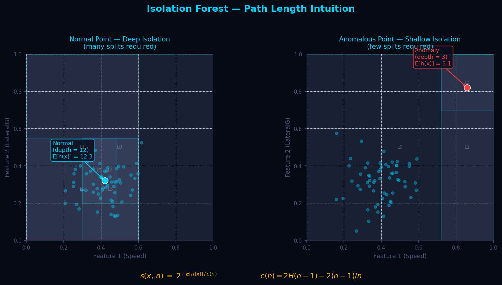
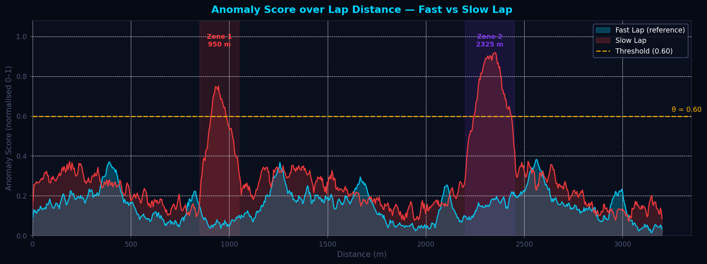
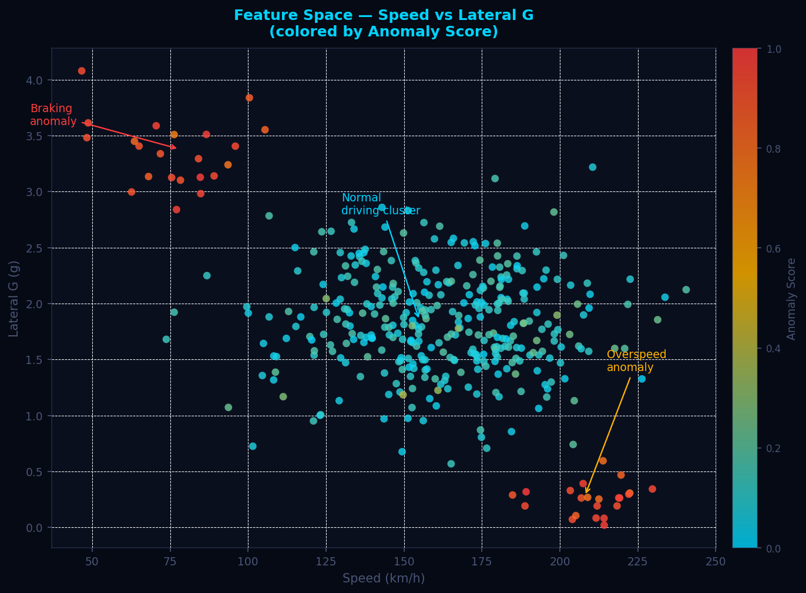
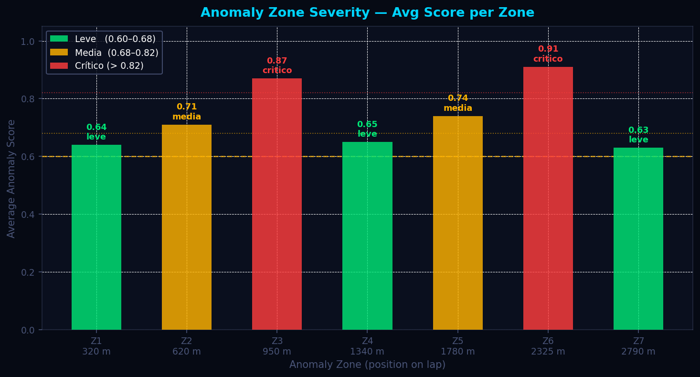

# Detección de Anomalías — Isolation Forest

> **Módulo:** `src/analytics/ml_anomaly.py`
> **Algoritmo principal:** Isolation Forest (Liu et al., 2008)
> **Vector de features:** Speed · Brake · Throttle · SteerAngle · LateralG · LongitudinalG

---

## Tabla de Contenidos

1. [Descripción General](#descripción-general)
2. [Fundamentos Científicos](#fundamentos-científicos)
3. [Algoritmo e Implementación](#algoritmo-e-implementación)
4. [Parámetros Clave](#parámetros-clave)
5. [Interpretación de Resultados](#interpretación-de-resultados)
6. [Recomendaciones para el Piloto](#recomendaciones-para-el-piloto)
7. [Visualizaciones](#visualizaciones)
8. [Referencias](#referencias)

---

## Descripción General

El módulo de detección de anomalías identifica, metro a metro, los instantes en que el comportamiento del piloto en la vuelta lenta se desvía significativamente del patrón de la vuelta rápida de referencia. A diferencia de los enfoques univariados (p.ej., detectar solo velocidad fuera de rango), este módulo analiza simultáneamente seis canales de telemetría como un **vector de estado**. Una combinación inusual de valores — aunque cada canal individualmente parezca plausible — se detecta como anomalía.

La vuelta rápida actúa como la *distribución de referencia*: define lo que es "conducción óptima" para esa pista y condición específica. El modelo Isolation Forest se entrena exclusivamente sobre esa referencia y se evalúa sobre la vuelta lenta. Las regiones donde el score supera el umbral `ANOMALY_THRESHOLD = 0.60` se agrupan en **zonas de anomalía** con duración mínima de 15 metros, que se clasifican por severidad y se presentan al ingeniero con una descripción accionable.

---

## Fundamentos Científicos

### 2.1 Intuición del Isolation Forest

El Isolation Forest (Liu, Ting & Zhou, 2008) explota el principio de que los puntos anómalos son **escasos y distintos**: se pueden aislar con muy pocas particiones aleatorias del espacio de features, mientras que los puntos normales — inmersos en una región densa — requieren muchas más.

Dado un árbol de aislamiento construido con particiones aleatorias, se define la longitud de camino $h(x)$ como el número de aristas recorridas desde la raíz hasta el nodo terminal que contiene a $x$. Un punto anómalo tiene $h(x)$ pequeño; un punto normal tiene $h(x)$ grande.

### 2.2 Función de Score

Con un bosque de $T$ árboles y $n$ muestras de entrenamiento, el score de anomalía para una observación $x$ es:

$$
s(x,\,n) \;=\; 2^{-\,\dfrac{E[h(x)]}{c(n)}}
$$

donde:

- $E[h(x)]$ es la longitud de camino promedio sobre todos los árboles del bosque.
- $c(n)$ es el factor de normalización equivalente a la longitud de camino esperada en un **árbol de búsqueda binaria** de $n$ nodos:

$$
c(n) \;=\; 2\,H(n-1) \;-\; \frac{2(n-1)}{n}
$$

con $H(k) = \ln(k) + \gamma_E$ (número harmónico, $\gamma_E \approx 0.5772$ constante de Euler-Mascheroni).

**Interpretación del score:**

| Valor de $s(x,n)$ | Interpretación |
|---|---|
| $s \to 1$ | Muy anómalo: $E[h(x)] \ll c(n)$ |
| $s \approx 0.5$ | Indistinguible de la norma |
| $s \to 0$ | Muy normal: $E[h(x)] \gg c(n)$ |

### 2.3 Normalización de Score a [0, 1]

La función interna del scikit-learn `decision_function` devuelve valores donde **alto = normal**. Para convertirlo a una escala donde **1 = más anómalo**, se aplica:

$$
\hat{s}_i \;=\; \text{clip}\!\left(\frac{s_{\max} - s_i}{s_{\max} - s_{\min} + \varepsilon},\; 0,\; 1\right), \quad \varepsilon = 10^{-9}
$$

Esta normalización es relativa a la distribución de la vuelta evaluada, garantizando que el rango completo $[0, 1]$ esté siempre representado.

### 2.4 Espacio Multivariado de 6 Canales

El vector de estado $\mathbf{x}_t \in \mathbb{R}^6$ en el instante $t$ es:

$$
\mathbf{x}_t = \bigl[\,\text{Speed},\;\text{Brake},\;\text{Throttle},\;\text{SteerAngle},\;\text{LateralG},\;\text{LongitudinalG}\,\bigr]_t
$$

La motivación para el análisis **multivariado sobre univariado** es fundamental: una frenada a 150 km/h puede ser normal; un ángulo de volante de 8° puede ser normal; pero la combinación simultánea de ambos con throttle parcialmente abierto es altamente anómala y solo detectable en el espacio conjunto.

### 2.5 Estandarización (StandardScaler)

Antes del entrenamiento, cada canal se centra y escala usando los estadísticos de la **vuelta rápida**:

$$
z_{i,j} \;=\; \frac{x_{i,j} - \mu_j^{\text{fast}}}{\sigma_j^{\text{fast}}}
$$

donde $j$ índica el canal (feature) e $i$ el instante de tiempo. La vuelta lenta se transforma con los **mismos** $\mu_j^{\text{fast}}$ y $\sigma_j^{\text{fast}}$, sin re-calcular. Esto es esencial: desviaciones de la vuelta lenta respecto a la escala de la rápida son precisamente la señal que se quiere detectar.

### 2.6 Suavizado y Detección de Zonas

El score punto a punto presenta ruido de alta frecuencia. Se aplica una media móvil centrada de ventana 5:

$$
\tilde{s}_i \;=\; \frac{1}{5} \sum_{k=i-2}^{i+2} \hat{s}_k
$$

Las zonas de anomalía continuas se extraen con un algoritmo de umbralización secuencial: se acumula una zona mientras $\tilde{s}_i > \theta = 0.60$, y la zona se reporta solo si su longitud supera $\Delta_{\min} = 15\,\text{m}$. La severidad se clasifica por el score promedio de la zona:

$$
\text{Severidad}(\bar{s}) = \begin{cases}
\text{leve}    & 0.60 < \bar{s} \leq 0.68 \\
\text{media}   & 0.68 < \bar{s} \leq 0.82 \\
\text{crítico} & \bar{s} > 0.82
\end{cases}
$$

---

## Algoritmo e Implementación

### 3.1 Flujo de Ejecución

```
detectar_anomalias(df_aligned, contamination=0.10)
  │
  ├── 1. Selección de columnas *_Fast y *_Slow de ML_FEATURES
  ├── 2. fillna(ffill) → sin NaN propagados
  ├── 3. StandardScaler.fit_transform(X_fast)  ← fit SOLO en fast
  │        StandardScaler.transform(X_slow)    ← apply same scaler
  ├── 4. IsolationForest(n_estimators=120, contamination=0.10).fit(X_fast_sc)
  ├── 5. decision_function(X_fast_sc) → raw_fast
  │        decision_function(X_slow_sc) → raw_slow
  ├── 6. _normalize(raw_fast) → score_fast  [0,1]
  │        _normalize(raw_slow) → score_slow [0,1]
  ├── 7. rolling(5).mean() sobre ambos scores
  ├── 8. _extraer_zonas(distances, score_slow)
  └── 9. Downsample a MAX_SCORE_POINTS=500 para frontend
```

### 3.2 Construcción de la Matriz de Features

```python
fast_cols = [f"{f}_Fast" for f in ML_FEATURES if f"{f}_Fast" in df_aligned.columns]
X_fast = df_aligned[fast_cols].fillna(method="ffill").fillna(0).values
```

Solo se usan los canales que existan en el DataFrame alineado. La lógica de `shared_features` garantiza que la vuelta lenta solo incluya los mismos canales disponibles en la vuelta rápida, manteniendo el espacio dimensional idéntico para el modelo.

### 3.3 Entrenamiento del Modelo

```python
model = IsolationForest(
    n_estimators=120,
    contamination=contamination,  # default 0.10
    random_state=42,
    n_jobs=-1,
)
model.fit(X_fast_sc)
```

El parámetro `contamination=0.10` indica al modelo que aproximadamente el 10% de los puntos de entrenamiento (frenadas al límite, curvas rápidas) son intrínsecamente atípicos incluso dentro de la vuelta rápida. Esto ajusta el umbral interno de decisión.

### 3.4 Extracción de Zonas (`_extraer_zonas`)

El algoritmo itera sobre los pares `(distancia, score)` de la vuelta lenta. Al superar el umbral inicia una zona (`in_zone = True`) y acumula los scores. Al caer por debajo del umbral, evalúa si la zona supera los `MIN_ZONE_METERS = 15.0 m`; si es así, invoca `_build_zone`.

### 3.5 Clasificación de Severidad (`_build_zone`)

```python
if avg > 0.82:   sev = "critico"
elif avg > 0.68: sev = "media"
else:            sev = "leve"
```

Cada zona incluye: `start_m`, `end_m`, `length_m`, `avg_score`, `peak_score`, `severity`, `descripcion` textual para el piloto.

---

## Parámetros Clave

| Parámetro | Valor | Ubicación | Descripción | Efecto al modificar |
|---|---|---|---|---|
| `ML_FEATURES` | `[Speed, Brake, Throttle, SteerAngle, LateralG, LongitudinalG]` | Constante global | Canales del vector de estado | Añadir/quitar features cambia el espacio de detección |
| `n_estimators` | `120` | `IsolationForest` | Número de árboles en el bosque | Más árboles = mayor estabilidad, mayor costo computacional |
| `contamination` | `0.10` | `detectar_anomalias()` | Fracción esperada de anomalías en entrenamiento | Aumentar → umbral interno más permisivo, más zonas reportadas |
| `random_state` | `42` | `IsolationForest` | Semilla de aleatoriedad | Fija para reproducibilidad; cambiar altera resultados levemente |
| `n_jobs` | `-1` | `IsolationForest` | Paralelismo (todos los cores) | Reduce tiempo de entrenamiento en datasets grandes |
| `MAX_SCORE_POINTS` | `500` | Constante global | Muestras máximas enviadas al frontend | Reducir mejora rendimiento de red; aumentar mejora resolución visual |
| `ANOMALY_THRESHOLD` | `0.60` | Constante global | Umbral de score para iniciar zona | Reducir → más zonas (más sensible); aumentar → solo anomalías severas |
| `MIN_ZONE_METERS` | `15.0` | Constante global | Longitud mínima de zona reportable | Reducir → detecta errores puntuales breves; aumentar → solo errores sostenidos |
| `rolling(5)` | ventana=5 | `_normalize` + post-process | Suavizado de score | Aumentar → score más suave, zonas menos fragmentadas |
| `ε` | `1e-9` | `_normalize` | Protección contra división por cero | Técnico; no requiere ajuste |

---

## Interpretación de Resultados

### 5.1 Gráfico de Score por Distancia (Fig. 2)

- El **área cyan** (vuelta rápida) debe permanecer mayormente baja (< 0.40). Picos al 0.55–0.58 son normales en frenadas al límite y son absorbidos por `contamination=0.10`.
- El **área roja** (vuelta lenta) revela la magnitud relativa de cada error respecto a la referencia. Picos > 0.60 activan zonas.
- La **línea ámbar** en θ = 0.60 es la frontera de decisión. Todo lo que la supere y mantenga por ≥ 15 m se reporta como zona.
- Las **bandas verticales** indican las zonas activas. Su amplitud horizontal representa la duración del error en metros.

### 5.2 Espacio de Features (Fig. 3)

- Los puntos **cyan** (score bajo) conforman la distribución normal de la vuelta rápida.
- Los puntos **ámbar → rojo** (score alto) son estados del carro que el modelo nunca vio durante el entrenamiento, o que vio con baja frecuencia.
- Un cluster anómalo en baja velocidad / alta G lateral indica una curva tomada con trayectoria incorrecta (subviraje o sobreviraje marcado).
- Un cluster anómalo en alta velocidad / baja G lateral indica posible pérdida de adherencia, flat spot o línea demasiado recta donde la referencia carga el neumático.

### 5.3 Barras de Severidad por Zona (Fig. 4)

| Score promedio | Severidad | Interpretación operativa |
|---|---|---|
| 0.60 – 0.68 | **Leve** | Desviación marginal; el piloto está cerca del límite pero ejecuta incorrectamente en detalle |
| 0.68 – 0.82 | **Media** | Múltiples canales divergen simultáneamente; error de línea o pedales combinado |
| > 0.82 | **Crítico** | El modelo nunca observó esta combinación en la vuelta rápida; revisar trazada completa de la zona |

### 5.4 Banderas Rojas

- **Score pico > 0.95** en una zona crítica: posible error de setup (sobreviraje crónico, flat spot de freno).
- **Múltiples zonas críticas en la misma curva en vueltas sucesivas**: problema sistemático de trazada, no ruido.
- **Score de vuelta rápida elevado (> 0.50 promedio)**: la vuelta de referencia no es representativa; el modelo puede estar mal calibrado. Elegir una vuelta rápida más consistente.
- **Zones < 15 m muy frecuentes (filtradas)**: indica ruido de señal o sensor con drift; revisar calidad de datos de entrada.

---

## Recomendaciones para el Piloto

### Zonas Leves (0.60–0.68)

- Revisar el punto de referencia visual en la frenada. Pequeñas variaciones en el punto de entrada se propagan al score de múltiples canales.
- El error suele ser en un solo canal (p.ej., ligero throttle prematuro). Comparar canal por canal con la vuelta rápida en esa zona.

### Zonas Medias (0.68–0.82)

- La combinación de pedales y ángulo de volante diverge significativamente. Indicativo de subviraje correctivo (throttle on + volante agregado) o sobreviraje de entrada (frenada tardía con transferencia lateral).
- Verificar el canal `SteerAngle` en la zona: si es sustancialmente mayor que la referencia, la entrada de curva es tardía o la velocidad de entrada excede el grip disponible.
- Revisar `LateralG` vs `Speed` en el scatter plot (Fig. 3): si el piloto está en la región de baja G / alta velocidad, está sacrificando carga lateral — línea muy amplia.

### Zonas Críticas (> 0.82)

- El piloto está ejecutando una combinación de inputs que no tiene precedente en la vuelta rápida de referencia. Esto puede ser:
  - **Error de límite de adherencia**: exceder el círculo de tracción en al menos dos canales simultáneos.
  - **Reacción correctiva tardía**: el volante y los pedales reaccionan fuera de fase con la dinámica del carro.
  - **Problema mecánico**: si la zona crítica es persistente y el piloto reporta comportamiento anómalo, considerar inspección de subchasis, amortiguadores o presión de neumáticos.
- Protocolo recomendado: comparar telemetría canal por canal en la zona crítica usando el panel de comparación avanzado. Priorizar alineación de punto de frenada antes de trabajar en la salida de curva.

### Regla General de Prioritización

Trabajar zonas críticas primero, luego medias, ignorar leves en sesiones de clasificación. En sesiones largas, las zonas leves acumuladas pueden representar 0.2–0.4 s/vuelta en conjunto.

---

## Visualizaciones

### Fig. 1 — Intuición del Isolation Forest: Path Length



Diagrama esquemático que contrasta la profundidad de aislamiento entre un punto normal y un punto anómalo en un árbol de aislamiento. El punto normal (cyan, izquierda) requiere múltiples particiones recursivas antes de quedar aislado — su $E[h(x)]$ es alto, resultando en $s \to 0$. El punto anómalo (rojo, derecha) queda aislado con solo 3 particiones — su $E[h(x)]$ es bajo, resultando en $s \to 1$. Las cajas anidadas representan las celdas del espacio de features en cada nivel de la recursión. La ecuación del score se muestra en el pie del gráfico.

---

### Fig. 2 — Score de Anomalía por Distancia



Gráfico de área que superpone el perfil de anomaly score de la vuelta rápida (cyan) y la vuelta lenta (rojo) a lo largo de la distancia de vuelta en metros. La línea ámbar horizontal en θ = 0.60 indica el umbral de activación. Las bandas verticales coloreadas resaltan las dos zonas de anomalía detectadas. En una vuelta de referencia bien ejecutada, el área cyan debe permanecer compacta y baja. Picos aislados en la vuelta rápida corresponden a los instantes de máxima explotación del neumático (corner entry, trail braking) y son esperados con `contamination=0.10`.

---

### Fig. 3 — Espacio de Features: Speed vs LateralG



Scatter plot del espacio bidimensional Speed–LateralG (proyección del espacio de 6 dimensiones) con cada punto coloreado por su anomaly score normalizado (cyan bajo → ámbar medio → rojo alto). El cluster principal de puntos cyan-bajos representa la distribución de conducción óptima aprendida por el modelo. Los clusters rojos en la periferia (baja velocidad / alta G lateral, y alta velocidad / baja G lateral) corresponden a las zonas detectadas como anómalas: errores de frenada y líneas de sobrevelocidad respectivamente. Esta visualización confirma que los errores son combinaciones de features, no outliers univariados.

---

### Fig. 4 — Severidad por Zona de Anomalía



Gráfico de barras con cada zona detectada en el eje horizontal y el score promedio en el eje vertical. Las barras se colorean según la clasificación de severidad: verde (leve: 0.60–0.68), ámbar (media: 0.68–0.82) y rojo (crítico: > 0.82). Las líneas horizontales punteadas marcan los umbrales de clasificación. Esta vista permite al ingeniero de pista priorizar rápidamente las zonas que más impacto tienen sobre el tiempo de vuelta y orientar el debriefing con el piloto.

---

## Referencias

1. **Liu, F. T., Ting, K. M., & Zhou, Z.-H. (2008).** *Isolation Forest.* In *Proceedings of the 2008 Eighth IEEE International Conference on Data Mining* (ICDM), pp. 413–422. IEEE. — Artículo fundacional del algoritmo Isolation Forest; describe la derivación de $c(n)$ y la función de score $s(x,n)$.

2. **Liu, F. T., Ting, K. M., & Zhou, Z.-H. (2012).** *Isolation-Based Anomaly Detection.* *ACM Transactions on Knowledge Discovery from Data (TKDD)*, 6(1), 1–39. — Extensión del paper original con análisis de complejidad computacional $O(n \log n)$ y comparación con LOF y One-Class SVM en datasets industriales.

3. **Pedregosa, F. et al. (2011).** *Scikit-learn: Machine Learning in Python.* *Journal of Machine Learning Research*, 12, 2825–2830. — Documentación de referencia para la implementación de `IsolationForest`, `StandardScaler` y el parámetro `contamination` utilizados en este módulo.

4. **Segers, A. J. C. (2020).** *Data-driven methods for motorsport performance analysis: from telemetry to actionable feedback.* Master's thesis, Delft University of Technology. — Revisión de métodos de ML aplicados a telemetría de automovilismo; incluye análisis de sensibilidad para la selección de features en espacios multivariados de baja dimensión (4–8 canales).

5. **Breunig, M. M., Kriegel, H.-P., Ng, R. T., & Sander, J. (2000).** *LOF: Identifying Density-Based Local Outliers.* In *Proceedings of ACM SIGMOD*, pp. 93–104. — Referencia comparativa para detección de anomalías basada en densidad local; Isolation Forest supera a LOF en datasets de alta dimensión y grandes volúmenes de datos en tiempo real, justificando su elección para telemetría continua.
