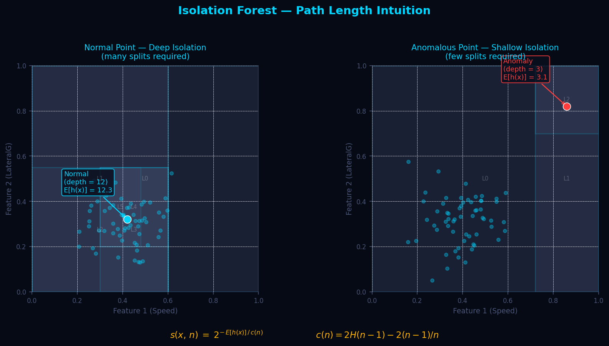
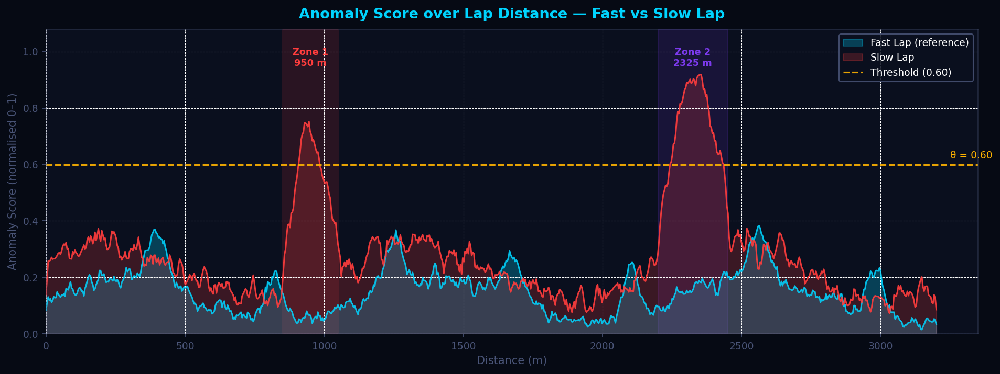
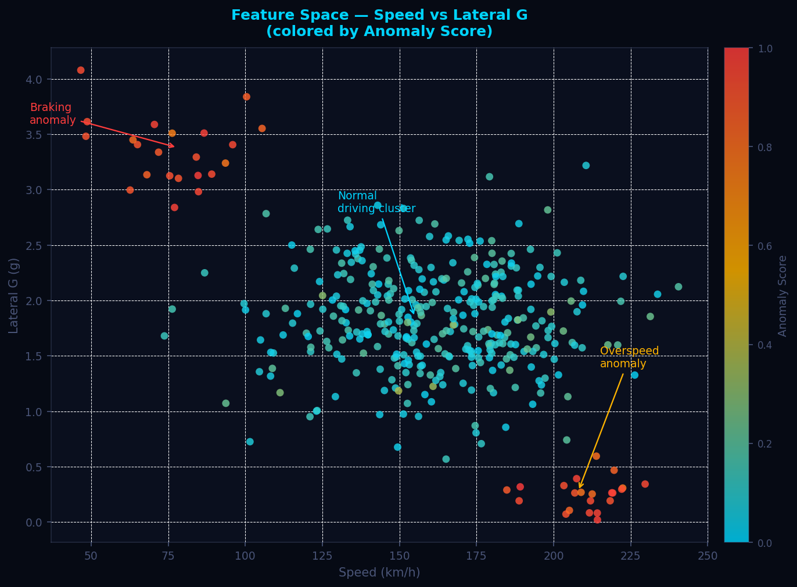
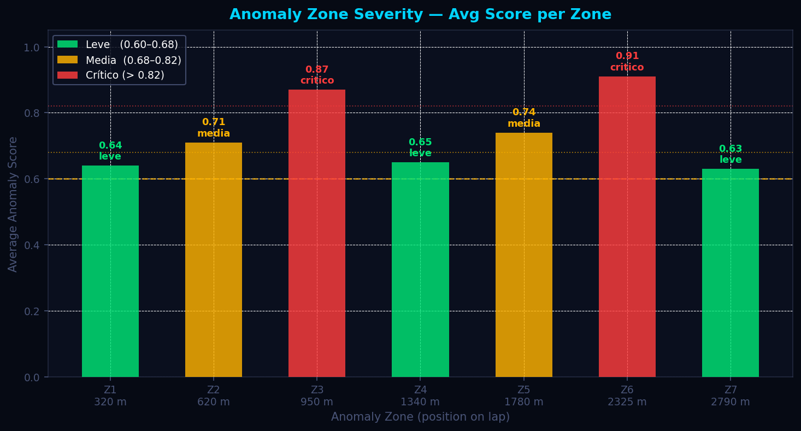

# Anomaly Detection — Isolation Forest

🌐 [Ver en Español](./05_anomaly_detection.es.md)

> **Module:** `src/analytics/ml_anomaly.py`
> **Core algorithm:** Isolation Forest (Liu et al., 2008)
> **Feature vector:** Speed · Brake · Throttle · SteerAngle · LateralG · LongitudinalG

---

## Table of Contents

1. [Overview](#overview)
2. [Scientific Background](#scientific-background)
3. [Algorithm and Implementation](#algorithm-and-implementation)
4. [Key Parameters](#key-parameters)
5. [Interpreting Results](#interpreting-results)
6. [Driver Recommendations](#driver-recommendations)
7. [Visualizations](#visualizations)
8. [References](#references)

---

## Overview

The anomaly detection module identifies, meter by meter, the moments in which the driver's behaviour during the slow lap deviates significantly from the pattern of the fast reference lap. Unlike univariate approaches (e.g., detecting only out-of-range speed), this module simultaneously analyses six telemetry channels as a **state vector**. An unusual combination of values — even if each individual channel appears plausible — is detected as an anomaly.

The fast lap acts as the *reference distribution*: it defines what "optimal driving" looks like for that specific track and condition. The Isolation Forest model is trained exclusively on that reference and evaluated on the slow lap. Regions where the score exceeds the threshold `ANOMALY_THRESHOLD = 0.60` are grouped into **anomaly zones** with a minimum length of 15 metres, classified by severity, and presented to the engineer with an actionable description.

---

## Scientific Background

### 2.1 Isolation Forest Intuition

The Isolation Forest (Liu, Ting & Zhou, 2008) exploits the principle that anomalous points are **rare and distinct**: they can be isolated with very few random partitions of the feature space, whereas normal points — embedded in a dense region — require many more.

Given an isolation tree built with random partitions, the path length $h(x)$ is defined as the number of edges traversed from the root to the terminal node containing $x$. An anomalous point has small $h(x)$; a normal point has large $h(x)$.

### 2.2 Score Function

For a forest of $T$ trees and $n$ training samples, the anomaly score for an observation $x$ is:

$$
s(x,\,n) \;=\; 2^{-\,\dfrac{E[h(x)]}{c(n)}}
$$

where:

- $E[h(x)]$ is the average path length across all trees in the forest.
- $c(n)$ is the normalisation factor equivalent to the expected path length in a **binary search tree** of $n$ nodes:

$$
c(n) \;=\; 2\,H(n-1) \;-\; \frac{2(n-1)}{n}
$$

with $H(k) = \ln(k) + \gamma_E$ (harmonic number, $\gamma_E \approx 0.5772$ Euler-Mascheroni constant).

**Score interpretation:**

| Value of $s(x,n)$ | Interpretation |
|---|---|
| $s \to 1$ | Highly anomalous: $E[h(x)] \ll c(n)$ |
| $s \approx 0.5$ | Indistinguishable from the norm |
| $s \to 0$ | Highly normal: $E[h(x)] \gg c(n)$ |

### 2.3 Score Normalisation to [0, 1]

The scikit-learn internal function `decision_function` returns values where **high = normal**. To convert to a scale where **1 = most anomalous**, the following is applied:

$$
\hat{s}_i \;=\; \text{clip}\!\left(\frac{s_{\max} - s_i}{s_{\max} - s_{\min} + \varepsilon},\; 0,\; 1\right), \quad \varepsilon = 10^{-9}
$$

This normalisation is relative to the distribution of the evaluated lap, guaranteeing that the full range $[0, 1]$ is always represented.

### 2.4 Multivariate Space of 6 Channels

The state vector $\mathbf{x}_t \in \mathbb{R}^6$ at instant $t$ is:

$$
\mathbf{x}_t = \bigl[\,\text{Speed},\;\text{Brake},\;\text{Throttle},\;\text{SteerAngle},\;\text{LateralG},\;\text{LongitudinalG}\,\bigr]_t
$$

The motivation for **multivariate over univariate** analysis is fundamental: braking at 150 km/h may be normal; a steering angle of 8° may be normal; but the simultaneous combination of both with the throttle partially open is highly anomalous and detectable only in the joint space.

### 2.5 Standardisation (StandardScaler)

Before training, each channel is centred and scaled using the statistics from the **fast lap**:

$$
z_{i,j} \;=\; \frac{x_{i,j} - \mu_j^{\text{fast}}}{\sigma_j^{\text{fast}}}
$$

where $j$ denotes the channel (feature) and $i$ the time instant. The slow lap is transformed using the **same** $\mu_j^{\text{fast}}$ and $\sigma_j^{\text{fast}}$, without recomputing. This is essential: deviations of the slow lap relative to the fast lap's scale are precisely the signal to be detected.

### 2.6 Smoothing and Zone Detection

The point-by-point score exhibits high-frequency noise. A centred moving average with window 5 is applied:

$$
\tilde{s}_i \;=\; \frac{1}{5} \sum_{k=i-2}^{i+2} \hat{s}_k
$$

Continuous anomaly zones are extracted with a sequential thresholding algorithm: a zone accumulates while $\tilde{s}_i > \theta = 0.60$, and the zone is reported only if its length exceeds $\Delta_{\min} = 15\,\text{m}$. Severity is classified by the zone's average score:

$$
\text{Severity}(\bar{s}) = \begin{cases}
\text{minor}    & 0.60 < \bar{s} \leq 0.68 \\
\text{moderate} & 0.68 < \bar{s} \leq 0.82 \\
\text{critical} & \bar{s} > 0.82
\end{cases}
$$

---

## Algorithm and Implementation

### 3.1 Execution Flow

```
detect_anomalies(df_aligned, contamination=0.10)
  │
  ├── 1. Select *_Fast and *_Slow columns from ML_FEATURES
  ├── 2. fillna(ffill) → no propagated NaNs
  ├── 3. StandardScaler.fit_transform(X_fast)  ← fit ONLY on fast
  │        StandardScaler.transform(X_slow)    ← apply same scaler
  ├── 4. IsolationForest(n_estimators=120, contamination=0.10).fit(X_fast_sc)
  ├── 5. decision_function(X_fast_sc) → raw_fast
  │        decision_function(X_slow_sc) → raw_slow
  ├── 6. _normalize(raw_fast) → score_fast  [0,1]
  │        _normalize(raw_slow) → score_slow [0,1]
  ├── 7. rolling(5).mean() on both scores
  ├── 8. _extract_zones(distances, score_slow)
  └── 9. Downsample to MAX_SCORE_POINTS=500 for frontend
```

### 3.2 Building the Feature Matrix

```python
fast_cols = [f"{f}_Fast" for f in ML_FEATURES if f"{f}_Fast" in df_aligned.columns]
X_fast = df_aligned[fast_cols].fillna(method="ffill").fillna(0).values
```

Only channels that exist in the aligned DataFrame are used. The `shared_features` logic ensures that the slow lap includes only the same channels available in the fast lap, keeping the dimensional space identical for the model.

### 3.3 Model Training

```python
model = IsolationForest(
    n_estimators=120,
    contamination=contamination,  # default 0.10
    random_state=42,
    n_jobs=-1,
)
model.fit(X_fast_sc)
```

The `contamination=0.10` parameter tells the model that approximately 10% of the training points (limit braking events, fast corners) are intrinsically atypical even within the fast lap. This adjusts the internal decision threshold.

### 3.4 Zone Extraction (`_extract_zones`)

The algorithm iterates over the `(distance, score)` pairs of the slow lap. When the threshold is exceeded, a zone begins (`in_zone = True`) and scores are accumulated. When the score falls below the threshold, the algorithm checks whether the zone exceeds `MIN_ZONE_METERS = 15.0 m`; if so, it calls `_build_zone`.

### 3.5 Severity Classification (`_build_zone`)

```python
if avg > 0.82:   sev = "critical"
elif avg > 0.68: sev = "moderate"
else:            sev = "minor"
```

Each zone includes: `start_m`, `end_m`, `length_m`, `avg_score`, `peak_score`, `severity`, and a textual `description` for the driver.

---

## Key Parameters

| Parameter | Value | Location | Description | Effect when modified |
|---|---|---|---|---|
| `ML_FEATURES` | `[Speed, Brake, Throttle, SteerAngle, LateralG, LongitudinalG]` | Global constant | State vector channels | Adding/removing features changes the detection space |
| `n_estimators` | `120` | `IsolationForest` | Number of trees in the forest | More trees = greater stability, higher computational cost |
| `contamination` | `0.10` | `detect_anomalies()` | Expected fraction of anomalies in training | Increase → more permissive internal threshold, more zones reported |
| `random_state` | `42` | `IsolationForest` | Randomness seed | Fixed for reproducibility; changing it slightly alters results |
| `n_jobs` | `-1` | `IsolationForest` | Parallelism (all cores) | Reduces training time on large datasets |
| `MAX_SCORE_POINTS` | `500` | Global constant | Maximum samples sent to frontend | Reducing improves network performance; increasing improves visual resolution |
| `ANOMALY_THRESHOLD` | `0.60` | Global constant | Score threshold to start a zone | Decrease → more zones (more sensitive); increase → only severe anomalies |
| `MIN_ZONE_METERS` | `15.0` | Global constant | Minimum length of a reportable zone | Decrease → detects brief point errors; increase → only sustained errors |
| `rolling(5)` | window=5 | `_normalize` + post-process | Score smoothing | Increasing → smoother score, less fragmented zones |
| `ε` | `1e-9` | `_normalize` | Protection against division by zero | Technical; no adjustment needed |

---

## Interpreting Results

### 5.1 Score-by-Distance Chart (Fig. 2)

- The **cyan area** (fast lap) should remain mostly low (< 0.40). Peaks at 0.55–0.58 are normal during limit braking events and are absorbed by `contamination=0.10`.
- The **red area** (slow lap) reveals the relative magnitude of each error compared to the reference. Peaks > 0.60 activate zones.
- The **amber line** at θ = 0.60 is the decision boundary. Everything that exceeds it and holds for ≥ 15 m is reported as a zone.
- The **vertical bands** indicate active zones. Their horizontal width represents the duration of the error in metres.

### 5.2 Feature Space (Fig. 3)

- **Cyan points** (low score) form the normal distribution of the fast lap.
- **Amber → red points** (high score) are car states the model never saw during training, or saw with low frequency.
- An anomalous cluster at low speed / high lateral G indicates a corner taken with an incorrect trajectory (pronounced understeer or oversteer).
- An anomalous cluster at high speed / low lateral G indicates possible loss of grip, a flat spot, or a line that is too straight where the reference loads the tyre.

### 5.3 Severity Bars by Zone (Fig. 4)

| Average score | Severity | Operational interpretation |
|---|---|---|
| 0.60 – 0.68 | **Minor** | Marginal deviation; the driver is near the limit but executing incorrectly in detail |
| 0.68 – 0.82 | **Moderate** | Multiple channels diverge simultaneously; combined line or pedal error |
| > 0.82 | **Critical** | The model never observed this combination in the fast reference lap; review the complete trace through the zone |

### 5.4 Red Flags

- **Peak score > 0.95** in a critical zone: possible setup error (chronic oversteer, brake flat spot).
- **Multiple critical zones at the same corner on successive laps**: systematic line problem, not noise.
- **High fast-lap score (> 0.50 average)**: the reference lap is not representative; the model may be poorly calibrated. Choose a more consistent fast lap.
- **Very frequent zones < 15 m (filtered out)**: indicates signal noise or a sensor with drift; review input data quality.

---

## Driver Recommendations

### Minor Zones (0.60–0.68)

- Review the visual reference point during braking. Small variations in the entry point propagate to the score across multiple channels.
- The error is usually in a single channel (e.g., slightly premature throttle application). Compare channel by channel against the fast lap in that zone.

### Moderate Zones (0.68–0.82)

- The combination of pedal inputs and steering angle diverges significantly. Indicative of corrective understeer (throttle on + extra steering lock added) or entry oversteer (late braking with lateral weight transfer).
- Check the `SteerAngle` channel in the zone: if it is substantially larger than the reference, the corner entry is late or the entry speed exceeds available grip.
- Review `LateralG` vs `Speed` in the scatter plot (Fig. 3): if the driver is in the low-G / high-speed region, they are sacrificing lateral load — too wide a line.

### Critical Zones (> 0.82)

- The driver is executing a combination of inputs that has no precedent in the fast reference lap. This may be:
  - **Grip limit error**: exceeding the traction circle on at least two simultaneous channels.
  - **Late corrective reaction**: the steering and pedals react out of phase with the car's dynamics.
  - **Mechanical issue**: if the critical zone is persistent and the driver reports anomalous behaviour, consider inspecting the subframe, dampers, or tyre pressures.
- Recommended protocol: compare telemetry channel by channel in the critical zone using the advanced comparison panel. Prioritise aligning the braking point before working on the corner exit.

### General Prioritisation Rule

Address critical zones first, then moderate zones, and ignore minor zones during qualifying sessions. In longer sessions, accumulated minor zones can collectively represent 0.2–0.4 s/lap.

---

## Visualizations

### Fig. 1 — Isolation Forest Intuition: Path Length



Schematic diagram contrasting the isolation depth between a normal point and an anomalous point in an isolation tree. The normal point (cyan, left) requires multiple recursive partitions before being isolated — its $E[h(x)]$ is high, resulting in $s \to 0$. The anomalous point (red, right) is isolated with only 3 partitions — its $E[h(x)]$ is low, resulting in $s \to 1$. The nested boxes represent the feature space cells at each level of the recursion. The score equation is shown in the chart caption.

---

### Fig. 2 — Anomaly Score by Distance



Area chart overlaying the anomaly score profile of the fast lap (cyan) and the slow lap (red) along the lap distance in metres. The horizontal amber line at θ = 0.60 indicates the activation threshold. The coloured vertical bands highlight the two detected anomaly zones. In a well-executed reference lap, the cyan area should remain compact and low. Isolated peaks in the fast lap correspond to moments of maximum tyre exploitation (corner entry, trail braking) and are expected with `contamination=0.10`.

---

### Fig. 3 — Feature Space: Speed vs LateralG



Scatter plot of the two-dimensional Speed–LateralG space (projection of the 6-dimensional space) with each point coloured by its normalised anomaly score (cyan low → amber medium → red high). The main cluster of low-cyan points represents the optimal driving distribution learned by the model. The red clusters at the periphery (low speed / high lateral G, and high speed / low lateral G) correspond to the zones detected as anomalous: braking errors and overspeed lines respectively. This visualisation confirms that the errors are combinations of features, not univariate outliers.

---

### Fig. 4 — Severity by Anomaly Zone



Bar chart with each detected zone on the horizontal axis and the average score on the vertical axis. Bars are coloured according to the severity classification: green (minor: 0.60–0.68), amber (moderate: 0.68–0.82), and red (critical: > 0.82). Horizontal dashed lines mark the classification thresholds. This view allows the track engineer to quickly prioritise the zones with the greatest impact on lap time and guide the debrief with the driver.

---

## References

1. **Liu, F. T., Ting, K. M., & Zhou, Z.-H. (2008).** *Isolation Forest.* In *Proceedings of the 2008 Eighth IEEE International Conference on Data Mining* (ICDM), pp. 413–422. IEEE. — Foundational paper for the Isolation Forest algorithm; describes the derivation of $c(n)$ and the score function $s(x,n)$.

2. **Liu, F. T., Ting, K. M., & Zhou, Z.-H. (2012).** *Isolation-Based Anomaly Detection.* *ACM Transactions on Knowledge Discovery from Data (TKDD)*, 6(1), 1–39. — Extension of the original paper with computational complexity analysis $O(n \log n)$ and comparison with LOF and One-Class SVM on industrial datasets.

3. **Pedregosa, F. et al. (2011).** *Scikit-learn: Machine Learning in Python.* *Journal of Machine Learning Research*, 12, 2825–2830. — Reference documentation for the implementation of `IsolationForest`, `StandardScaler`, and the `contamination` parameter used in this module.

4. **Segers, A. J. C. (2020).** *Data-driven methods for motorsport performance analysis: from telemetry to actionable feedback.* Master's thesis, Delft University of Technology. — Review of ML methods applied to motorsport telemetry; includes sensitivity analysis for feature selection in low-dimensional multivariate spaces (4–8 channels).

5. **Breunig, M. M., Kriegel, H.-P., Ng, R. T., & Sander, J. (2000).** *LOF: Identifying Density-Based Local Outliers.* In *Proceedings of ACM SIGMOD*, pp. 93–104. — Comparative reference for density-based local outlier detection; Isolation Forest outperforms LOF on high-dimensional datasets and large volumes of real-time data, justifying its selection for continuous telemetry.

---

> **Language note:** This document is the English translation of [`05_anomaly_detection.es.md`](./05_anomaly_detection.es.md). Both files are maintained in parallel. If you find a discrepancy, the Spanish source takes precedence.
