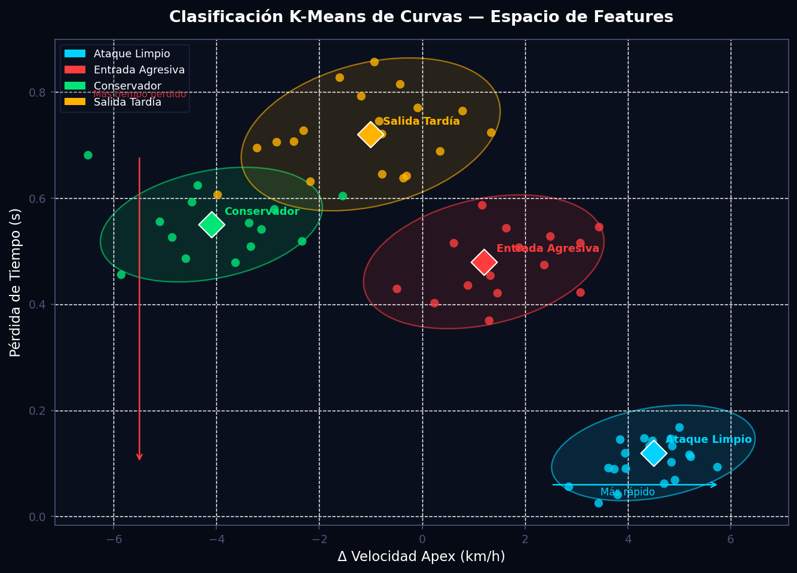
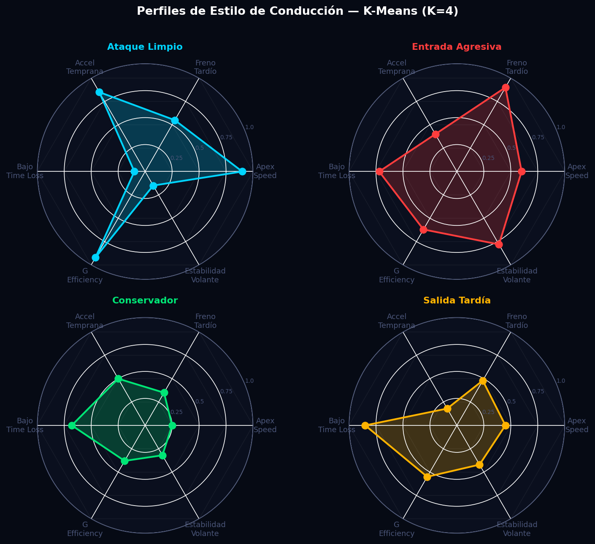
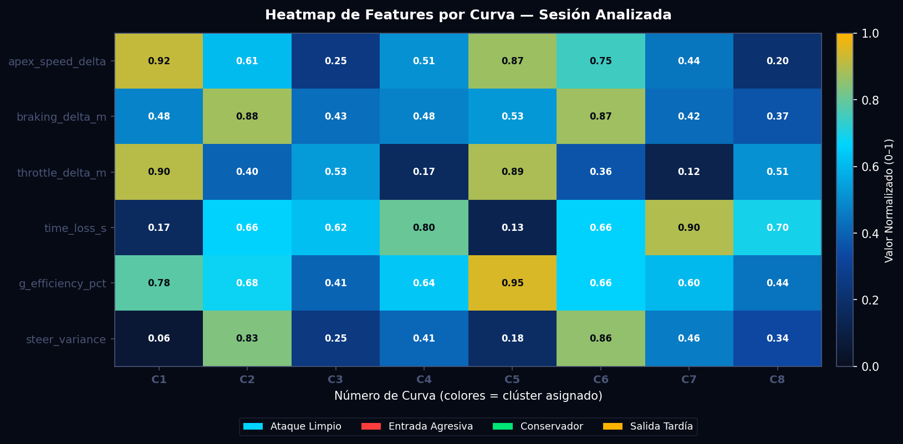

# Clasificación de Estilo de Conducción — K-Means por Curva

> **Módulo:** `src/analytics/ml_clustering.py`
> **Función principal:** `clasificar_curvas(df_aligned, corners, n_clusters=4)`
> **Dependencias:** `scikit-learn`, `numpy`, `pandas`

---

## Tabla de Contenidos

1. [Descripción General](#descripción-general)
2. [Fundamentos Científicos](#fundamentos-científicos)
3. [Algoritmo e Implementación](#algoritmo-e-implementación)
4. [Parámetros Clave](#parámetros-clave)
5. [Interpretación de Resultados](#interpretación-de-resultados)
6. [Recomendaciones para el Piloto](#recomendaciones-para-el-piloto)
7. [Visualizaciones](#visualizaciones)
8. [Referencias](#referencias)

---

## Descripción General

Este módulo clasifica automáticamente el paso por cada curva del circuito en perfiles de conducción discretos usando el algoritmo K-Means. Para cada curva se extrae un vector de seis métricas de telemetría que cuantifican la ejecución del piloto respecto a una vuelta de referencia: la diferencia de velocidad en el vértice, los puntos de frenada y aceleración, la pérdida de tiempo total, la eficiencia de uso de la fricción disponible y la estabilidad del volante. A partir de estos vectores, K-Means agrupa curvas con patrones similares en cuatro perfiles distintos — Ataque Limpio, Entrada Agresiva, Conservador y Salida Tardía — proporcionando un mapa de estilos de conducción accionable para el ingeniero de pista.

La clasificación opera sesión a sesión: los centroides se recalculan con los datos de cada sesión, lo que permite detectar derivas de comportamiento a lo largo del fin de semana (FP → Q → R) sin necesidad de reentrenamiento manual. La estandarización previa de features garantiza que ninguna variable domine el cálculo de distancias por tener una escala mayor.

---

## Fundamentos Científicos

### 2.1 Ingeniería de Features por Curva

Para cada curva $c$ identificada en el pipeline de segmentación, se construye un vector de features de dimensión 6:

$$\mathbf{x}_c = \bigl[\Delta v_{\text{apex}},\; \Delta d_{\text{brake}},\; \Delta d_{\text{thr}},\; \Delta t_{\text{loss}},\; \bar{\eta}_{G},\; \sigma^2_{\delta}\bigr]$$

| Símbolo | Feature | Definición |
|---------|---------|------------|
| $\Delta v_{\text{apex}}$ | `apex_speed_delta_kmh` | $v_{\text{piloto,apex}} - v_{\text{ref,apex}}$ en km/h. Positivo = piloto más rápido. |
| $\Delta d_{\text{brake}}$ | `braking_delta_m` | Distancia al punto de frenada del piloto menos el de referencia en metros. Negativo = frena más tarde (agresivo). |
| $\Delta d_{\text{thr}}$ | `throttle_delta_m` | Distancia al punto de apertura de gas menos la referencia. Negativo = abre antes (mejor salida). |
| $\Delta t_{\text{loss}}$ | `time_loss_seconds` | Diferencia de tiempo acumulada en la ventana de la curva (segundos). |
| $\bar{\eta}_{G}$ | `g_efficiency_pct` | Media del uso del círculo de fricción dentro de la ventana: $\eta = \sqrt{a_x^2 + a_y^2}\,/\,a_{\max}$ expresado en porcentaje. |
| $\sigma^2_{\delta}$ | `steer_variance` | Varianza del ángulo de volante en la ventana de la curva, medida en grados². |

La varianza del volante $\sigma^2_{\delta}$ se obtiene directamente de la columna `SteerAngle_Fast` del DataFrame alineado:

$$\sigma^2_{\delta} = \frac{1}{N-1}\sum_{i=1}^{N}\bigl(\delta_i - \bar{\delta}\bigr)^2$$

La eficiencia de la elipse de fricción se promedia sobre los $N$ muestras de la ventana:

$$\bar{\eta}_{G} = \frac{1}{N}\sum_{i=1}^{N}\frac{\sqrt{a_{x,i}^2 + a_{y,i}^2}}{a_{\max}}$$

### 2.2 Estandarización

Antes del clustering, cada feature se estandariza con la transformación z-score mediante `StandardScaler`:

$$\tilde{x}_{c,j} = \frac{x_{c,j} - \mu_j}{\sigma_j}$$

donde $\mu_j$ y $\sigma_j$ son la media y desviación estándar de la feature $j$ calculadas sobre todas las curvas de la sesión. Esto asegura que features con escalas dispares (metros vs. segundos vs. porcentaje) contribuyen igualmente a la distancia euclidiana.

### 2.3 Algoritmo K-Means

K-Means minimiza la inercia total (suma de distancias cuadradas intra-clúster):

$$W = \sum_{k=1}^{K} \sum_{\mathbf{x} \in C_k} \|\mathbf{x} - \boldsymbol{\mu}_k\|^2$$

donde $C_k$ es el conjunto de puntos asignados al clúster $k$ y $\boldsymbol{\mu}_k$ es el centroide de dicho clúster.

El algoritmo alterna entre dos pasos hasta convergencia:

**Paso E (asignación):** Cada curva se asigna al clúster cuyo centroide minimiza la distancia euclidiana en el espacio estandarizado:

$$z_c = \arg\min_{k \in \{1,\ldots,K\}} \|\tilde{\mathbf{x}}_c - \boldsymbol{\mu}_k\|^2$$

**Paso M (actualización):** Cada centroide se recalcula como la media aritmética de los puntos asignados:

$$\boldsymbol{\mu}_k = \frac{1}{|C_k|} \sum_{\mathbf{x} \in C_k} \mathbf{x}$$

El proceso garantiza que $W$ decrece monótonamente en cada iteración y converge a un mínimo local.

### 2.4 Selección del Número de Clústeres (Método del Codo)

El parámetro $K=4$ se seleccionó mediante el método del codo: se grafica $W(K)$ para $K \in \{2, 3, \ldots, 8\}$ y se identifica el punto de inflexión donde la reducción marginal de inercia disminuye significativamente. Formalmente, se busca el $K^*$ tal que:

$$\frac{W(K^*-1) - W(K^*)}{W(K^*) - W(K^*+1)} \gg 1$$

En datos de telemetría de vuelta completa, $K=4$ corresponde a los cuatro arquetipos de error de conducción más frecuentes en competición: errores de entrada, errores de vértice, errores de salida y ejecución nominal.

### 2.5 Interpretación de Centroides

El módulo interpreta cada centroide $\boldsymbol{\mu}_k$ en el espacio original (invertiendo la estandarización con `inverse_transform`) y aplica un conjunto de reglas heurísticas basadas en el conocimiento de ingeniería de pista:

| Condición sobre el centroide | Perfil asignado |
|---|---|
| $\Delta v_{\text{apex}} > 3$ km/h AND $\Delta d_{\text{thr}} < -5$ m AND $\Delta t < 0.2$ s | Ataque Limpio |
| $\Delta d_{\text{brake}} < -8$ m AND $\Delta t > 0.3$ s | Entrada Agresiva |
| $\Delta v_{\text{apex}} < -3$ km/h AND $\bar{\eta}_G < 65\%$ | Conservador |
| $\Delta d_{\text{thr}} > 8$ m | Salida Tardía |
| $\sigma^2_{\delta} > 60$ deg² | Conducción Errática |
| $|\Delta v_{\text{apex}}| < 1$ km/h AND $\Delta t < 0.15$ s | Ejecución Consistente |

---

## Algoritmo e Implementación

### 3.1 Flujo de Ejecución

```
clasificar_curvas(df_aligned, corners, n_clusters=4)
│
├── _build_feature_matrix(df_aligned, corners)
│   ├── Para cada curva: extraer ventana temporal [start_distance, end_distance]
│   ├── Calcular 4 deltas desde corner dict (apex, brake, throttle, time_loss)
│   ├── Calcular G_efficiency  → media de G_Efficiency_Fast en la ventana
│   ├── Calcular steer_variance → var de SteerAngle_Fast en la ventana
│   └── Retornar matrix X [n_corners × 6] y lista de corner_numbers
│
├── StandardScaler.fit_transform(X)  → X_sc normalizado
│
├── KMeans(n_clusters=k, random_state=42, n_init=12).fit_predict(X_sc)
│   └── labels [n_corners], cluster_centers_ [k × 6]
│
├── scaler.inverse_transform(cluster_centers_)  → centroids_orig
│
├── _interpretar_centroides(centroids_orig, k)  → dict {label_id: nombre}
│
└── Combinar corner_number + cluster + perfil + features → lista de dicts
```

### 3.2 Construcción de la Matriz de Features

El método `_build_feature_matrix` itera sobre la lista de `corners` generada por el pipeline de segmentación. Para cada curva se extrae la ventana del DataFrame alineado mediante filtrado por distancia:

```python
window = df_aligned[
    (df_aligned["Distance"] >= start) & (df_aligned["Distance"] <= end)
]
```

Se requiere un mínimo de 4 muestras en la ventana (`len(window) < 4` descarta la curva) para garantizar que la varianza del volante sea estadísticamente significativa. Los cuatro primeros features (`apex_delta`, `brake_delta`, `throttle_d`, `time_loss`) se leen directamente del diccionario de curva producido por el módulo de alineación. Los dos features computados sobre la ventana son:

```python
g_eff     = float(window["G_Efficiency_Fast"].mean())   # media en la ventana
steer_var = float(window["SteerAngle_Fast"].var())       # varianza (ddof=1)
```

### 3.3 Parámetros de KMeans

```python
model = KMeans(n_clusters=k, random_state=42, n_init=12)
```

- `n_init=12`: el algoritmo se reinicia 12 veces con semillas distintas y retiene la solución de menor inercia, reduciendo la probabilidad de quedar atrapado en un mínimo local subóptimo.
- `random_state=42`: reproducibilidad determinista de resultados entre ejecuciones.
- `k = min(n_clusters, len(vectors))`: protección contra $K > N$, que haría el problema mal condicionado.

### 3.4 Guardado del Resultado

Cada entrada del resultado incluye el número de curva, el índice entero del clúster, la etiqueta legible del perfil y el diccionario completo de features redondeados:

```python
{
    "corner_number": 3,
    "cluster": 1,
    "perfil": "Entrada Agresiva — Frena tarde, salida comprometida",
    "features": {
        "apex_speed_delta_kmh": 1.2,
        "braking_delta_m": -11.3,
        "throttle_delta_m": 2.5,
        "time_loss_s": 0.412,
        "g_efficiency_pct": 61.7,
        "steer_variance": 43.8,
    }
}
```

---

## Parámetros Clave

| Parámetro | Valor por defecto | Tipo | Descripción | Efecto al modificar |
|---|---|---|---|---|
| `n_clusters` | `4` | `int` | Número de clústeres K-Means | Aumentar a 5–6 para circuitos largos (>12 curvas) con mayor variedad de esquinas; reducir a 3 en sessiones cortas. |
| `n_init` (KMeans) | `12` | `int` | Número de reinicios del algoritmo | Mayor = más estable pero más lento. 12 es suficiente para N < 20 curvas. |
| `random_state` | `42` | `int` | Semilla de aleatoriedad | Cambiar sólo para análisis de sensibilidad; mantener fijo para reproducibilidad. |
| `min_window_samples` | `4` | `int` | Mínimo de muestras en ventana de curva | Reducir a 2 sólo si la frecuencia de muestreo es muy baja (<10 Hz). |
| Umbral `apex_d > 3` | `3.0 km/h` | `float` | Límite para clasificar como Ataque Limpio | Ajustar según la velocidad media del circuito (±1 km/h en lentos, ±3 km/h en rápidos). |
| Umbral `brake_d < -8` | `-8.0 m` | `float` | Límite para Entrada Agresiva | Reducir a -5 m en chicanas cortas; ampliar a -12 m en frenadas de alta velocidad. |
| Umbral `g_eff < 65` | `65%` | `float` | Límite de G efficiency para Conservador | Depende del tipo de neumático y condiciones de pista (seco/mojado). |
| Umbral `thr_d > 8` | `8.0 m` | `float` | Límite para Salida Tardía | Reducir a 5 m en trazados técnicos donde el exit es corto. |

---

## Interpretación de Resultados

### 5.1 Mapa de Clústeres — Scatter 2D

La visualización proyecta las curvas sobre los dos features más discriminantes: velocidad en el vértice (eje X) y pérdida de tiempo (eje Y). Los cuatro cuadrantes tienen interpretación directa:

- **Cuadrante superior izquierdo** (bajo apex speed, alto time loss): curvas Conservadoras. El piloto evita el riesgo pero deja tiempo en la mesa de forma consistente.
- **Cuadrante superior derecho** (apex speed positiva, alto time loss): curvas de Entrada Agresiva. El piloto llega rápido al vértice pero compromete la salida.
- **Cuadrante inferior derecho** (alto apex speed, bajo time loss): Ataque Limpio. El rango objetivo para toda sesión.
- **Cuadrante inferior izquierdo** (bajo apex speed, tiempo medio): Salida Tardía. La penalización es en la tracción de salida, no en el vértice.

Las elipses de covarianza representan la dispersión de 1.8 desviaciones estándar dentro de cada clúster. Un clúster muy disperso (elipse grande) indica **inconsistencia** — el piloto ejecuta esa curva de forma diferente en cada vuelta.

### 5.2 Perfiles Radar

Cada eje del gráfico radar representa un feature normalizado entre 0 (mínimo observado en sesión) y 1 (máximo). Un polígono amplio en todos los ejes indica un piloto que exprime el coche en todos los frentes. Los patrones diagnósticos más importantes:

| Patrón en radar | Diagnóstico |
|---|---|
| Eje "Freno Tardío" alto + "Bajo Time Loss" bajo | El piloto frena tarde pero paga el precio en la salida — compromiso subóptimo. |
| Eje "G Efficiency" bajo + "Apex Speed" bajo | El piloto no usa el grip disponible, posiblemente por subviraje o falta de confianza. |
| Eje "Estabilidad Volante" bajo (alta varianza) | Sobre-corrección en el vértice, posiblemente por sobreviraje o desequilibrio de carga. |
| Polígono simétrico y compacto cerca del centro | Conducción homogénea pero lenta — mejorar todas las métricas de forma balanceada. |

### 5.3 Heatmap de Features por Curva

El heatmap permite identificar de forma inmediata qué curvas específicas concentran los problemas. Los valores están normalizados por sesión (0–1). Reglas de lectura:

- **Celda ámbar brillante en `time_loss_s`**: esa curva específica es la mayor fuente de tiempo perdido — prioridad máxima de trabajo.
- **Celda fría en `g_efficiency_pct`**: el piloto no maximiza el uso del neumático en esa curva — revisar trazada o punto de referencia interno.
- **Celda cálida en `steer_variance`**: inestabilidad de volante localizada — puede indicar baches, sobreviraje o punto de freno incorrecto.
- Los colores del eje X indican el clúster asignado a cada curva, permitiendo validar visualmente la coherencia de la clasificación.

### 5.4 Señales de Alerta

| Condición | Significado | Acción recomendada |
|---|---|---|
| Misma curva cambia de clúster entre vueltas | Alta variabilidad de ejecución | Revisar referencias internas del piloto para esa curva |
| Todos los clústeres asignados al mismo perfil | Datos insuficientes o sesión muy corta | Verificar que `n_clusters ≤ n_corners/2` |
| `steer_variance > 80` deg² | Sobreviraje severo o desequilibrio | Revisión de setup (balanceo, diferencial) |
| `g_efficiency_pct < 50%` en grupo de curvas | Subutilización sistemática del grip | Trabajo de punto de freno y trazada de entrada |

---

## Recomendaciones para el Piloto

### 6.1 Ataque Limpio

Este perfil es el estado objetivo. Las curvas en este clúster representan la referencia de ejecución del propio piloto. **Acción:** Estudiar en detalle estos pasos — posición de freno, marcas de apéx, punto de apertura de gas — y replicar esa técnica en las demás curvas.

### 6.2 Entrada Agresiva

El piloto frena más tarde que en la referencia ($\Delta d_{\text{brake}} < -8$ m) pero compromete la salida. Esto indica que la velocidad de entrada excede la capacidad de rotación del coche, obligando a abrir el volante o mantener freno durante el vértice.

**Acciones:**
- Adelantar el punto de frenada 5–8 m y verificar si el `time_loss_s` disminuye.
- Revisar la presión de frenada inicial (ramp rate) — una frenada más suave al inicio puede permitir rotar mejor.
- Evaluar el ajuste del diferencial de entrada si el problema se concentra en curvas lentas.

### 6.3 Conservador

El piloto frena antes de lo necesario y no alcanza la velocidad de vértice de referencia, además con baja eficiencia de la elipse de fricción. Señal de falta de confianza o referencia incorrecta.

**Acciones:**
- Trabajar con el piloto en establecer una marca visual de freno más agresiva, comenzando con incrementos de 2–3 m.
- Verificar que el equilibrio del coche en entrada sea neutro — el sobreviraje de entrada induce conservadurismo involuntario.
- Analizar si el problema se repite exclusivamente en curvas rápidas (posible falta de carga aerodinámica) o lentas (confianza en el coche).

### 6.4 Salida Tardía

El piloto abre el gas demasiado tarde ($\Delta d_{\text{thr}} > 8$ m respecto a la referencia). Es el error con mayor impacto acumulativo en circuitos con largas rectas tras curvas lentas, ya que el déficit de velocidad se propaga hasta el final de la recta.

**Acciones:**
- Identificar si la apertura tardía es por miedo al sobreviraje de salida o por un punto de referencia incorrecto. Revisar telemetría de aceleración lateral al momento de apertura de gas.
- Ajustar el diferencial de salida (locking) para facilitar la tracción en la cuerda.
- Usar la marca de trazada en la salida (bordillo exterior) como referencia absoluta de apertura de gas.

### 6.5 Conducción Errática

Alta varianza del volante ($\sigma^2_{\delta} > 60$ deg²) sin un patrón claro en los demás features. Suele indicar un problema de setup o una referencia interna del piloto que genera sobre-correcciones.

**Acciones:**
- Revisar los datos de aceleración lateral simultáneos — si hay picos de $a_y$ correlacionados con los picos de volante, el problema es de sobreviraje.
- Analizar los registros de presión de frenos: el sobreviraje de entrada bajo frenada es la causa más frecuente de esta firma.
- Considerar aumentar el amortiguamiento de rebote trasero o reducir el antirollbar trasero.

---

## Visualizaciones

### Figura 1 — Dispersión de Curvas en Espacio de Features



Proyección 2D de todas las curvas de la sesión sobre los ejes `apex_speed_delta_kmh` (X) y `time_loss_s` (Y). Cada punto representa una curva individual; el color indica el clúster K-Means asignado. Los rombos grandes marcan los centroides. Las elipses representan la región de 1.8 desviaciones estándar de cada clúster. Un clúster compacto (elipse pequeña) indica alta consistencia en esa modalidad de conducción. La separación entre los centroides de Ataque Limpio (cian, inferior derecho) y Conservador (verde, superior izquierdo) cuantifica el potencial de mejora total del piloto.

### Figura 2 — Perfiles Radar de Cada Clúster



Cuatro gráficos radar (uno por clúster) con los seis features normalizados. Cada eje va de 0 (mínimo en sesión) a 1 (máximo). Los ejes han sido orientados de modo que "hacia afuera" representa siempre el comportamiento más extremo en esa dimensión. La huella del polígono es la "firma" del estilo de conducción: Ataque Limpio produce un polígono con alta cobertura en Apex Speed, Accel Temprana y G Efficiency; Entrada Agresiva sobresale únicamente en el eje Freno Tardío; Conservador presenta un polígono uniformemente pequeño.

### Figura 3 — Heatmap de Features por Curva



Matriz de colores donde las columnas son las curvas del circuito (C1–C8) y las filas son los seis features. Los valores están normalizados entre 0 (azul oscuro) y 1 (ámbar). El color del etiquetado del eje X indica el clúster asignado a esa curva: cian = Ataque Limpio, rojo = Entrada Agresiva, verde = Conservador, ámbar = Salida Tardía. Permite identificar de un vistazo qué curvas concentran el mayor tiempo perdido y qué feature es el responsable.

---

## Referencias

1. **Lloyd, S.P. (1982).** Least squares quantization in PCM. *IEEE Transactions on Information Theory*, 28(2), 129–137. — Formulación original del algoritmo K-Means y demostración de convergencia.

2. **Arthur, D. & Vassilvitskii, S. (2007).** k-means++: The advantages of careful seeding. *Proceedings of the 18th Annual ACM-SIAM Symposium on Discrete Algorithms*, 1027–1035. — Método de inicialización de centroides usado por scikit-learn como base de `n_init` múltiples.

3. **Milligan, G.W. & Cooper, M.C. (1985).** An examination of procedures for determining the number of clusters in a data set. *Psychometrika*, 50(2), 159–179. — Evaluación del método del codo y criterios cuantitativos de selección de K.

4. **Ogata, H., Yoshida, T., & Nakayama, S. (2014).** Driver behavior classification based on machine learning using vehicle driving data. *IEEE Intelligent Vehicles Symposium Proceedings*, 925–930. — Aplicación de K-Means a clasificación de estilos de conducción con features extraídos de telemetría vehicular.

5. **Beckman, B. (1991).** The physics of racing. *Carroll Smith Consulting.* — Base física para el modelo del círculo de fricción (elipse de aceleraciones) y su relación con la velocidad en curva y la eficiencia de conducción.
