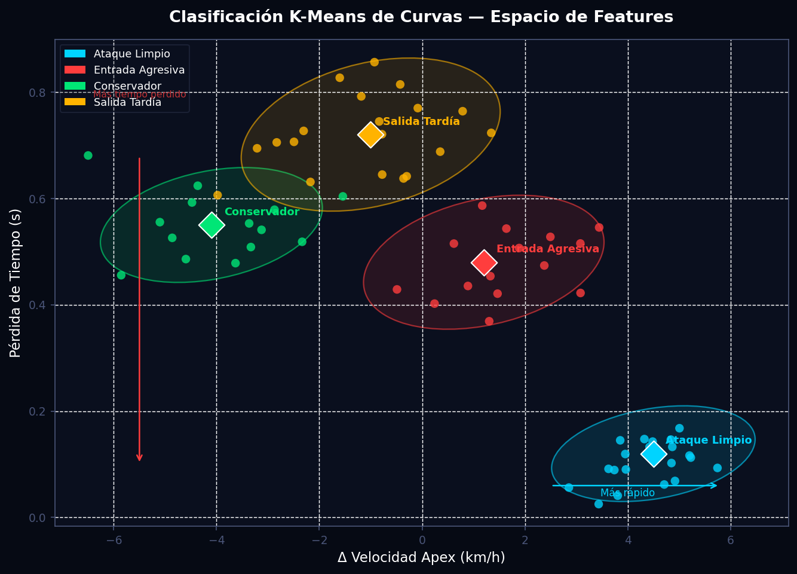
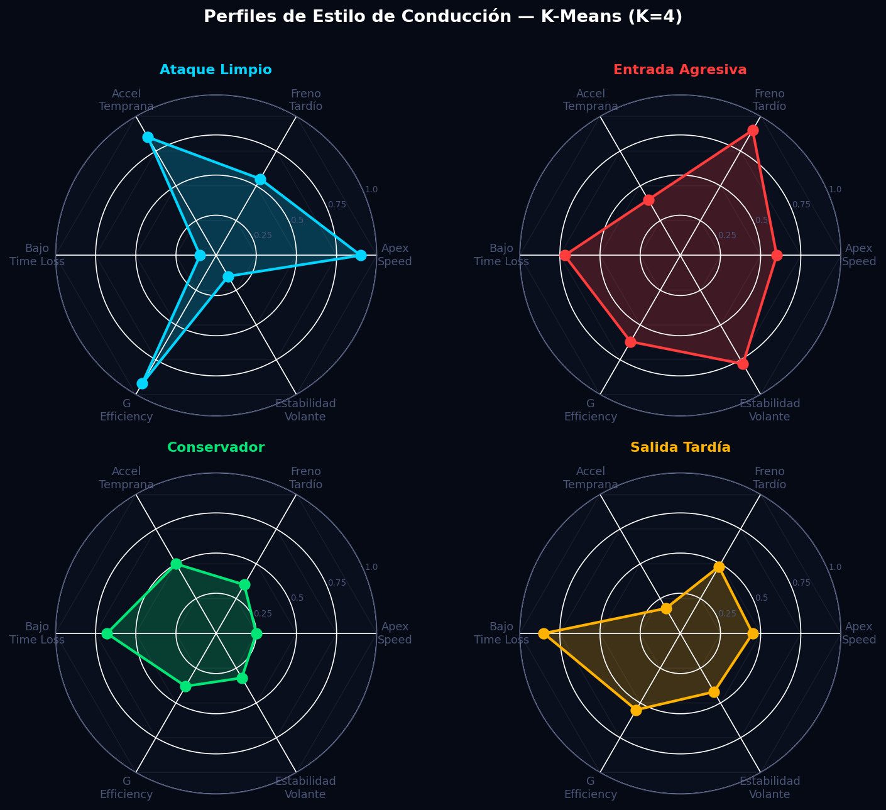
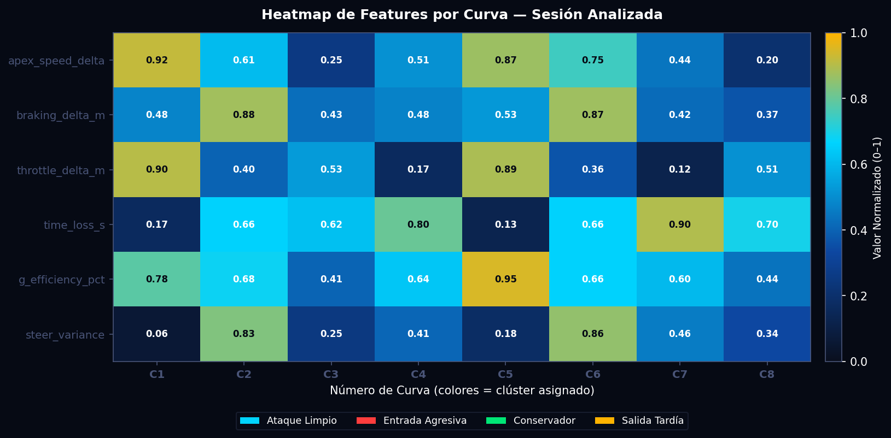

# Driving Style Classification — K-Means per Corner

🌐 [Ver en Español](./06_clustering.es.md)

> **Module:** `src/analytics/ml_clustering.py`
> **Main function:** `clasificar_curvas(df_aligned, corners, n_clusters=4)`
> **Dependencies:** `scikit-learn`, `numpy`, `pandas`

---

## Table of Contents

1. [Overview](#overview)
2. [Scientific Background](#scientific-background)
3. [Algorithm and Implementation](#algorithm-and-implementation)
4. [Key Parameters](#key-parameters)
5. [Interpreting Results](#interpreting-results)
6. [Recommendations for the Driver](#recommendations-for-the-driver)
7. [Visualizations](#visualizations)
8. [References](#references)

---

## Overview

This module automatically classifies each corner passage on the circuit into discrete driving profiles using the K-Means algorithm. For each corner, a six-metric telemetry feature vector is extracted to quantify the driver's execution relative to a reference lap: the apex speed delta, braking and throttle points, total time loss, friction circle usage efficiency, and steering wheel stability. From these vectors, K-Means groups corners with similar patterns into four distinct profiles — Clean Attack, Aggressive Entry, Conservative, and Late Exit — providing an actionable driving style map for the track engineer.

Classification operates session by session: centroids are recalculated from each session's data, enabling behavioural drift detection across the race weekend (FP → Q → R) without the need for manual retraining. Prior feature standardisation ensures no variable dominates the distance calculation simply by having a larger scale.

---

## Scientific Background

### 2.1 Corner Feature Engineering

For each corner $c$ identified in the segmentation pipeline, a feature vector of dimension 6 is constructed:

$$\mathbf{x}_c = \bigl[\Delta v_{\text{apex}},\; \Delta d_{\text{brake}},\; \Delta d_{\text{thr}},\; \Delta t_{\text{loss}},\; \bar{\eta}_{G},\; \sigma^2_{\delta}\bigr]$$

| Symbol | Feature | Definition |
|--------|---------|------------|
| $\Delta v_{\text{apex}}$ | `apex_speed_delta_kmh` | $v_{\text{driver,apex}} - v_{\text{ref,apex}}$ in km/h. Positive = driver is faster. |
| $\Delta d_{\text{brake}}$ | `braking_delta_m` | Distance to the driver's braking point minus the reference braking point in metres. Negative = brakes later (aggressive). |
| $\Delta d_{\text{thr}}$ | `throttle_delta_m` | Distance to the throttle application point minus the reference. Negative = applies throttle earlier (better exit). |
| $\Delta t_{\text{loss}}$ | `time_loss_seconds` | Accumulated time delta within the corner window (seconds). |
| $\bar{\eta}_{G}$ | `g_efficiency_pct` | Mean usage of the friction circle within the window: $\eta = \sqrt{a_x^2 + a_y^2}\,/\,a_{\max}$ expressed as a percentage. |
| $\sigma^2_{\delta}$ | `steer_variance` | Variance of the steering angle within the corner window, measured in degrees². |

The steering variance $\sigma^2_{\delta}$ is derived directly from the `SteerAngle_Fast` column of the aligned DataFrame:

$$\sigma^2_{\delta} = \frac{1}{N-1}\sum_{i=1}^{N}\bigl(\delta_i - \bar{\delta}\bigr)^2$$

The friction ellipse efficiency is averaged over the $N$ samples in the window:

$$\bar{\eta}_{G} = \frac{1}{N}\sum_{i=1}^{N}\frac{\sqrt{a_{x,i}^2 + a_{y,i}^2}}{a_{\max}}$$

### 2.2 Standardisation

Before clustering, each feature is standardised with the z-score transformation using `StandardScaler`:

$$\tilde{x}_{c,j} = \frac{x_{c,j} - \mu_j}{\sigma_j}$$

where $\mu_j$ and $\sigma_j$ are the mean and standard deviation of feature $j$ computed over all corners in the session. This ensures that features with disparate scales (metres vs. seconds vs. percentage) contribute equally to the Euclidean distance.

### 2.3 K-Means Algorithm

K-Means minimises total inertia (sum of squared intra-cluster distances):

$$W = \sum_{k=1}^{K} \sum_{\mathbf{x} \in C_k} \|\mathbf{x} - \boldsymbol{\mu}_k\|^2$$

where $C_k$ is the set of points assigned to cluster $k$ and $\boldsymbol{\mu}_k$ is the centroid of that cluster.

The algorithm alternates between two steps until convergence:

**E-step (assignment):** Each corner is assigned to the cluster whose centroid minimises the Euclidean distance in the standardised space:

$$z_c = \arg\min_{k \in \{1,\ldots,K\}} \|\tilde{\mathbf{x}}_c - \boldsymbol{\mu}_k\|^2$$

**M-step (update):** Each centroid is recomputed as the arithmetic mean of its assigned points:

$$\boldsymbol{\mu}_k = \frac{1}{|C_k|} \sum_{\mathbf{x} \in C_k} \mathbf{x}$$

The process guarantees that $W$ decreases monotonically at each iteration and converges to a local minimum.

### 2.4 Selecting the Number of Clusters (Elbow Method)

The parameter $K=4$ was selected using the elbow method: $W(K)$ is plotted for $K \in \{2, 3, \ldots, 8\}$ and the inflection point where the marginal inertia reduction diminishes significantly is identified. Formally, the search is for the $K^*$ such that:

$$\frac{W(K^*-1) - W(K^*)}{W(K^*) - W(K^*+1)} \gg 1$$

In full-lap telemetry data, $K=4$ corresponds to the four most frequent driving error archetypes in competition: entry errors, apex errors, exit errors, and nominal execution.

### 2.5 Centroid Interpretation

The module interprets each centroid $\boldsymbol{\mu}_k$ in the original space (reversing standardisation with `inverse_transform`) and applies a set of heuristic rules based on track engineering knowledge:

| Centroid condition | Assigned profile |
|---|---|
| $\Delta v_{\text{apex}} > 3$ km/h AND $\Delta d_{\text{thr}} < -5$ m AND $\Delta t < 0.2$ s | Clean Attack |
| $\Delta d_{\text{brake}} < -8$ m AND $\Delta t > 0.3$ s | Aggressive Entry |
| $\Delta v_{\text{apex}} < -3$ km/h AND $\bar{\eta}_G < 65\%$ | Conservative |
| $\Delta d_{\text{thr}} > 8$ m | Late Exit |
| $\sigma^2_{\delta} > 60$ deg² | Erratic Driving |
| $|\Delta v_{\text{apex}}| < 1$ km/h AND $\Delta t < 0.15$ s | Consistent Execution |

---

## Algorithm and Implementation

### 3.1 Execution Flow

```
clasificar_curvas(df_aligned, corners, n_clusters=4)
│
├── _build_feature_matrix(df_aligned, corners)
│   ├── For each corner: extract time window [start_distance, end_distance]
│   ├── Compute 4 deltas from corner dict (apex, brake, throttle, time_loss)
│   ├── Compute G_efficiency  → mean of G_Efficiency_Fast in the window
│   ├── Compute steer_variance → var of SteerAngle_Fast in the window
│   └── Return matrix X [n_corners × 6] and list of corner_numbers
│
├── StandardScaler.fit_transform(X)  → normalised X_sc
│
├── KMeans(n_clusters=k, random_state=42, n_init=12).fit_predict(X_sc)
│   └── labels [n_corners], cluster_centers_ [k × 6]
│
├── scaler.inverse_transform(cluster_centers_)  → centroids_orig
│
├── _interpretar_centroides(centroids_orig, k)  → dict {label_id: name}
│
└── Combine corner_number + cluster + profile + features → list of dicts
```

### 3.2 Building the Feature Matrix

The `_build_feature_matrix` method iterates over the list of `corners` generated by the segmentation pipeline. For each corner the window is extracted from the aligned DataFrame by filtering on distance:

```python
window = df_aligned[
    (df_aligned["Distance"] >= start) & (df_aligned["Distance"] <= end)
]
```

A minimum of 4 samples in the window is required (`len(window) < 4` discards the corner) to ensure that the steering variance is statistically meaningful. The first four features (`apex_delta`, `brake_delta`, `throttle_d`, `time_loss`) are read directly from the corner dictionary produced by the alignment module. The two features computed over the window are:

```python
g_eff     = float(window["G_Efficiency_Fast"].mean())   # mean over the window
steer_var = float(window["SteerAngle_Fast"].var())       # variance (ddof=1)
```

### 3.3 KMeans Parameters

```python
model = KMeans(n_clusters=k, random_state=42, n_init=12)
```

- `n_init=12`: the algorithm is restarted 12 times with different seeds and retains the lowest-inertia solution, reducing the probability of becoming trapped in a suboptimal local minimum.
- `random_state=42`: deterministic reproducibility of results across runs.
- `k = min(n_clusters, len(vectors))`: protection against $K > N$, which would make the problem ill-conditioned.

### 3.4 Storing the Result

Each result entry includes the corner number, the integer cluster index, the human-readable profile label, and the complete dictionary of rounded features:

```python
{
    "corner_number": 3,
    "cluster": 1,
    "perfil": "Entrada Agresiva — Frena tarde, salida comprometida",
    "features": {
        "apex_speed_delta_kmh": 1.2,
        "braking_delta_m": -11.3,
        "throttle_delta_m": 2.5,
        "time_loss_s": 0.412,
        "g_efficiency_pct": 61.7,
        "steer_variance": 43.8,
    }
}
```

---

## Key Parameters

| Parameter | Default value | Type | Description | Effect when modified |
|---|---|---|---|---|
| `n_clusters` | `4` | `int` | Number of K-Means clusters | Increase to 5–6 for long circuits (>12 corners) with greater corner variety; reduce to 3 for short sessions. |
| `n_init` (KMeans) | `12` | `int` | Number of algorithm restarts | Higher = more stable but slower. 12 is sufficient for N < 20 corners. |
| `random_state` | `42` | `int` | Random seed | Change only for sensitivity analysis; keep fixed for reproducibility. |
| `min_window_samples` | `4` | `int` | Minimum samples in corner window | Reduce to 2 only if the sampling rate is very low (<10 Hz). |
| Threshold `apex_d > 3` | `3.0 km/h` | `float` | Limit for classification as Clean Attack | Adjust according to average circuit speed (±1 km/h on slow circuits, ±3 km/h on fast ones). |
| Threshold `brake_d < -8` | `-8.0 m` | `float` | Limit for Aggressive Entry | Reduce to -5 m in short chicanes; increase to -12 m in high-speed braking zones. |
| Threshold `g_eff < 65` | `65%` | `float` | G efficiency limit for Conservative | Depends on tyre type and track conditions (dry/wet). |
| Threshold `thr_d > 8` | `8.0 m` | `float` | Limit for Late Exit | Reduce to 5 m on technical layouts where the exit is short. |

---

## Interpreting Results

### 5.1 Cluster Map — 2D Scatter

The visualisation projects corners onto the two most discriminating features: apex speed (X-axis) and time loss (Y-axis). The four quadrants have a direct interpretation:

- **Top-left quadrant** (low apex speed, high time loss): Conservative corners. The driver avoids risk but consistently leaves time on the table.
- **Top-right quadrant** (positive apex speed, high time loss): Aggressive Entry corners. The driver arrives quickly at the apex but compromises the exit.
- **Bottom-right quadrant** (high apex speed, low time loss): Clean Attack. The target range for every session.
- **Bottom-left quadrant** (low apex speed, moderate time): Late Exit. The penalty lies in exit traction, not at the apex.

The covariance ellipses represent the 1.8-standard-deviation spread within each cluster. A highly dispersed cluster (large ellipse) indicates **inconsistency** — the driver executes that corner differently on each lap.

### 5.2 Radar Profiles

Each axis of the radar chart represents a feature normalised between 0 (session minimum) and 1 (session maximum). A large polygon on all axes indicates a driver extracting the most from the car on every front. The most important diagnostic patterns:

| Radar pattern | Diagnosis |
|---|---|
| High "Late Brake" axis + low "Low Time Loss" axis | The driver brakes late but pays the price at exit — suboptimal trade-off. |
| Low "G Efficiency" axis + low "Apex Speed" axis | The driver is not using the available grip, possibly due to understeer or lack of confidence. |
| Low "Steering Stability" axis (high variance) | Over-correction at the apex, possibly due to oversteer or load imbalance. |
| Symmetric and compact polygon near the centre | Homogeneous but slow driving — improve all metrics in a balanced manner. |

### 5.3 Feature Heatmap per Corner

The heatmap allows immediate identification of which specific corners concentrate the problems. Values are normalised per session (0–1). Reading rules:

- **Bright amber cell in `time_loss_s`**: that specific corner is the greatest source of lost time — highest priority for work.
- **Cold cell in `g_efficiency_pct`**: the driver is not maximising tyre usage at that corner — review the line or internal reference point.
- **Warm cell in `steer_variance`**: localised steering instability — may indicate bumps, oversteer, or an incorrect braking point.
- The X-axis label colours indicate the cluster assigned to each corner, allowing visual validation of classification coherence.

### 5.4 Warning Signals

| Condition | Meaning | Recommended action |
|---|---|---|
| Same corner changes cluster between laps | High execution variability | Review the driver's internal references for that corner |
| All clusters assigned to the same profile | Insufficient data or very short session | Verify that `n_clusters <= n_corners/2` |
| `steer_variance > 80` deg² | Severe oversteer or imbalance | Setup review (balance, differential) |
| `g_efficiency_pct < 50%` across a group of corners | Systematic under-use of grip | Work on braking point and entry line |

---

## Recommendations for the Driver

### 6.1 Clean Attack

This profile is the target state. Corners in this cluster represent the driver's own execution benchmark. **Action:** Study these passages in detail — braking position, apex marks, throttle application point — and replicate that technique at the remaining corners.

### 6.2 Aggressive Entry

The driver brakes later than the reference ($\Delta d_{\text{brake}} < -8$ m) but compromises the exit. This indicates that the entry speed exceeds the car's rotation capacity, forcing the driver to unwind the wheel or maintain brake pressure through the apex.

**Actions:**
- Move the braking point 5–8 m earlier and verify whether `time_loss_s` decreases.
- Review initial brake pressure (ramp rate) — a softer initial application may allow better rotation.
- Evaluate the entry differential setting if the problem is concentrated at slow corners.

### 6.3 Conservative

The driver brakes earlier than necessary and does not reach the reference apex speed, also with low friction circle efficiency. A sign of lack of confidence or an incorrect reference point.

**Actions:**
- Work with the driver on establishing a more aggressive visual braking marker, starting with 2–3 m increments.
- Verify that the car balance on entry is neutral — entry oversteer induces involuntary conservatism.
- Analyse whether the problem recurs exclusively at fast corners (possible lack of aerodynamic load) or slow corners (car confidence).

### 6.4 Late Exit

The driver opens the throttle too late ($\Delta d_{\text{thr}} > 8$ m relative to the reference). This is the error with the greatest cumulative impact on circuits with long straights after slow corners, as the speed deficit propagates all the way to the end of the straight.

**Actions:**
- Identify whether the late application is due to fear of exit oversteer or an incorrect reference point. Review lateral acceleration telemetry at the moment of throttle application.
- Adjust the exit differential (locking) to facilitate traction at the apex.
- Use the exit line marker (outer kerb) as an absolute throttle application reference.

### 6.5 Erratic Driving

High steering variance ($\sigma^2_{\delta} > 60$ deg²) with no clear pattern in the other features. This typically indicates a setup problem or an internal driver reference that generates over-corrections.

**Actions:**
- Review simultaneous lateral acceleration data — if $a_y$ peaks correlate with steering peaks, the problem is oversteer.
- Analyse brake pressure traces: entry oversteer under braking is the most frequent cause of this signature.
- Consider increasing rear rebound damping or reducing the rear anti-roll bar.

---

## Visualizations

### Figure 1 — Corner Scatter in Feature Space



2D projection of all session corners onto the `apex_speed_delta_kmh` (X) and `time_loss_s` (Y) axes. Each point represents an individual corner; colour indicates the assigned K-Means cluster. Large diamonds mark the centroids. Ellipses represent the 1.8-standard-deviation region of each cluster. A compact cluster (small ellipse) indicates high consistency in that driving mode. The separation between the Clean Attack (cyan, bottom right) and Conservative (green, top left) centroids quantifies the driver's total improvement potential.

### Figure 2 — Radar Profiles of Each Cluster



Four radar charts (one per cluster) with the six normalised features. Each axis runs from 0 (session minimum) to 1 (session maximum). The axes are oriented so that "outward" always represents the most extreme behaviour in that dimension. The polygon footprint is the "signature" of the driving style: Clean Attack produces a polygon with high coverage on Apex Speed, Early Throttle, and G Efficiency; Aggressive Entry stands out only on the Late Brake axis; Conservative presents a uniformly small polygon.

### Figure 3 — Feature Heatmap per Corner



Colour matrix where columns are the circuit corners (C1–C8) and rows are the six features. Values are normalised between 0 (dark blue) and 1 (amber). The X-axis label colour indicates the cluster assigned to that corner: cyan = Clean Attack, red = Aggressive Entry, green = Conservative, amber = Late Exit. Allows immediate identification of which corners concentrate the greatest time loss and which feature is responsible.

---

## References

1. **Lloyd, S.P. (1982).** Least squares quantization in PCM. *IEEE Transactions on Information Theory*, 28(2), 129–137. — Original formulation of the K-Means algorithm and proof of convergence.

2. **Arthur, D. & Vassilvitskii, S. (2007).** k-means++: The advantages of careful seeding. *Proceedings of the 18th Annual ACM-SIAM Symposium on Discrete Algorithms*, 1027–1035. — Centroid initialisation method used by scikit-learn as the basis for multiple `n_init` runs.

3. **Milligan, G.W. & Cooper, M.C. (1985).** An examination of procedures for determining the number of clusters in a data set. *Psychometrika*, 50(2), 159–179. — Evaluation of the elbow method and quantitative criteria for K selection.

4. **Ogata, H., Yoshida, T., & Nakayama, S. (2014).** Driver behavior classification based on machine learning using vehicle driving data. *IEEE Intelligent Vehicles Symposium Proceedings*, 925–930. — Application of K-Means to driving style classification with features extracted from vehicle telemetry.

5. **Beckman, B. (1991).** The physics of racing. *Carroll Smith Consulting.* — Physical basis for the friction circle model (acceleration ellipse) and its relationship to cornering speed and driving efficiency.

---

*This document is a translation of [06_clustering.es.md](./06_clustering.es.md). The original Spanish version is the authoritative source; in case of discrepancy, the Spanish version prevails.*
