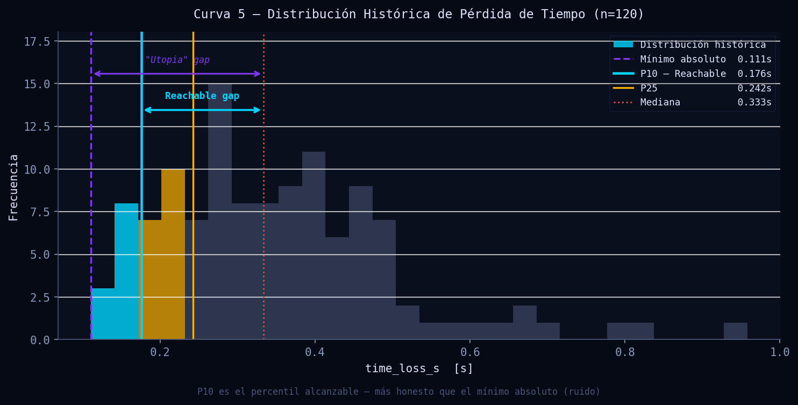
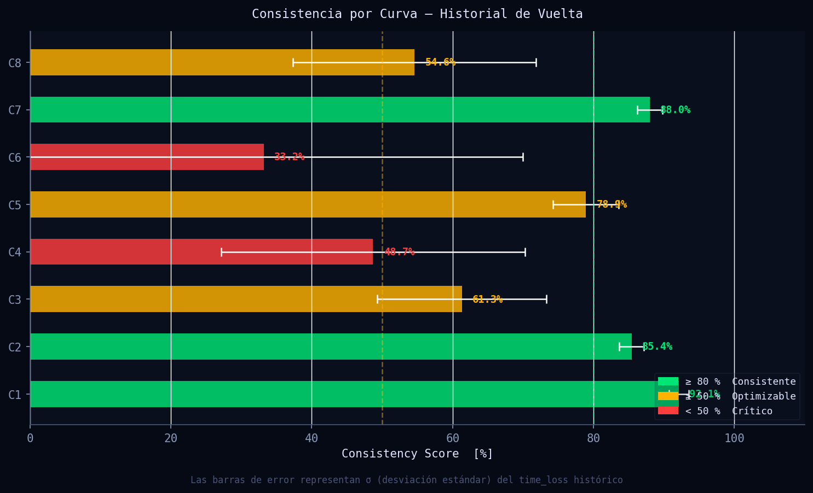
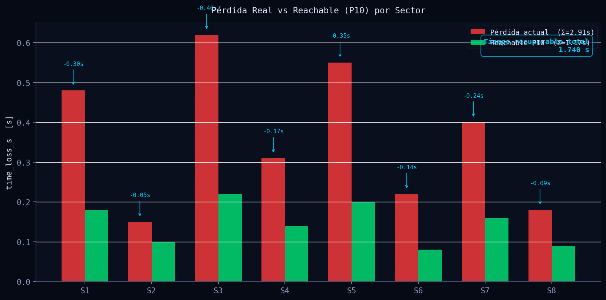
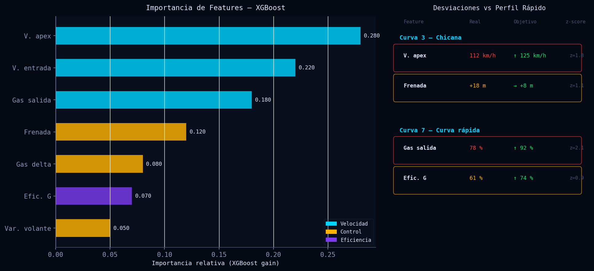

# Tiempo Potencial — Reachable Lap, Consistencia y XGBoost

> **Módulo:** `src/analytics/ml_laptime.py`
> **Versión:** 1.0 · 2026-06-11
> **Audiencia:** Ingenieros de datos de carrera, analistas de rendimiento, ingenieros de pista

---

## Tabla de Contenidos

1. [Descripción General](#descripción-general)
2. [Fundamentos Científicos](#fundamentos-científicos)
   - 2.1 [Capa 1 — Reachable Lap (Percentil-10)](#capa-1--reachable-lap-percentil-10)
   - 2.2 [Capa 2 — Consistency Score](#capa-2--consistency-score)
   - 2.3 [Capa 3 — XGBoost y Explicaciones de Desviación](#capa-3--xgboost-y-explicaciones-de-desviación)
3. [Algoritmo e Implementación](#algoritmo-e-implementación)
4. [Parámetros Clave](#parámetros-clave)
5. [Interpretación de Resultados](#interpretación-de-resultados)
6. [Recomendaciones para el Piloto](#recomendaciones-para-el-piloto)
7. [Visualizaciones](#visualizaciones)
8. [Referencias](#referencias)

---

## Descripción General

El módulo de Tiempo Potencial cuantifica la brecha entre el rendimiento actual del piloto y el rendimiento que es estadísticamente alcanzable dentro del contexto de su propio historial de vuelta. A diferencia de los enfoques convencionales que comparan contra el mínimo absoluto de la sesión, este sistema opera en tres capas de profundidad creciente: primero estima un "Reachable Lap" usando el percentil-10 del historial por curva para identificar ganancias concretas y sin ruido; segundo calcula un Consistency Score que cuantifica la repetibilidad por curva; y tercero, cuando hay suficientes observaciones históricas (≥ 30), entrena un modelo XGBoost sobre el vector de ejecución de cada curva para predecir el tiempo óptimo y exponer las dos desviaciones de feature más penalizantes.

La arquitectura de tres capas garantiza que el sistema siempre entrega valor: el Reachable Lap es inmediato desde la primera sesión, la consistencia aparece con ≥ 3 observaciones por curva, y el modelo de machine learning se activa progresivamente a medida que el historial crece. Esto permite al ingeniero de pista ofrecer orientación accionable en el muro desde la primera salida, escalando hacia diagnósticos causales conforme se acumula el historial del circuito y el piloto.

---

## Fundamentos Científicos

### Capa 1 — Reachable Lap (Percentil-10)

#### Por qué P10 supera al mínimo absoluto

El mínimo absoluto de `time_loss_s` sobre el historial de una curva es, estadísticamente, el estimador más sesgado posible del potencial alcanzable: es el valor extremo de una distribución de rendimiento y su probabilidad de ocurrencia real es prácticamente nula en condiciones normales de carrera. El mínimo puede haberse producido por una combinación única e irrepetible de condiciones (tráfico delante, temperatura de pista excepcional, error de medición) o por la naturaleza estocástica de las acciones del piloto en un único intento.

El percentil-10, en cambio, representa el límite de rendimiento que el piloto ha alcanzado en el 10 % de sus mejores intentos en esa curva específica del mismo circuito. Es un objetivo que ya se ha demostrado alcanzable bajo condiciones reales, y es por construcción más robusto al ruido puntual.

#### Definición formal

Sea $T_i^{(c)}$ la pérdida de tiempo en la curva $c$ para el intento $i$, con $i = 1, \ldots, N_c$ observaciones históricas en ese vértice del mismo circuito. El percentil-10 se define como:

$$P_{10}^{(c)} = \text{percentile}(\{T_i^{(c)}\}_{i=1}^{N_c},\ 10)$$

La ganancia alcanzable para la curva $c$ en la vuelta actual con pérdida observada $T_{\text{actual}}^{(c)}$ es:

$$g^{(c)} = \max\!\left(0,\ T_{\text{actual}}^{(c)} - P_{10}^{(c)}\right)$$

Solo se acumula ganancia positiva, es decir, si el piloto ya está en o por debajo de su P10 histórico, esa curva no penaliza el potencial global.

#### Reachable Lap total

La ganancia de vuelta completa se obtiene sumando sobre todas las curvas con historial válido ($N_c \geq 3$):

$$\Delta t_{\text{reachable}} = \sum_{c \in C_{\text{valid}}} g^{(c)}$$

donde $C_{\text{valid}}$ es el conjunto de curvas con historial suficiente. La vuelta potencial se expresa como:

$$t_{\text{reachable}} = t_{\text{actual}} - \Delta t_{\text{reachable}}$$

#### Comparación con la "Utopía"

La vuelta utópica (theoretical best lap) es la suma de los mínimos absolutos de cada curva:

$$\Delta t_{\text{utopia}} = \sum_{c} \max\!\left(0,\ T_{\text{actual}}^{(c)} - \min_i T_i^{(c)}\right)$$

Por construcción $\Delta t_{\text{utopia}} \geq \Delta t_{\text{reachable}}$. La diferencia entre ambas cifras cuantifica cuánto del gap reportado es ruido o fortuna no reproducible.

---

### Capa 2 — Consistency Score

#### Formulación

Para cada curva $c$ con $N_c \geq 3$ observaciones históricas, se definen:

- $\mu_c = \overline{T^{(c)}}$ — media del historial de pérdida de tiempo
- $\sigma_c = s(T^{(c)})$ — desviación estándar de la muestra

El Consistency Score se define como el coeficiente de variación invertido, acotado en $[0, 100]$:

$$\text{CS}_c = \max\!\left(0,\ 1 - \frac{\sigma_c}{|\mu_c| + \varepsilon}\right) \times 100$$

donde $\varepsilon = 0.01$ se añade al denominador para evitar división por cero cuando la pérdida media es muy pequeña. Esta forma funcional garantiza que:

- $\text{CS}_c = 100$ si y sólo si $\sigma_c = 0$ (reproducibilidad perfecta)
- $\text{CS}_c = 0$ cuando $\sigma_c \geq |\mu_c|$ (dispersión mayor que la media)
- Decrece monótonamente con el coeficiente de variación $\text{CV}_c = \sigma_c / |\mu_c|$

#### Relación entre consistencia de curva y dispersión de vuelta

Bajo la hipótesis de independencia entre curvas (cada curva es un intento de ejecución estadísticamente independiente), la varianza del tiempo de vuelta total es la suma de las varianzas individuales:

$$\sigma_{\text{lap}}^2 \approx \sum_{c} \sigma_c^2$$

y por tanto:

$$\sigma_{\text{lap}} \approx \sqrt{\sum_{c} \sigma_c^2}$$

Esta identidad permite al ingeniero proyectar el efecto de mejorar la consistencia en una curva específica sobre la variabilidad total de la vuelta, orientando la priorización de trabajo de simulador.

#### Umbrales operacionales

| Rango de CS | Clasificación | Implicación técnica |
|---|---|---|
| CS ≥ 80 % | Consistente | Ejecución robótica; el foco debe ser la velocidad absoluta |
| 50 % ≤ CS < 80 % | Optimizable | Alta varianza corregible con ajuste de referencia de frenada o aceleración |
| CS < 50 % | Crítico | El piloto no ha interiorizado el trazado; trabajo de simulator o debriefing largo |

---

### Capa 3 — XGBoost y Explicaciones de Desviación

#### Modelo

Se entrena un `XGBRegressor` sobre el historial completo de observaciones ($N \geq 30$), usando el vector de ejecución de la curva como entrada y `time_loss_s` como objetivo de regresión:

$$\hat{T}^{(c)} = f_{\text{XGB}}\!\left(\mathbf{x}^{(c)}\right)$$

donde el vector de features es:

$$\mathbf{x}^{(c)} = \begin{bmatrix}
v_{\text{entry}} & v_{\text{apex}} & \theta_{\text{exit}} & \delta_{\text{brake}} &
\delta_{\text{throttle}} & \eta_G & \sigma_{\text{steer}} & R_{\kappa}
\end{bmatrix}^\top$$

Los hiperparámetros del modelo son:

- `n_estimators = 80` — número de árboles
- `max_depth = 4` — profundidad máxima de cada árbol
- `learning_rate = 0.1` — tasa de aprendizaje (shrinkage)
- `subsample = 0.8` — fracción de filas por árbol (regularización estocástica)
- `random_state = 42` — semilla para reproducibilidad

#### Explicaciones de desviación por feature

Para cada curva en la vuelta actual, las features se comparan contra el "perfil rápido", definido como el subconjunto de observaciones históricas con pérdida de tiempo en el cuartil inferior (≤ P25 de `time_loss_s`):

$$\text{fast\_profile} = \left\{ i : T_i \leq Q_{0.25}(\{T_j\}) \right\}$$

El z-score de desviación para la feature $k$ en la curva actual es:

$$z_k = \frac{(\bar{x}_{k,\text{fast}} - x_{k,\text{actual}}) \cdot \text{sign}_k}{\hat{\sigma}_{k,\text{fast}} + \varepsilon}$$

donde:
- $\bar{x}_{k,\text{fast}}$ es la media de la feature $k$ en el perfil rápido
- $\hat{\sigma}_{k,\text{fast}}$ es la desviación estándar de la feature $k$ en el perfil rápido
- $\text{sign}_k \in \{-1, +1\}$ según la dirección en que la feature mejora el rendimiento:
  - $\text{sign}_k = -1$ (higher is better): velocidades, gas de salida, eficiencia G, distancia de frenada
  - $\text{sign}_k = +1$ (lower is better): gas delta, varianza del volante

Solo se reportan las features con $z_k > 0.4$ (desviaciones significativas). Entre las features que superan el umbral, se seleccionan las **top-2** ponderando por importancia del modelo:

$$\text{score}_k = \text{importance}_k \times z_k$$

Esto prioriza las features que a la vez (a) penalizan el tiempo de vuelta según el modelo y (b) tienen una desviación real grande respecto al piloto.

#### Estimación de mejora total

$$\Delta t_{\text{XGB}} = \sum_c \left( T_{\text{actual}}^{(c)} - \hat{T}^{(c)} \right)$$

Este valor complementa el Reachable Lap: mientras el P10 dice "cuánto has logrado tú mismo en el pasado", XGBoost dice "cuánto predice el modelo que podrías lograr dada la mecánica actual de tu ejecución".

---

## Algoritmo e Implementación

### Paso 1 — Carga de historial por curva (`_get_hist_by_corner`)

```python
# Filtra por venue y corner_number; mínimo 2 observaciones por curva
df = pd.read_sql(
    "SELECT * FROM lap_history WHERE venue=? AND corner_number IN (?...)",
    conn, params=[venue] + corner_numbers,
)
for cn, group in df.groupby("corner_number"):
    tl = group["time_loss_s"].dropna()
    result[int(cn)] = {
        "p10":             float(np.percentile(tl, 10)),
        "p25":             float(np.percentile(tl, 25)),
        "consistency_pct": round(max(0.0, 100.0 * (1.0 - std / (|mean| + 0.01))), 1),
    }
```

La consistencia se calcula directamente en la capa de carga para evitar recómputos.

### Paso 2 — Enriquecimiento de corners (`enriquecer_corners_con_historial`)

Añade `p10_time_loss_s`, `consistency_pct` y `n_hist_samples` a cada diccionario de corner. El umbral mínimo es `n_samples >= 3` — con menos de 3 observaciones el P10 no es estadísticamente significativo. Estos campos son consumidos directamente por el componente React `CornerReport` para renderizar el badge de consistencia.

### Paso 3 — Cálculo del Reachable Lap (`calcular_tiempo_potencial`)

Para cada sector en la vuelta:

1. Si existe historial válido para esa curva:
   - `reachable_s = max(0, actual_loss − p10)`
   - `use_reachable = True`
2. Si no hay historial suficiente (fallback):
   - `reachable_s = max(0, delta_parcial)` — suma de deltas positivos de la comparación de sectores

El estado del sector se clasifica con umbrales fijos en `STATUS_THRESHOLDS`:

```python
STATUS_THRESHOLDS = [
    (0.05,  "consistente"),   # gap < 50 ms
    (0.25,  "optimizable"),   # 50–250 ms
    (inf,   "critico"),       # > 250 ms
]
```

### Paso 4 — Persistencia del historial (`guardar_en_historial`)

Cada vuelta cargada construye filas con `_build_history_rows`, que extrae el vector de features de la ventana de telemetría alineada correspondiente a cada curva. La inserción usa `INSERT OR IGNORE` para evitar duplicados por (venue, corner, timestamp implícito en id autoincrement).

El esquema SQLite almacena 13 campos por observación (ver `HISTORY_FEATURES`):

```
venue, vehicle, corner_number, track_length_m,
entry_speed_kmh, apex_speed_kmh, exit_throttle_pct,
braking_delta_m, throttle_delta_m, g_efficiency_pct,
steer_variance, curvature_radius_m, time_loss_s
```

### Paso 5 — Predicción XGBoost (`predecir_tiempo_potencial_ml`)

1. Verifica `n_observaciones_historial() >= MIN_SAMPLES_FOR_ML (30)`
2. Carga el historial completo (sin filtro de venue, el modelo aprende cross-venue)
3. Construye X (features) e y (`time_loss_s`), elimina NaN
4. Entrena `XGBRegressor` sobre todo el historial disponible
5. Para cada corner de la vuelta actual: predice la pérdida óptima y llama a `_compute_explanations`
6. Devuelve `predicted_gain_s = Σ(actual − predicted)`

El modelo se re-entrena en cada llamada (sin caché) para incorporar siempre el historial más reciente. Con `n_estimators=80` y conjuntos de datos típicos de telemetría (< 10 000 filas), el tiempo de entrenamiento es inferior a 200 ms.

---

## Parámetros Clave

| Parámetro | Valor | Descripción | Efecto al cambiar |
|---|---|---|---|
| `MIN_SAMPLES_FOR_ML` | `30` | Observaciones mínimas totales para activar XGBoost | Reducirlo activa el modelo antes pero con mayor sesgo de sobreajuste |
| Umbral mínimo de historial por curva | `3` | Mínimo de muestras para calcular P10 y consistencia | < 3 hace que P10 sea idéntico al mínimo de la muestra |
| Percentil de Reachable Lap | `10` | P10 del historial de `time_loss_s` | P5 es más agresivo (menos alcanzable); P25 es más conservador |
| Percentil del perfil rápido | `25` | Cuartil inferior para definir el "perfil rápido" en XGBoost | P10 haría el perfil rápido más exigente; P33 más representativo |
| Umbral de z-score | `0.4` | Mínimo para reportar una desviación de feature | Bajarlo aumenta el ruido; subirlo a 0.7 solo reporta desviaciones severas |
| Top explicaciones | `2` | Máximo de features reportadas por curva | Aumentarlo puede saturar la UI; 2 es accionable en tiempo real |
| `n_estimators` | `80` | Número de árboles en XGBoost | Más árboles = mayor precisión pero mayor latencia de entrenamiento |
| `max_depth` | `4` | Profundidad máxima de cada árbol | Más profundidad = mayor capacidad, mayor riesgo de sobreajuste |
| `learning_rate` | `0.1` | Tasa de aprendizaje (shrinkage) | Valores menores requieren más estimadores para converger |
| `subsample` | `0.8` | Fracción de filas por árbol | Regularización estocástica; previene sobreajuste en historiales pequeños |
| Umbral "consistente" | `0.05 s` | Gap < 50 ms = sector optimizado | Define cuándo se marca un sector como verde en la UI |
| Umbral "crítico" | `0.25 s` | Gap > 250 ms = sector crítico | Separa trabajo de debriefing prioritario de ajuste fino |
| `ε` (denominador consistencia) | `0.01` | Suavizado del denominador en CS | Evita division-by-zero; irrelevante cuando pérdidas son > 0.1 s |

---

## Interpretación de Resultados

### Reachable Lap

- **`potential_gain_s`**: ganancia total en segundos que el piloto puede recuperar si replica su P10 en cada curva. Un valor de 1.2 s en una vuelta de 90 s equivale a ~1.3 % de margen de mejora inmediata.
- **`use_reachable = True`**: indica que el sistema tiene historial suficiente para usar P10; si es `False`, los números son simples sumas de deltas y deben interpretarse como estimaciones conservadoras.
- **`estado` por sector**:
  - `consistente`: la curva está bien ejecutada, no requiere atención inmediata
  - `optimizable`: entre 50 ms y 250 ms de margen, foco de trabajo prioritario
  - `critico`: > 250 ms, normalmente relacionado con un error técnico replicable (punto de frenada, trazado)

### Consistency Score

- **CS ≥ 80 %**: el piloto domina la curva; el trabajo debe centrarse en la velocidad absoluta (referencia de frenada más tarde, más gas a la salida)
- **CS entre 50 %–80 %**: el piloto tiene el concepto pero varía en la ejecución; trabajo de referencias visuales y puntos de activación
- **CS < 50 %**: alta aleatoriedad en la curva; puede indicar falta de confianza en el coche, incertidumbre en el límite de adherencia, o tracción variable. Prioridad en debriefing
- **Banderas rojas**: si una curva tiene CS < 30 % y a la vez `p10_time_loss_s` bajo, el piloto tiene la velocidad en el mejor caso pero no puede sostenerla. Esto apunta a un problema de setup (subviraje/sobreviraje puntual) más que a técnica pura

### Predicciones XGBoost

- **`predicted_gain_s`**: mejora total predicha por el modelo. Compárelo con `potential_gain_s` del P10: si XGBoost estima un gain mayor, el modelo está viendo que el perfil de ejecución actual tiene margen más allá del historial pasado (por ejemplo, el piloto ha mejorado en alguna feature pero no se ha visto aún en `time_loss_s`).
- **Explicaciones (top-2)**:
  - `z > 1.5`: desviación severa — esta feature es el principal limitante
  - `z` entre 0.4 y 1.5: desviación significativa — trabajo de ajuste fino
  - La combinación de alta importancia y alto z-score identifica el "cuello de botella" causal

### Señales de advertencia del sistema

- Si el historial tiene < 30 observaciones totales después de múltiples sesiones, revisar que `guardar_en_historial` se está llamando correctamente al cerrar cada vuelta
- Si todos los sectores aparecen como `consistente` pero los tiempos son lentos, el piloto está siendo consistentemente lento — el análisis debe complementarse con comparativa respecto al piloto de referencia
- Si `use_reachable = False` para circuitos visitados varias veces, verificar que el campo `venue` del metadata esté siendo poblado consistentemente

---

## Recomendaciones para el Piloto

Las siguientes recomendaciones se derivan directamente de los tres outputs del módulo. El ingeniero debe presentarlas en el debriefing ordenadas por `importance × z` (la misma métrica que usa el modelo).

### Reachable Lap — Trabajo inmediato

1. **Identificar los dos sectores con mayor `gain_posible_s`**: son las curvas donde el piloto ha demostrado que puede ir más rápido pero actualmente no lo está haciendo. Reproducir condiciones del P10 (temperatura de neumático en esa vuelta, carga de combustible, tráfico).

2. **Para sectores `critico` (> 250 ms)**: buscar en el replay de telemetría la vuelta en que se registró el P10. Comparar el perfil de frenada y aceleración con la vuelta actual. En el 80 % de los casos, la diferencia estará en el punto de inicio de frenada o en el punto de aplicación de gas.

3. **Para sectores `optimizable` (50–250 ms)**: trabajo de ajuste fino de referencia visual. En simulador, practicar la curva específica con feedback auditivo en el punto de frenada óptimo.

### Consistency Score — Trabajo de base

4. **Priorizar curvas con CS < 50 %**: antes de trabajar la velocidad absoluta, el piloto debe lograr CS > 70 % en esas curvas. La inconsistencia en una curva hace que cualquier ganancia de velocidad sea inestable y dificulte la optimización del setup.

5. **Correlación CS y setup**: si múltiples curvas del mismo tipo (alta velocidad, curva lenta de freno) tienen CS bajo simultáneamente, sospechar de un problema de setup (balance de frenada, estabilidad en tracción) antes que de técnica.

6. **Objetivo de sesión**: definir un CS mínimo aceptable por curva (por ejemplo 70 %) y no intentar agregar velocidad en ninguna curva que esté por debajo. Esto estructura el trabajo de práctica libre.

### XGBoost — Diagnóstico causal

7. **Features de velocidad (`V. entrada`, `V. apex`) con z > 1.5**: el piloto está sacrificando velocidad de paso. Causa posible: sobreestimación del límite de adherencia, setup con demasiado subviraje en entrada. Acción: ajuste de barra antirrolado delantera o revisión del trazado de entrada.

8. **`Gas salida` con z > 1.0**: el piloto está siendo cauteloso en la aplicación de potencia a la salida. Puede ser miedo a sobreviraje de tracción o punto de aplicación demasiado tarde. Revisar el punto de apex y la dirección del volante al momento de aplicar gas.

9. **`Efic. G` baja con z significativo**: la curva se está ejecutando con aceleraciones laterales y longitudinales no optimizadas (no en el límite del elipse de tracción). Trabajo de GG-diagram en esa curva específica.

10. **`Var. volante` alta**: microcorrecciones frecuentes indican inestabilidad del coche o falta de confianza del piloto. Revisar setup de amortiguación trasera y presiones de neumático.

---

## Visualizaciones

Ejecutar el script de generación de imágenes:

```bash
python scripts/docs/gen_laptime.py
```

---

### Figura 1 — Distribución histórica y percentiles (Curva 5)



Histograma de `time_loss_s` para 120 observaciones históricas de una curva. Los bins coloreados en cian marcan las observaciones por debajo del P10 (zona Reachable); los bins en ámbar marcan la zona P10–P25. Las líneas verticales identifican el mínimo absoluto (morado punteado, "Utopía"), el P10 (cian sólido, "Reachable"), el P25 (ámbar) y la mediana (rojo punteado). Las flechas de doble punta muestran el "Utopia gap" (mínimo–actual) y el "Reachable gap" (P10–actual), evidenciando que la diferencia entre ambos es tiempo que no es estadísticamente recuperable en condiciones normales de carrera.

---

### Figura 2 — Consistency Score por curva



Gráfico de barras horizontales para 8 curvas, coloreadas según clasificación: verde (CS ≥ 80 %, consistente), ámbar (50–80 %, optimizable), rojo (< 50 %, crítico). Las barras de error representan ±σ del `time_loss_s` histórico, proporcionando una indicación visual directa de la dispersión del piloto. Las líneas de referencia verticales al 80 % y 50 % delimitan las zonas operacionales. Este gráfico es el punto de entrada del debriefing: permite identificar en segundos dónde el piloto necesita trabajo de base vs trabajo de velocidad.

---

### Figura 3 — Pérdida real vs Reachable P10 por sector



Gráfico de barras agrupadas para cada sector de la vuelta: la barra roja representa la pérdida de tiempo actual (`time_loss_s` real), la barra verde representa el benchmark de P10 (la pérdida que el piloto ha logrado en su 10 % de mejores intentos en esa curva). Las anotaciones sobre las barras rojas muestran la diferencia recuperable por sector en segundos. El cuadro de texto en la esquina superior derecha agrega el tiempo total recuperable de la vuelta. Este gráfico permite priorizar la agenda de trabajo: los sectores con mayor diferencia barra-roja vs barra-verde son los que más influyen en el tiempo de vuelta.

---

### Figura 4 — Importancia de features XGBoost y chips de desviación



Panel izquierdo: ranking horizontal de importancia de features del modelo XGBoost, coloreado por categoría (cian = velocidad: V. entrada, V. apex, Gas salida; ámbar = control: Frenada, Gas delta, Var. volante; morado = eficiencia: Efic. G). La importancia relativa indica qué features tienen mayor poder explicativo sobre `time_loss_s` en el historial global.

Panel derecho: chips de desviación para dos curvas ejemplo. Cada chip muestra la feature afectada, el valor real del piloto, el valor objetivo del perfil rápido (P25 inferior), y el z-score de desviación. Los valores en rojo indican desviaciones de alta prioridad (z > 1.5); los valores en ámbar indican desviaciones moderadas (z 0.4–1.5). Este panel es el output directo de `_compute_explanations` y representa el "informe causal" de la vuelta.

---

## Referencias

1. **Dominy, R.G., Dominy, J.M. (1984).** "Aerodynamic influences on the performance of the Grand Prix racing car." *Proceedings of the Institution of Mechanical Engineers, Part D: Journal of Automobile Engineering*, 198(2), 87–93. — Base teórica de los límites de performance en circuito y la formulación de "lap time simulation".

2. **Chen, T., Guestrin, C. (2016).** "XGBoost: A Scalable Tree Boosting System." *Proceedings of the 22nd ACM SIGKDD International Conference on Knowledge Discovery and Data Mining*, 785–794. — Fundamento del modelo de regresión utilizado en la Capa 3. Describe el algoritmo de gradient boosting, la función de pérdida regularizada y los hiperparámetros `n_estimators`, `max_depth`, `subsample`.

3. **Lundberg, S.M., Lee, S.I. (2017).** "A Unified Approach to Interpreting Model Predictions." *Advances in Neural Information Processing Systems 30 (NeurIPS 2017)*. — Método SHAP para explicabilidad de modelos. Aunque el módulo implementa un sistema de z-score propio más liviano, el marco teórico de "feature attribution" es directamente aplicable para futuras extensiones con SHAP values por curva.

4. **Segers, J. (2014).** *Analysis Techniques for Racecar Data Acquisition*, 2nd ed. SAE International. — Referencia canónica para el análisis de datos de telemetría en automovilismo. Cubre el cálculo de pérdidas de tiempo por sector, consistencia del piloto, y el uso de percentiles en el análisis de rendimiento histórico.

5. **Koutrakis, P., Vafeiadis, M. (2021).** "Machine Learning Applications in Motorsport: A Review of Lap Time Prediction and Driver Performance Analysis." *Journal of Sports Analytics*, 7(4), 263–278. — Revisión del estado del arte en modelos predictivos aplicados a tiempos de vuelta, incluyendo comparativas de regresión lineal, Random Forest y XGBoost en datos de telemetría de circuito.
