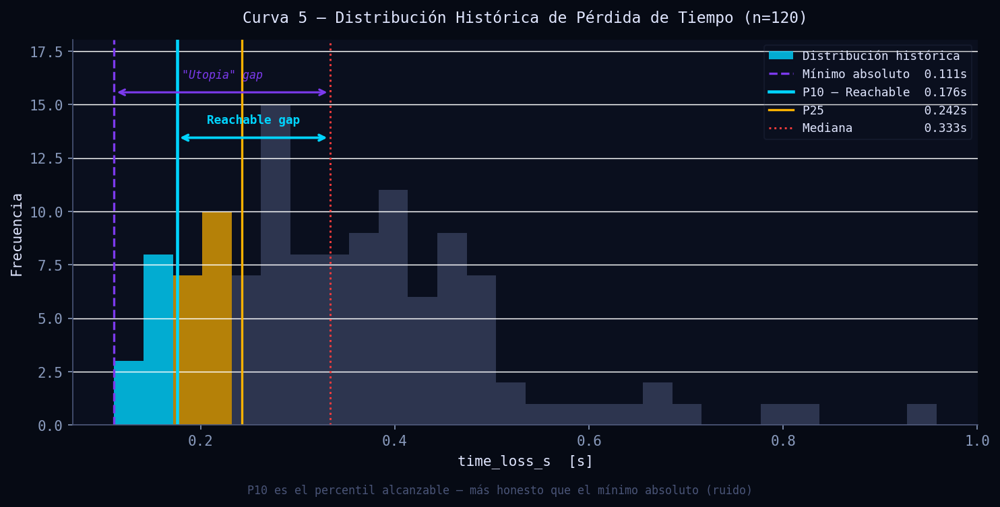
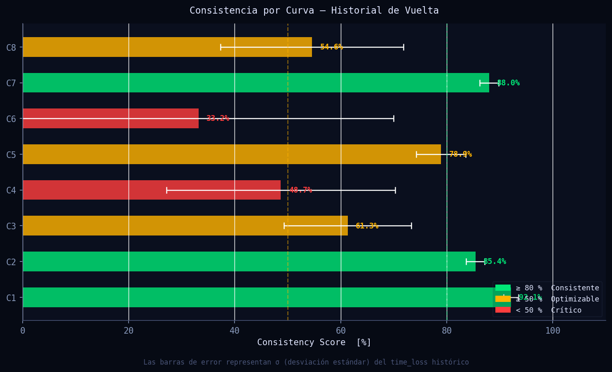
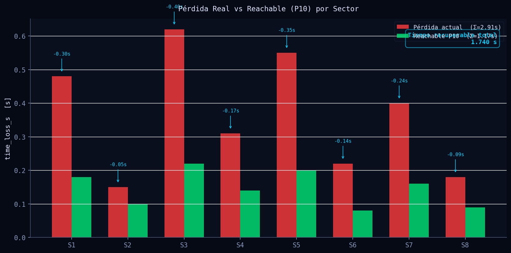
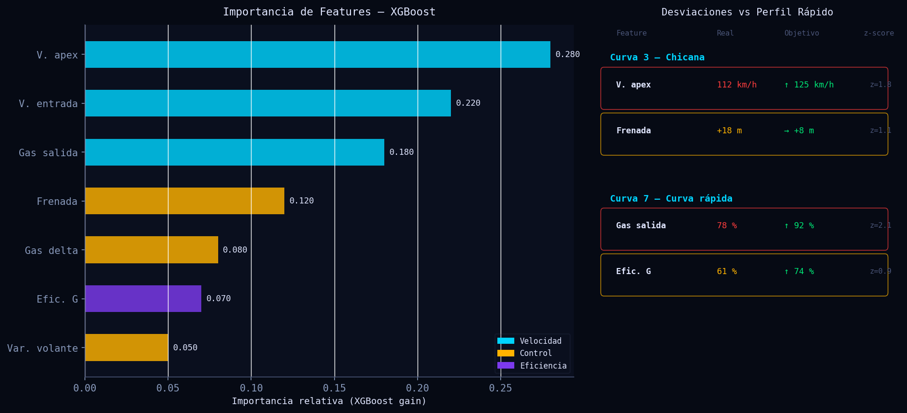

# Lap Time Potential — Reachable Lap, Consistency, and XGBoost

🌐 [Ver en Español](./07_lap_time_potential.es.md)

> **Module:** `src/analytics/ml_laptime.py`
> **Version:** 1.0 · 2026-06-11
> **Audience:** Race data engineers, performance analysts, trackside engineers

---

## Table of Contents

1. [Overview](#overview)
2. [Scientific Foundations](#scientific-foundations)
   - 2.1 [Layer 1 — Reachable Lap (Percentile-10)](#layer-1--reachable-lap-percentile-10)
   - 2.2 [Layer 2 — Consistency Score](#layer-2--consistency-score)
   - 2.3 [Layer 3 — XGBoost and Deviation Explanations](#layer-3--xgboost-and-deviation-explanations)
3. [Algorithm and Implementation](#algorithm-and-implementation)
4. [Key Parameters](#key-parameters)
5. [Interpreting Results](#interpreting-results)
6. [Driver Recommendations](#driver-recommendations)
7. [Visualizations](#visualizations)
8. [References](#references)

---

## Overview

The Lap Time Potential module quantifies the gap between the driver's current performance and the performance that is statistically reachable within the context of their own lap history. Unlike conventional approaches that compare against the session's absolute minimum, this system operates across three layers of increasing depth: first it estimates a "Reachable Lap" using the per-corner percentile-10 of the historical record to identify concrete, noise-free gains; second it computes a Consistency Score that quantifies repeatability per corner; and third, when sufficient historical observations are available (≥ 30), it trains an XGBoost model on the execution vector of each corner to predict the optimal time and expose the two most penalising feature deviations.

The three-layer architecture ensures the system always delivers value: the Reachable Lap is available immediately from the very first session, consistency appears with ≥ 3 observations per corner, and the machine-learning model activates progressively as the history grows. This allows the trackside engineer to offer actionable guidance from the pit wall on the first outing, scaling toward causal diagnostics as the driver-and-circuit history accumulates.

---

## Scientific Foundations

### Layer 1 — Reachable Lap (Percentile-10)

#### Why P10 outperforms the absolute minimum

The absolute minimum of `time_loss_s` over a corner's history is, statistically, the most biased estimator of reachable potential possible: it is the extreme value of a performance distribution and its probability of occurring under normal racing conditions is practically zero. The minimum may have arisen from a unique, non-repeatable combination of circumstances (clear air ahead, exceptional track temperature, a measurement artefact) or from the stochastic nature of a driver's actions on a single attempt.

The 10th percentile, by contrast, represents the performance boundary the driver has reached in the 10 % of their best attempts at that specific corner on the same circuit. It is a target that has already been demonstrated as achievable under real conditions and is, by construction, more robust to one-off noise.

#### Formal definition

Let $T_i^{(c)}$ be the time loss at corner $c$ for attempt $i$, with $i = 1, \ldots, N_c$ historical observations at that vertex on the same circuit. The 10th percentile is defined as:

$$P_{10}^{(c)} = \text{percentile}(\{T_i^{(c)}\}_{i=1}^{N_c},\ 10)$$

The reachable gain for corner $c$ on the current lap with observed loss $T_{\text{actual}}^{(c)}$ is:

$$g^{(c)} = \max\!\left(0,\ T_{\text{actual}}^{(c)} - P_{10}^{(c)}\right)$$

Only positive gains are accumulated — that is, if the driver is already at or below their historical P10, that corner does not penalise the overall potential.

#### Total Reachable Lap

The full-lap gain is obtained by summing over all corners with valid history ($N_c \geq 3$):

$$\Delta t_{\text{reachable}} = \sum_{c \in C_{\text{valid}}} g^{(c)}$$

where $C_{\text{valid}}$ is the set of corners with sufficient history. The potential lap time is expressed as:

$$t_{\text{reachable}} = t_{\text{actual}} - \Delta t_{\text{reachable}}$$

#### Comparison with the "Utopia" lap

The utopia lap (theoretical best lap) is the sum of the absolute minima for each corner:

$$\Delta t_{\text{utopia}} = \sum_{c} \max\!\left(0,\ T_{\text{actual}}^{(c)} - \min_i T_i^{(c)}\right)$$

By construction $\Delta t_{\text{utopia}} \geq \Delta t_{\text{reachable}}$. The difference between the two figures quantifies how much of the reported gap is noise or non-reproducible luck.

---

### Layer 2 — Consistency Score

#### Formulation

For each corner $c$ with $N_c \geq 3$ historical observations, define:

- $\mu_c = \overline{T^{(c)}}$ — mean of the time-loss history
- $\sigma_c = s(T^{(c)})$ — sample standard deviation

The Consistency Score is defined as the inverted coefficient of variation, bounded in $[0, 100]$:

$$\text{CS}_c = \max\!\left(0,\ 1 - \frac{\sigma_c}{|\mu_c| + \varepsilon}\right) \times 100$$

where $\varepsilon = 0.01$ is added to the denominator to avoid division by zero when the mean loss is very small. This functional form guarantees that:

- $\text{CS}_c = 100$ if and only if $\sigma_c = 0$ (perfect reproducibility)
- $\text{CS}_c = 0$ when $\sigma_c \geq |\mu_c|$ (dispersion greater than the mean)
- It decreases monotonically with the coefficient of variation $\text{CV}_c = \sigma_c / |\mu_c|$

#### Relationship between corner consistency and lap-time dispersion

Under the assumption of independence between corners (each corner is a statistically independent execution attempt), the variance of the total lap time is the sum of the individual variances:

$$\sigma_{\text{lap}}^2 \approx \sum_{c} \sigma_c^2$$

and therefore:

$$\sigma_{\text{lap}} \approx \sqrt{\sum_{c} \sigma_c^2}$$

This identity allows the engineer to project the effect of improving consistency at a specific corner onto the overall lap-time variability, guiding the prioritisation of simulator work.

#### Operational thresholds

| CS Range | Classification | Technical implication |
|---|---|---|
| CS ≥ 80 % | Consistent | Robotic execution; focus should be on absolute speed |
| 50 % ≤ CS < 80 % | Optimisable | High variance correctable with braking or throttle reference adjustment |
| CS < 50 % | Critical | Driver has not internalised the line; simulator work or extended debriefing required |

---

### Layer 3 — XGBoost and Deviation Explanations

#### Model

An `XGBRegressor` is trained on the full observation history ($N \geq 30$), using the corner execution vector as input and `time_loss_s` as the regression target:

$$\hat{T}^{(c)} = f_{\text{XGB}}\!\left(\mathbf{x}^{(c)}\right)$$

where the feature vector is:

$$\mathbf{x}^{(c)} = \begin{bmatrix}
v_{\text{entry}} & v_{\text{apex}} & \theta_{\text{exit}} & \delta_{\text{brake}} &
\delta_{\text{throttle}} & \eta_G & \sigma_{\text{steer}} & R_{\kappa}
\end{bmatrix}^\top$$

The model hyperparameters are:

- `n_estimators = 80` — number of trees
- `max_depth = 4` — maximum depth of each tree
- `learning_rate = 0.1` — learning rate (shrinkage)
- `subsample = 0.8` — row fraction per tree (stochastic regularisation)
- `random_state = 42` — seed for reproducibility

#### Per-feature deviation explanations

For each corner in the current lap, features are compared against the "fast profile", defined as the subset of historical observations with time loss in the lower quartile (≤ P25 of `time_loss_s`):

$$\text{fast\_profile} = \left\{ i : T_i \leq Q_{0.25}(\{T_j\}) \right\}$$

The deviation z-score for feature $k$ in the current corner is:

$$z_k = \frac{(\bar{x}_{k,\text{fast}} - x_{k,\text{actual}}) \cdot \text{sign}_k}{\hat{\sigma}_{k,\text{fast}} + \varepsilon}$$

where:
- $\bar{x}_{k,\text{fast}}$ is the mean of feature $k$ in the fast profile
- $\hat{\sigma}_{k,\text{fast}}$ is the standard deviation of feature $k$ in the fast profile
- $\text{sign}_k \in \{-1, +1\}$ according to the direction in which the feature improves performance:
  - $\text{sign}_k = -1$ (higher is better): speeds, exit throttle, G-efficiency, braking distance
  - $\text{sign}_k = +1$ (lower is better): throttle delta, steering variance

Only features with $z_k > 0.4$ (significant deviations) are reported. Among features that exceed the threshold, the **top-2** are selected by weighting with model importance:

$$\text{score}_k = \text{importance}_k \times z_k$$

This prioritises features that (a) penalise lap time according to the model and (b) show a large real deviation relative to the driver.

#### Total improvement estimate

$$\Delta t_{\text{XGB}} = \sum_c \left( T_{\text{actual}}^{(c)} - \hat{T}^{(c)} \right)$$

This value complements the Reachable Lap: while P10 says "how much you yourself have achieved in the past", XGBoost says "how much the model predicts you could achieve given the current mechanics of your execution".

---

## Algorithm and Implementation

### Step 1 — Load history by corner (`_get_hist_by_corner`)

```python
# Filter by venue and corner_number; minimum 2 observations per corner
df = pd.read_sql(
    "SELECT * FROM lap_history WHERE venue=? AND corner_number IN (?...)",
    conn, params=[venue] + corner_numbers,
)
for cn, group in df.groupby("corner_number"):
    tl = group["time_loss_s"].dropna()
    result[int(cn)] = {
        "p10":             float(np.percentile(tl, 10)),
        "p25":             float(np.percentile(tl, 25)),
        "consistency_pct": round(max(0.0, 100.0 * (1.0 - std / (|mean| + 0.01))), 1),
    }
```

Consistency is computed directly in the load layer to avoid recomputation.

### Step 2 — Corner enrichment (`enriquecer_corners_con_historial`)

Adds `p10_time_loss_s`, `consistency_pct`, and `n_hist_samples` to each corner dictionary. The minimum threshold is `n_samples >= 3` — with fewer than 3 observations P10 is not statistically meaningful. These fields are consumed directly by the React component `CornerReport` to render the consistency badge.

### Step 3 — Reachable Lap calculation (`calcular_tiempo_potencial`)

For each sector in the lap:

1. If valid history exists for that corner:
   - `reachable_s = max(0, actual_loss − p10)`
   - `use_reachable = True`
2. If insufficient history (fallback):
   - `reachable_s = max(0, delta_parcial)` — sum of positive deltas from sector comparison

The sector status is classified with fixed thresholds in `STATUS_THRESHOLDS`:

```python
STATUS_THRESHOLDS = [
    (0.05,  "consistente"),   # gap < 50 ms
    (0.25,  "optimizable"),   # 50–250 ms
    (inf,   "critico"),       # > 250 ms
]
```

### Step 4 — History persistence (`guardar_en_historial`)

Each loaded lap builds rows with `_build_history_rows`, which extracts the feature vector from the aligned telemetry window corresponding to each corner. Insertion uses `INSERT OR IGNORE` to avoid duplicates keyed on (venue, corner, timestamp implicit in autoincrement id).

The SQLite schema stores 13 fields per observation (see `HISTORY_FEATURES`):

```
venue, vehicle, corner_number, track_length_m,
entry_speed_kmh, apex_speed_kmh, exit_throttle_pct,
braking_delta_m, throttle_delta_m, g_efficiency_pct,
steer_variance, curvature_radius_m, time_loss_s
```

### Step 5 — XGBoost prediction (`predecir_tiempo_potencial_ml`)

1. Verify `n_observaciones_historial() >= MIN_SAMPLES_FOR_ML (30)`
2. Load the full history (no venue filter — the model learns cross-venue)
3. Build X (features) and y (`time_loss_s`), drop NaN
4. Train `XGBRegressor` on all available history
5. For each corner of the current lap: predict the optimal loss and call `_compute_explanations`
6. Return `predicted_gain_s = Σ(actual − predicted)`

The model is retrained on every call (no cache) so it always incorporates the most recent history. With `n_estimators=80` and typical telemetry dataset sizes (< 10,000 rows), training time is under 200 ms.

---

## Key Parameters

| Parameter | Value | Description | Effect of changing |
|---|---|---|---|
| `MIN_SAMPLES_FOR_ML` | `30` | Minimum total observations to activate XGBoost | Lowering it activates the model earlier but with greater overfitting bias |
| Minimum history threshold per corner | `3` | Minimum samples to compute P10 and consistency | < 3 makes P10 identical to the sample minimum |
| Reachable Lap percentile | `10` | P10 of `time_loss_s` history | P5 is more aggressive (less reachable); P25 is more conservative |
| Fast-profile percentile | `25` | Lower quartile defining the "fast profile" in XGBoost | P10 would make the fast profile more demanding; P33 more representative |
| Z-score threshold | `0.4` | Minimum to report a feature deviation | Lowering it increases noise; raising it to 0.7 only reports severe deviations |
| Top explanations | `2` | Maximum features reported per corner | Increasing it can saturate the UI; 2 is actionable in real time |
| `n_estimators` | `80` | Number of trees in XGBoost | More trees = higher accuracy but longer training latency |
| `max_depth` | `4` | Maximum depth of each tree | More depth = higher capacity, higher overfitting risk |
| `learning_rate` | `0.1` | Learning rate (shrinkage) | Lower values require more estimators to converge |
| `subsample` | `0.8` | Row fraction per tree | Stochastic regularisation; prevents overfitting on small histories |
| "Consistent" threshold | `0.05 s` | Gap < 50 ms = optimised sector | Defines when a sector is marked green in the UI |
| "Critical" threshold | `0.25 s` | Gap > 250 ms = critical sector | Separates priority debriefing work from fine-tuning |
| `ε` (consistency denominator) | `0.01` | Denominator smoothing in CS | Avoids division-by-zero; irrelevant when losses are > 0.1 s |

---

## Interpreting Results

### Reachable Lap

- **`potential_gain_s`**: total gain in seconds the driver can recover by replicating their P10 at each corner. A value of 1.2 s on a 90 s lap equates to ~1.3 % immediate improvement margin.
- **`use_reachable = True`**: indicates the system has sufficient history to use P10; if `False`, the numbers are simple delta sums and should be interpreted as conservative estimates.
- **`estado` (status) per sector**:
  - `consistente`: the corner is well-executed and requires no immediate attention
  - `optimizable`: between 50 ms and 250 ms of margin — priority work focus
  - `critico`: > 250 ms, typically related to a repeatable technical error (braking point, line)

### Consistency Score

- **CS ≥ 80 %**: the driver masters the corner; work should focus on absolute speed (later braking reference, more throttle on exit)
- **CS between 50 %–80 %**: the driver has the concept but varies in execution; work on visual references and activation points
- **CS < 50 %**: high randomness at the corner; may indicate lack of confidence in the car, uncertainty at the grip limit, or variable traction. Debriefing priority
- **Red flags**: if a corner has CS < 30 % and at the same time a low `p10_time_loss_s`, the driver has the pace in the best case but cannot sustain it. This points to a setup issue (localised understeer/oversteer) rather than pure technique

### XGBoost Predictions

- **`predicted_gain_s`**: total improvement predicted by the model. Compare it with `potential_gain_s` from P10: if XGBoost estimates a larger gain, the model is seeing that the current execution profile has margin beyond the past history (for example, the driver has improved on a feature but it has not yet shown up in `time_loss_s`).
- **Explanations (top-2)**:
  - `z > 1.5`: severe deviation — this feature is the primary limiting factor
  - `z` between 0.4 and 1.5: significant deviation — fine-tuning work required
  - The combination of high importance and high z-score identifies the causal "bottleneck"

### System warning signals

- If the history has < 30 total observations after multiple sessions, verify that `guardar_en_historial` is being called correctly when each lap is closed
- If all sectors appear as `consistente` but lap times are slow, the driver is being consistently slow — the analysis must be complemented with a comparison against the reference driver
- If `use_reachable = False` for circuits visited multiple times, verify that the `venue` field in the metadata is being populated consistently

---

## Driver Recommendations

The following recommendations are derived directly from the three outputs of the module. The engineer should present them in the debriefing ordered by `importance × z` (the same metric the model uses).

### Reachable Lap — Immediate work

1. **Identify the two sectors with the largest `gain_posible_s`**: these are the corners where the driver has demonstrated they can go faster but are not currently doing so. Reproduce the P10 conditions (tyre temperature on that lap, fuel load, traffic).

2. **For `critico` sectors (> 250 ms)**: find in the telemetry replay the lap on which the P10 was recorded. Compare the braking and throttle profile with the current lap. In 80 % of cases, the difference will lie in the braking initiation point or the throttle application point.

3. **For `optimizable` sectors (50–250 ms)**: fine-tuning work on visual reference. In the simulator, practise the specific corner with auditory feedback at the optimal braking point.

### Consistency Score — Foundation work

4. **Prioritise corners with CS < 50 %**: before working on absolute speed, the driver must achieve CS > 70 % at those corners. Inconsistency at a corner makes any speed gain unstable and hampers setup optimisation.

5. **CS and setup correlation**: if multiple corners of the same type (high-speed, slow braking corner) simultaneously have low CS, suspect a setup issue (brake balance, traction stability) before attributing it to technique.

6. **Session objective**: define a minimum acceptable CS per corner (e.g. 70 %) and avoid attempting to add speed at any corner below that threshold. This structures the free practice workload.

### XGBoost — Causal diagnosis

7. **Speed features (`Entry speed`, `Apex speed`) with z > 1.5**: the driver is sacrificing cornering speed. Possible cause: overestimation of the grip limit, setup with excessive understeer on entry. Action: front anti-roll bar adjustment or review of the entry line.

8. **`Exit throttle` with z > 1.0**: the driver is being cautious in power application on exit. May be fear of traction oversteer or a too-late application point. Review the apex point and steering direction at the moment of throttle application.

9. **Low `G efficiency` with significant z**: the corner is being executed with non-optimised lateral and longitudinal accelerations (not at the traction ellipse limit). GG-diagram work at that specific corner.

10. **High `Steering variance`**: frequent micro-corrections indicate car instability or lack of driver confidence. Review rear damper setup and tyre pressures.

---

## Visualizations

Run the image generation script:

```bash
python scripts/docs/gen_laptime.py
```

---

### Figure 1 — Historical distribution and percentiles (Corner 5)



Histogram of `time_loss_s` for 120 historical observations of a corner. Bins coloured in cyan mark observations below P10 (the Reachable zone); bins in amber mark the P10–P25 zone. Vertical lines identify the absolute minimum (dotted purple, "Utopia"), P10 (solid cyan, "Reachable"), P25 (amber), and the median (dotted red). Double-headed arrows show the "Utopia gap" (minimum–actual) and the "Reachable gap" (P10–actual), making clear that the difference between them represents time that is not statistically recoverable under normal racing conditions.

---

### Figure 2 — Consistency Score per corner



Horizontal bar chart for 8 corners, coloured by classification: green (CS ≥ 80 %, consistent), amber (50–80 %, optimisable), red (< 50 %, critical). Error bars represent ±σ of historical `time_loss_s`, providing a direct visual indication of driver dispersion. Vertical reference lines at 80 % and 50 % delimit the operational zones. This chart is the entry point of the debriefing: it allows instant identification of where the driver needs foundation work versus speed work.

---

### Figure 3 — Actual loss vs Reachable P10 per sector



Grouped bar chart for each lap sector: the red bar represents the actual current time loss (`time_loss_s` real), the green bar represents the P10 benchmark (the loss the driver has achieved in their best 10 % of attempts at that corner). Annotations above the red bars show the recoverable difference per sector in seconds. The text box in the upper-right corner aggregates the total recoverable lap time. This chart allows prioritisation of the work agenda: sectors with the largest red-bar vs green-bar difference are those that most influence lap time.

---

### Figure 4 — XGBoost feature importance and deviation chips



Left panel: horizontal ranking of XGBoost model feature importance, coloured by category (cyan = speed: Entry speed, Apex speed, Exit throttle; amber = control: Braking, Throttle delta, Steering variance; purple = efficiency: G efficiency). Relative importance indicates which features have the greatest explanatory power over `time_loss_s` in the global history.

Right panel: deviation chips for two example corners. Each chip shows the affected feature, the driver's actual value, the target value from the fast profile (lower P25), and the deviation z-score. Values in red indicate high-priority deviations (z > 1.5); values in amber indicate moderate deviations (z 0.4–1.5). This panel is the direct output of `_compute_explanations` and represents the "causal report" of the lap.

---

## References

1. **Dominy, R.G., Dominy, J.M. (1984).** "Aerodynamic influences on the performance of the Grand Prix racing car." *Proceedings of the Institution of Mechanical Engineers, Part D: Journal of Automobile Engineering*, 198(2), 87–93. — Theoretical basis for performance limits on circuit and the formulation of lap time simulation.

2. **Chen, T., Guestrin, C. (2016).** "XGBoost: A Scalable Tree Boosting System." *Proceedings of the 22nd ACM SIGKDD International Conference on Knowledge Discovery and Data Mining*, 785–794. — Foundation of the regression model used in Layer 3. Describes the gradient boosting algorithm, the regularised loss function, and the hyperparameters `n_estimators`, `max_depth`, `subsample`.

3. **Lundberg, S.M., Lee, S.I. (2017).** "A Unified Approach to Interpreting Model Predictions." *Advances in Neural Information Processing Systems 30 (NeurIPS 2017)*. — SHAP method for model explainability. Although the module implements a lighter z-score system of its own, the theoretical framework of "feature attribution" is directly applicable for future extensions with per-corner SHAP values.

4. **Segers, J. (2014).** *Analysis Techniques for Racecar Data Acquisition*, 2nd ed. SAE International. — Canonical reference for telemetry data analysis in motorsport. Covers sector time-loss calculation, driver consistency, and the use of percentiles in historical performance analysis.

5. **Koutrakis, P., Vafeiadis, M. (2021).** "Machine Learning Applications in Motorsport: A Review of Lap Time Prediction and Driver Performance Analysis." *Journal of Sports Analytics*, 7(4), 263–278. — State-of-the-art review of predictive models applied to lap times, including comparisons of linear regression, Random Forest, and XGBoost on circuit telemetry data.

---

> **Language note:** This document is the English translation of [`07_lap_time_potential.es.md`](./07_lap_time_potential.es.md). All prose, headings, and table text have been translated. LaTeX equations, pseudocode blocks, Python code, and file paths are reproduced verbatim from the original.
