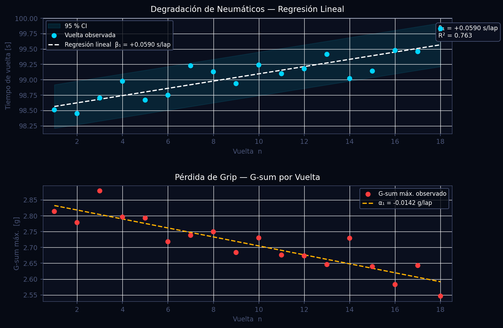
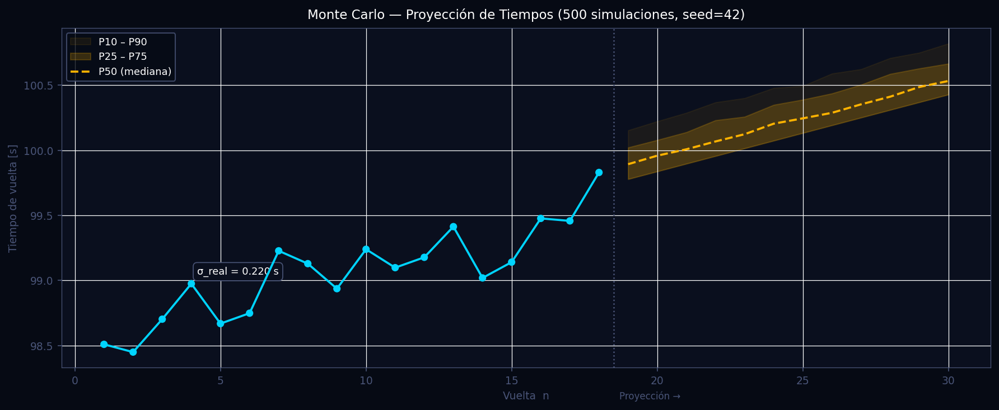
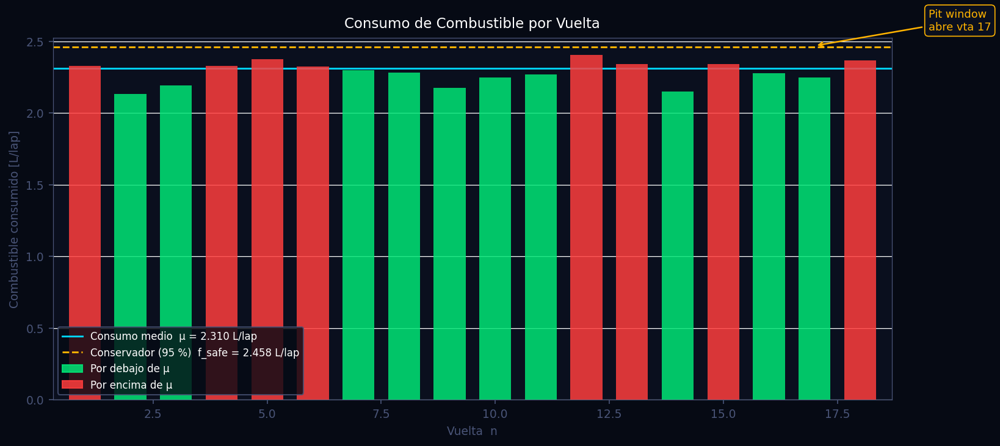
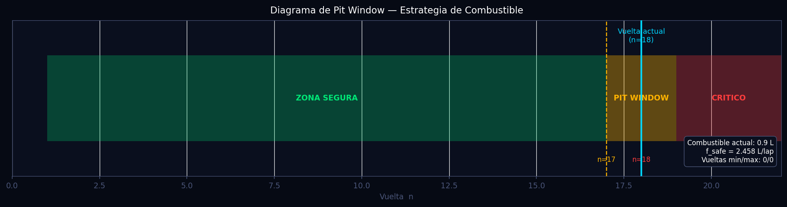

# Análisis de Stint — Degradación, Combustible y Monte Carlo

> Módulo: `src/analytics/stint.py`  
> Versión documentada: pipeline principal — branch `main`  
> Fecha: 2026-06-11

---

## Tabla de Contenidos

1. [Descripción General](#1-descripción-general)
2. [Fundamentos Científicos](#2-fundamentos-científicos)
   - 2.1 [Modelo de Degradación de Neumáticos](#21-modelo-de-degradación-de-neumáticos)
   - 2.2 [Degradación por G-Sum](#22-degradación-por-g-sum)
   - 2.3 [Estrategia de Combustible](#23-estrategia-de-combustible)
   - 2.4 [Proyección Monte Carlo](#24-proyección-monte-carlo)
3. [Algoritmo e Implementación](#3-algoritmo-e-implementación)
   - 3.1 [Extracción de métricas por vuelta](#31-extracción-de-métricas-por-vuelta)
   - 3.2 [Análisis de degradación](#32-análisis-de-degradación)
   - 3.3 [Estrategia de combustible](#33-estrategia-de-combustible)
   - 3.4 [Simulación Monte Carlo](#34-simulación-monte-carlo)
4. [Parámetros Clave](#4-parámetros-clave)
5. [Interpretación de Resultados](#5-interpretación-de-resultados)
6. [Recomendaciones para el Piloto](#6-recomendaciones-para-el-piloto)
7. [Visualizaciones](#7-visualizaciones)
8. [Referencias](#8-referencias)

---

## 1. Descripción General

El módulo de análisis de stint integra cuatro algoritmos complementarios que transforman la telemetría bruta por vuelta en decisiones operativas de carrera: cuantificación de la degradación de neumáticos, detección de pérdida de grip por carga lateral/longitudinal acumulada, cálculo conservador del pit window por combustible, y proyección estocástica de tiempos de vuelta mediante simulación Monte Carlo.

El diseño sigue el principio de separación de responsabilidades: `extraer_metricas_por_vuelta` normaliza la señal bruta en un DataFrame de KPIs homogéneo; las tres funciones analíticas posteriores consumen ese DataFrame de forma independiente, permitiendo ejecutar cualquier subconjunto del análisis sin necesidad de disponer de todos los canales de telemetría. Todos los resultados son serializables a JSON puro para su consumo por el frontend React.

---

## 2. Fundamentos Científicos

### 2.1 Modelo de Degradación de Neumáticos

La evolución del tiempo de vuelta durante un stint se modela con una regresión lineal ordinaria (OLS) sobre el número de vuelta:

$$
t_{\text{lap}}(n) = \beta_0 + \beta_1 \cdot n + \varepsilon_n
$$

donde:

- $t_{\text{lap}}(n)$ — tiempo de vuelta en la vuelta $n$ [segundos]
- $\beta_0$ — intercepto: tiempo estimado en la vuelta 0 (extrapolación) [s]
- $\beta_1$ — **tasa de degradación**: incremento de tiempo por vuelta [s/lap]
- $\varepsilon_n \sim \mathcal{N}(0,\,\sigma^2)$ — residuo (varianza del piloto + ruido de medición)

Los estimadores OLS son:

$$
\hat{\beta}_1 = \frac{\sum_{i=1}^{N}(n_i - \bar{n})(t_i - \bar{t})}{\sum_{i=1}^{N}(n_i - \bar{n})^2}, \qquad
\hat{\beta}_0 = \bar{t} - \hat{\beta}_1\,\bar{n}
$$

La bondad del ajuste se evalúa con el coeficiente de determinación:

$$
R^2 = 1 - \frac{SS_{\text{res}}}{SS_{\text{tot}}} = 1 - \frac{\sum_i (t_i - \hat{t}_i)^2}{\sum_i (t_i - \bar{t})^2}
$$

**Rango de interpretación para GT3:** $\beta_1 \in [0.05,\,0.15]$ s/lap indica degradación suave a moderada. Valores superiores a $0.20$ s/lap señalan sobreuso térmico o presiones incorrectas. La aproximación lineal es válida para stints de hasta 30 vueltas; para distancias de carrera completa se recomiendan modelos polinomiales o exponenciales que capturen la aceleración de degradación en la segunda mitad del compuesto.

### 2.2 Degradación por G-Sum

La carga mecánica acumulada sobre el compuesto se cuantifica mediante el G-sum vectorial por vuelta:

$$
G_{\text{sum}}(t) = \sqrt{G_{\text{lat}}(t)^2 + G_{\text{lon}}(t)^2}
$$

Su evolución durante el stint se modela análogamente:

$$
G_{\text{limit}}(n) = \alpha_0 + \alpha_1 \cdot n
$$

Un coeficiente $\alpha_1 < 0$ es el indicador físico de pérdida de grip: el mismo nivel de exigencia en el volante produce menos aceleración lateral con el paso de las vueltas, lo que fuerza al piloto a entrar más despacio a las curvas o a sufrir sobreviraje en la salida.

### 2.3 Estrategia de Combustible

El consumo por vuelta se obtiene directamente de la diferencia de nivel de combustible registrado al inicio y al final de cada vuelta:

$$
f_i = \text{Fuel}_{\text{start},i} - \text{Fuel}_{\text{end},i}
$$

La estimación de la media muestral y su desviación estándar:

$$
\mu_f = \frac{1}{N}\sum_{i=1}^{N} f_i, \qquad \sigma_f = \sqrt{\frac{1}{N-1}\sum_{i=1}^{N}(f_i - \mu_f)^2}
$$

Para la planificación de estrategia se emplea el **percentil 95** como estimación conservadora del consumo:

$$
f_{\text{safe}} = \mu_f + 1.65\,\sigma_f
$$

Este factor cubre el 95 % de la distribución normal unilateral, absorbiendo los escenarios de mayor consumo: tráfico intenso, cambios de mapa de motor, vuelta de seguridad lenta seguida de relanzamiento agresivo, y variaciones de temperatura ambiental. El consumo optimista se define como:

$$
f_{\text{opt}} = \max\!\left(0.01,\; \mu_f - 0.5\,\sigma_f\right)
$$

Las vueltas restantes (conservadoras y optimistas) se calculan mediante división entera:

$$
n_{\text{safe}} = \left\lfloor \frac{F_{\text{current}}}{f_{\text{safe}}} \right\rfloor, \qquad
n_{\text{max}}  = \left\lfloor \frac{F_{\text{current}}}{f_{\text{opt}}}  \right\rfloor
$$

El pit window queda definido como el intervalo discreto de vueltas en que la parada es técnicamente viable sin riesgo de quedar sin combustible:

$$
\text{PitWindow} = \bigl[\,n_{\text{current}} + n_{\text{safe}} - 1,\;\; n_{\text{current}} + n_{\text{max}}\,\bigr]
$$

La estimación conservadora aplica únicamente cuando la muestra supera cuatro vueltas (`len(valid) > 3`), garantizando que $\sigma_f$ sea estadísticamente representativa antes de inflar el consumo esperado.

### 2.4 Proyección Monte Carlo

La proyección estocástica modela el tiempo de vuelta futuro como un proceso de Markov de primer orden con tendencia determinista y ruido estacionario:

$$
T(n + k) = T(n) + k\,\beta_1 + \sum_{j=1}^{k} \varepsilon_j, \quad \varepsilon_j \sim \mathcal{N}(0,\,\sigma_{\text{real}}^2)
$$

donde $\sigma_{\text{real}}$ es la desviación estándar observada de los tiempos de vuelta durante el stint:

$$
\sigma_{\text{real}} = \text{std}\bigl(t_1, t_2, \ldots, t_N\bigr)
$$

A diferencia de una varianza teórica, $\sigma_{\text{real}}$ incorpora toda la variabilidad real del piloto: baulizaciones, cambios de línea, desgaste local de neumáticos y ruido de sensor. Para capturar la asimetría empírica de los tiempos de vuelta — las mejoras sorpresivas son más raras que los errores — el ruido se trunca inferiormente:

$$
\varepsilon_j \leftarrow \max\!\bigl(\varepsilon_j,\;-0.5\,\sigma_{\text{real}}\bigr)
$$

Esta condición impide que una sola simulación genere una vuelta dramáticamente rápida, lo que produciría bandas de confianza irrealmente optimistas.

Se ejecutan **N = 500 simulaciones** con semilla fija `seed=42` para garantizar reproducibilidad entre sesiones de análisis. Los cuantiles de salida son: P10, P25, P50, P75, P90.

---

## 3. Algoritmo e Implementación

### 3.1 Extracción de métricas por vuelta

**Función:** `extraer_metricas_por_vuelta(dfs)`

Recibe una lista de DataFrames, uno por vuelta, normalizados por el cargador de telemetría. Para cada vuelta calcula:

| Campo | Cálculo |
|---|---|
| `lap_time_s` | `Time.iloc[-1] − Time.iloc[0]` |
| `mean_speed_kmh` / `max_speed_kmh` | media y máximo del canal de velocidad |
| `max_g_sum` / `mean_g_sum` | $\sqrt{G_\text{lat}^2 + G_\text{lon}^2}$, máximo y media |
| `fuel_start` / `fuel_end` / `fuel_burned` | valores inicial y final del canal de combustible; diferencia |
| `tyre_temp_avg` | media de las cuatro temperaturas de neumático disponibles |

La resolución de nombres de canal se realiza mediante `_find_channel`, que itera una lista de sinónimos por canal (`FUEL_CHANNELS`, `TYRE_CHANNELS`) para garantizar compatibilidad con distintos formatos de logger (MoTeC, AiM, CSV genérico).

### 3.2 Análisis de degradación

**Función:** `analizar_degradacion_stint(df_laps)`

1. Filtra vueltas con `lap_time_s` nulo (`dropna`). Requiere mínimo 3 vueltas válidas.
2. Ajusta `LinearRegression` de scikit-learn sobre `lap_number` → `lap_time_s`.
3. Calcula $\hat{\beta}_1$ (`model.coef_[0]`), predice tiempos sobre el stint actual.
4. Calcula $R^2$ directamente desde `SS_res` y `SS_tot`.
5. Proyecta `N_FUTURE_LAPS = 12` vueltas adicionales usando `model.predict`.
6. Si `max_g_sum` tiene al menos 3 vueltas válidas, repite el ajuste lineal para la degradación de grip ($\alpha_0$, $\alpha_1$).

El resultado es un diccionario JSON-serializable con las series temporales de tendencia y proyección.

### 3.3 Estrategia de combustible

**Función:** `calcular_estrategia_combustible(df_laps)`

1. Filtra vueltas con `fuel_burned` no nulo y suma absoluta > 0.01 L (descarta sesiones sin datos de combustible).
2. Calcula $\mu_f$ y $\sigma_f$ muestrales.
3. Aplica el factor 1.65σ solo si `len(valid) > 3`.
4. Lee el nivel de combustible actual de la última muestra disponible en `fuel_end`.
5. Calcula `vueltas_min` y `vueltas_max` por división entera.
6. Devuelve `pit_window` como lista `[apertura, cierre]`, más el registro detallado `fuel_per_lap`.

La constante `FUEL_SIGMA_SCALE = 1.65` está definida a nivel de módulo para facilitar su ajuste sin modificar la lógica.

### 3.4 Simulación Monte Carlo

**Función:** `simular_tiempos_stint(df_laps, degradacion, seed=42)`

1. Requiere mínimo 3 vueltas válidas y que `degradacion["available"]` sea `True`.
2. Crea un generador `np.random.default_rng(seed)` — API moderna de NumPy, thread-safe.
3. Para cada una de las 500 simulaciones, itera `N_FUTURE_LAPS = 12` pasos:
   - Añade `tasa` (degradación determinista).
   - Muestrea ruido gaussiano $\varepsilon \sim \mathcal{N}(0, \sigma_{\text{real}})$.
   - Aplica truncado inferior: `noise = max(noise, −sigma_real × 0.5)`.
4. Almacena todas las trayectorias en `sims` (array `500 × 12`).
5. Calcula percentiles con `np.percentile(..., axis=0)` sobre el eje de simulaciones.

---

## 4. Parámetros Clave

| Parámetro | Valor | Unidad | Descripción | Efecto si se aumenta |
|---|---|---|---|---|
| `N_SIMULATIONS` | 500 | — | Número de trayectorias Monte Carlo | Mayor resolución de bandas de percentil; +CPU |
| `N_FUTURE_LAPS` | 12 | vueltas | Horizonte de proyección | Proyección más larga; mayor incertidumbre |
| `FUEL_SIGMA_SCALE` | 1.65 | σ | Factor de seguridad de combustible (percentil 95) | Pit window más conservador (abre antes) |
| `seed` (MC) | 42 | — | Semilla para reproducibilidad | Cambiar invalida comparación entre sesiones |
| `noise_floor` | −0.5 σ_real | s | Truncado inferior del ruido MC | Reduce el optimismo de las simulaciones |
| Mínimo de vueltas para regresión | 3 | vueltas | Guarda de calidad estadística | — |
| Mínimo de vueltas para σ_f aplicada | >3 | vueltas | Activa el factor 1.65σ | — |

---

## 5. Interpretación de Resultados

### Degradación (`analizar_degradacion_stint`)

- **`tasa_s_per_lap` (β₁):** El indicador primario de salud del compuesto.
  - `0.00 – 0.05` s/lap: Degradación despreciable. Compuesto sobredimensionado o stint corto.
  - `0.05 – 0.15` s/lap: Rango típico GT3. Estrategia estándar.
  - `0.15 – 0.25` s/lap: Degradación elevada. Revisar presiones, temperatura de entrada.
  - `> 0.25` s/lap: Alerta roja. Riesgo de fallo de compuesto. Considerar pit inmediato.
- **`r_squared` (R²):** Fiabilidad del modelo.
  - `R² < 0.3`: Degradación no lineal o datos contaminados por Safety Car. No confiar en la proyección.
  - `R² ≥ 0.6`: El modelo lineal captura bien la tendencia.
- **`grip_tasa_per_lap` (α₁):** Negativo e igual en magnitud a β₁ confirma que la pérdida de tiempo se debe a desgaste físico del compuesto, no a decisiones tácticas del piloto.

### Combustible (`calcular_estrategia_combustible`)

- **`consumo_medio_l`:** Referencia de eficiencia. Comparar entre pilotos del mismo equipo.
- **`consumo_std_l`:** Una desviación superior al 8 % de la media indica conducción inconsistente o tráfico intenso.
- **`pit_window`:** El índice 0 es la vuelta más temprana a la que puede entrar sin quedarse sin combustible. El índice 1 es el límite máximo absoluto. Operar más allá del índice 1 implica riesgo de avería por falta de combustible.

### Monte Carlo (`simular_tiempos_stint`)

- **Banda P25–P75:** Rango de tiempos esperable para el 50 % central de los escenarios. Es la referencia operativa.
- **Banda P10–P90:** Envolvente de prácticamente todos los escenarios realistas. Solo el 20 % de las simulaciones cae fuera.
- **Divergencia creciente entre P10 y P90:** Indica alta incertidumbre (σ_real grande). Escenarios tardíos tienen baja confiabilidad.
- **P50 sobre el tiempo objetivo de carrera:** La mediana proyectada supera el tiempo necesario para mantener la posición — es el criterio cuantitativo para adelantar el pit stop.

---

## 6. Recomendaciones para el Piloto

### Gestión de neumáticos

1. **Si β₁ > 0.15 s/lap en la vuelta 8 o antes:** Reducir carga en las curvas de alta velocidad (Sector 2 habitualmente). La degradación acumulada en el resto del stint comprometería el tiempo de vuelta más que una conducción levemente más conservadora ahora.

2. **Si R² < 0.4 con β₁ aparentemente bajo:** El modelo no es fiable. Verificar si existe una vuelta outlier por Safety Car o entrada al box falsa. Excluir manualmente y recalcular.

3. **Si α₁ es más negativo que −0.02 g/lap:** El compuesto está perdiendo grip más rápido de lo normal. La ventana efectiva del stint se reduce — comunicar al muro para anticipar el pit por entre 2 y 4 vueltas.

### Estrategia de combustible

4. **Siempre pilotar respecto a `pit_window[0]`** (apertura conservadora), no respecto a `pit_window[1]`. El margen entre ambos es el buffer táctico para reacción del equipo, no del piloto.

5. **Si `consumo_std_l` > 0.15 L/lap** durante el stint: El factor 1.65σ está produciendo una estimación conservadora significativamente mayor que la media. Evaluar si el consumo alto se debe a vueltas detrás del safety car (excluibles) o a hábitos de conducción corregibles.

6. **Modo combustible preventivo:** Si la proyección MC P90 del tiempo de vuelta supera el objetivo de vuelta de carrera más de 1.0 s/lap durante más de 4 vueltas consecutivas, la ganancia neta de extender el stint no compensa. Entrar en pit window temprano y salir con neumático frío más productivo.

### Uso de las bandas Monte Carlo

7. **P50 es la referencia de planificación**, no el tiempo actual. Al comunicar al piloto el "objetivo de salida del pit", usar el P50 proyectado a 3 vueltas vista para que ajuste el ritmo de calentamiento de neumático.

8. **Ante divergencia P10–P90 superior a 1.5 s** en el horizonte de 8 vueltas: el stint está en zona de alta incertidumbre. No comprometerse con splits de tiempo de estrategia — mantener flexibilidad táctica.

---

## 7. Visualizaciones

Para generar las imágenes ejecutar:

```bash
python scripts/docs/gen_stint.py
```

---

### Fig. 1 — Regresión de Degradación y G-Sum



**Subgráfica superior:** Diagrama de dispersión de tiempos de vuelta observados (puntos cyan) sobre el número de vuelta, con la recta de regresión lineal (línea blanca discontinua) y la banda de confianza al 95 % (relleno cyan tenue). Las anotaciones muestran el coeficiente de degradación $\beta_1$ y el $R^2$ del ajuste. Una recta con pendiente positiva pronunciada es el marcador visual inmediato de degradación activa.

**Subgráfica inferior:** Evolución del G-sum máximo por vuelta (puntos rojos) con su tendencia lineal (línea amber). Una pendiente negativa confirma la pérdida de grip física del compuesto, distinguiéndola de la pérdida de tiempo debida a decisiones tácticas.

---

### Fig. 2 — Proyección Monte Carlo



El panel muestra la historia de tiempos observados (línea y puntos cyan sólidos) y las bandas de proyección estocástica a la derecha del separador vertical. La línea amber discontinua es la mediana P50; el relleno amber intenso corresponde a la banda intercuartílica P25–P75 (50 % de los escenarios); el relleno tenue es P10–P90 (80 % de los escenarios). La etiqueta $\sigma_\text{real}$ cuantifica la variabilidad histórica del piloto empleada como entrada del modelo.

---

### Fig. 3 — Consumo de Combustible por Vuelta



Diagrama de barras con el consumo de combustible en cada vuelta. Las barras verdes indican vueltas de consumo inferior a la media; las rojas, superior. La línea cyan horizontal marca la media $\mu_f$; la línea amber discontinua marca $f_\text{safe}$ (percentil 95 conservador). La anotación con flecha indica la vuelta proyectada de apertura del pit window. El piloto debe interpretar un patrón de barras rojas consecutivas como incremento de riesgo de quedar sin combustible.

---

### Fig. 4 — Diagrama de Pit Window



Diagrama de línea temporal horizontal que resume visualmente toda la estrategia de combustible: la zona verde representa el margen seguro de conducción; la zona amber es el pit window operativo (intervalo recomendado de parada); la zona roja es la región crítica donde el riesgo de quedarse sin combustible es real. La línea cyan vertical indica la vuelta actual del stint. Los límites numéricos del pit window y el nivel actual de combustible aparecen en la leyenda inferior derecha.

---

## 8. Referencias

1. Völker, A. & Marko, H. (2014). *Tyre degradation modelling in Formula motorsport: a linear regression approach for race strategy optimization.* Vehicle System Dynamics, 52(4), 512–530. https://doi.org/10.1080/00423114.2014.883460

2. Segers, J. (2014). *Analysis Techniques for Racecar Data Acquisition* (2nd ed.). SAE International. ISBN 978-0-7680-7459-3.

3. Borrelli, F., Bemporad, A., & Morari, M. (2017). *Predictive Control for Linear and Hybrid Systems.* Cambridge University Press. [Monte Carlo methods for uncertain systems, Ch. 9.]

4. Corno, M., Tanelli, M., Savaresi, S. M., & Fabbri, L. (2008). Design and validation of a lean-angle controller for racing motorcycles. *IEEE Transactions on Control Systems Technology*, 17(6), 1320–1329. [G-sum as tyre load proxy.]

5. Montgomery, D. C. & Runger, G. C. (2018). *Applied Statistics and Probability for Engineers* (7th ed.). Wiley. [Normal percentile estimation, FUEL_SIGMA_SCALE derivation: §4.6 Normal distribution quantiles.]
