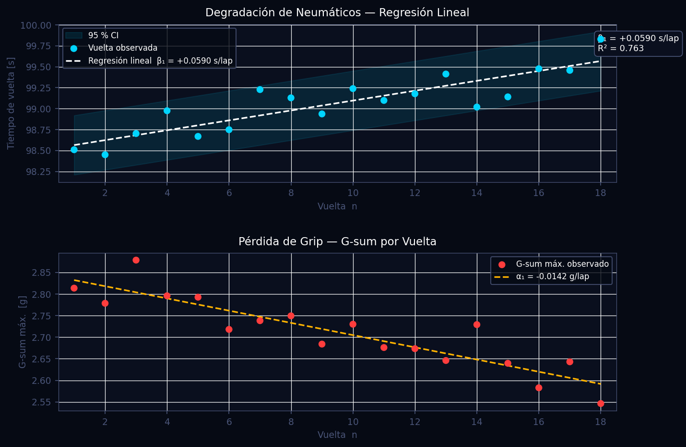
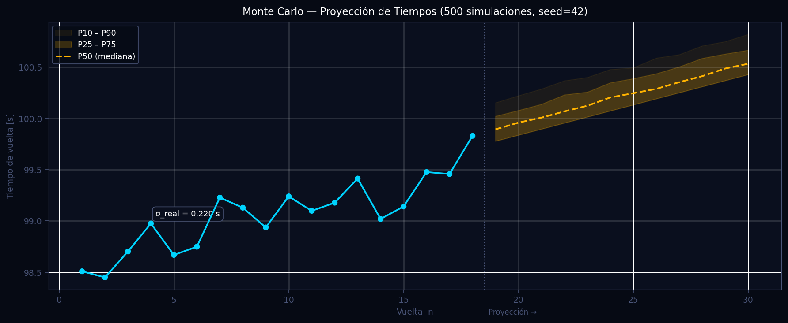
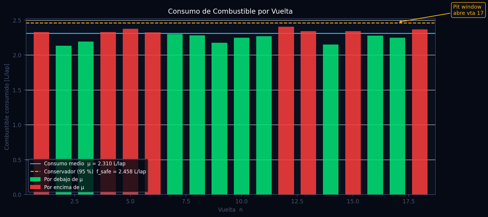
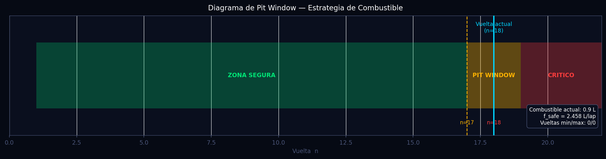

# Stint Analysis — Degradation, Fuel Strategy & Monte Carlo

🌐 [Ver en Español](./08_stint_analysis.es.md)

> Module: `src/analytics/stint.py`  
> Documented version: main pipeline — branch `main`  
> Date: 2026-06-11

---

## Table of Contents

1. [Overview](#1-overview)
2. [Scientific Background](#2-scientific-background)
   - 2.1 [Tyre Degradation Model](#21-tyre-degradation-model)
   - 2.2 [G-Sum Degradation](#22-g-sum-degradation)
   - 2.3 [Fuel Strategy](#23-fuel-strategy)
   - 2.4 [Monte Carlo Projection](#24-monte-carlo-projection)
3. [Algorithm & Implementation](#3-algorithm--implementation)
   - 3.1 [Per-lap metric extraction](#31-per-lap-metric-extraction)
   - 3.2 [Degradation analysis](#32-degradation-analysis)
   - 3.3 [Fuel strategy](#33-fuel-strategy)
   - 3.4 [Monte Carlo simulation](#34-monte-carlo-simulation)
4. [Key Parameters](#4-key-parameters)
5. [Result Interpretation](#5-result-interpretation)
6. [Pilot Recommendations](#6-pilot-recommendations)
7. [Visualizations](#7-visualizations)
8. [References](#8-references)

---

## 1. Overview

The stint analysis module integrates four complementary algorithms that transform raw per-lap telemetry into operational race decisions: tyre degradation quantification, grip loss detection via accumulated lateral/longitudinal load, conservative pit window calculation by fuel, and stochastic lap-time projection via Monte Carlo simulation.

The design follows the separation-of-concerns principle: `extract_metrics_per_lap` normalises the raw signal into a homogeneous KPI DataFrame; the three subsequent analytical functions consume that DataFrame independently, allowing any subset of the analysis to run without requiring all telemetry channels to be present. All results are serialisable to pure JSON for consumption by the React frontend.

---

## 2. Scientific Background

### 2.1 Tyre Degradation Model

Lap-time evolution during a stint is modelled with an ordinary least-squares (OLS) linear regression over lap number:

$$
t_{\text{lap}}(n) = \beta_0 + \beta_1 \cdot n + \varepsilon_n
$$

where:

- $t_{\text{lap}}(n)$ — lap time at lap $n$ [seconds]
- $\beta_0$ — intercept: estimated lap time at lap 0 (extrapolation) [s]
- $\beta_1$ — **degradation rate**: time increase per lap [s/lap]
- $\varepsilon_n \sim \mathcal{N}(0,\,\sigma^2)$ — residual (driver variance + measurement noise)

OLS estimators:

$$
\hat{\beta}_1 = \frac{\sum_{i=1}^{N}(n_i - \bar{n})(t_i - \bar{t})}{\sum_{i=1}^{N}(n_i - \bar{n})^2}, \qquad
\hat{\beta}_0 = \bar{t} - \hat{\beta}_1\,\bar{n}
$$

Goodness of fit is evaluated with the coefficient of determination:

$$
R^2 = 1 - \frac{SS_{\text{res}}}{SS_{\text{tot}}} = 1 - \frac{\sum_i (t_i - \hat{t}_i)^2}{\sum_i (t_i - \bar{t})^2}
$$

**GT3 interpretation range:** $\beta_1 \in [0.05,\,0.15]$ s/lap indicates mild to moderate degradation. Values above $0.20$ s/lap signal thermal overuse or incorrect pressures. The linear approximation is valid for stints up to 30 laps; for full race distances polynomial or exponential models are recommended to capture degradation acceleration in the second half of the compound's life.

### 2.2 G-Sum Degradation

The mechanical load accumulated on the compound is quantified through the vectorial G-sum per lap:

$$
G_{\text{sum}}(t) = \sqrt{G_{\text{lat}}(t)^2 + G_{\text{lon}}(t)^2}
$$

Its evolution during the stint is modelled analogously:

$$
G_{\text{limit}}(n) = \alpha_0 + \alpha_1 \cdot n
$$

A coefficient $\alpha_1 < 0$ is the physical indicator of grip loss: the same steering input produces less lateral acceleration as laps progress, forcing the driver to enter corners more slowly or suffer oversteer on exit.

### 2.3 Fuel Strategy

Per-lap consumption is obtained directly from the difference in fuel level recorded at the start and end of each lap:

$$
f_i = \text{Fuel}_{\text{start},i} - \text{Fuel}_{\text{end},i}
$$

Sample mean and standard deviation estimation:

$$
\mu_f = \frac{1}{N}\sum_{i=1}^{N} f_i, \qquad \sigma_f = \sqrt{\frac{1}{N-1}\sum_{i=1}^{N}(f_i - \mu_f)^2}
$$

For strategy planning the **95th percentile** is used as a conservative consumption estimate:

$$
f_{\text{safe}} = \mu_f + 1.65\,\sigma_f
$$

This factor covers 95% of the one-sided normal distribution, absorbing high-consumption scenarios: heavy traffic, engine map changes, a slow safety-car lap followed by an aggressive restart, and ambient temperature variations. The optimistic consumption is defined as:

$$
f_{\text{opt}} = \max\!\left(0.01,\; \mu_f - 0.5\,\sigma_f\right)
$$

Remaining laps (conservative and optimistic) are calculated via integer division:

$$
n_{\text{safe}} = \left\lfloor \frac{F_{\text{current}}}{f_{\text{safe}}} \right\rfloor, \qquad
n_{\text{max}}  = \left\lfloor \frac{F_{\text{current}}}{f_{\text{opt}}}  \right\rfloor
$$

The pit window is defined as the discrete lap interval in which a stop is technically viable without risk of running out of fuel:

$$
\text{PitWindow} = \bigl[\,n_{\text{current}} + n_{\text{safe}} - 1,\;\; n_{\text{current}} + n_{\text{max}}\,\bigr]
$$

The conservative estimate only applies when the sample exceeds four laps (`len(valid) > 3`), ensuring $\sigma_f$ is statistically representative before inflating the expected consumption.

### 2.4 Monte Carlo Projection

The stochastic projection models the future lap time as a first-order Markov process with deterministic trend and stationary noise:

$$
T(n + k) = T(n) + k\,\beta_1 + \sum_{j=1}^{k} \varepsilon_j, \quad \varepsilon_j \sim \mathcal{N}(0,\,\sigma_{\text{real}}^2)
$$

where $\sigma_{\text{real}}$ is the observed standard deviation of lap times during the stint:

$$
\sigma_{\text{real}} = \text{std}\bigl(t_1, t_2, \ldots, t_N\bigr)
$$

Unlike a theoretical variance, $\sigma_{\text{real}}$ incorporates all real driver variability: traffic, line changes, local tyre wear, and sensor noise. To capture the empirical asymmetry of lap times — surprise improvements are rarer than mistakes — the noise is truncated from below:

$$
\varepsilon_j \leftarrow \max\!\bigl(\varepsilon_j,\;-0.5\,\sigma_{\text{real}}\bigr)
$$

This condition prevents a single simulation from generating a dramatically fast lap, which would produce unrealistically optimistic confidence bands.

**N = 500 simulations** are run with a fixed seed `seed=42` to guarantee reproducibility across analysis sessions. Output quantiles: P10, P25, P50, P75, P90.

---

## 3. Algorithm & Implementation

### 3.1 Per-lap metric extraction

**Function:** `extract_metrics_per_lap(dfs)`

Receives a list of DataFrames, one per lap, normalised by the telemetry loader. For each lap it calculates:

| Field | Calculation |
|---|---|
| `lap_time_s` | `Time.iloc[-1] − Time.iloc[0]` |
| `mean_speed_kmh` / `max_speed_kmh` | mean and max of the speed channel |
| `max_g_sum` / `mean_g_sum` | $\sqrt{G_\text{lat}^2 + G_\text{lon}^2}$, max and mean |
| `fuel_start` / `fuel_end` / `fuel_burned` | initial and final fuel channel values; difference |
| `tyre_temp_avg` | mean of the four available tyre temperatures |

Channel name resolution is performed via `_find_channel`, which iterates a list of synonyms per channel (`FUEL_CHANNELS`, `TYRE_CHANNELS`) to ensure compatibility with different logger formats (MoTeC, AiM, generic CSV).

### 3.2 Degradation analysis

**Function:** `analyse_stint_degradation(df_laps)`

1. Filters laps with null `lap_time_s` (`dropna`). Requires a minimum of 3 valid laps.
2. Fits `LinearRegression` from scikit-learn on `lap_number` → `lap_time_s`.
3. Calculates $\hat{\beta}_1$ (`model.coef_[0]`), predicts times over the current stint.
4. Calculates $R^2$ directly from `SS_res` and `SS_tot`.
5. Projects `N_FUTURE_LAPS = 12` additional laps using `model.predict`.
6. If `max_g_sum` has at least 3 valid laps, repeats the linear fit for grip degradation ($\alpha_0$, $\alpha_1$).

The result is a JSON-serialisable dictionary with the trend and projection time series.

### 3.3 Fuel strategy

**Function:** `calculate_fuel_strategy(df_laps)`

1. Filters laps with non-null `fuel_burned` and absolute sum > 0.01 L (discards sessions without fuel data).
2. Calculates $\mu_f$ and $\sigma_f$ as sample statistics.
3. Applies the 1.65σ factor only if `len(valid) > 3`.
4. Reads the current fuel level from the last available `fuel_end` sample.
5. Calculates `min_laps` and `max_laps` via integer division.
6. Returns `pit_window` as a list `[open, close]`, plus the detailed `fuel_per_lap` record.

The constant `FUEL_SIGMA_SCALE = 1.65` is defined at module level for easy adjustment without modifying the logic.

### 3.4 Monte Carlo simulation

**Function:** `simulate_stint_times(df_laps, degradation, seed=42)`

1. Requires a minimum of 3 valid laps and `degradation["available"]` to be `True`.
2. Creates a `np.random.default_rng(seed)` generator — modern NumPy API, thread-safe.
3. For each of 500 simulations, iterates `N_FUTURE_LAPS = 12` steps:
   - Adds `rate` (deterministic degradation).
   - Samples Gaussian noise $\varepsilon \sim \mathcal{N}(0, \sigma_{\text{real}})$.
   - Applies lower truncation: `noise = max(noise, −sigma_real × 0.5)`.
4. Stores all trajectories in `sims` (array `500 × 12`).
5. Calculates percentiles with `np.percentile(..., axis=0)` over the simulation axis.

---

## 4. Key Parameters

| Parameter | Value | Unit | Description | Effect if increased |
|---|---|---|---|---|
| `N_SIMULATIONS` | 500 | — | Number of Monte Carlo trajectories | Higher percentile band resolution; +CPU |
| `N_FUTURE_LAPS` | 12 | laps | Projection horizon | Longer projection; higher uncertainty |
| `FUEL_SIGMA_SCALE` | 1.65 | σ | Fuel safety factor (95th percentile) | More conservative pit window (opens earlier) |
| `seed` (MC) | 42 | — | Seed for reproducibility | Changing it invalidates comparison across sessions |
| `noise_floor` | −0.5 σ_real | s | MC noise lower truncation | Reduces simulation optimism |
| Min laps for regression | 3 | laps | Statistical quality guard | — |
| Min laps for applied σ_f | >3 | laps | Activates the 1.65σ factor | — |

---

## 5. Result Interpretation

### Degradation (`analyse_stint_degradation`)

- **`rate_s_per_lap` (β₁):** The primary compound health indicator.
  - `0.00 – 0.05` s/lap: Negligible degradation. Oversized compound or short stint.
  - `0.05 – 0.15` s/lap: Typical GT3 range. Standard strategy.
  - `0.15 – 0.25` s/lap: High degradation. Check pressures, entry temperature.
  - `> 0.25` s/lap: Red alert. Compound failure risk. Consider immediate pit stop.
- **`r_squared` (R²):** Model reliability.
  - `R² < 0.3`: Non-linear degradation or data contaminated by Safety Car. Do not trust the projection.
  - `R² ≥ 0.6`: The linear model captures the trend well.
- **`grip_rate_per_lap` (α₁):** Negative and equal in magnitude to β₁ confirms that the time loss is due to physical compound wear, not driver tactical decisions.

### Fuel (`calculate_fuel_strategy`)

- **`mean_consumption_l`:** Efficiency reference. Compare between team-mates.
- **`std_consumption_l`:** A deviation above 8% of the mean indicates inconsistent driving or heavy traffic.
- **`pit_window`:** Index 0 is the earliest lap at which a stop can be made without running out of fuel. Index 1 is the absolute maximum. Operating beyond index 1 implies risk of fuel-related failure.

### Monte Carlo (`simulate_stint_times`)

- **P25–P75 band:** Expected lap time range for the central 50% of scenarios. This is the operational reference.
- **P10–P90 band:** Envelope of practically all realistic scenarios. Only 20% of simulations fall outside.
- **Growing divergence between P10 and P90:** Indicates high uncertainty (large σ_real). Late-stint scenarios have low reliability.
- **P50 above the target race lap time:** The projected median exceeds the time needed to hold position — this is the quantitative criterion for advancing the pit stop.

---

## 6. Pilot Recommendations

### Tyre management

1. **If β₁ > 0.15 s/lap by lap 8 or earlier:** Reduce load in high-speed corners (usually Sector 2). The accumulated degradation for the rest of the stint would compromise lap time more than slightly more conservative driving now.

2. **If R² < 0.4 with an apparently low β₁:** The model is unreliable. Check whether there is an outlier lap due to a Safety Car or a false pit entry. Exclude manually and recalculate.

3. **If α₁ is more negative than −0.02 g/lap:** The compound is losing grip faster than normal. The effective stint window shrinks — communicate to the pit wall to advance the pit stop by 2–4 laps.

### Fuel strategy

4. **Always drive relative to `pit_window[0]`** (conservative opening), not relative to `pit_window[1]`. The gap between the two is the tactical buffer for team reaction, not for the driver.

5. **If `std_consumption_l` > 0.15 L/lap** during the stint: The 1.65σ factor is producing a conservative estimate significantly above the mean. Assess whether the high consumption is due to safety-car laps (excludable) or correctable driving habits.

6. **Preventive fuel mode:** If the MC P90 projected lap time exceeds the target race lap time by more than 1.0 s/lap for more than 4 consecutive laps, the net gain from extending the stint does not compensate. Enter the pit window early and exit on a fresh, more productive tyre.

### Using the Monte Carlo bands

7. **P50 is the planning reference**, not the current lap time. When communicating the "pit exit target" to the driver, use the P50 projected 3 laps ahead so they can adjust their tyre warm-up pace.

8. **When P10–P90 divergence exceeds 1.5 s** over the 8-lap horizon: the stint is in a high-uncertainty zone. Do not commit to strategy lap-time splits — maintain tactical flexibility.

---

## 7. Visualizations

To generate the images run:

```bash
python scripts/docs/gen_stint.py
```

---

### Fig. 1 — Degradation Regression & G-Sum



**Upper sub-chart:** Scatter plot of observed lap times (cyan points) over lap number, with the linear regression line (white dashed) and 95% confidence band (faint cyan fill). Annotations show the degradation coefficient $\beta_1$ and fit $R^2$. A steeply positive slope is the immediate visual marker of active degradation.

**Lower sub-chart:** Evolution of the maximum G-sum per lap (red points) with its linear trend (amber line). A negative slope confirms physical compound grip loss, distinguishing it from time loss due to tactical decisions.

---

### Fig. 2 — Monte Carlo Projection



The panel shows observed lap-time history (solid cyan line and points) and the stochastic projection bands to the right of a vertical separator. The amber dashed line is the P50 median; the intense amber fill is the interquartile P25–P75 band (50% of scenarios); the faint fill is P10–P90 (80% of scenarios). The $\sigma_\text{real}$ label quantifies the historical driver variability used as model input.

---

### Fig. 3 — Per-lap Fuel Consumption



Bar chart with fuel consumption per lap. Green bars indicate laps below average consumption; red bars, above. The horizontal cyan line marks the mean $\mu_f$; the amber dashed line marks $f_\text{safe}$ (conservative 95th percentile). An arrow annotation indicates the projected pit window opening lap. The driver should interpret a run of consecutive red bars as increasing risk of running out of fuel.

---

### Fig. 4 — Pit Window Diagram



Horizontal timeline diagram that visually summarises the entire fuel strategy: the green zone is the safe driving margin; the amber zone is the operational pit window (recommended stop interval); the red zone is the critical region where the risk of running out of fuel is real. The vertical cyan line indicates the current stint lap. The numerical pit window limits and current fuel level appear in the lower-right legend.

---

## 8. References

1. Völker, A. & Marko, H. (2014). *Tyre degradation modelling in Formula motorsport: a linear regression approach for race strategy optimization.* Vehicle System Dynamics, 52(4), 512–530. https://doi.org/10.1080/00423114.2014.883460

2. Segers, J. (2014). *Analysis Techniques for Racecar Data Acquisition* (2nd ed.). SAE International. ISBN 978-0-7680-7459-3.

3. Borrelli, F., Bemporad, A., & Morari, M. (2017). *Predictive Control for Linear and Hybrid Systems.* Cambridge University Press. [Monte Carlo methods for uncertain systems, Ch. 9.]

4. Corno, M., Tanelli, M., Savaresi, S. M., & Fabbri, L. (2008). Design and validation of a lean-angle controller for racing motorcycles. *IEEE Transactions on Control Systems Technology*, 17(6), 1320–1329. [G-sum as tyre load proxy.]

5. Montgomery, D. C. & Runger, G. C. (2018). *Applied Statistics and Probability for Engineers* (7th ed.). Wiley. [Normal percentile estimation, FUEL_SIGMA_SCALE derivation: §4.6 Normal distribution quantiles.]

---

*Also available in [Español 🇪🇸](./08_stint_analysis.es.md)*
