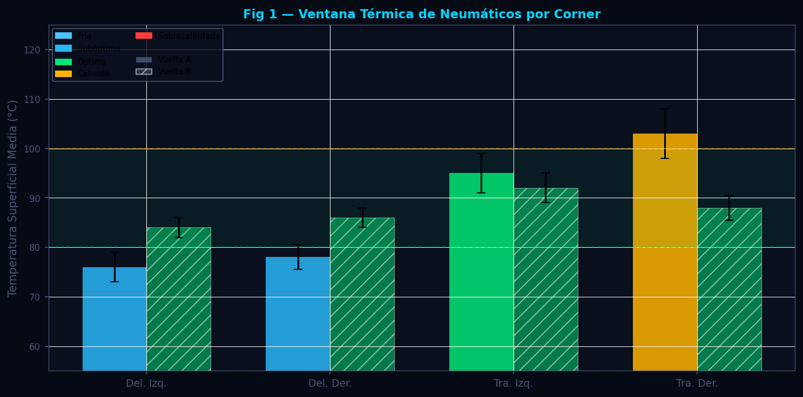
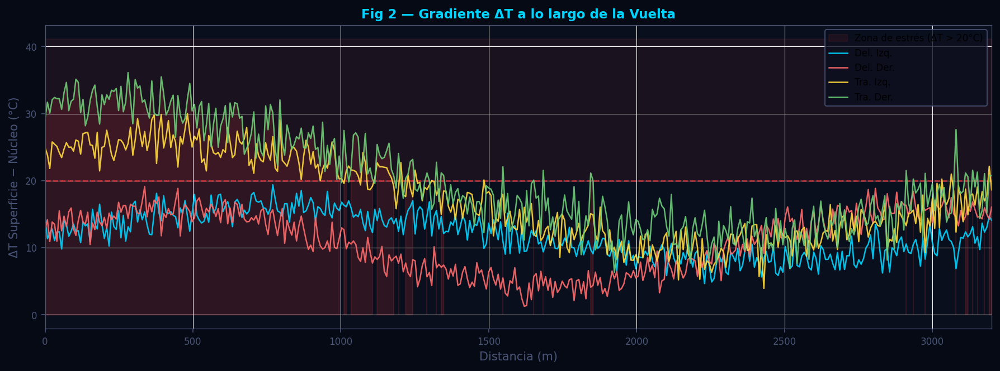
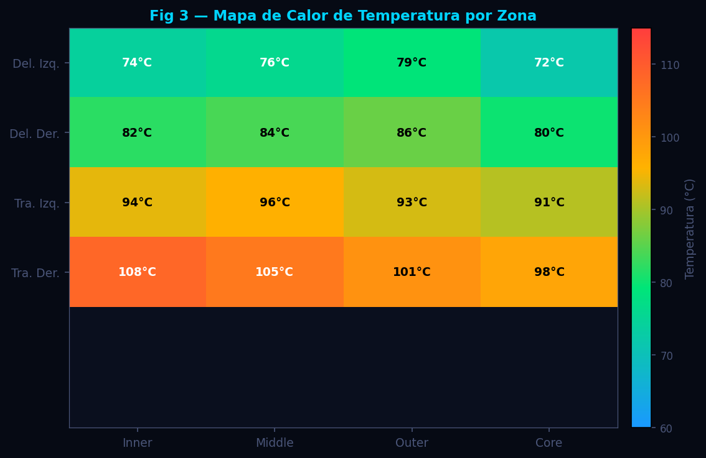

# Temperatura de Neumáticos — Análisis Térmico

**Módulo:** `src/analytics/thermodynamics.py`  
**Fecha de revisión:** 2026-06-12

---

## Tabla de Contenidos

1. [Descripción General](#descripción-general)
2. [Fundamentos Científicos](#fundamentos-científicos)
   - 2.1 [Física del Neumático en la Ventana Térmica](#21-física-del-neumático-en-la-ventana-térmica)
   - 2.2 [Gradiente Superficial–Núcleo (ΔT)](#22-gradiente-superficialnúcleo-δt)
   - 2.3 [Estrés Térmico](#23-estrés-térmico)
3. [Algoritmo e Implementación](#algoritmo-e-implementación)
   - 3.1 [Estructura de Canales MoTeC](#31-estructura-de-canales-motec)
   - 3.2 [`analizar_neumaticos`](#32-analizar_neumaticos)
   - 3.3 [`analizar_neumaticos_comparativo`](#33-analizar_neumaticos_comparativo)
4. [Parámetros Clave](#parámetros-clave)
5. [Interpretación de Resultados](#interpretación-de-resultados)
6. [Recomendaciones para el Piloto](#recomendaciones-para-el-piloto)
7. [Visualizaciones](#visualizaciones)
8. [Referencias](#referencias)

---

## Descripción General

El módulo de termodinámica de neumáticos analiza los 16 canales de temperatura de los 4 neumáticos (Inner, Middle, Outer y Core por rueda) para determinar si el compuesto está operando dentro de su ventana de temperatura óptima, cuantificar el gradiente interno del neumático y detectar zonas de estrés térmico que predicen desgaste acelerado o pérdida de grip. Para comparativas de dos vueltas, el módulo ejecuta el análisis de forma independiente sobre cada lap usando los canales alineados con sufijo `_Fast` y `_Slow`.

---

## Fundamentos Científicos

### 2.1 Física del Neumático en la Ventana Térmica

Los compuestos de goma de un neumático de competición tienen una curva de coeficiente de fricción μ que forma una cúpula con un pico bien definido. Por debajo del rango óptimo, los polímeros no alcanzan la plasticidad suficiente para maximizar el área de contacto molecular (grip); por encima, la degradación química acelera el desgaste y puede producir graining o blistering.

$$
\mu(T) \approx \mu_{max} \cdot \exp\!\left(-\frac{(T - T_{opt})^2}{2\sigma_T^2}\right)
$$

donde $T_{opt}$ es el centro de la ventana óptima y $\sigma_T$ controla la anchura del pico. En la práctica, el rango óptimo se expresa como $[T_{min},\, T_{max}]$; el módulo usa por defecto **80–100°C** para compuestos GT de calle de alto rendimiento (configurable).

El sistema clasifica el estado de cada neumático en cinco niveles:

| Estado | Condición | Implicación |
|---|---|---|
| `fria` | $T < T_{min} - 15°C$ | Sin grip disponible; vuelta de calentamiento necesaria |
| `suboptima` | $T_{min} - 15°C \le T < T_{min}$ | Grip parcial; neumático aún ganando temperatura |
| `optima` | $T_{min} \le T \le T_{max}$ | Máximo grip; condición objetivo |
| `caliente` | $T_{max} < T \le T_{max} + 15°C$ | Degradación acelerada; monitorear de cerca |
| `sobrecalentada` | $T > T_{max} + 15°C$ | Blistering potencial; reducir ritmo o entrar a pits |

---

### 2.2 Gradiente Superficial–Núcleo (ΔT)

La diferencia entre la temperatura superficial media y la temperatura del núcleo es un indicador de la tasa de generación de calor en el compound:

$$
\Delta T = \bar{T}_{surface} - T_{core}
$$

donde $\bar{T}_{surface} = \frac{T_{Inner} + T_{Middle} + T_{Outer}}{3}$.

Un ΔT **positivo y elevado** (> 20°C) indica que la superficie del neumático genera calor más rápido de lo que el núcleo puede disipar, situación que aumenta el riesgo de graining en el primer stint y blistering en condiciones de alta carga. En el extremo opuesto, un ΔT negativo o cercano a cero en un neumático "caliente" puede indicar que el núcleo supera la temperatura de la banda de rodadura, situación característica del blistering avanzado.

---

### 2.3 Estrés Térmico

El módulo calcula el porcentaje de muestras donde ΔT supera el umbral de estrés de **20°C**:

$$
\text{high\_stress\_pct} = \frac{|\{i : \Delta T_i > 20°C\}|}{N} \times 100\%
$$

Este valor, junto con `window_status`, forma la base del diagnóstico rápido: un neumático con estado `caliente` y `high_stress_pct > 30%` requiere atención inmediata de setup o estrategia.

---

## Algoritmo e Implementación

### 3.1 Estructura de Canales MoTeC

El cargador (`loaders.py`) normaliza los nombres de columna del CSV al esquema canónico:

| Canal canónico | Variantes MoTeC aceptadas |
|---|---|
| `TyreTempInnerFL` | `Tire Temp Inner FL`, `Tyre Temp (I) FL`, `Tyre Temp I FL` |
| `TyreTempMiddleFL` | `Tire Temp Middle FL`, `Tyre Temp (M) FL`, `Tyre Temp M FL` |
| `TyreTempOuterFL` | `Tire Temp Outer FL`, `Tyre Temp (O) FL`, `Tyre Temp O FL` |
| `TyreTempCoreFL` | `Tire Temp Core FL`, `Tyre Core Temp FL`, `Tyre Temp Core FL` |

El mismo patrón se aplica a FR, RL y RR. En el DataFrame alineado, los canales se identifican con sufijo `_Fast` o `_Slow`.

---

### 3.2 `analizar_neumaticos`

```
Entradas:
  df       — DataFrame de telemetría (raw o alineado)
  suffix   — "" para df raw, "_Fast" o "_Slow" para df alineado
  t_min    — temperatura mínima de la ventana óptima (°C)
  t_max    — temperatura máxima de la ventana óptima (°C)

Para cada rueda [FL, FR, RL, RR]:
  1. surface_mean = mean(TyreTempInner, TyreTempMiddle, TyreTempOuter)
  2. core_mean    = mean(TyreTempCore)
  3. delta_t      = surface_mean - core_mean
  4. high_stress_pct = mean(delta_t > 20°C) * 100
  5. ref_temp     = surface_mean si disponible, sino core_mean
  6. window_status   = clasificar ref_temp en {fria, suboptima, optima, caliente, sobrecalentada}
  7. window_deviation = desviación respecto al límite más cercano de la ventana

Salida por distancia (downsampled × 10):
  distance, {corner}_surface, {corner}_core, {corner}_delta  para cada corner

Retorna dict con available, t_min, t_max, corners[], per_distance{}
```

---

### 3.3 `analizar_neumaticos_comparativo`

Wrapper que llama a `analizar_neumaticos` con `suffix="_Fast"` y `suffix="_Slow"` sobre el DataFrame alineado. Retorna `{available, t_min, t_max, lap_a: {...}, lap_b: {...}}`. Si ninguna vuelta tiene canales de temperatura, retorna `{available: False}`.

---

## Parámetros Clave

| Parámetro | Valor por defecto | Descripción |
|---|---|---|
| `t_min` | 80°C | Límite inferior de la ventana de temperatura óptima |
| `t_max` | 100°C | Límite superior de la ventana de temperatura óptima |
| `DOWNSAMPLE` | 10 | Factor de reducción para la serie por distancia |
| `stress_threshold` | 20°C | ΔT mínimo para declarar estrés térmico |
| Margen `fria` | 15°C | Diferencia con `t_min` que define estado "fría" |
| Margen `caliente` | 15°C | Diferencia con `t_max` que define estado "caliente" |

---

## Interpretación de Resultados

### Estado de la ventana

- **`optima`**: El neumático trabaja en su zona de máximo coeficiente de fricción. No requiere acción salvo verificar que se mantenga estable.
- **`suboptima`**: Vuelta de calentamiento insuficiente o neumáticos fríos tras salida de la caja de cambios (tras SC o bandera roja). El piloto debería aumentar la carga sobre ese eje.
- **`caliente` / `sobrecalentada`**: Sobrecarga mecánica, presión de neumático incorrecta, o setup demasiado rígido que genera deslizamiento. Prioridad alta.
- **`fria`**: Posible error de sensor, vuelta lenta, o neumático completamente nuevo sin temperatura.

### Gradiente ΔT por zona (Inner/Middle/Outer)

Un neumático bien configurado con presión y alineación correctas debería mostrar una temperatura uniforme en las tres zonas. Las desviaciones indican:

| Patrón | Diagnóstico probable |
|---|---|
| Inner >> Outer | Presión excesiva (área central de contacto, bordes levantados) |
| Outer >> Inner | Presión insuficiente o exceso de camber negativo |
| Middle >> Inner + Outer | Camber muy positivo o neumático de alta presión y rigidez |
| Uniforme | Presión y geometría correctas |

---

## Recomendaciones para el Piloto

**Neumático frío en curvas rápidas:**
Realizar vueltas de calentamiento con zigzag moderado en las rectas para generar fricción en las bandas sin comprometer la trazada. Verificar presión en frío: una presión muy alta reduce la generación de calor por deformación.

**Neumático sobrecalentado en eje trasero:**
Reducir el diferencial en fase de aceleración. Verificar que el balance de frenado no está demasiado adelantado (el freno trasero excesivo genera calor por deslizamiento). Considerar reducir el ángulo de camber trasero si el Inner está significativamente más caliente.

**ΔT superficie-núcleo > 30°C persistente:**
El núcleo no disipa el calor a la velocidad que la superficie lo genera. Si el compuesto es "duro", considerar cambiar a un compuesto más blando para el circuito. Si el compuesto es "blando", probablemente hay blistering incipiente.

---

## Visualizaciones

Generadas por `scripts/docs/gen_thermodynamics.py` con datos sintéticos.

---

### Figura 1 — Ventana Térmica y Estados



Diagrama de barras de la temperatura media superficial de los 4 neumáticos superpuesto con la banda de temperatura óptima (zona verde, 80–100°C). Cada barra tiene un código de color según el estado (`fria` = azul, `suboptima` = celeste, `optima` = verde, `caliente` = naranja, `sobrecalentada` = rojo). Las barras de error representan ±1σ de la distribución temporal.

---

### Figura 2 — Gradiente ΔT a lo largo de la Vuelta



Serie temporal del gradiente ΔT (superficie − núcleo) para los 4 neumáticos a lo largo de la distancia de la vuelta. La banda sombreada roja indica la zona de estrés térmico (ΔT > 20°C). Las diferencias entre ejes (delantero vs trasero) revelan el balance de carga dinámica.

---

### Figura 3 — Mapa de Calor de Temperatura por Zona



Mapa de calor (4 neumáticos × 4 zonas: Inner, Middle, Outer, Core) con temperatura media de la vuelta. La paleta va de azul frío a rojo caliente. Un gradiente vertical uniforme en cada columna indica buena distribución de temperatura; asimetría horizontal señala problemas de presión o geometría.

---

## Referencias

1. Milliken, W. F., & Milliken, D. L. (1995). *Race Car Vehicle Dynamics*. SAE International. — Capítulo 2: Tire Behavior; análisis de ventanas de temperatura de compuesto de goma.

2. Dixon, J. C. (1996). *Tires, Suspension and Handling* (2nd ed.). SAE International. — Modelo de coeficiente de fricción en función de temperatura; gradiente superficial-núcleo.

3. Segers, J. (2014). *Analysis Techniques for Racecar Data Acquisition* (2nd ed.). SAE International. — Interpretación de canales de temperatura de neumáticos en telemetría MoTeC; diagnóstico de presión desde distribución por zona.

4. Pacejka, H. B. (2012). *Tire and Vehicle Dynamics* (3rd ed.). Butterworth-Heinemann. — Modelo térmico simplificado del neumático; efecto de temperatura sobre el coeficiente de rigidez de la banda de rodadura.
