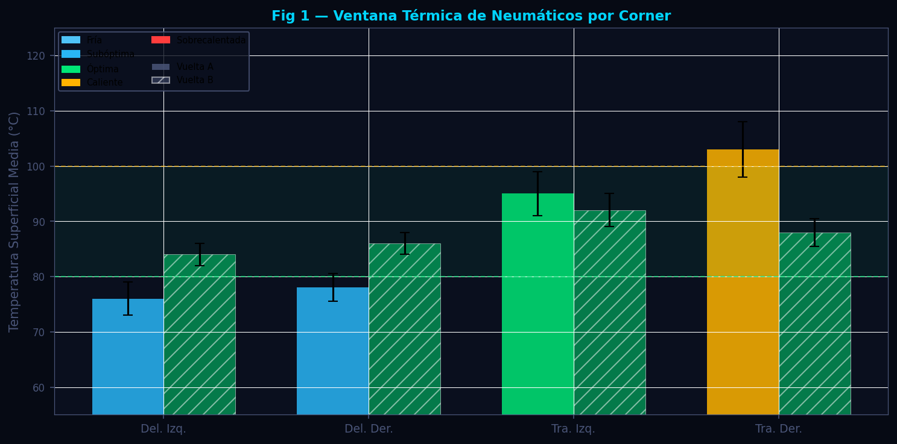
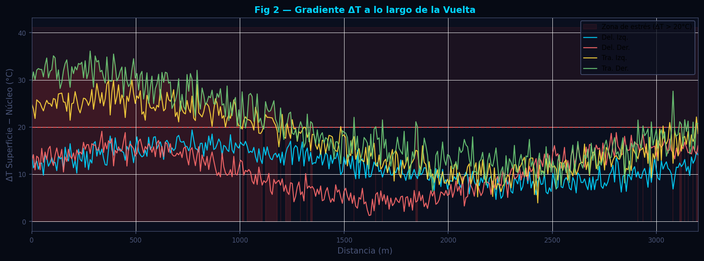
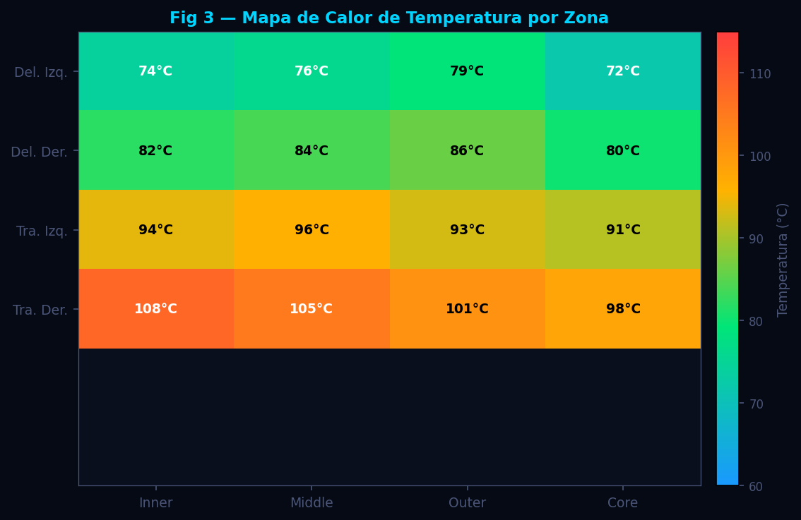

# Tyre Temperature — Thermal Analysis

🌐 [Ver en Español](./09_thermodynamics.es.md)

**Module:** `src/analytics/thermodynamics.py`  
**Review date:** 2026-06-12

---

## Table of Contents

1. [Overview](#overview)
2. [Scientific Background](#scientific-background)
   - 2.1 [Tyre Physics Within the Thermal Window](#21-tyre-physics-within-the-thermal-window)
   - 2.2 [Surface-to-Core Gradient (ΔT)](#22-surface-to-core-gradient-δt)
   - 2.3 [Thermal Stress](#23-thermal-stress)
3. [Algorithm & Implementation](#algorithm--implementation)
   - 3.1 [MoTeC Channel Structure](#31-motec-channel-structure)
   - 3.2 [`analyse_tyres`](#32-analyse_tyres)
   - 3.3 [`analyse_tyres_comparative`](#33-analyse_tyres_comparative)
4. [Key Parameters](#key-parameters)
5. [Result Interpretation](#result-interpretation)
6. [Pilot Recommendations](#pilot-recommendations)
7. [Visualizations](#visualizations)
8. [References](#references)

---

## Overview

The tyre thermodynamics module analyses the 16 temperature channels from the 4 tyres (Inner, Middle, Outer and Core per wheel) to determine whether the compound is operating within its optimal temperature window, quantify the tyre's internal gradient, and detect thermal stress zones that predict accelerated wear or grip loss. For two-lap comparisons, the module runs the analysis independently on each lap using the aligned channels with `_Fast` and `_Slow` suffixes.

---

## Scientific Background

### 2.1 Tyre Physics Within the Thermal Window

The rubber compounds in a racing tyre have a friction coefficient μ curve that forms a dome with a well-defined peak. Below the optimal range, the polymers do not reach sufficient plasticity to maximise molecular contact area (grip); above it, chemical degradation accelerates wear and can produce graining or blistering.

$$
\mu(T) \approx \mu_{max} \cdot \exp\!\left(-\frac{(T - T_{opt})^2}{2\sigma_T^2}\right)
$$

where $T_{opt}$ is the centre of the optimal window and $\sigma_T$ controls the peak width. In practice, the optimal range is expressed as $[T_{min},\, T_{max}]$; the module defaults to **80–100°C** for high-performance GT road compounds (configurable).

The system classifies each tyre's state into five levels:

| State | Condition | Implication |
|---|---|---|
| `cold` | $T < T_{min} - 15°C$ | No grip available; warm-up lap required |
| `sub-optimal` | $T_{min} - 15°C \le T < T_{min}$ | Partial grip; tyre still gaining temperature |
| `optimal` | $T_{min} \le T \le T_{max}$ | Maximum grip; target condition |
| `hot` | $T_{max} < T \le T_{max} + 15°C$ | Accelerated degradation; monitor closely |
| `overheated` | $T > T_{max} + 15°C$ | Potential blistering; reduce pace or pit |

---

### 2.2 Surface-to-Core Gradient (ΔT)

The difference between the mean surface temperature and the core temperature is an indicator of the heat generation rate in the compound:

$$
\Delta T = \bar{T}_{surface} - T_{core}
$$

where $\bar{T}_{surface} = \frac{T_{Inner} + T_{Middle} + T_{Outer}}{3}$.

A **positive and high ΔT** (> 20°C) indicates that the tyre surface is generating heat faster than the core can dissipate, increasing the risk of graining in the first stint and blistering under high-load conditions. At the opposite extreme, a negative or near-zero ΔT in a "hot" tyre may indicate that the core is exceeding the tread temperature, characteristic of advanced blistering.

---

### 2.3 Thermal Stress

The module calculates the percentage of samples where ΔT exceeds the stress threshold of **20°C**:

$$
\text{high\_stress\_pct} = \frac{|\{i : \Delta T_i > 20°C\}|}{N} \times 100\%
$$

This value, combined with `window_status`, forms the basis for rapid diagnosis: a tyre with state `hot` and `high_stress_pct > 30%` requires immediate setup or strategy attention.

---

## Algorithm & Implementation

### 3.1 MoTeC Channel Structure

The loader (`loaders.py`) normalises CSV column names to the canonical scheme:

| Canonical channel | Accepted MoTeC variants |
|---|---|
| `TyreTempInnerFL` | `Tire Temp Inner FL`, `Tyre Temp (I) FL`, `Tyre Temp I FL` |
| `TyreTempMiddleFL` | `Tire Temp Middle FL`, `Tyre Temp (M) FL`, `Tyre Temp M FL` |
| `TyreTempOuterFL` | `Tire Temp Outer FL`, `Tyre Temp (O) FL`, `Tyre Temp O FL` |
| `TyreTempCoreFL` | `Tire Temp Core FL`, `Tyre Core Temp FL`, `Tyre Temp Core FL` |

The same pattern applies to FR, RL, and RR. In the aligned DataFrame, channels are identified with the `_Fast` or `_Slow` suffix.

---

### 3.2 `analyse_tyres`

```
Inputs:
  df       — telemetry DataFrame (raw or aligned)
  suffix   — "" for raw df, "_Fast" or "_Slow" for aligned df
  t_min    — minimum temperature of the optimal window (°C)
  t_max    — maximum temperature of the optimal window (°C)

For each wheel [FL, FR, RL, RR]:
  1. surface_mean = mean(TyreTempInner, TyreTempMiddle, TyreTempOuter)
  2. core_mean    = mean(TyreTempCore)
  3. delta_t      = surface_mean - core_mean
  4. high_stress_pct = mean(delta_t > 20°C) * 100
  5. ref_temp     = surface_mean if available, else core_mean
  6. window_status   = classify ref_temp into {cold, sub-optimal, optimal, hot, overheated}
  7. window_deviation = deviation from the nearest window boundary

Per-distance output (downsampled × 10):
  distance, {corner}_surface, {corner}_core, {corner}_delta  for each corner

Returns dict with available, t_min, t_max, corners[], per_distance{}
```

---

### 3.3 `analyse_tyres_comparative`

Wrapper that calls `analyse_tyres` with `suffix="_Fast"` and `suffix="_Slow"` on the aligned DataFrame. Returns `{available, t_min, t_max, lap_a: {...}, lap_b: {...}}`. If neither lap has temperature channels, returns `{available: False}`.

---

## Key Parameters

| Parameter | Default value | Description |
|---|---|---|
| `t_min` | 80°C | Lower limit of the optimal temperature window |
| `t_max` | 100°C | Upper limit of the optimal temperature window |
| `DOWNSAMPLE` | 10 | Reduction factor for the per-distance series |
| `stress_threshold` | 20°C | Minimum ΔT to declare thermal stress |
| `cold` margin | 15°C | Difference from `t_min` that defines the "cold" state |
| `hot` margin | 15°C | Difference from `t_max` that defines the "hot" state |

---

## Result Interpretation

### Window state

- **`optimal`**: The tyre is working in its maximum friction coefficient zone. No action required except to verify it remains stable.
- **`sub-optimal`**: Insufficient warm-up lap or cold tyres after a pit stop (following SC or red flag). The driver should increase load on that axle.
- **`hot` / `overheated`**: Mechanical overload, incorrect tyre pressure, or too-stiff a setup generating slip. High priority.
- **`cold`**: Possible sensor error, slow lap, or brand-new tyre with no temperature built up.

### ΔT gradient by zone (Inner/Middle/Outer)

A well-set-up tyre with correct pressure and alignment should show uniform temperature across all three zones. Deviations indicate:

| Pattern | Probable diagnosis |
|---|---|
| Inner >> Outer | Excessive pressure (central contact patch, raised edges) |
| Outer >> Inner | Insufficient pressure or excessive negative camber |
| Middle >> Inner + Outer | Very positive camber or high-pressure/stiff tyre |
| Uniform | Correct pressure and geometry |

---

## Pilot Recommendations

**Cold tyre in fast corners:**
Perform warm-up laps with moderate weaving on straights to generate friction across the tread without compromising the racing line. Check cold pressure: very high pressure reduces heat generation from deformation.

**Overheated tyre on the rear axle:**
Reduce the differential on acceleration. Verify that the brake bias is not too far forward (excessive rear braking generates heat through slip). Consider reducing rear camber angle if the Inner is significantly hotter.

**Surface-to-core ΔT > 30°C persistently:**
The core is not dissipating heat at the rate the surface is generating it. If the compound is "hard", consider switching to a softer compound for the circuit. If the compound is "soft", there is likely incipient blistering.

---

## Visualizations

Generated by `scripts/docs/gen_thermodynamics.py` with synthetic data.

---

### Figure 1 — Thermal Window & States



Bar chart of the mean surface temperature of all 4 tyres overlaid with the optimal temperature band (green zone, 80–100°C). Each bar is colour-coded by state (`cold` = blue, `sub-optimal` = light blue, `optimal` = green, `hot` = orange, `overheated` = red). Error bars represent ±1σ of the time distribution.

---

### Figure 2 — ΔT Gradient Over the Lap



Time series of the ΔT gradient (surface − core) for all 4 tyres over lap distance. The red shaded band indicates the thermal stress zone (ΔT > 20°C). Differences between axles (front vs rear) reveal the dynamic load balance.

---

### Figure 3 — Temperature Zone Heat Map



Heat map (4 tyres × 4 zones: Inner, Middle, Outer, Core) with mean lap temperature. The palette ranges from cold blue to hot red. A vertically uniform gradient in each column indicates good temperature distribution; horizontal asymmetry signals pressure or geometry problems.

---

## References

1. Milliken, W. F., & Milliken, D. L. (1995). *Race Car Vehicle Dynamics*. SAE International. — Chapter 2: Tire Behavior; rubber compound temperature window analysis.

2. Dixon, J. C. (1996). *Tires, Suspension and Handling* (2nd ed.). SAE International. — Friction coefficient model as a function of temperature; surface-to-core gradient.

3. Segers, J. (2014). *Analysis Techniques for Racecar Data Acquisition* (2nd ed.). SAE International. — Interpretation of tyre temperature channels in MoTeC telemetry; pressure diagnosis from zone distribution.

4. Pacejka, H. B. (2012). *Tire and Vehicle Dynamics* (3rd ed.). Butterworth-Heinemann. — Simplified tyre thermal model; effect of temperature on tread stiffness coefficient.

---

*Also available in [Español 🇪🇸](./09_thermodynamics.es.md)*
