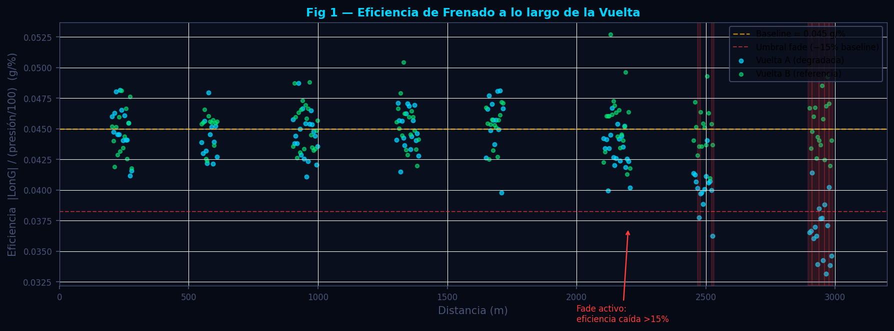
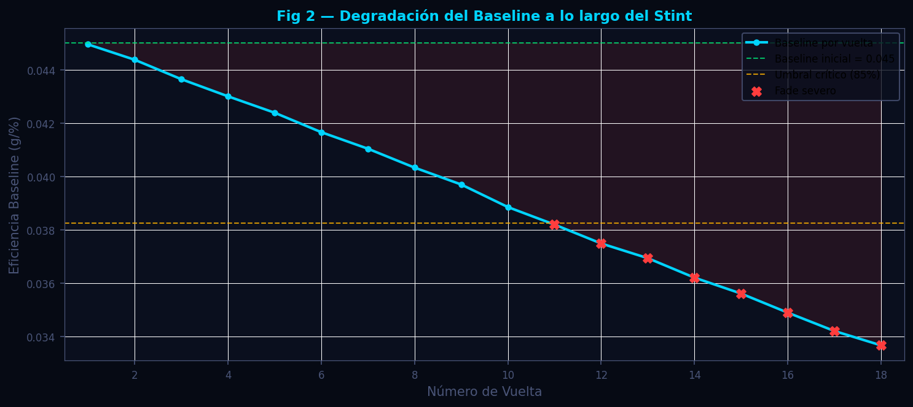
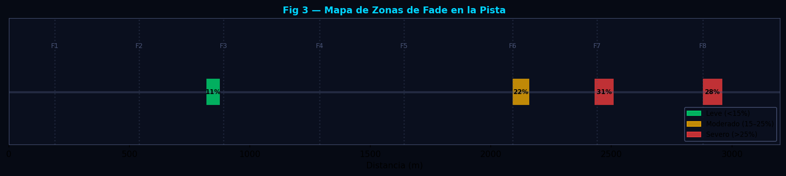

# Brake Fade — Eficiencia y Degradación de Frenado

**Módulo:** `src/analytics/brake_fade.py`  
**Fecha de revisión:** 2026-06-12

---

## Tabla de Contenidos

1. [Descripción General](#descripción-general)
2. [Fundamentos Científicos](#fundamentos-científicos)
   - 2.1 [Física del Brake Fade](#21-física-del-brake-fade)
   - 2.2 [Métrica de Eficiencia de Frenado](#22-métrica-de-eficiencia-de-frenado)
   - 2.3 [Detección de Degradación Progresiva](#23-detección-de-degradación-progresiva)
3. [Algoritmo e Implementación](#algoritmo-e-implementación)
   - 3.1 [`_efficiency_series`](#31-_efficiency_series)
   - 3.2 [`_fade_zones`](#32-_fade_zones)
   - 3.3 [`analizar_eficiencia_frenado`](#33-analizar_eficiencia_frenado)
4. [Parámetros Clave](#parámetros-clave)
5. [Interpretación de Resultados](#interpretación-de-resultados)
6. [Recomendaciones para el Piloto](#recomendaciones-para-el-piloto)
7. [Visualizaciones](#visualizaciones)
8. [Referencias](#referencias)

---

## Descripción General

El módulo de brake fade cuantifica la eficiencia del sistema de frenado vuelta a vuelta cruzando la presión ejercida sobre el pedal (canal `Brake`, en % de recorrido) con la desaceleración longitudinal generada (canal `LongitudinalG`, en g). Un piloto que aplica la misma presión pero obtiene menos G de desaceleración al final del stint está experimentando brake fade térmico: la temperatura acumulada en los discos reduce el coeficiente de rozamiento del compuesto de freno.

El módulo trabaja sobre el DataFrame alineado (sufijos `_Fast` / `_Slow`) para comparar la evolución de la eficiencia entre dos vueltas y localizar las zonas de la pista donde la degradación es más pronunciada.

---

## Fundamentos Científicos

### 2.1 Física del Brake Fade

El brake fade ocurre cuando la temperatura de los discos supera el rango operativo del compuesto de pastilla. Existen dos mecanismos principales:

**Fade de compuesto (pad fade):** La resina aglomerante de la pastilla comienza a volatilizarse, creando una capa de gas entre la pastilla y el disco que actúa como lubricante y reduce el coeficiente de rozamiento μ:

$$
\mu_{fade}(T) \approx \mu_0 \cdot \left(1 - k_{fade} \cdot \frac{T - T_{fade}}{T_{ref}}\right)
$$

donde $T_{fade}$ es la temperatura de inicio del fade y $k_{fade}$ es la tasa de degradación específica del compuesto.

**Fade de fluido (fluid fade):** El líquido de frenos hierve en las tuberías o en el cilindro de rueda, generando burbujas de vapor compresibles que hacen que el pedal se hunda antes de generar presión efectiva. Este tipo de fade es más brusco e impredecible.

En ambos casos, la señal en telemetría es la misma: la presión del pedal aumenta (o se mantiene constante) mientras la desaceleración generada disminuye.

---

### 2.2 Métrica de Eficiencia de Frenado

La eficiencia instantánea en cada punto de frenada se define como:

$$
\eta_{freno}(s) = \frac{|G_{lon}(s)|}{p_{brake}(s) / 100}
$$

donde:
- $|G_{lon}(s)|$ es la desaceleración longitudinal en g (valor absoluto; la señal es negativa durante la frenada)
- $p_{brake}(s)$ es la presión del pedal como porcentaje del recorrido máximo (0–100%)
- El cociente tiene unidades de **g por unidad de presión relativa**

La métrica solo se computa en zonas de frenada activa:

$$
\text{zona de frenado} \iff p_{brake}(s) \geq 15\% \;\wedge\; G_{lon}(s) < -0.05 \text{ g}
$$

Fuera de estas zonas, $\eta_{freno}$ se deja como NaN para no contaminar el análisis.

---

### 2.3 Detección de Degradación Progresiva

El baseline de eficiencia se calcula como la media de $\eta_{freno}$ en el **primer tercio de la vuelta**, donde los frenos aún no han alcanzado la temperatura máxima del stint. Una caída relativa superior al umbral `FADE_DROP` respecto al baseline indica fade activo:

$$
\text{Fade} \iff \eta_{freno}(s) < \text{baseline} \cdot (1 - \Delta_{fade})
$$

donde $\Delta_{fade} = 0.15$ (15% de caída relativa respecto al baseline inicial).

Las zonas de fade se agrupan en intervalos contiguos y se reportan con su severidad:

$$
\text{severity}_z = 1 - \frac{\min(\eta_{freno}) \text{ en zona}}{\text{baseline}}
$$

---

## Algoritmo e Implementación

### 3.1 `_efficiency_series`

```
Entradas:
  brake  — presión de pedal (%, Series)
  lon_g  — aceleración longitudinal (g, Series)

Proceso:
  1. Crear máscara: braking = (brake >= 15%) AND (lon_g < -0.05 g)
  2. Para muestras en braking:
       eff = |lon_g| / (brake / 100)
       (denominador clippeado a EFFICIENCY_FLOOR = 0.01 para evitar ÷0)
  3. Para muestras fuera de braking: eff = NaN

Salida: pd.Series de eficiencia, NaN fuera de zonas de frenado
```

---

### 3.2 `_fade_zones`

```
Entradas:
  distance — eje de distancia (m)
  eff      — eficiencia por muestra (NaN fuera de zonas de frenado)
  baseline — eficiencia de referencia (primer tercio del lap)

Proceso:
  threshold = baseline * (1 - 0.15)   # caída >15%
  1. Recorrer series punto a punto
  2. Si eff < threshold → marcar inicio de zona fade (si no estaba ya en una)
  3. Al salir de zona → registrar {start, end, severity}
     severity = 1 - (eff_mínima_en_zona / baseline)

Salida: lista de dicts [{start, end, severity}, ...]
```

---

### 3.3 `analizar_eficiencia_frenado`

```
Entradas:
  df — DataFrame alineado con Brake_Fast, LongitudinalG_Fast, Brake_Slow, LongitudinalG_Slow

Para cada vuelta (A = _Fast, B = _Slow):
  1. Calcular eff = _efficiency_series(brake, lon_g)
  2. baseline = mean(eff en el primer tercio, dropna)
  3. score    = mean(eff completa, dropna)
  4. fade_zones = _fade_zones(distance, eff, baseline)

Salida por distancia (downsampled × 5):
  distance, efficiency_a, efficiency_b

Retorna dict con:
  available, available_a, available_b,
  score_a, score_b, baseline_a, baseline_b,
  fade_zones_a, fade_zones_b,
  per_distance{}
```

---

## Parámetros Clave

| Parámetro | Valor por defecto | Descripción |
|---|---|---|
| `BRAKE_THRESHOLD` | 15% | Presión mínima del pedal para declarar zona de frenado |
| `DECEL_THRESHOLD` | 0.05 g | Desaceleración mínima para confirmar frenada activa |
| `EFFICIENCY_FLOOR` | 0.01 | Clamping mínimo del denominador (evita ÷0) |
| `FADE_DROP` | 0.15 (15%) | Caída relativa del baseline que define fade activo |
| `DOWNSAMPLE` | 5 | Factor de reducción para la serie por distancia |

---

## Interpretación de Resultados

### Score global de eficiencia

El `score` es la media de $\eta_{freno}$ en todas las zonas de frenado de la vuelta. Un score mayor indica frenos más eficientes para la presión aplicada. La diferencia entre el score de la vuelta A y B, combinada con el análisis de zonas, permite distinguir:

- **Score similar, sin zonas de fade:** ambas vueltas tienen frenos en buen estado — la diferencia de tiempo de vuelta no viene del sistema de frenado.
- **Score degradado en B + zonas de fade al final de la vuelta:** fade progresivo; los frenos del stint B llegaron a temperatura operativa límite.
- **Score degradado en A desde la primera frenada:** posible error de baseline (neumáticos o frenos fríos), problema mecánico, o frenos sobredimensionados para la pista.

### Severidad de las zonas de fade

| Severidad | Rango | Acción recomendada |
|---|---|---|
| < 0.15 | Leve degradación | Monitorear en siguiente sesión |
| 0.15–0.30 | Fade moderado | Revisar temperatura de discos; ajustar cooling |
| > 0.30 | Fade severo | Cambio de compuesto o ductos de refrigeración |

### Patrones espaciales

- **Fade concentrado en la primera frenada fuerte** (típicamente la más larga de la pista): los frenos no han disipado suficiente calor entre la última vuelta y la actual. Cooling insuficiente en la vuelta de enfriamiento.
- **Fade progresivo a lo largo del stint** (zonas aparecen cada vez más tarde en la vuelta): degradación térmica acumulativa. Los discos no vuelven a temperatura base entre vueltas.
- **Fade puntual en una sola frenada**: posible punto caliente en el disco o pastilla asimétrica. Revisar desgaste diferencial entre los frenos del mismo eje.

---

## Recomendaciones para el Piloto

**Fade leve al final del stint:**
Reducir la presión máxima del pedal un 5% en las dos últimas frenadas fuertes. El coche tardará ligeramente más en frenar pero los frenos llegarán a la siguiente vuelta en mejor estado térmico.

**Fade severo desde la mitad del stint:**
El compuesto de pastilla está fuera de su rango operativo. Solicitar al ingeniero revisar la temperatura de disco (pyrometer en pit). Considerar aumentar el ducto de refrigeración de frenos o cambiar a un compuesto de mayor temperatura de operación.

**Hundimiento de pedal (fade de fluido):**
Señal de que el líquido de frenos está hirviendo. Acción inmediata: entrar a pits para bleeding o verificar pérdidas. Asegurarse de que el brake bias no está demasiado adelantado (el freno trasero calienta menos pero el delantero puede superar 900°C en circuitos de alta carga).

---

## Visualizaciones

Generadas por `scripts/docs/gen_brake_fade.py` con datos sintéticos.

---

### Figura 1 — Eficiencia de Frenado a lo largo de la Vuelta



Serie temporal de la eficiencia $\eta_{freno}$ para dos vueltas (vuelta A en cian, vuelta B en rojo). Los puntos solo aparecen en las zonas de frenado activo. La línea discontinua horizontal marca el baseline de eficiencia de la vuelta A. Las zonas sombreadas en rojo indican donde la eficiencia cae más de un 15% respecto al baseline, clasificadas como fade activo.

---

### Figura 2 — Degradación del Baseline a lo Largo del Stint



Evolución del baseline de eficiencia a lo largo de múltiples vueltas simuladas de un stint. La línea sólida verde muestra el baseline inicial; la curva cian el baseline medido vuelta a vuelta. La pendiente negativa cuantifica la tasa de degradación térmica acumulativa. La banda sombreada naranja indica el umbral crítico (85% del baseline inicial).

---

### Figura 3 — Mapa de Zonas de Fade en la Pista



Mapa lineal de la distancia de la vuelta (eje X) con marcadores de las zonas de fade detectadas. El grosor y color de cada marcador codifica la severidad (verde leve → rojo severo). Las frenadas principales de la pista se identifican con anotaciones de la distancia de inicio. Este mapa permite al ingeniero identificar qué frenadas específicas presentan fade y planificar el ducto de refrigeración en consecuencia.

---

## Referencias

1. Segers, J. (2014). *Analysis Techniques for Racecar Data Acquisition* (2nd ed.). SAE International. — Capítulo sobre análisis de frenado: presión de pedal vs. desaceleración; detección de fade desde telemetría.

2. Milliken, W. F., & Milliken, D. L. (1995). *Race Car Vehicle Dynamics*. SAE International. — Modelos de transferencia de carga en frenada; análisis del bias de frenado delantero/trasero.

3. Limpert, R. (2011). *Brake Design and Safety* (3rd ed.). SAE International. — Física del fade de compuesto: volatilización de resinas aglomerantes; curvas μ–T de pastillas de competición.

4. Day, A. (2014). *Braking of Road Vehicles*. Elsevier. — Modelo térmico de disco de freno; temperatura de equilibrio en función de velocidad y presión; fade de fluido hidráulico.
