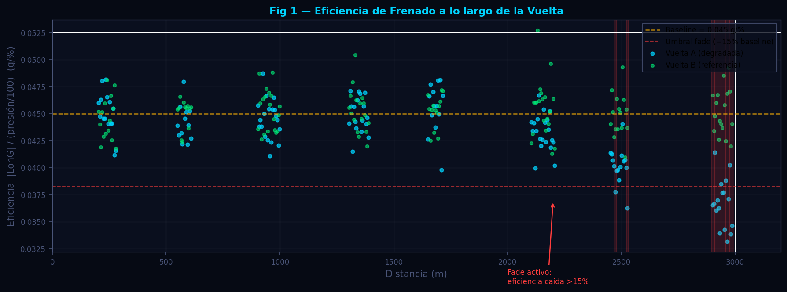
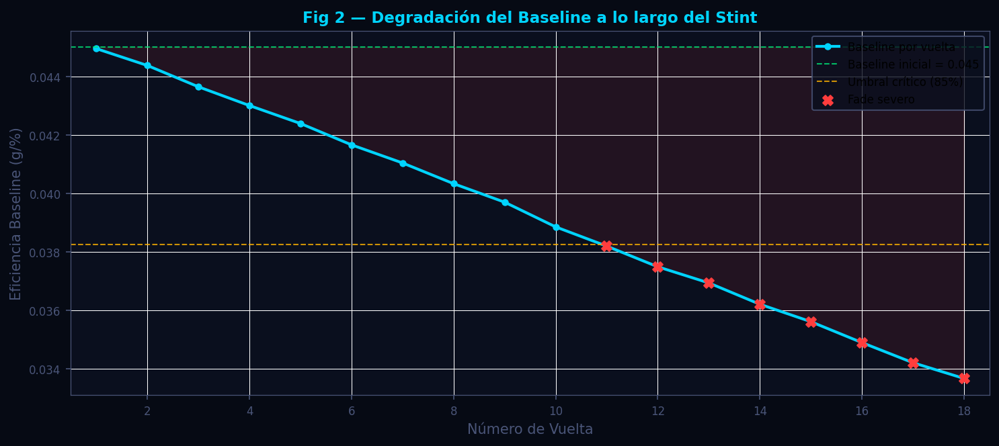
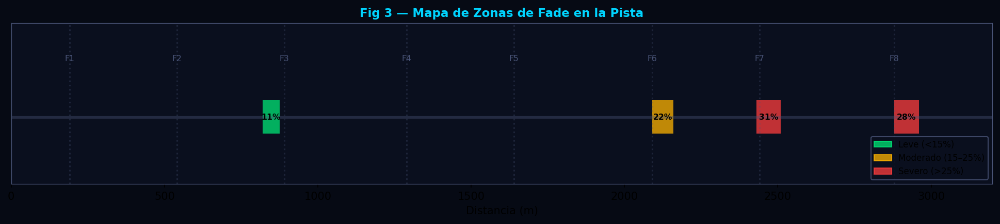

# Brake Fade — Braking Efficiency & Degradation

🌐 [Ver en Español](./10_brake_fade.es.md)

**Module:** `src/analytics/brake_fade.py`  
**Review date:** 2026-06-12

---

## Table of Contents

1. [Overview](#overview)
2. [Scientific Background](#scientific-background)
   - 2.1 [Physics of Brake Fade](#21-physics-of-brake-fade)
   - 2.2 [Braking Efficiency Metric](#22-braking-efficiency-metric)
   - 2.3 [Progressive Degradation Detection](#23-progressive-degradation-detection)
3. [Algorithm & Implementation](#algorithm--implementation)
   - 3.1 [`_efficiency_series`](#31-_efficiency_series)
   - 3.2 [`_fade_zones`](#32-_fade_zones)
   - 3.3 [`analyse_braking_efficiency`](#33-analyse_braking_efficiency)
4. [Key Parameters](#key-parameters)
5. [Result Interpretation](#result-interpretation)
6. [Pilot Recommendations](#pilot-recommendations)
7. [Visualizations](#visualizations)
8. [References](#references)

---

## Overview

The brake fade module quantifies braking system efficiency lap by lap by crossing the pedal pressure applied (`Brake` channel, in % travel) with the longitudinal deceleration generated (`LongitudinalG` channel, in g). A driver applying the same pressure but obtaining less deceleration G at the end of the stint is experiencing thermal brake fade: the heat accumulated in the discs reduces the friction coefficient of the brake pad compound.

The module works on the aligned DataFrame (`_Fast` / `_Slow` suffixes) to compare efficiency evolution between two laps and locate the track zones where degradation is most pronounced.

---

## Scientific Background

### 2.1 Physics of Brake Fade

Brake fade occurs when disc temperature exceeds the pad compound's operating range. There are two main mechanisms:

**Compound fade (pad fade):** The binder resin in the pad begins to vaporise, creating a gas layer between pad and disc that acts as a lubricant and reduces the friction coefficient μ:

$$
\mu_{fade}(T) \approx \mu_0 \cdot \left(1 - k_{fade} \cdot \frac{T - T_{fade}}{T_{ref}}\right)
$$

where $T_{fade}$ is the fade onset temperature and $k_{fade}$ is the compound-specific degradation rate.

**Fluid fade:** The brake fluid boils in the lines or wheel cylinder, generating compressible vapour bubbles that cause the pedal to sink before generating effective pressure. This type of fade is more abrupt and unpredictable.

In both cases, the telemetry signal is the same: pedal pressure increases (or remains constant) while the deceleration generated decreases.

---

### 2.2 Braking Efficiency Metric

Instantaneous efficiency at each braking point is defined as:

$$
\eta_{brake}(s) = \frac{|G_{lon}(s)|}{p_{brake}(s) / 100}
$$

where:
- $|G_{lon}(s)|$ is the longitudinal deceleration in g (absolute value; the signal is negative during braking)
- $p_{brake}(s)$ is the pedal pressure as a percentage of maximum travel (0–100%)
- The ratio has units of **g per unit of relative pressure**

The metric is only computed in active braking zones:

$$
\text{braking zone} \iff p_{brake}(s) \geq 15\% \;\wedge\; G_{lon}(s) < -0.05 \text{ g}
$$

Outside these zones, $\eta_{brake}$ is left as NaN to avoid contaminating the analysis.

---

### 2.3 Progressive Degradation Detection

The efficiency baseline is calculated as the mean of $\eta_{brake}$ in the **first third of the lap**, where the brakes have not yet reached the stint's peak temperature. A relative drop greater than the `FADE_DROP` threshold with respect to the baseline indicates active fade:

$$
\text{Fade} \iff \eta_{brake}(s) < \text{baseline} \cdot (1 - \Delta_{fade})
$$

where $\Delta_{fade} = 0.15$ (15% relative drop from the initial baseline).

Fade zones are grouped into contiguous intervals and reported with their severity:

$$
\text{severity}_z = 1 - \frac{\min(\eta_{brake}) \text{ in zone}}{\text{baseline}}
$$

---

## Algorithm & Implementation

### 3.1 `_efficiency_series`

```
Inputs:
  brake  — pedal pressure (%, Series)
  lon_g  — longitudinal acceleration (g, Series)

Process:
  1. Create mask: braking = (brake >= 15%) AND (lon_g < -0.05 g)
  2. For samples in braking:
       eff = |lon_g| / (brake / 100)
       (denominator clipped to EFFICIENCY_FLOOR = 0.01 to avoid ÷0)
  3. For samples outside braking: eff = NaN

Output: pd.Series of efficiency, NaN outside braking zones
```

---

### 3.2 `_fade_zones`

```
Inputs:
  distance — distance axis (m)
  eff      — efficiency per sample (NaN outside braking zones)
  baseline — reference efficiency (first third of lap)

Process:
  threshold = baseline * (1 - 0.15)   # >15% drop
  1. Iterate over series point by point
  2. If eff < threshold → mark fade zone start (if not already in one)
  3. On zone exit → record {start, end, severity}
     severity = 1 - (min_eff_in_zone / baseline)

Output: list of dicts [{start, end, severity}, ...]
```

---

### 3.3 `analyse_braking_efficiency`

```
Inputs:
  df — aligned DataFrame with Brake_Fast, LongitudinalG_Fast, Brake_Slow, LongitudinalG_Slow

For each lap (A = _Fast, B = _Slow):
  1. Calculate eff = _efficiency_series(brake, lon_g)
  2. baseline = mean(eff in first third, dropna)
  3. score    = mean(eff overall, dropna)
  4. fade_zones = _fade_zones(distance, eff, baseline)

Per-distance output (downsampled × 5):
  distance, efficiency_a, efficiency_b

Returns dict with:
  available, available_a, available_b,
  score_a, score_b, baseline_a, baseline_b,
  fade_zones_a, fade_zones_b,
  per_distance{}
```

---

## Key Parameters

| Parameter | Default value | Description |
|---|---|---|
| `BRAKE_THRESHOLD` | 15% | Minimum pedal pressure to declare a braking zone |
| `DECEL_THRESHOLD` | 0.05 g | Minimum deceleration to confirm active braking |
| `EFFICIENCY_FLOOR` | 0.01 | Minimum denominator clamp (avoids ÷0) |
| `FADE_DROP` | 0.15 (15%) | Relative baseline drop that defines active fade |
| `DOWNSAMPLE` | 5 | Reduction factor for the per-distance series |

---

## Result Interpretation

### Global efficiency score

The `score` is the mean of $\eta_{brake}$ across all braking zones in the lap. A higher score indicates more efficient brakes for the pressure applied. The difference between Lap A and Lap B scores, combined with zone analysis, allows distinction between:

- **Similar scores, no fade zones:** both laps have brakes in good condition — the lap time difference does not come from the braking system.
- **Degraded score in B + fade zones at end of lap:** progressive fade; Lap B stint brakes reached their thermal operating limit.
- **Degraded score in A from the first braking point:** possible baseline error (cold tyres or brakes), mechanical issue, or brakes oversized for the circuit.

### Fade zone severity

| Severity | Range | Recommended action |
|---|---|---|
| < 0.15 | Mild degradation | Monitor in next session |
| 0.15–0.30 | Moderate fade | Check disc temperature; adjust cooling |
| > 0.30 | Severe fade | Compound change or cooling duct modifications |

### Spatial patterns

- **Fade concentrated at the first heavy braking point** (typically the longest on the circuit): brakes have not dissipated enough heat between the previous lap and the current one. Insufficient cooling during the cool-down lap.
- **Progressive fade throughout the stint** (zones appearing later and later in the lap): cumulative thermal degradation. Discs are not returning to base temperature between laps.
- **Fade at a single braking point only**: possible hot spot on the disc or asymmetric pad. Check for differential wear between brakes on the same axle.

---

## Pilot Recommendations

**Mild fade at end of stint:**
Reduce maximum pedal pressure by 5% at the two final heavy braking points. The car will take slightly longer to stop but brakes will arrive at the next lap in better thermal condition.

**Severe fade from mid-stint:**
The pad compound is outside its operating range. Request the engineer to check disc temperature (pyrometer in pit). Consider increasing the brake cooling duct or switching to a higher-operating-temperature compound.

**Pedal sinking (fluid fade):**
Sign that brake fluid is boiling. Immediate action: pit stop for bleeding or check for leaks. Ensure brake bias is not too far forward (rear brakes run cooler but front brakes can exceed 900°C on high-load circuits).

---

## Visualizations

Generated by `scripts/docs/gen_brake_fade.py` with synthetic data.

---

### Figure 1 — Braking Efficiency Over the Lap



Time series of $\eta_{brake}$ for two laps (Lap A in cyan, Lap B in red). Points only appear in active braking zones. The horizontal dashed line marks the Lap A efficiency baseline. Red-shaded zones indicate where efficiency drops more than 15% below baseline, classified as active fade.

---

### Figure 2 — Baseline Degradation Over the Stint



Evolution of the efficiency baseline across multiple simulated stint laps. The solid green line shows the initial baseline; the cyan curve shows the measured baseline lap by lap. The negative slope quantifies the cumulative thermal degradation rate. The amber shaded band indicates the critical threshold (85% of the initial baseline).

---

### Figure 3 — Fade Zone Map on Track



Linear map of lap distance (X axis) with markers for detected fade zones. The thickness and colour of each marker encode severity (green mild → red severe). The main circuit braking points are identified with distance annotations. This map allows the engineer to identify which specific braking points show fade and plan cooling duct placement accordingly.

---

## References

1. Segers, J. (2014). *Analysis Techniques for Racecar Data Acquisition* (2nd ed.). SAE International. — Chapter on braking analysis: pedal pressure vs. deceleration; fade detection from telemetry.

2. Milliken, W. F., & Milliken, D. L. (1995). *Race Car Vehicle Dynamics*. SAE International. — Load transfer models under braking; front/rear brake bias analysis.

3. Limpert, R. (2011). *Brake Design and Safety* (3rd ed.). SAE International. — Physics of compound fade: binder resin vaporisation; μ–T curves of competition pads.

4. Day, A. (2014). *Braking of Road Vehicles*. Elsevier. — Brake disc thermal model; equilibrium temperature as a function of speed and pressure; hydraulic fluid fade.

---

*Also available in [Español 🇪🇸](./10_brake_fade.es.md)*
