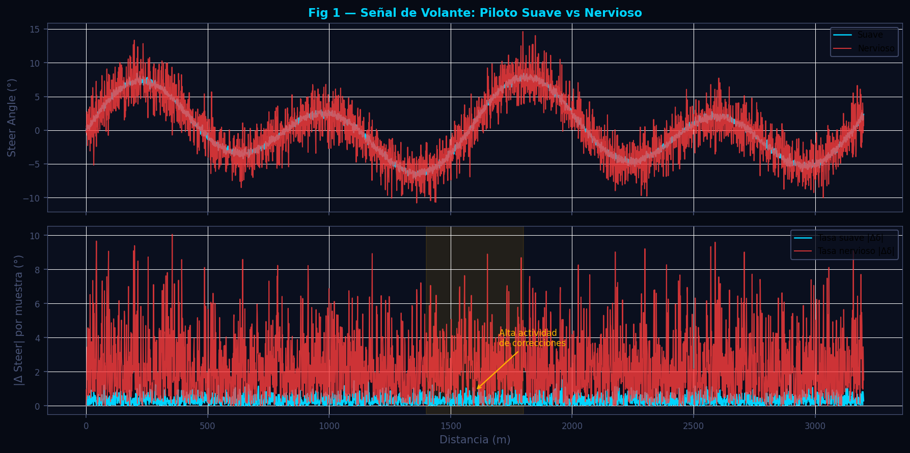
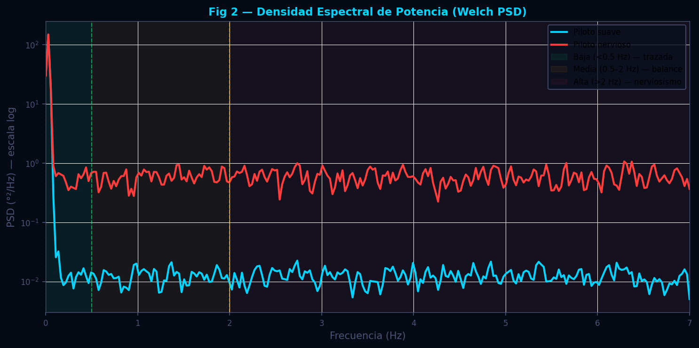
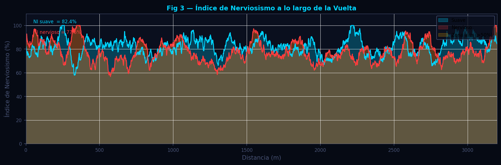

# Inputs del Piloto — FFT y Nerviosismo de Volante

**Módulo:** `src/analytics/driver_inputs.py`  
**Fecha de revisión:** 2026-06-12

---

## Tabla de Contenidos

1. [Descripción General](#descripción-general)
2. [Fundamentos Científicos](#fundamentos-científicos)
   - 2.1 [Frecuencia de las Correcciones de Volante](#21-frecuencia-de-las-correcciones-de-volante)
   - 2.2 [Estimación de Densidad Espectral de Potencia (PSD)](#22-estimación-de-densidad-espectral-de-potencia-psd)
   - 2.3 [Índice de Nerviosismo Normalizado](#23-índice-de-nerviosismo-normalizado)
   - 2.4 [Solapamiento Freno-Gas](#24-solapamiento-freno-gas)
3. [Algoritmo e Implementación](#algoritmo-e-implementación)
   - 3.1 [`_nervousness_series`](#31-_nervousness_series)
   - 3.2 [`_fft_bands`](#32-_fft_bands)
   - 3.3 [`analizar_inputs_piloto`](#33-analizar_inputs_piloto)
4. [Parámetros Clave](#parámetros-clave)
5. [Interpretación de Resultados](#interpretación-de-resultados)
6. [Recomendaciones para el Piloto](#recomendaciones-para-el-piloto)
7. [Visualizaciones](#visualizaciones)
8. [Referencias](#referencias)

---

## Descripción General

El módulo de análisis de inputs del piloto cuantifica la calidad de las correcciones aplicadas al volante usando dos técnicas complementarias: un **índice de nerviosismo** basado en la media móvil de la tasa de variación del ángulo, y un análisis **espectral (Welch PSD)** que descompone la señal de volante en bandas de frecuencia. La banda de alta frecuencia (> 2 Hz) es el principal indicador de micro-correcciones involuntarias asociadas a falta de confianza en el grip o fatiga del piloto. Adicionalmente, el módulo calcula el porcentaje de tiempo con solapamiento simultáneo de freno y gas, un indicador del estilo de conducción en las transiciones de frenado a aceleración.

---

## Fundamentos Científicos

### 2.1 Frecuencia de las Correcciones de Volante

Las entradas de volante de un piloto experto se pueden clasificar por frecuencia:

| Rango | Tipo de movimiento | Causa |
|---|---|---|
| < 0.5 Hz | Variaciones de trazada y curvas largas | Intencional — cambio de línea o trazo de curva |
| 0.5–2 Hz | Correcciones de balance | Respuesta a cambios de transferencia de carga |
| > 2 Hz | Micro-correcciones | Neumáticos en límite de adherencia, superficie irregular, o nerviosismo |

Un piloto en confianza y con buen ritmo aplica las entradas de volante principalmente en la banda baja (< 0.5 Hz), con transiciones suaves hacia la banda media. Un piloto fatigado, con falta de confianza o con un coche de setup problemático genera significativamente más potencia en la banda alta (> 2 Hz).

---

### 2.2 Estimación de Densidad Espectral de Potencia (PSD)

El módulo usa el método de **Welch** para estimar la PSD, que divide la señal en ventanas solapadas con función de Hann, calcula el periodograma de cada ventana y promedia:

$$
S_{xx}(f) = \frac{1}{K} \sum_{k=0}^{K-1} \left| \sum_{n=0}^{N-1} x_k[n] \cdot w[n] \cdot e^{-j2\pi fn/N} \right|^2
$$

donde $K$ es el número de ventanas, $N$ el tamaño de cada ventana (`nperseg = min(256, len/2)`) y $w[n]$ es la ventana de Hann.

La potencia en cada banda se calcula como la integral de la PSD en el rango correspondiente mediante la regla trapezoidal:

$$
P_{banda} = \int_{f_1}^{f_2} S_{xx}(f)\, df \approx \sum_{f \in [f_1, f_2]} S_{xx}(f) \cdot \Delta f
$$

La potencia relativa de cada banda se normaliza por la potencia total:

$$
P_{banda,\%} = \frac{P_{banda}}{P_{total}} \times 100\%
$$

**Frecuencia de muestreo efectiva:** El DataFrame alineado tiene pasos de 1 m. A una velocidad media de $\bar{v}$ km/h, la frecuencia de muestreo efectiva es:

$$
f_s \approx \frac{\bar{v}}{3.6} \;\text{Hz}
$$

A 50 km/h, $f_s \approx 14$ Hz; a 100 km/h, $f_s \approx 28$ Hz. Esta estimación asegura que el eje de frecuencias del PSD sea físicamente correcto.

---

### 2.3 Índice de Nerviosismo Normalizado

El índice de nerviosismo es una alternativa al FFT que funciona muestra a muestra y permite generar una curva sobre la distancia de la vuelta:

$$
r[i] = |\delta[i] - \delta[i-1]|
$$

$$
\text{nerv}[i] = \text{rolling\_mean}(r, W)[i]
$$

$$
\text{nerv\_norm}[i] = \frac{\text{nerv}[i]}{\text{percentil}_{99}(\text{nerv})}
$$

donde $W = 80$ muestras (≈ 80 m de ventana centrada). La normalización por el percentil 99 (en lugar del máximo absoluto) elimina el efecto de picos espúreos aislados y hace comparable el índice entre vueltas de diferente duración o velocidad media.

El índice global de nerviosismo es la media del índice normalizado sobre toda la vuelta:

$$
\text{NI} = \langle \text{nerv\_norm} \rangle \in [0, 1]
$$

---

### 2.4 Solapamiento Freno-Gas

El porcentaje de tiempo con freno y gas simultáneos es un indicador del estilo de conducción:

$$
\text{overlap\_pct} = \frac{|\{i : \text{Brake}_i > 5\% \;\wedge\; \text{Throttle}_i > 5\%\}|}{N} \times 100\%
$$

Un solapamiento moderado (2–8%) es técnicamente correcto en la fase de trail-braking (el piloto va liberando el freno mientras abre el gas lentamente al salir del apex). Un solapamiento muy alto (> 15%) puede indicar pánico en la frenada o mal uso de los controles.

---

## Algoritmo e Implementación

### 3.1 `_nervousness_series`

```
Entradas: steer (pd.Series, grados)

1. rate = |diff(steer)|          # tasa de cambio absoluta por muestra
2. smoothed = rolling_mean(rate, window=80, center=True, min_periods=1)
3. p99 = quantile(smoothed, 0.99)
4. Si p99 < 1e-6 → retornar serie de ceros (señal plana)
5. normed = clip(smoothed / p99, 0, 1)

Salida: pd.Series en [0, 1] con la misma longitud que steer
```

---

### 3.2 `_fft_bands`

```
Entradas: steer (pd.Series), sample_rate_hz (float)

1. Si len(steer) < 64 → retornar {low:0, mid:0, high:0}
2. s = ffill(steer).fillna(0).values
3. freqs, psd = welch(s, fs=sample_rate_hz, nperseg=min(256, len/2))
4. total = trapz(psd, freqs);  si total < 1e-12 → usar 1.0

Para cada banda:
  low  = trapz(psd[freqs <  0.5],  freqs[freqs <  0.5])  / total
  mid  = trapz(psd[0.5 ≤ f < 2.0], freqs[0.5 ≤ f < 2.0]) / total
  high = trapz(psd[freqs >= 2.0],  freqs[freqs >= 2.0])  / total

Salida: {low, mid, high} suma ≈ 1.0 (puede diferir por NaN en bordes)
```

---

### 3.3 `analizar_inputs_piloto`

```
Entradas: df (DataFrame alineado con SteerAngle_Fast/Slow, Brake_Fast/Slow, Throttle_Fast/Slow)

Para cada vuelta (A = _Fast, B = _Slow):
  1. nerv_series = _nervousness_series(SteerAngle)
  2. bands       = _fft_bands(SteerAngle, sample_rate_hz estimada desde Speed)
  3. overall     = mean(nerv_series)
  4. label       = _nervousness_label(overall, bands.high)
  5. overlap_pct = _overlap_pct(Brake, Throttle)

Salida por distancia (downsampled × 5):
  distance, nervousness_a, nervousness_b

Retorna dict con:
  available, available_a, available_b,
  nervousness_score_a/b, fft_bands_a/b,
  nervousness_label_a/b, overlap_pct_a/b,
  per_distance{}
```

La etiqueta de nerviosismo se asigna según una tabla cruzada (NI × banda alta):

| NI | P(high) | Etiqueta |
|---|---|---|
| < 0.15 | < 0.15 | Muy suave |
| < 0.30 | < 0.25 | Suave |
| < 0.50 | < 0.40 | Normal |
| < 0.70 | < 0.55 | Activo |
| ≥ 0.70 | ≥ 0.55 | Nervioso |

---

## Parámetros Clave

| Parámetro | Valor por defecto | Descripción |
|---|---|---|
| `ROLLING_WIN` | 80 muestras | Ventana de la media móvil de la tasa de volante |
| `DOWNSAMPLE` | 5 | Factor de reducción para la serie por distancia |
| `nperseg` | min(256, n/2) | Tamaño de ventana del Welch PSD |
| `brake_thr` | 5% | Umbral mínimo de presión de freno para solapamiento |
| `thr_thr` | 5% | Umbral mínimo de apertura de gas para solapamiento |
| Banda baja | < 0.5 Hz | Movimientos intencionales de trazada |
| Banda media | 0.5–2 Hz | Correcciones de balance dinámico |
| Banda alta | > 2 Hz | Micro-correcciones (indicador de nerviosismo) |

---

## Interpretación de Resultados

### Índice de nerviosismo global

| Rango NI | Diagnóstico |
|---|---|
| 0–0.15 | Piloto muy fluido; entradas suaves y progresivas |
| 0.15–0.30 | Conducción suave con correcciones leves en curvas complejas |
| 0.30–0.50 | Nivel normal para un piloto amateur con buen ritmo |
| 0.50–0.70 | Piloto activo; posible falta de confianza en neumáticos o setup |
| > 0.70 | Conducción nerviosa; fatiga, neumáticos fríos, o setup con vibración |

### Bandas FFT

- **Banda alta > 40%:** La mitad de la energía de las correcciones está en micro-movimientos > 2 Hz. Señal de alerta: el coche puede tener vibración de frenos, flat-spot, o el piloto está en el límite de su capacidad de control.
- **Banda baja > 60%:** Excelente. La mayoría de las correcciones son movimientos intencionales de trazada.
- **Banda media 30–50%:** Normal en curvas técnicas donde la transferencia de carga requiere adaptación continua.

### Solapamiento freno-gas

| % Solapamiento | Diagnóstico |
|---|---|
| 0–2% | Técnica de trail-braking mínima o nula |
| 2–8% | Trail-braking óptimo en las curvas apropiadas |
| 8–15% | Solapamiento elevado; revisar si es intencional o pánico |
| > 15% | Muy alto; puede saturar los frenos traseros si el balance está adelantado |

---

## Recomendaciones para el Piloto

**Nerviosismo alto en curvas rápidas:**
El piloto está haciendo micro-correcciones involuntarias que sugieren que el coche está al límite o más allá. Reducir la velocidad de entrada en esas curvas y reconstruir la confianza progresivamente. Verificar el setup de suspensión (rebote trasero demasiado rápido puede generar inestabilidad en tracción).

**Nerviosismo alto concentrado en la frenada:**
Posible flat-spot en los neumáticos o vibración de discos. Comprobar el estado de los neumáticos y el balance de frenado. Un balance demasiado adelantado puede generar bloqueo esporádico del eje delantero, que el piloto percibe como vibración.

**Banda alta elevada pero NI bajo:**
El volante tiene mucho "ruido" de alta frecuencia pero con amplitud pequeña. Puede indicar vibración mecánica (no del piloto). Cruzar con datos de aceleración lateral para descartar resonancia de suspensión.

---

## Visualizaciones

Generadas por `scripts/docs/gen_driver_inputs.py` con datos sintéticos.

---

### Figura 1 — Señal de Volante y Tasa de Cambio



Panel superior: ángulo de volante (°) a lo largo de la distancia de la vuelta para dos pilotos (suave vs nervioso). Panel inferior: tasa de cambio absoluta |Δδ| por muestra. La diferencia de amplitud en la banda alta es claramente visible: el piloto nervioso genera picos de mayor amplitud y más frecuentes.

---

### Figura 2 — Densidad Espectral de Potencia (PSD) Comparativa



PSD de Welch para dos pilotos. Las bandas baja, media y alta están sombreadas en verde, naranja y rojo respectivamente. El área relativa de cada banda representa la fracción de potencia. El piloto suave concentra su potencia en la banda baja; el piloto nervioso tiene un pico prominente en la banda alta.

---

### Figura 3 — Índice de Nerviosismo a lo largo de la Vuelta



Área chart del índice de nerviosismo normalizado (0–100%) en función de la distancia de la vuelta para las dos vueltas comparadas. Las zonas de alta actividad se resaltan con un fondo naranja. La curva permite identificar qué secciones de la pista generan más estrés en los inputs del piloto.

---

## Referencias

1. Segers, J. (2014). *Analysis Techniques for Racecar Data Acquisition* (2nd ed.). SAE International. — Análisis de canales de volante; interpretación de micro-correcciones como indicadores de carga cognitiva.

2. Welch, P. D. (1967). The use of fast Fourier transform for the estimation of power spectra: A method based on time averaging over short, modified periodograms. *IEEE Transactions on Audio and Electroacoustics*, 15(2), 70–73.

3. Bärgman, J., et al. (2017). Driving behaviour analysis using naturalistic data. *Transportation Research Part F*, 47, 198–210. — Análisis de frecuencia de inputs de volante como métrica de demanda cognitiva.

4. Attia, R., et al. (2012). Combined longitudinal and lateral control for automated vehicle guidance. *Vehicle System Dynamics*, 50(9), 1447–1484. — Frecuencias características de control de volante humano vs. automatizado.
