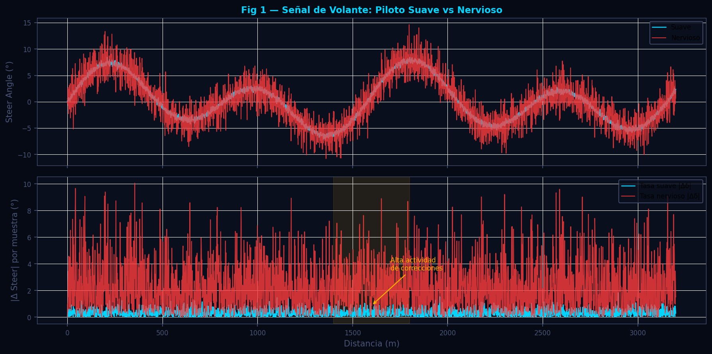
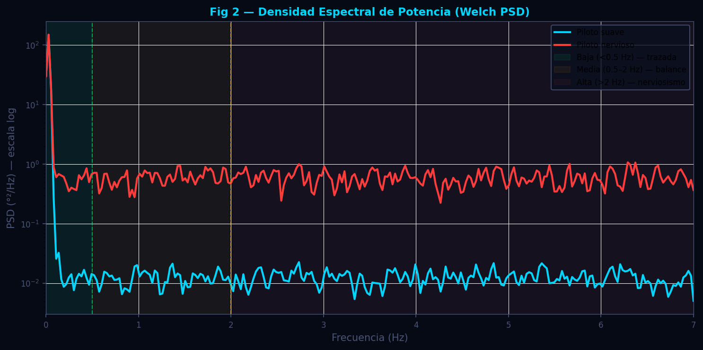
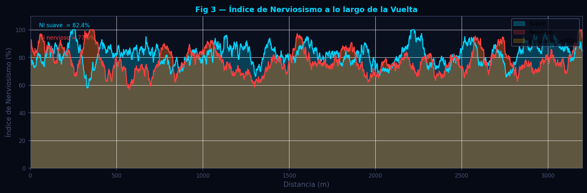

# Driver Inputs — FFT & Steering Jitter

🌐 [Ver en Español](./11_driver_inputs.es.md)

**Module:** `src/analytics/driver_inputs.py`  
**Review date:** 2026-06-12

---

## Table of Contents

1. [Overview](#overview)
2. [Scientific Background](#scientific-background)
   - 2.1 [Frequency of Steering Corrections](#21-frequency-of-steering-corrections)
   - 2.2 [Power Spectral Density (PSD) Estimation](#22-power-spectral-density-psd-estimation)
   - 2.3 [Normalised Nervousness Index](#23-normalised-nervousness-index)
   - 2.4 [Brake-Throttle Overlap](#24-brake-throttle-overlap)
3. [Algorithm & Implementation](#algorithm--implementation)
   - 3.1 [`_nervousness_series`](#31-_nervousness_series)
   - 3.2 [`_fft_bands`](#32-_fft_bands)
   - 3.3 [`analyse_driver_inputs`](#33-analyse_driver_inputs)
4. [Key Parameters](#key-parameters)
5. [Result Interpretation](#result-interpretation)
6. [Pilot Recommendations](#pilot-recommendations)
7. [Visualizations](#visualizations)
8. [References](#references)

---

## Overview

The driver inputs analysis module quantifies the quality of steering corrections using two complementary techniques: a **nervousness index** based on the rolling mean of the angle rate of change, and a **spectral analysis (Welch PSD)** that decomposes the steering signal into frequency bands. The high-frequency band (> 2 Hz) is the primary indicator of involuntary micro-corrections associated with lack of grip confidence or driver fatigue. Additionally, the module calculates the percentage of time with simultaneous brake-throttle overlap, an indicator of driving style in the braking-to-acceleration transition.

---

## Scientific Background

### 2.1 Frequency of Steering Corrections

An expert driver's steering inputs can be classified by frequency:

| Range | Movement type | Cause |
|---|---|---|
| < 0.5 Hz | Line variations and long corners | Intentional — line change or corner trace |
| 0.5–2 Hz | Balance corrections | Response to load transfer changes |
| > 2 Hz | Micro-corrections | Tyres at traction limit, rough surface, or nervousness |

A confident driver with good rhythm applies steering inputs primarily in the low band (< 0.5 Hz), with smooth transitions into the mid band. A fatigued driver, one lacking confidence, or one with a problematic setup generates significantly more power in the high band (> 2 Hz).

---

### 2.2 Power Spectral Density (PSD) Estimation

The module uses the **Welch** method to estimate the PSD, which divides the signal into overlapping windows with a Hann function, computes the periodogram for each window, and averages:

$$
S_{xx}(f) = \frac{1}{K} \sum_{k=0}^{K-1} \left| \sum_{n=0}^{N-1} x_k[n] \cdot w[n] \cdot e^{-j2\pi fn/N} \right|^2
$$

where $K$ is the number of windows, $N$ the size of each window (`nperseg = min(256, len/2)`) and $w[n]$ is the Hann window.

Band power is calculated as the integral of the PSD over the corresponding range using the trapezoidal rule:

$$
P_{band} = \int_{f_1}^{f_2} S_{xx}(f)\, df \approx \sum_{f \in [f_1, f_2]} S_{xx}(f) \cdot \Delta f
$$

Relative power for each band is normalised by total power:

$$
P_{band,\%} = \frac{P_{band}}{P_{total}} \times 100\%
$$

**Effective sampling frequency:** The aligned DataFrame has 1 m steps. At an average speed of $\bar{v}$ km/h, the effective sampling frequency is:

$$
f_s \approx \frac{\bar{v}}{3.6} \;\text{Hz}
$$

At 50 km/h, $f_s \approx 14$ Hz; at 100 km/h, $f_s \approx 28$ Hz. This estimate ensures the PSD frequency axis is physically correct.

---

### 2.3 Normalised Nervousness Index

The nervousness index is a sample-by-sample alternative to FFT that allows generating a curve over lap distance:

$$
r[i] = |\delta[i] - \delta[i-1]|
$$

$$
\text{nerv}[i] = \text{rolling\_mean}(r, W)[i]
$$

$$
\text{nerv\_norm}[i] = \frac{\text{nerv}[i]}{\text{percentile}_{99}(\text{nerv})}
$$

where $W = 80$ samples (≈ 80 m centred window). Normalisation by the 99th percentile (instead of the absolute maximum) eliminates the effect of isolated spurious spikes and makes the index comparable across laps of different duration or average speed.

The global nervousness index is the mean of the normalised index over the entire lap:

$$
\text{NI} = \langle \text{nerv\_norm} \rangle \in [0, 1]
$$

---

### 2.4 Brake-Throttle Overlap

The percentage of time with simultaneous braking and throttle is an indicator of driving style:

$$
\text{overlap\_pct} = \frac{|\{i : \text{Brake}_i > 5\% \;\wedge\; \text{Throttle}_i > 5\%\}|}{N} \times 100\%
$$

A moderate overlap (2–8%) is technically correct in the trail-braking phase (the driver progressively releases the brake while gently opening the throttle past the apex). A very high overlap (> 15%) may indicate panic braking or poor pedal usage.

---

## Algorithm & Implementation

### 3.1 `_nervousness_series`

```
Input: steer (pd.Series, degrees)

1. rate = |diff(steer)|          # absolute rate of change per sample
2. smoothed = rolling_mean(rate, window=80, center=True, min_periods=1)
3. p99 = quantile(smoothed, 0.99)
4. If p99 < 1e-6 → return zero series (flat signal)
5. normed = clip(smoothed / p99, 0, 1)

Output: pd.Series in [0, 1] with same length as steer
```

---

### 3.2 `_fft_bands`

```
Inputs: steer (pd.Series), sample_rate_hz (float)

1. If len(steer) < 64 → return {low:0, mid:0, high:0}
2. s = ffill(steer).fillna(0).values
3. freqs, psd = welch(s, fs=sample_rate_hz, nperseg=min(256, len/2))
4. total = trapz(psd, freqs);  if total < 1e-12 → use 1.0

For each band:
  low  = trapz(psd[freqs <  0.5],  freqs[freqs <  0.5])  / total
  mid  = trapz(psd[0.5 ≤ f < 2.0], freqs[0.5 ≤ f < 2.0]) / total
  high = trapz(psd[freqs >= 2.0],  freqs[freqs >= 2.0])  / total

Output: {low, mid, high} sum ≈ 1.0 (may differ at NaN edges)
```

---

### 3.3 `analyse_driver_inputs`

```
Inputs: df (aligned DataFrame with SteerAngle_Fast/Slow, Brake_Fast/Slow, Throttle_Fast/Slow)

For each lap (A = _Fast, B = _Slow):
  1. nerv_series = _nervousness_series(SteerAngle)
  2. bands       = _fft_bands(SteerAngle, sample_rate_hz estimated from Speed)
  3. overall     = mean(nerv_series)
  4. label       = _nervousness_label(overall, bands.high)
  5. overlap_pct = _overlap_pct(Brake, Throttle)

Per-distance output (downsampled × 5):
  distance, nervousness_a, nervousness_b

Returns dict with:
  available, available_a, available_b,
  nervousness_score_a/b, fft_bands_a/b,
  nervousness_label_a/b, overlap_pct_a/b,
  per_distance{}
```

The nervousness label is assigned according to a cross-table (NI × high band):

| NI | P(high) | Label |
|---|---|---|
| < 0.15 | < 0.15 | Very smooth |
| < 0.30 | < 0.25 | Smooth |
| < 0.50 | < 0.40 | Normal |
| < 0.70 | < 0.55 | Active |
| ≥ 0.70 | ≥ 0.55 | Nervous |

---

## Key Parameters

| Parameter | Default value | Description |
|---|---|---|
| `ROLLING_WIN` | 80 samples | Rolling mean window for steering rate |
| `DOWNSAMPLE` | 5 | Reduction factor for the per-distance series |
| `nperseg` | min(256, n/2) | Welch PSD window size |
| `brake_thr` | 5% | Minimum brake pressure for overlap |
| `thr_thr` | 5% | Minimum throttle opening for overlap |
| Low band | < 0.5 Hz | Intentional line movements |
| Mid band | 0.5–2 Hz | Dynamic balance corrections |
| High band | > 2 Hz | Micro-corrections (nervousness indicator) |

---

## Result Interpretation

### Global nervousness index

| NI range | Diagnosis |
|---|---|
| 0–0.15 | Very fluid driver; smooth and progressive inputs |
| 0.15–0.30 | Smooth driving with mild corrections in complex corners |
| 0.30–0.50 | Normal level for an amateur driver with good rhythm |
| 0.50–0.70 | Active driver; possible lack of confidence in tyres or setup |
| > 0.70 | Nervous driving; fatigue, cold tyres, or setup with vibration |

### FFT bands

- **High band > 40%:** Half the correction energy is in micro-movements > 2 Hz. Warning signal: the car may have brake vibration, a flat spot, or the driver is at the edge of their control capacity.
- **Low band > 60%:** Excellent. Most corrections are intentional line movements.
- **Mid band 30–50%:** Normal in technical corners where load transfer requires continuous adaptation.

### Brake-throttle overlap

| % Overlap | Diagnosis |
|---|---|
| 0–2% | Minimal or no trail-braking technique |
| 2–8% | Optimal trail-braking in appropriate corners |
| 8–15% | High overlap; check if intentional or panic |
| > 15% | Very high; may saturate rear brakes if bias is forward |

---

## Pilot Recommendations

**High nervousness in fast corners:**
The driver is making involuntary micro-corrections suggesting the car is at or beyond its limit. Reduce entry speed in those corners and rebuild confidence progressively. Check suspension setup (excessive rear rebound speed can generate instability under traction).

**High nervousness concentrated at braking points:**
Possible flat spot on tyres or disc vibration. Check tyre condition and brake balance. A balance too far forward can cause intermittent front axle lock-up, which the driver perceives as vibration.

**High-band elevated but low NI:**
The steering has a lot of high-frequency "noise" but with small amplitude. May indicate mechanical vibration (not from the driver). Cross-check with lateral acceleration data to rule out suspension resonance.

---

## Visualizations

Generated by `scripts/docs/gen_driver_inputs.py` with synthetic data.

---

### Figure 1 — Steering Signal & Rate of Change



Upper panel: steering angle (°) over lap distance for two drivers (smooth vs nervous). Lower panel: absolute rate of change |Δδ| per sample. The difference in high-band amplitude is clearly visible: the nervous driver generates higher-amplitude and more frequent peaks.

---

### Figure 2 — Comparative Power Spectral Density (PSD)



Welch PSD for two drivers. The low, mid and high bands are shaded in green, amber and red respectively. The relative area of each band represents the power fraction. The smooth driver concentrates power in the low band; the nervous driver has a prominent peak in the high band.

---

### Figure 3 — Nervousness Index Over the Lap



Area chart of the normalised nervousness index (0–100%) as a function of lap distance for both compared laps. High-activity zones are highlighted with an amber background. The curve allows identification of which track sections generate the most stress in driver inputs.

---

## References

1. Segers, J. (2014). *Analysis Techniques for Racecar Data Acquisition* (2nd ed.). SAE International. — Steering channel analysis; interpretation of micro-corrections as cognitive load indicators.

2. Welch, P. D. (1967). The use of fast Fourier transform for the estimation of power spectra: A method based on time averaging over short, modified periodograms. *IEEE Transactions on Audio and Electroacoustics*, 15(2), 70–73.

3. Bärgman, J., et al. (2017). Driving behaviour analysis using naturalistic data. *Transportation Research Part F*, 47, 198–210. — Frequency analysis of steering inputs as a cognitive demand metric.

4. Attia, R., et al. (2012). Combined longitudinal and lateral control for automated vehicle guidance. *Vehicle System Dynamics*, 50(9), 1447–1484. — Characteristic frequencies of human vs. automated steering control.

---

*Also available in [Español 🇪🇸](./11_driver_inputs.es.md)*
