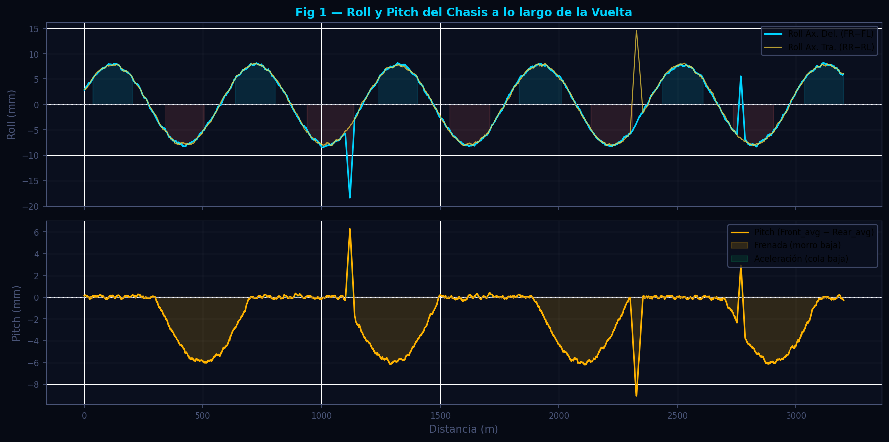
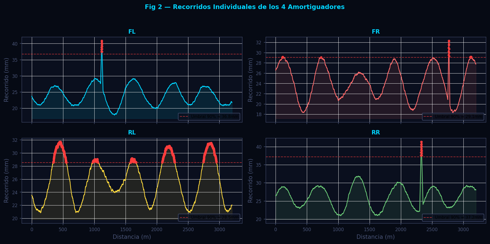
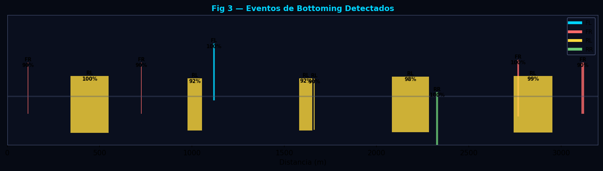

# Suspensión — Pitch, Roll y Detección de Bottoming

**Módulo:** `src/analytics/suspension.py`  
**Fecha de revisión:** 2026-06-12

---

## Tabla de Contenidos

1. [Descripción General](#descripción-general)
2. [Fundamentos Científicos](#fundamentos-científicos)
   - 2.1 [Transferencia de Carga y Recorrido de Suspensión](#21-transferencia-de-carga-y-recorrido-de-suspensión)
   - 2.2 [Roll del Chasis](#22-roll-del-chasis)
   - 2.3 [Pitch del Chasis](#23-pitch-del-chasis)
   - 2.4 [Bottoming — Compresión Máxima del Amortiguador](#24-bottoming--compresión-máxima-del-amortiguador)
3. [Algoritmo e Implementación](#algoritmo-e-implementación)
   - 3.1 [Cálculo de Roll y Pitch](#31-cálculo-de-roll-y-pitch)
   - 3.2 [Detección de Bottoming](#32-detección-de-bottoming)
   - 3.3 [`analizar_suspension`](#33-analizar_suspension)
4. [Parámetros Clave](#parámetros-clave)
5. [Interpretación de Resultados](#interpretación-de-resultados)
6. [Recomendaciones para el Piloto](#recomendaciones-para-el-piloto)
7. [Visualizaciones](#visualizaciones)
8. [Referencias](#referencias)

---

## Descripción General

El módulo de suspensión analiza los cuatro canales de recorrido de amortiguador (Suspension Travel FL, FR, RL, RR) para calcular el pitch y roll dinámico del chasis a lo largo de la vuelta. El recorrido de cada amortiguador refleja directamente la carga que soporta esa rueda: cuando el coche frena, el peso se transfiere hacia delante (pitch positivo); en curva, hacia el exterior (roll). La detección de bottoming identifica los puntos donde el amortiguador llega al límite de su recorrido, lo cual genera saltos bruscos en la transferencia de carga y puede dañar el fondo del coche o el tope de goma.

---

## Fundamentos Científicos

### 2.1 Transferencia de Carga y Recorrido de Suspensión

El recorrido del amortiguador ($z$, en mm) está relacionado linealmente con la fuerza normal sobre la rueda mediante la rigidez de la muelle ($k$) y el factor de palanca de la suspensión ($MR$):

$$
\Delta F_{rueda} = k \cdot MR^2 \cdot \Delta z
$$

Para análisis comparativo entre dos vueltas con la misma configuración mecánica, el recorrido relativo es suficiente para caracterizar la dinámica: una mayor diferencia de recorrido entre lados indica mayor transferencia de carga lateral (más roll), y una mayor diferencia entre ejes indica más transferencia longitudinal (más pitch).

---

### 2.2 Roll del Chasis

El roll del eje delantero se define como la diferencia de recorrido entre el lado derecho y el izquierdo:

$$
\phi_F = z_{FR} - z_{FL}
$$

Convención de signo: **positivo = más carga a la derecha** (curva a izquierda). El roll del eje trasero sigue la misma convención:

$$
\phi_R = z_{RR} - z_{RL}
$$

La diferencia entre $\phi_F$ y $\phi_R$ indica el **balance de roll** (rigidez relativa de barra estabilizadora delantera vs. trasera). Si $|\phi_F| > |\phi_R|$, el eje trasero es más rígido en roll (o la barra trasera está más apretada), lo que tiende a generar sobreviraje.

---

### 2.3 Pitch del Chasis

El pitch se calcula como la diferencia entre el promedio del eje delantero y el trasero:

$$
\theta = \frac{z_{FL} + z_{FR}}{2} - \frac{z_{RL} + z_{RR}}{2}
$$

Convención de signo: **positivo = morro bajo** (frenada fuerte o aerodinámica con más downforce delantero). Un pitch negativo persistente en rectas de alta velocidad puede indicar que el difusor trasero está generando más downforce del esperado o que el muelle trasero es demasiado blando.

---

### 2.4 Bottoming — Compresión Máxima del Amortiguador

Un evento de bottoming ocurre cuando el amortiguador alcanza el 90% de su recorrido máximo observado durante la sesión. Se usa el máximo observado en lugar de un valor nominal porque el recorrido real disponible varía según el setup de altura de viaje y el estado de carga del vehículo:

$$
\text{threshold}_{bottoming} = 0.90 \cdot \max(z_{corner})
$$

Los eventos se agrupan en intervalos contiguos de al menos 3 m de longitud para filtrar picos espúreos de un solo punto. La severidad de cada evento se calcula como la fracción del recorrido máximo alcanzada:

$$
\text{severity} = \frac{\max(z) \text{ en zona}}{\max(z) \text{ en vuelta}}
$$

---

## Algoritmo e Implementación

### 3.1 Cálculo de Roll y Pitch

```
Entradas:
  df      — DataFrame alineado
  suffix  — "_Fast" o "_Slow"

Canales: SuspTravelFL/FR/RL/RR + suffix (todos en mm)

1. Leer FL, FR, RL, RR con pd.to_numeric + fillna(0)
   (si algún canal falta, se reemplaza con serie de ceros)

2. front_avg = (FL + FR) / 2
   rear_avg  = (RL + RR) / 2
   roll_f    = FR - FL          # eje delantero
   roll_r    = RR - RL          # eje trasero
   pitch     = front_avg - rear_avg

3. Estadísticas resumen:
   max_roll_f  = max(|roll_f|)
   max_roll_r  = max(|roll_r|)
   max_pitch   = max(|pitch|)
   mean_roll_f = mean(|roll_f|)
   mean_pitch  = mean(|pitch|)
```

---

### 3.2 Detección de Bottoming

```
Para cada amortiguador [FL, FR, RL, RR]:
  1. max_t = max(travel)
  2. Si max_t < 1 mm → skip (señal probablemente ruidosa o ausente)
  3. threshold = max_t * 0.90
  4. bottoming_mask = travel >= threshold

  Extracción de zonas:
  5. Iterar sobre máscara: detectar transiciones False→True (inicio) y True→False (fin)
  6. Si longitud de zona >= 3 m:
     registrar {corner, start_m, end_m, max_travel, severity}

Salida: lista de dicts con todos los eventos de bottoming del lap
```

---

### 3.3 `analizar_suspension`

```
Entradas: df (DataFrame alineado)

Para cada vuelta (suffix = "_Fast", "_Slow"):
  1. _suspension_for_suffix(df, suffix, dist) →
     {summary, per_distance, bottoming}

Salida por distancia (downsampled × 5) por vuelta:
  distance, roll_f, roll_r, pitch, fl, fr, rl, rr

Retorna dict con:
  available, available_a, available_b,
  summary_a/b: {max_roll_f, max_roll_r, max_pitch, mean_roll_f, mean_pitch, bottoming_events},
  per_distance_a/b: {...},
  bottoming_a/b: [{corner, start_m, end_m, max_travel, severity}, ...]
```

---

## Parámetros Clave

| Parámetro | Valor por defecto | Descripción |
|---|---|---|
| `DOWNSAMPLE` | 5 | Factor de reducción para las series por distancia |
| `BOTTOM_FRACTION` | 0.90 | Fracción del recorrido máximo observado que define bottoming |
| `MIN_DURATION_M` | 3.0 m | Longitud mínima de zona de bottoming para reportar |
| Convención roll | FR − FL | Positivo = carga a la derecha |
| Convención pitch | Front_avg − Rear_avg | Positivo = morro bajo |

---

## Interpretación de Resultados

### Roll del eje delantero vs trasero

| Patrón | Diagnóstico |
|---|---|
| $\max|\phi_F| \gg \max|\phi_R|$ | El eje trasero está más rígido en roll (barra trasera apretada → sobreviraje) |
| $\max|\phi_R| \gg \max|\phi_F|$ | El eje delantero está más rígido (barra delantera apretada → subviraje) |
| $\max|\phi_F| \approx \max|\phi_R|$ | Balance de roll equilibrado — buen punto de partida |
| Roll muy elevado en ambos ejes | Muelles demasiado blandos; el coche balancea en exceso; evaluar dureza de muelles |

### Pitch

- **Pitch positivo elevado en frenada** (morro muy bajo): setup de muelle delantero muy blando o la distribución de frenado está demasiado adelantada. El aerodynamic pitch puede también contribuir en circuitos de alta velocidad.
- **Pitch negativo en aceleración** (cola baja): normal y deseable; indica buena tracción trasera.
- **Pitch oscilante en rectas:** puede indicar resonancia del muelle/amortiguador (bouncing). Revisar el rebote del amortiguador.

### Eventos de bottoming

Un evento de bottoming tiene consecuencias directas sobre la dinámica:
- **Bottoming delantero en frenada:** El tope de goma o tope metálico del amortiguador actúa como un muelle extra muy rígido, provocando un brusco cambio de ride rate que puede desestabilizar el coche en la fase de rotación.
- **Bottoming trasero en aceleración:** Pérdida repentina de tracción al cambiar la geometría de la suspensión trasera. También puede dañar el fondo aerodinámico si el alerón trasero o el difusor rozan el suelo.
- **Bottoming en curvas rápidas:** Especialmente peligroso porque puede generar reacciones impredecibles a alta velocidad.

---

## Recomendaciones para el Piloto

**Bottoming frecuente en el mismo amortiguador:**
Aumentar la dureza del muelle de ese corner en 1–2 pasos. Si el bottoming ocurre solo en frenadas fuertes, revisar también el amortiguamiento en compresión (bump). La altura de viaje también puede incrementarse si el reglamento lo permite.

**Roll excesivo en curvas rápidas:**
Endurecer la barra estabilizadora del eje que más rueda (o ambas). Verificar primero si el roll es simétrico entre curvas a izquierda y derecha: un roll asimétrico puede indicar un amortiguador averiado.

**Pitch muy elevado en frenada fuerte:**
Si el pitch delantero supera 8–10 mm en la frenada más fuerte, evaluar endurecer el amortiguamiento de compresión delantero. Una distribución de frenado más trasera también reduce el pitch pero puede perjudicar la estabilidad.

---

## Visualizaciones

Generadas por `scripts/docs/gen_suspension.py` con datos sintéticos.

---

### Figura 1 — Roll y Pitch a lo largo de la Vuelta



Panel superior: roll del eje delantero ($\phi_F$, mm) a lo largo de la distancia. Las zonas de roll elevado (curvas) están sombreadas. Panel inferior: pitch del chasis (θ, mm). Los picos negativos corresponden a frenadas (morro baja hacia delante); los valles positivos a aceleraciones (cola baja). La línea de referencia en 0 facilita la lectura del signo.

---

### Figura 2 — Recorridos Individuales de los 4 Amortiguadores



Cuatro series superpuestas (FL cian, FR rojo, RL amarillo, RR verde) del recorrido de cada amortiguador. Los eventos de bottoming se marcan con marcadores circulares de mayor tamaño. La diferencia vertical entre FL y FR es el roll delantero; entre la media delantera y trasera, el pitch.

---

### Figura 3 — Diagrama de Bottoming Detectado



Visualización de los eventos de bottoming sobre el mapa de distancia de la vuelta. Cada evento se representa como una barra vertical cuya altura indica la severidad (fracción del recorrido máximo). El color identifica la rueda afectada. Las zonas de la pista (curvas vs rectas) se superponen en el fondo para contextualizar la ubicación de cada evento.

---

## Referencias

1. Milliken, W. F., & Milliken, D. L. (1995). *Race Car Vehicle Dynamics*. SAE International. — Capítulo 16–17: Transferencia de carga dinámica; roll rate; interacción muelle-amortiguador.

2. Dixon, J. C. (1996). *Tires, Suspension and Handling* (2nd ed.). SAE International. — Análisis de recorrido de suspensión; definición de ride rate y wheel rate; motion ratio.

3. Segers, J. (2014). *Analysis Techniques for Racecar Data Acquisition* (2nd ed.). SAE International. — Interpretación de canales SuspTravel en telemetría MoTeC; análisis de pitch y roll desde datos de 4 ruedas.

4. Trzesniowski, M. (2014). *Rennwagentechnik: Grundlagen, Konstruktion, Komponenten, Systeme*. Springer Vieweg. — Suspensiones de fórmula; análisis de bottoming en circuitos con curvas rápidas.
