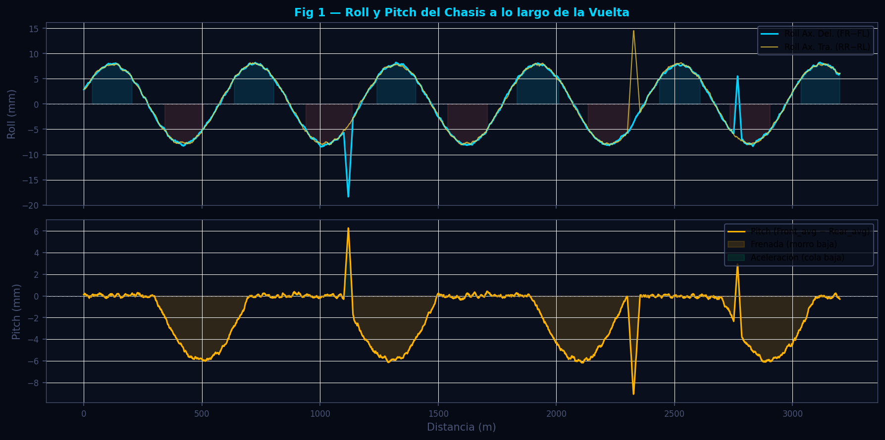
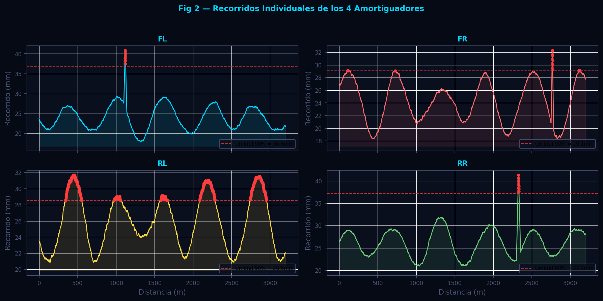
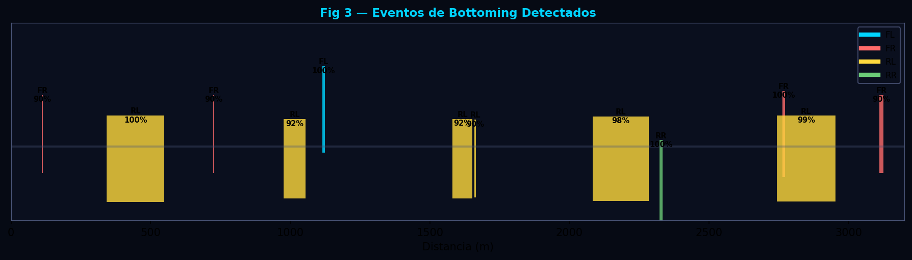

# Suspension — Pitch, Roll & Bottoming Detection

🌐 [Ver en Español](./12_suspension.es.md)

**Module:** `src/analytics/suspension.py`  
**Review date:** 2026-06-12

---

## Table of Contents

1. [Overview](#overview)
2. [Scientific Background](#scientific-background)
   - 2.1 [Load Transfer & Suspension Travel](#21-load-transfer--suspension-travel)
   - 2.2 [Chassis Roll](#22-chassis-roll)
   - 2.3 [Chassis Pitch](#23-chassis-pitch)
   - 2.4 [Bottoming — Maximum Damper Compression](#24-bottoming--maximum-damper-compression)
3. [Algorithm & Implementation](#algorithm--implementation)
   - 3.1 [Roll & Pitch Calculation](#31-roll--pitch-calculation)
   - 3.2 [Bottoming Detection](#32-bottoming-detection)
   - 3.3 [`analyse_suspension`](#33-analyse_suspension)
4. [Key Parameters](#key-parameters)
5. [Result Interpretation](#result-interpretation)
6. [Pilot Recommendations](#pilot-recommendations)
7. [Visualizations](#visualizations)
8. [References](#references)

---

## Overview

The suspension module analyses the four damper travel channels (Suspension Travel FL, FR, RL, RR) to calculate dynamic chassis pitch and roll over the lap. Each damper's travel directly reflects the load borne by that wheel: when the car brakes, weight transfers forwards (positive pitch); in a corner, to the outside (roll). Bottoming detection identifies points where the damper reaches the limit of its travel, generating abrupt load-transfer spikes that can damage the floor or the rubber bump stop.

---

## Scientific Background

### 2.1 Load Transfer & Suspension Travel

Damper travel ($z$, in mm) is linearly related to the normal force on the wheel via spring stiffness ($k$) and the suspension leverage ratio ($MR$):

$$
\Delta F_{wheel} = k \cdot MR^2 \cdot \Delta z
$$

For comparative analysis between two laps with the same mechanical configuration, relative travel is sufficient to characterise the dynamics: a larger travel difference between sides indicates greater lateral load transfer (more roll), and a larger difference between axles indicates more longitudinal transfer (more pitch).

---

### 2.2 Chassis Roll

Front axle roll is defined as the travel difference between the right and left sides:

$$
\phi_F = z_{FR} - z_{FL}
$$

Sign convention: **positive = more load on the right** (left-hand corner). Rear axle roll follows the same convention:

$$
\phi_R = z_{RR} - z_{RL}
$$

The difference between $\phi_F$ and $\phi_R$ indicates the **roll balance** (relative stiffness of front vs. rear anti-roll bar). If $|\phi_F| > |\phi_R|$, the rear axle is stiffer in roll (or the rear bar is tighter), which tends to generate oversteer.

---

### 2.3 Chassis Pitch

Pitch is calculated as the difference between the front axle mean and the rear axle mean:

$$
\theta = \frac{z_{FL} + z_{FR}}{2} - \frac{z_{RL} + z_{RR}}{2}
$$

Sign convention: **positive = nose down** (hard braking or aerodynamics with more front downforce). A persistent negative pitch at high-speed straights may indicate the rear diffuser is generating more downforce than expected, or the rear spring is too soft.

---

### 2.4 Bottoming — Maximum Damper Compression

A bottoming event occurs when the damper reaches 90% of its maximum observed travel during the session. The observed maximum is used rather than a nominal value because the available travel varies with ride-height setup and vehicle load state:

$$
\text{threshold}_{bottoming} = 0.90 \cdot \max(z_{corner})
$$

Events are grouped into contiguous intervals of at least 3 m length to filter single-point spurious spikes. The severity of each event is calculated as the fraction of maximum travel reached:

$$
\text{severity} = \frac{\max(z) \text{ in zone}}{\max(z) \text{ in lap}}
$$

---

## Algorithm & Implementation

### 3.1 Roll & Pitch Calculation

```
Inputs:
  df      — aligned DataFrame
  suffix  — "_Fast" or "_Slow"

Channels: SuspTravelFL/FR/RL/RR + suffix (all in mm)

1. Read FL, FR, RL, RR with pd.to_numeric + fillna(0)
   (if any channel is missing, it is replaced with a zero series)

2. front_avg = (FL + FR) / 2
   rear_avg  = (RL + RR) / 2
   roll_f    = FR - FL          # front axle
   roll_r    = RR - RL          # rear axle
   pitch     = front_avg - rear_avg

3. Summary statistics:
   max_roll_f  = max(|roll_f|)
   max_roll_r  = max(|roll_r|)
   max_pitch   = max(|pitch|)
   mean_roll_f = mean(|roll_f|)
   mean_pitch  = mean(|pitch|)
```

---

### 3.2 Bottoming Detection

```
For each damper [FL, FR, RL, RR]:
  1. max_t = max(travel)
  2. If max_t < 1 mm → skip (signal probably noisy or absent)
  3. threshold = max_t * 0.90
  4. bottoming_mask = travel >= threshold

  Zone extraction:
  5. Iterate over mask: detect False→True transitions (start) and True→False (end)
  6. If zone length >= 3 m:
     record {corner, start_m, end_m, max_travel, severity}

Output: list of dicts with all bottoming events for the lap
```

---

### 3.3 `analyse_suspension`

```
Inputs: df (aligned DataFrame)

For each lap (suffix = "_Fast", "_Slow"):
  1. _suspension_for_suffix(df, suffix, dist) →
     {summary, per_distance, bottoming}

Per-distance output (downsampled × 5) per lap:
  distance, roll_f, roll_r, pitch, fl, fr, rl, rr

Returns dict with:
  available, available_a, available_b,
  summary_a/b: {max_roll_f, max_roll_r, max_pitch, mean_roll_f, mean_pitch, bottoming_events},
  per_distance_a/b: {...},
  bottoming_a/b: [{corner, start_m, end_m, max_travel, severity}, ...]
```

---

## Key Parameters

| Parameter | Default value | Description |
|---|---|---|
| `DOWNSAMPLE` | 5 | Reduction factor for per-distance series |
| `BOTTOM_FRACTION` | 0.90 | Fraction of observed max travel that defines bottoming |
| `MIN_DURATION_M` | 3.0 m | Minimum bottoming zone length to report |
| Roll convention | FR − FL | Positive = load to the right |
| Pitch convention | Front_avg − Rear_avg | Positive = nose down |

---

## Result Interpretation

### Front vs. rear axle roll

| Pattern | Diagnosis |
|---|---|
| $\max|\phi_F| \gg \max|\phi_R|$ | Rear axle is stiffer in roll (tight rear bar → oversteer) |
| $\max|\phi_R| \gg \max|\phi_F|$ | Front axle is stiffer (tight front bar → understeer) |
| $\max|\phi_F| \approx \max|\phi_R|$ | Balanced roll — a good starting point |
| Very high roll on both axles | Springs too soft; car wallows excessively; evaluate spring stiffness |

### Pitch

- **High positive pitch under braking** (very low nose): front spring setup too soft or brake distribution too far forward. Aerodynamic pitch may also contribute at high-speed circuits.
- **Negative pitch under acceleration** (low tail): normal and desirable; indicates good rear traction.
- **Oscillating pitch on straights:** may indicate spring/damper resonance (bouncing). Check damper rebound setting.

### Bottoming events

A bottoming event has direct consequences on dynamics:
- **Front bottoming under braking:** The rubber or metal bump stop acts as an extra, very stiff spring, causing an abrupt ride-rate change that can destabilise the car during rotation.
- **Rear bottoming under acceleration:** Sudden traction loss as the rear suspension geometry changes. Can also damage aerodynamic components if the rear wing or diffuser contacts the ground.
- **Bottoming in fast corners:** Particularly dangerous as it can generate unpredictable reactions at high speed.

---

## Pilot Recommendations

**Frequent bottoming on the same damper:**
Increase spring stiffness on that corner by 1–2 steps. If bottoming only occurs under hard braking, also review compression damping (bump). Ride height can also be increased if the regulations allow it.

**Excessive roll in fast corners:**
Stiffen the anti-roll bar on the axle that rolls most (or both). First check whether the roll is symmetric between left and right corners: asymmetric roll may indicate a faulty damper.

**Very high pitch under hard braking:**
If front pitch exceeds 8–10 mm at the hardest braking point, consider stiffening front compression damping. A more rearward brake bias also reduces pitch but may impair stability.

---

## Visualizations

Generated by `scripts/docs/gen_suspension.py` with synthetic data.

---

### Figure 1 — Roll & Pitch Over the Lap



Upper panel: front axle roll ($\phi_F$, mm) over distance. High-roll zones (corners) are shaded. Lower panel: chassis pitch (θ, mm). Negative peaks correspond to braking points (nose dives forward); positive valleys to acceleration (tail squats). The zero reference line aids sign reading.

---

### Figure 2 — Individual Travel of the 4 Dampers



Four superimposed series (FL cyan, FR red, RL yellow, RR green) of each damper's travel. Bottoming events are marked with larger circular markers. The vertical difference between FL and FR is the front roll; between the front and rear averages, the pitch.

---

### Figure 3 — Detected Bottoming Events Diagram



Visualisation of bottoming events on the lap distance map. Each event is represented as a vertical bar whose height indicates severity (fraction of maximum travel). Colour identifies the affected wheel. Track zones (corners vs. straights) are overlaid in the background to contextualise each event's location.

---

## References

1. Milliken, W. F., & Milliken, D. L. (1995). *Race Car Vehicle Dynamics*. SAE International. — Chapters 16–17: Dynamic load transfer; roll rate; spring-damper interaction.

2. Dixon, J. C. (1996). *Tires, Suspension and Handling* (2nd ed.). SAE International. — Suspension travel analysis; ride rate and wheel rate definitions; motion ratio.

3. Segers, J. (2014). *Analysis Techniques for Racecar Data Acquisition* (2nd ed.). SAE International. — Interpretation of SuspTravel channels in MoTeC telemetry; pitch and roll analysis from 4-wheel data.

4. Trzesniowski, M. (2014). *Rennwagentechnik: Grundlagen, Konstruktion, Komponenten, Systeme*. Springer Vieweg. — Formula suspension; bottoming analysis in circuits with fast corners.

---

*Also available in [Español 🇪🇸](./12_suspension.es.md)*
