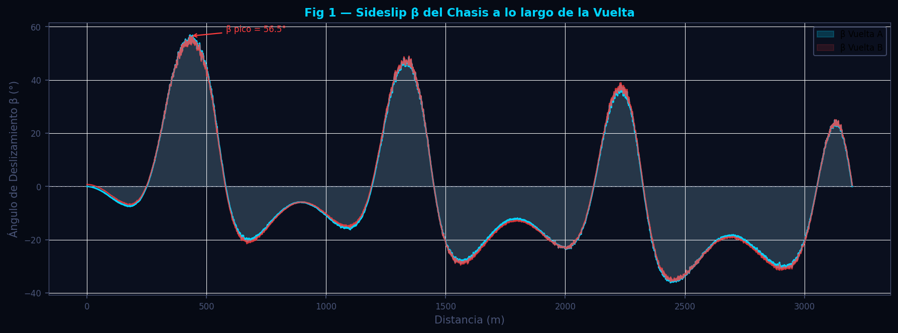
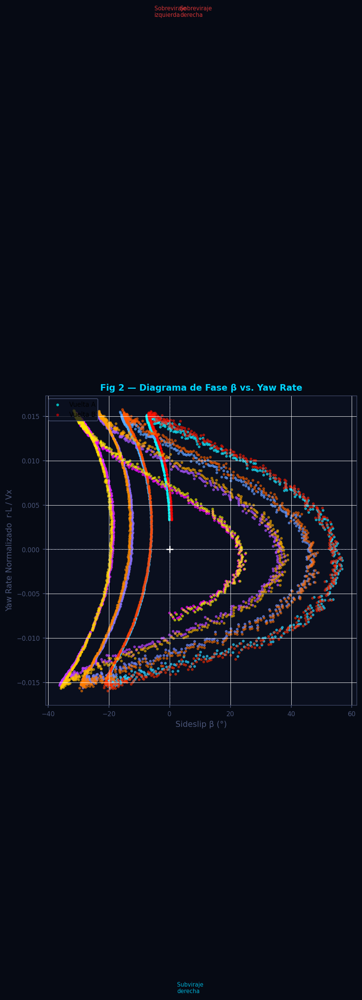
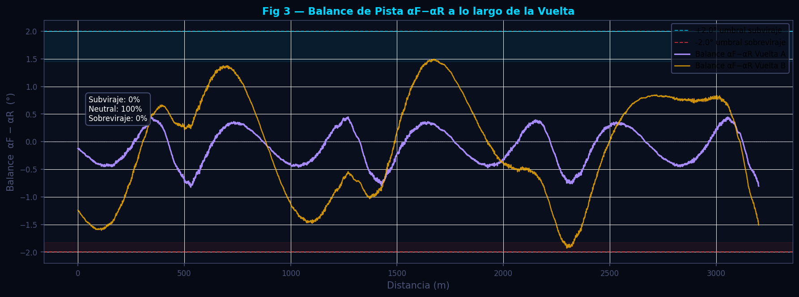

# Ángulo de Deslizamiento — Sideslip β y Balance αF/αR

**Módulo:** `src/analytics/slip_angle.py`  
**Fecha de revisión:** 2026-06-12

---

## Tabla de Contenidos

1. [Descripción General](#descripción-general)
2. [Fundamentos Científicos](#fundamentos-científicos)
   - 2.1 [Ángulo de Deslizamiento del Chasis (β)](#21-ángulo-de-deslizamiento-del-chasis-β)
   - 2.2 [Modelo de Bicicleta Lineal](#22-modelo-de-bicicleta-lineal)
   - 2.3 [Ángulos de Deslizamiento de Rueda (αF, αR)](#23-ángulos-de-deslizamiento-de-rueda-αf-αr)
   - 2.4 [Balance de Pista y Diagnóstico de Comportamiento](#24-balance-de-pista-y-diagnóstico-de-comportamiento)
3. [Algoritmo e Implementación](#algoritmo-e-implementación)
   - 3.1 [Integración Cinemática con Corrección de Deriva](#31-integración-cinemática-con-corrección-de-deriva)
   - 3.2 [Estimación de αF y αR](#32-estimación-de-αf-y-αr)
   - 3.3 [`analizar_slip_angle`](#33-analizar_slip_angle)
4. [Parámetros Clave y Supuestos de Geometría](#parámetros-clave-y-supuestos-de-geometría)
5. [Interpretación de Resultados](#interpretación-de-resultados)
6. [Recomendaciones para el Piloto](#recomendaciones-para-el-piloto)
7. [Visualizaciones](#visualizaciones)
8. [Referencias](#referencias)

---

## Descripción General

El ángulo de deslizamiento del chasis (β, *sideslip angle* o *body slip angle*) es el ángulo entre el vector de velocidad del centro de gravedad del vehículo y su eje longitudinal. A diferencia del ángulo de volante, β es invisible para el piloto pero determina el estado de equilibrio del vehículo: valores de β grandes indican que el coche se mueve "de costado", una condición asociada a la saturación de alguno de los ejes.

El módulo implementa una estimación cinemática integrada que utiliza la aceleración lateral, el yaw rate y la velocidad para reconstruir la velocidad lateral del vehículo, y aplica el modelo de bicicleta lineal para estimar los ángulos de deslizamiento individuales de los ejes delantero (αF) y trasero (αR). La diferencia αF − αR es el indicador cuantitativo más directo del balance entre subviraje y sobreviraje.

---

## Fundamentos Científicos

### 2.1 Ángulo de Deslizamiento del Chasis (β)

En el sistema de referencia del vehículo, la velocidad del centro de gravedad tiene componentes longitudinal ($V_x$) y lateral ($V_y$):

$$
\beta = \arctan\!\left(\frac{V_y}{V_x}\right)
$$

Para un vehículo en steady-state circular, β es constante y pequeño (< 5°). Durante transitorios de entrada/salida de curva, β varía rápidamente y valores elevados (> 8–10°) indican que el piloto está al límite o ha superado la adherencia de uno de los ejes.

La ecuación de movimiento lateral en el marco del vehículo es:

$$
m(\dot{V}_y + V_x \cdot r) = F_{lat,F} + F_{lat,R}
$$

donde $r$ es la velocidad de guiñada (*yaw rate*) en rad/s. Reordenando para obtener la aceleración de $V_y$:

$$
\dot{V}_y = a_y - r \cdot V_x
$$

donde $a_y = G_{lat} \cdot g$ es la aceleración lateral medida en m/s².

---

### 2.2 Modelo de Bicicleta Lineal

El modelo de bicicleta (*bicycle model* o *single-track model*) representa el vehículo como un sistema de dos ruedas virtuales (una delantera y una trasera) situadas en el eje longitudinal. Es el modelo más utilizado en dinámica del vehículo para análisis de primer orden porque captura el comportamiento en steady-state y en transitorios lentos sin los 6 grados de libertad del modelo de 4 ruedas.

Los parámetros geométricos:

| Parámetro | Símbolo | Valor usado | Descripción |
|---|---|---|---|
| Distancia entre ejes | $L$ | 2.48 m | Wheelbase (estimado para coche sport) |
| Dist. CG-eje delantero | $l_F$ | $L \cdot 0.44 = 1.09$ m | 44% del wheelbase hacia delante |
| Dist. CG-eje trasero | $l_R$ | $L \cdot 0.56 = 1.39$ m | 56% restante |
| Relación de dirección | $i_s$ | 14.0 | Giro de volante por giro de rueda |

---

### 2.3 Ángulos de Deslizamiento de Rueda (αF, αR)

Los ángulos de deslizamiento de los neumáticos ($\alpha$) representan la diferencia entre la dirección en que apunta la rueda y la dirección en que se mueve realmente. El modelo de bicicleta lineal en régimen cuasiestático relaciona estos ángulos con β y el yaw rate $r$:

**Eje delantero:**

$$
\alpha_F = \delta_{wheel} - \beta - \frac{l_F \cdot r}{V_x}
$$

donde $\delta_{wheel} = \delta_{volante} / i_s$ es el ángulo de la rueda delantera.

**Eje trasero:**

$$
\alpha_R = -\beta + \frac{l_R \cdot r}{V_x}
$$

El signo positivo del término $l_R \cdot r / V_x$ en el eje trasero refleja que, en una curva, el eje trasero experimenta un ángulo de deslizamiento generado por el yaw rate incluso sin aporte del piloto (es la fuente de la estabilidad inherente de los coches con tracción trasera).

> **Nota de precisión:** El modelo de bicicleta es lineal y válido para ángulos de deslizamiento pequeños (< ~5°). Para análisis de eventos de sobreviraje severo donde αR puede superar los 10–15°, el modelo subestima los efectos de saturación del neumático. La estimación es cualitativa en esas condiciones.

---

### 2.4 Balance de Pista y Diagnóstico de Comportamiento

La diferencia de ángulos de deslizamiento entre ejes define el balance instantáneo del vehículo:

$$
\text{Balance} = \alpha_F - \alpha_R
$$

| Balance | Diagnóstico |
|---|---|
| $> +2°$ | **Subviraje:** el eje delantero trabaja más que el trasero |
| $\in [-2°, +2°]$ | **Neutral:** comportamiento equilibrado |
| $< -2°$ | **Sobreviraje:** el eje trasero trabaja más que el delantero |

---

## Algoritmo e Implementación

### 3.1 Integración Cinemática con Corrección de Deriva

La integración directa de $\dot{V}_y$ acumula el error de sesgo (*bias*) del acelerómetro lateral, que puede ser de décimas de g pero que al integrar sobre una vuelta de 90 segundos genera un error de varios m/s. La corrección de deriva lineal es válida en circuito cerrado donde el ángulo de deslizamiento medio de la vuelta debe ser aproximadamente cero:

```
Para cada muestra i (paso de 1 m en el df alineado):
  dt[i] = 1.0 / Vx[i]              # tiempo para recorrer 1 m

Integración:
  Vy_dot[i] = ay[i] - r[i] * Vx[i]     # r en rad/s
  Vy_raw = cumsum(Vy_dot * dt)

Corrección de deriva lineal:
  drift = linspace(Vy_raw[0], Vy_raw[-1], N)
  Vy_corrected = Vy_raw - drift

Ángulo de deslizamiento:
  beta = degrees(arctan2(Vy_corrected, Vx))
```

La corrección lineal elimina la componente de deriva del integrador sin alterar las variaciones periódicas de β (que representan la física real del vehículo). En circuitos muy cortos o con pocas curvas, la hipótesis de β medio ≈ 0 puede fallar parcialmente.

**Detección de unidades del yaw rate:** MoTeC exporta el Chassis Yaw Rate en °/s. El módulo detecta automáticamente las unidades comparando el valor máximo absoluto con 6.3 rad/s (equivalente a una rotación completa por segundo). Si el máximo es menor, se asume °/s y se convierte.

---

### 3.2 Estimación de αF y αR

```
Entradas: Vx (m/s), r (rad/s), steer (°), beta (°)

delta_wheel = steer / STEER_RATIO   # ° → °

alpha_F = delta_wheel - beta - degrees(r * l_F / Vx)
alpha_R =              -beta + degrees(r * l_R / Vx)
balance = alpha_F - alpha_R
```

Para muestras con $V_x < 3$ m/s (casi parado), el cálculo se omite para evitar divisiones por cero y artefactos de baja velocidad.

---

### 3.3 `analizar_slip_angle`

```
Entradas: df (DataFrame alineado con Speed, LateralG, YawRate, SteerAngle + sufijos)

Para cada vuelta (suffix = "_Fast", "_Slow"):
  _slip_for_suffix(df, suffix, dist) →
    summary: {beta_max, beta_mean, beta_p95,
              understeer_pct, oversteer_pct, neutral_pct, balance_mean,
              has_wheel_angles}
    per_distance: {distance, beta, alpha_f, alpha_r, balance}

Retorna dict con:
  available, available_a, available_b,
  wheelbase_m, steer_ratio,
  summary_a/b, per_distance_a/b
```

Si el canal `YawRate` no está disponible, el módulo retorna `{available: False}` porque la integración de β requiere obligatoriamente el yaw rate para desacoplar la contribución de la curva de la aceleración lateral.

---

## Parámetros Clave y Supuestos de Geometría

| Parámetro | Valor por defecto | Descripción |
|---|---|---|
| `WHEELBASE_M` | 2.48 m | Distancia entre ejes (Porsche Cayman GT4 ≈ 2.476 m) |
| `L_F_RATIO` | 0.44 | Fracción del wheelbase al eje delantero |
| `STEER_RATIO` | 14.0 | Relación de dirección volante/rueda |
| `MIN_SPEED_MS` | 3.0 m/s | Velocidad mínima para calcular β y α |
| `DOWNSAMPLE` | 5 | Factor de reducción para series por distancia |
| `OS_THRESHOLD` | 2.0° | Umbral de balance para clasificar sobreviraje |
| `US_THRESHOLD` | 2.0° | Umbral de balance para clasificar subviraje |

> **Aviso:** Los valores de geometría son estimaciones basadas en el vehículo de prueba (Porsche Cayman GT4 Clubsport). Para un análisis cuantitativo preciso con otro vehículo, ajustar `WHEELBASE_M`, `L_F_RATIO` y `STEER_RATIO` a los valores del vehículo real.

---

## Interpretación de Resultados

### β — Ángulo de deslizamiento del chasis

| β máximo | Interpretación |
|---|---|
| < 3° | Conducción conservadora; el coche trabaja lejos del límite |
| 3–6° | Rango típico de conducción límite; buen ritmo |
| 6–10° | Coche en el límite; correcciones frecuentes del piloto |
| > 10° | Vehículo en condición de derrape activo o deriva |

### Balance αF − αR

- **Subviraje persistente** (balance > +2° en la mayoría de curvas): El eje delantero trabaja sistemáticamente más que el trasero. Causas probables: presión baja en delanteros, balance de peso muy trasero, o setup con mucho subviraje de fábrica para estabilidad.
- **Sobreviraje en aceleración** (balance < −2° al salir de curvas lentas): El yaw rate crece más de lo que comanda el volante. Causa típica: diferencial muy cerrado o neumáticos traseros sobretemperados.
- **Balance neutro a neutral** (oscila alrededor de 0): El coche está bien equilibrado. El piloto puede explotar el grip de ambos ejes.

---

## Recomendaciones para el Piloto

**β elevado en entrada a curvas (> 8°):**
El coche está rotando demasiado en la entrada. El piloto está usando la transferencia de carga de frenada para generar rotación (técnica válida en trail-braking extremo), pero está al límite de la adherencia trasera. Revisar que el balance de frenado no esté demasiado trasero.

**Balance positivo constante en curvas lentas:**
Subviraje de entrada. El eje delantero satura antes de llegar al apex. Solución de trazada: entrada más lenta y más corta, apuntar al apex más tarde. Solución de setup: suavizar la barra delantera un paso o reducir presión delantera 0.1 bar.

**Sobreviraje repentino en la cima (β negativo brusco):**
El eje trasero pierde grip en el apex. Posibles causas: throttle aplicado demasiado pronto, diferencial muy cerrado, o temperatura trasera excesiva. La solución de trazada es retrasar el punto de aplicación de gas.

---

## Visualizaciones

Generadas por `scripts/docs/gen_slip_angle.py` con datos sintéticos.

---

### Figura 1 — Ángulo β a lo largo de la Vuelta



Serie del ángulo de deslizamiento β (grados) a lo largo de la distancia de la vuelta para dos vueltas comparadas. Los valores positivos indican que el vector de velocidad apunta a la izquierda del eje del coche; los negativos, a la derecha. Las zonas de alta velocidad (rectas) muestran β ≈ 0; los picos aparecen en la entrada a curvas.

---

### Figura 2 — Diagrama de Fase β vs. Yaw Rate



Diagrama de dispersión del ángulo β (eje X) frente al yaw rate normalizado $r \cdot L / V_x$ (eje Y). Este diagrama de fase revela el modo de equilibrio del vehículo: en conducción neutral, los puntos forman una elipse centrada en el origen. Una distribución sesgada hacia valores positivos de β con yaw rate bajo indica subviraje crónico; hacia valores negativos, sobreviraje.

---

### Figura 3 — Balance αF−αR a lo largo de la Vuelta



Serie del balance de pista (αF − αR, grados) con bandas de umbral sombreadas (azul para subviraje > +2°, rojo para sobreviraje < −2°). La línea horizontal central (balance = 0) representa el comportamiento neutral ideal. El porcentaje de tiempo en cada zona (subviraje, neutral, sobreviraje) se muestra como anotaciones en el gráfico.

---

## Referencias

1. Milliken, W. F., & Milliken, D. L. (1995). *Race Car Vehicle Dynamics*. SAE International. — Capítulos 5–6: Modelo de bicicleta; definición formal de β y α; relación entre balance de neumáticos y comportamiento de subviraje/sobreviraje.

2. Rajamani, R. (2012). *Vehicle Dynamics and Control* (2nd ed.). Springer. — Integración cinemática de la ecuación lateral; modelo de bicicleta lineal; corrección de sesgo del integrador.

3. van Zanten, A., et al. (1995). VDC, the vehicle dynamics control system of Bosch. *SAE Technical Paper 950759*. — Uso práctico del ángulo β estimado en sistemas de control activo; métodos de corrección de deriva.

4. Guiggiani, M. (2014). *The Science of Vehicle Dynamics*. Springer. — Fundamentos matemáticos del modelo de bicicleta extendido; análisis de estabilidad en función de los ángulos de deslizamiento.

5. Pacejka, H. B. (2012). *Tire and Vehicle Dynamics* (3rd ed.). Butterworth-Heinemann. — Modelo de Magic Formula; relación entre α y la fuerza lateral de neumático; transición a saturación.
