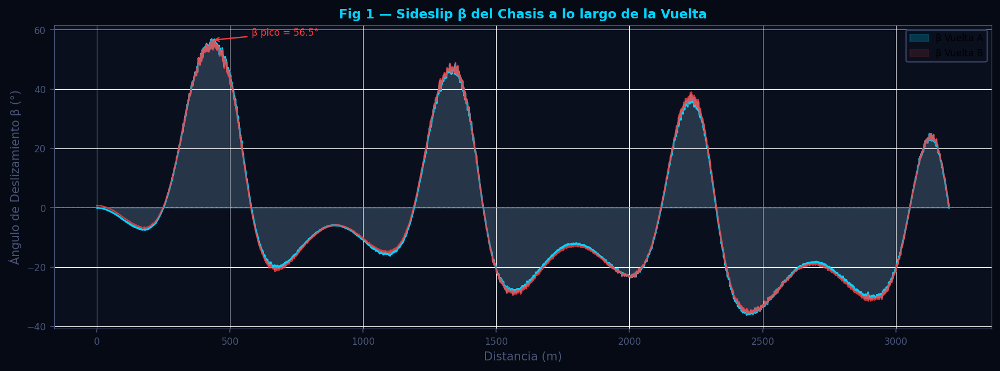
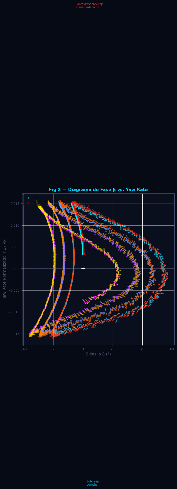
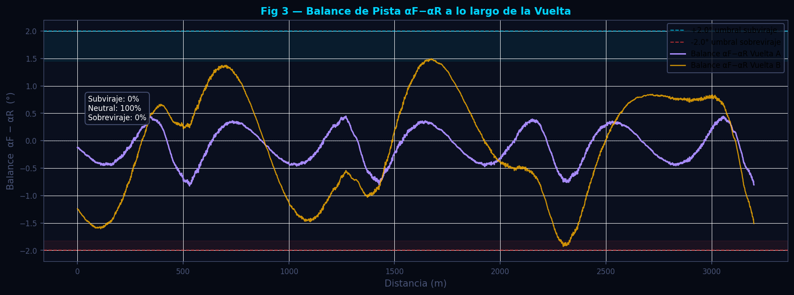

# Slip Angle — Sideslip β & αF/αR Balance

🌐 [Ver en Español](./13_slip_angle.es.md)

**Module:** `src/analytics/slip_angle.py`  
**Review date:** 2026-06-12

---

## Table of Contents

1. [Overview](#overview)
2. [Scientific Background](#scientific-background)
   - 2.1 [Chassis Sideslip Angle (β)](#21-chassis-sideslip-angle-β)
   - 2.2 [Linear Bicycle Model](#22-linear-bicycle-model)
   - 2.3 [Wheel Slip Angles (αF, αR)](#23-wheel-slip-angles-αf-αr)
   - 2.4 [On-track Balance & Behaviour Diagnosis](#24-on-track-balance--behaviour-diagnosis)
3. [Algorithm & Implementation](#algorithm--implementation)
   - 3.1 [Kinematic Integration with Drift Correction](#31-kinematic-integration-with-drift-correction)
   - 3.2 [αF and αR Estimation](#32-αf-and-αr-estimation)
   - 3.3 [`analyse_slip_angle`](#33-analyse_slip_angle)
4. [Key Parameters & Geometry Assumptions](#key-parameters--geometry-assumptions)
5. [Result Interpretation](#result-interpretation)
6. [Pilot Recommendations](#pilot-recommendations)
7. [Visualizations](#visualizations)
8. [References](#references)

---

## Overview

The chassis sideslip angle (β, also called *body slip angle*) is the angle between the velocity vector of the vehicle's centre of gravity and its longitudinal axis. Unlike the steering angle, β is invisible to the driver but determines the vehicle's equilibrium state: large β values indicate the car is moving "sideways", a condition associated with saturation of one of the axles.

The module implements an integrated kinematic estimate that uses lateral acceleration, yaw rate, and speed to reconstruct the vehicle's lateral velocity, and applies the linear bicycle model to estimate the individual slip angles of the front (αF) and rear (αR) axles. The difference αF − αR is the most direct quantitative indicator of the balance between understeer and oversteer.

---

## Scientific Background

### 2.1 Chassis Sideslip Angle (β)

In the vehicle reference frame, the centre-of-gravity velocity has longitudinal ($V_x$) and lateral ($V_y$) components:

$$
\beta = \arctan\!\left(\frac{V_y}{V_x}\right)
$$

For a vehicle in steady-state circular motion, β is constant and small (< 5°). During entry/exit transients, β varies rapidly and high values (> 8–10°) indicate the driver is at or has exceeded one axle's grip limit.

The lateral equation of motion in the vehicle frame is:

$$
m(\dot{V}_y + V_x \cdot r) = F_{lat,F} + F_{lat,R}
$$

where $r$ is the yaw rate in rad/s. Rearranging to obtain the $V_y$ acceleration:

$$
\dot{V}_y = a_y - r \cdot V_x
$$

where $a_y = G_{lat} \cdot g$ is the measured lateral acceleration in m/s².

---

### 2.2 Linear Bicycle Model

The bicycle model (*single-track model*) represents the vehicle as a system of two virtual wheels (one front and one rear) located on the longitudinal axis. It is the most widely used model in vehicle dynamics for first-order analysis because it captures steady-state and slow-transient behaviour without the six degrees of freedom of the 4-wheel model.

Geometric parameters:

| Parameter | Symbol | Value used | Description |
|---|---|---|---|
| Wheelbase | $L$ | 2.48 m | Axle-to-axle distance (sport car estimate) |
| CG-to-front axle | $l_F$ | $L \cdot 0.44 = 1.09$ m | 44% of wheelbase forward |
| CG-to-rear axle | $l_R$ | $L \cdot 0.56 = 1.39$ m | Remaining 56% |
| Steering ratio | $i_s$ | 14.0 | Steering wheel turns per road wheel turn |

---

### 2.3 Wheel Slip Angles (αF, αR)

Tyre slip angles ($\alpha$) represent the difference between the direction the wheel is pointing and the direction it is actually moving. The quasi-static linear bicycle model relates these angles to β and yaw rate $r$:

**Front axle:**

$$
\alpha_F = \delta_{wheel} - \beta - \frac{l_F \cdot r}{V_x}
$$

where $\delta_{wheel} = \delta_{steering} / i_s$ is the front road wheel angle.

**Rear axle:**

$$
\alpha_R = -\beta + \frac{l_R \cdot r}{V_x}
$$

The positive sign of the $l_R \cdot r / V_x$ term at the rear reflects that, in a corner, the rear axle experiences a slip angle generated by the yaw rate even without driver input (this is the source of inherent stability in rear-wheel-drive cars).

> **Accuracy note:** The bicycle model is linear and valid for small slip angles (< ~5°). For analysis of severe oversteer events where αR may exceed 10–15°, the model underestimates tyre saturation effects. The estimate is qualitative under those conditions.

---

### 2.4 On-track Balance & Behaviour Diagnosis

The difference in slip angles between axles defines the vehicle's instantaneous balance:

$$
\text{Balance} = \alpha_F - \alpha_R
$$

| Balance | Diagnosis |
|---|---|
| $> +2°$ | **Understeer:** front axle is working harder than the rear |
| $\in [-2°, +2°]$ | **Neutral:** balanced behaviour |
| $< -2°$ | **Oversteer:** rear axle is working harder than the front |

---

## Algorithm & Implementation

### 3.1 Kinematic Integration with Drift Correction

Direct integration of $\dot{V}_y$ accumulates the lateral accelerometer bias error, which may be tenths of g but when integrated over a 90-second lap generates errors of several m/s. Linear drift correction is valid for a closed circuit where the mean lap sideslip angle must be approximately zero:

```
For each sample i (1 m step in the aligned df):
  dt[i] = 1.0 / Vx[i]              # time to travel 1 m

Integration:
  Vy_dot[i] = ay[i] - r[i] * Vx[i]     # r in rad/s
  Vy_raw = cumsum(Vy_dot * dt)

Linear drift correction:
  drift = linspace(Vy_raw[0], Vy_raw[-1], N)
  Vy_corrected = Vy_raw - drift

Sideslip angle:
  beta = degrees(arctan2(Vy_corrected, Vx))
```

The linear correction removes the integrator drift component without altering the periodic variations in β (which represent the real vehicle physics). On very short circuits or those with few corners, the β mean ≈ 0 hypothesis may partially fail.

**Yaw rate unit detection:** MoTeC exports Chassis Yaw Rate in °/s. The module automatically detects units by comparing the absolute maximum value against 6.3 rad/s (equivalent to one full rotation per second). If the maximum is lower, °/s is assumed and conversion is applied.

---

### 3.2 αF and αR Estimation

```
Inputs: Vx (m/s), r (rad/s), steer (°), beta (°)

delta_wheel = steer / STEER_RATIO   # ° → °

alpha_F = delta_wheel - beta - degrees(r * l_F / Vx)
alpha_R =              -beta + degrees(r * l_R / Vx)
balance = alpha_F - alpha_R
```

For samples with $V_x < 3$ m/s (nearly stationary), the calculation is skipped to avoid division-by-zero and low-speed artefacts.

---

### 3.3 `analyse_slip_angle`

```
Inputs: df (aligned DataFrame with Speed, LateralG, YawRate, SteerAngle + suffixes)

For each lap (suffix = "_Fast", "_Slow"):
  _slip_for_suffix(df, suffix, dist) →
    summary: {beta_max, beta_mean, beta_p95,
              understeer_pct, oversteer_pct, neutral_pct, balance_mean,
              has_wheel_angles}
    per_distance: {distance, beta, alpha_f, alpha_r, balance}

Returns dict with:
  available, available_a, available_b,
  wheelbase_m, steer_ratio,
  summary_a/b, per_distance_a/b
```

If the `YawRate` channel is not available, the module returns `{available: False}` because β integration mandatorily requires yaw rate to decouple the corner contribution from lateral acceleration.

---

## Key Parameters & Geometry Assumptions

| Parameter | Default value | Description |
|---|---|---|
| `WHEELBASE_M` | 2.48 m | Axle-to-axle distance (Porsche Cayman GT4 ≈ 2.476 m) |
| `L_F_RATIO` | 0.44 | Fraction of wheelbase to front axle |
| `STEER_RATIO` | 14.0 | Steering wheel-to-road wheel ratio |
| `MIN_SPEED_MS` | 3.0 m/s | Minimum speed to calculate β and α |
| `DOWNSAMPLE` | 5 | Reduction factor for per-distance series |
| `OS_THRESHOLD` | 2.0° | Balance threshold to classify oversteer |
| `US_THRESHOLD` | 2.0° | Balance threshold to classify understeer |

> **Warning:** Geometry values are estimates based on the test vehicle (Porsche Cayman GT4 Clubsport). For quantitatively precise analysis with a different vehicle, adjust `WHEELBASE_M`, `L_F_RATIO` and `STEER_RATIO` to the actual vehicle's values.

---

## Result Interpretation

### β — Chassis sideslip angle

| Maximum β | Interpretation |
|---|---|
| < 3° | Conservative driving; car is working well within the limit |
| 3–6° | Typical limit driving range; good pace |
| 6–10° | Car at the limit; frequent driver corrections |
| > 10° | Vehicle in active slide or drift condition |

### Balance αF − αR

- **Persistent understeer** (balance > +2° in most corners): The front axle is systematically working harder than the rear. Probable causes: low front pressure, very rear weight bias, or a factory understeer-heavy setup for stability.
- **Oversteer on acceleration** (balance < −2° when exiting slow corners): Yaw rate is growing faster than the steering commands. Typical cause: very locked differential or overheated rear tyres.
- **Neutral balance** (oscillates around 0): The car is well-balanced. The driver can exploit grip from both axles.

---

## Pilot Recommendations

**High β at corner entry (> 8°):**
The car is rotating too much on entry. The driver is using braking load transfer to generate rotation (valid trail-braking technique at the extreme), but is at the rear grip limit. Check that brake bias is not too far rearward.

**Consistently positive balance in slow corners:**
Entry understeer. The front axle saturates before reaching the apex. Line solution: slower entry, tighter line, later apex. Setup solution: soften front bar one step or reduce front pressure by 0.1 bar.

**Sudden oversteer at the apex (sharp negative β):**
The rear axle loses grip at the apex. Possible causes: throttle applied too early, very locked differential, or excessive rear temperature. The line solution is to delay the throttle application point.

---

## Visualizations

Generated by `scripts/docs/gen_slip_angle.py` with synthetic data.

---

### Figure 1 — β Over the Lap



Series of the sideslip angle β (degrees) over lap distance for two compared laps. Positive values indicate the velocity vector points to the left of the car axis; negative values, to the right. High-speed zones (straights) show β ≈ 0; peaks appear at corner entries.

---

### Figure 2 — Phase Diagram β vs. Yaw Rate



Scatter plot of β angle (X axis) against normalised yaw rate $r \cdot L / V_x$ (Y axis). This phase diagram reveals the vehicle's equilibrium mode: in neutral driving, points form an ellipse centred at the origin. A distribution skewed toward positive β values with low yaw rate indicates chronic understeer; toward negative values, oversteer.

---

### Figure 3 — αF−αR Balance Over the Lap



Series of on-track balance (αF − αR, degrees) with shaded threshold bands (blue for understeer > +2°, red for oversteer < −2°). The central horizontal line (balance = 0) represents the ideal neutral behaviour. The percentage of time in each zone (understeer, neutral, oversteer) is shown as annotations on the chart.

---

## References

1. Milliken, W. F., & Milliken, D. L. (1995). *Race Car Vehicle Dynamics*. SAE International. — Chapters 5–6: Bicycle model; formal definition of β and α; relationship between tyre balance and understeer/oversteer behaviour.

2. Rajamani, R. (2012). *Vehicle Dynamics and Control* (2nd ed.). Springer. — Kinematic integration of the lateral equation; linear bicycle model; integrator bias correction.

3. van Zanten, A., et al. (1995). VDC, the vehicle dynamics control system of Bosch. *SAE Technical Paper 950759*. — Practical use of estimated β angle in active control systems; drift correction methods.

4. Guiggiani, M. (2014). *The Science of Vehicle Dynamics*. Springer. — Mathematical foundations of the extended bicycle model; stability analysis as a function of slip angles.

5. Pacejka, H. B. (2012). *Tire and Vehicle Dynamics* (3rd ed.). Butterworth-Heinemann. — Magic Formula model; relationship between α and lateral tyre force; transition to saturation.

---

*Also available in [Español 🇪🇸](./13_slip_angle.es.md)*
